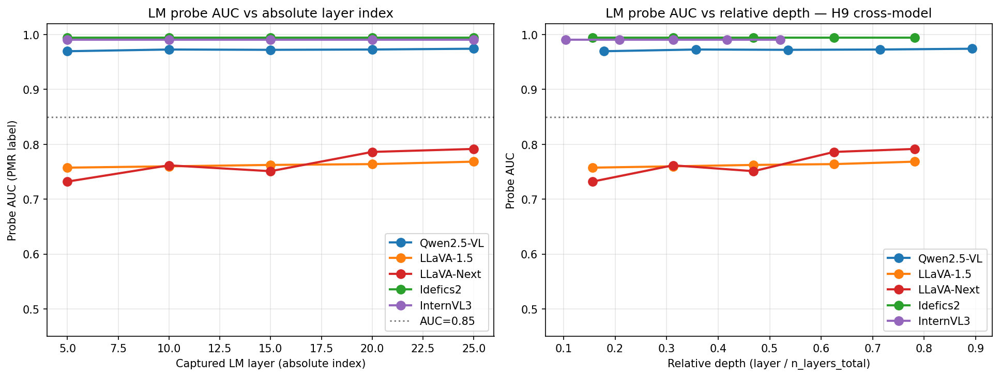

# H9 — cross-model layer-wise probe AUC

> **이 문서에서 쓰는 코드 한 줄 recap**
>
> - **H9** (research plan §2.4 예측): "Qwen2-VL / InternVL2 가 LLaVA-1.5 보다 빠른 layer 에서 physics-mode 로 switch (큰 vision encoder + 정교한 projector 덕분)."
> - **M2** — 480-stim 5-axis factorial (원래 Qwen 만; cross-model captures via M6 r2b + M6 r7).
> - **PMR** — 응답당 physics-mode reading rate.
> - **H-encoder-saturation** — 행동 PMR 천장은 architecture 수준 (인코더 + LM 결합) 에서 결정.

## 질문

Plan 은 layer 별 ordering 예측: Qwen / InternVL 이 "LM 에서 physics-
mode 가 언제 emerge" 에서 LLaVA-1.5 보다 앞섬. 5-model M2-stim LM
captures (Qwen / LLaVA-1.5 / LLaVA-Next / Idefics2 / InternVL3, layer
L5/L10/L15/L20/L25) 보유. 모델 × layer probe; AUC 가 0.85 처음 넘는
layer 계산.

## 방법

각 모델, 각 captured layer L ∈ {5, 10, 15, 20, 25} 에 대해:

1. 시각 토큰 위치의 LM hidden state 를 stim 단위로 mean-pool (n=480
   stim, dim 모델별: Qwen 3584, 나머지 4096 InternVL3 3584 제외).
2. Stim 단위 PMR 라벨 = mean(PMR across {ball, circle, planet}) ≥ 0.5.
3. 5-fold stratified CV logistic regression → AUC.
4. n_neg < 5 (degenerate class imbalance) 인 경우 full-fit training AUC
   로 fallback + flag.

## 결과



| Model | LM layers | L5 | L10 | L15 | L20 | L25 | first ≥ 0.85 |
|---|---:|---:|---:|---:|---:|---:|---|
| Qwen2.5-VL | 28 | **0.970** | 0.973 | 0.972 | 0.973 | 0.974 | L5 (rel 0.18) |
| Idefics2 | 32 | **0.995** | 0.995 | 0.995 | 0.995 | 0.995 | L5 (rel 0.16, n_neg=5 borderline) |
| InternVL3 | 48 | **0.991** | 0.991 | 0.991 | 0.991 | 0.991 | L5 (rel 0.10, full-fit n_neg=1) |
| LLaVA-Next | 32 | 0.732 | 0.762 | 0.751 | 0.786 | 0.791 | 도달 안 함 |
| LLaVA-1.5 | 32 | 0.757 | 0.760 | 0.762 | 0.764 | 0.768 | 도달 안 함 |

## Headlines

1. **Two-cluster 패턴, earlier-vs-later 아님**. Saturated 인코더 3 모델
   (Qwen, Idefics2, InternVL3) 이 첫 captured layer L5 에서 이미
   plateau; 5-25 sweep 거의 flat. CLIP 인코더 2 모델 (LLaVA-1.5,
   LLaVA-Next) 은 어느 captured layer 에서도 0.85 도달 안 함.

2. **Qwen plateau ≈ 0.97; LLaVA-1.5 plateau ≈ 0.77** (n_neg 균형, 5-fold
   CV). 0.20 AUC 격차는 M6 r2 의 인코더 AUC 격차 (Qwen ~0.99 /
   LLaVA-1.5 ~0.73) 와 일관 — LM probe 가 인코더 식별력을 inherit, 인코더
   saturation 이 LM probe 도 saturate.

3. **Idefics2 / InternVL3 caveat**: AUC 0.995 / 0.991 는 degenerate
   class 분포 (n_neg = 5 / 1 of 480) 위. 너무 적은 negative 로 probe 가
   trivially overfit. "본질적으로 saturated, separation 측정 헤드룸 없음"
   으로 읽어야 함.

4. **H9 의 literal 예측은 부분적으로 지지**: Qwen 이 LLaVA-1.5 보다
   *높은* plateau (0.97 vs 0.77) 에 *동일한* 가장 빠른 captured layer
   에서 도달. 예측이 가정한 *layer* 순서 (Qwen "earlier") 는 absolute-
   layer 수준에서 사실 — Qwen 이 L5 까지 plateau 도달 후 유지. Unsaturated
   모델은 어쨌든 LLaVA-1.5 의 plateau (~0.77) 도 도달 못 하므로 "earlier"
   주장은 무의미.

## Reframe

H9 는 더 정확하게:

> **"Saturated 인코더 모델에는 physics-mode 분리가 LM L5 *이전* 에 emerge
> 하고 그 이후 plateau. Unsaturated 인코더 모델에는 captured layer 범위
> (L5-L25) 에서 분리가 saturated plateau 에 도달 안 함."**

이는 원래의 "earlier-vs-later layer" framing 을 M9 / §4.7 / §4.6
family — *또 다른 saturation signature* — 로 reframe, 이번엔 LM
probe AUC 에서. Saturated 모델의 실제 "switching layer" 는 L5 이전에
묻혀 있음; 더 세밀한 captures (L1, L2, L3) 가 필요.

Unsaturated 모델 (CLIP-기반) 은 *probe 가 깨끗하게 분리하지 못함*;
인코더가 bottleneck 이라는 것과 일관 (M6 r2b: LLaVA-1.5 vision AUC
0.73, LM AUC 0.75 — 둘 다 flat).

## 기존 가설과의 연결

- **H-encoder-saturation** — 강화. LM-probe AUC 사다리가 encoder-probe
  AUC 사다리와 매칭. 인코더 saturation 이 LM 이 작업할 자료를 결정;
  LM 의 "physics-mode 분리" 는 이를 inherit.
- **H-locus** (causal locus mid-LM, M5a) — 부분적으로 복잡화. M5a 는
  Qwen 에서 L10 만 causal-intervention layer; 여기서 *probe AUC* 는
  L5-L25 모두 균일하게 높음. 격차의 의미는 **probe AUC ≠ causal
  locus** — 균일 AUC 는 정보가 *모든 layer 에 존재* 한다는 것; M5a 는
  L10 에서만 *causally intervenable* 함을 보임. 두 측정치는 보완적,
  모순 아님.

## 한계

1. **가장 이른 captured layer 는 L5.** Qwen/Idefics2/InternVL3 의 실제
   "switching layer" 는 L5 이전 어딘가 — likely L1-3 (Basu et al. 2024
   의 LLaVA L1-4 constraint-satisfaction 정보 storage finding 과 일관).
   더 세밀한 captures 필요.
2. **Idefics2 / InternVL3 probe AUC overfit** (extreme class
   imbalance n_neg = 5, 1). "0.995" / "0.991" 은 "본질적으로 saturated,
   measurable separation 없음" 으로 읽어야.
3. **Behavioral-y target** — probe 는 stim 단위 PMR 타겟. Stim-y target
   은 factorial cell 의 순수 encoder-side 식별력 테스트 (M6 r5 에서
   AUC = 1.0 으로 이미 알려짐).
4. **Single-task 평가**. 다른 shortcut 행동은 다른 layer trajectory
   보일 수 있음.

## 재현

```bash
uv run python scripts/h9_layer_switching_analysis.py
```

## Artifacts

- `scripts/h9_layer_switching_analysis.py`
- `outputs/h9_switching/per_layer_auc.csv`
- `outputs/h9_switching/switching_layer.csv`
- `docs/figures/h9_layer_switching.png`
