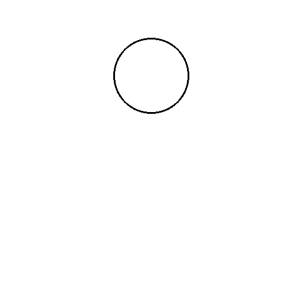
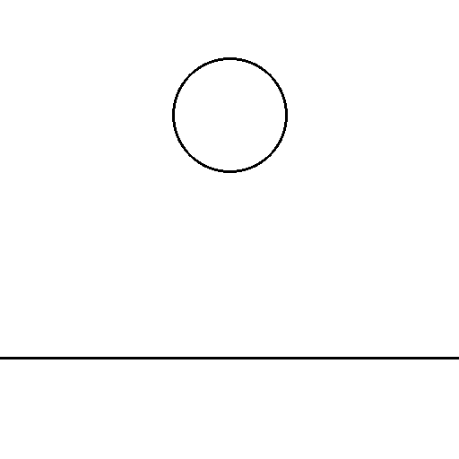
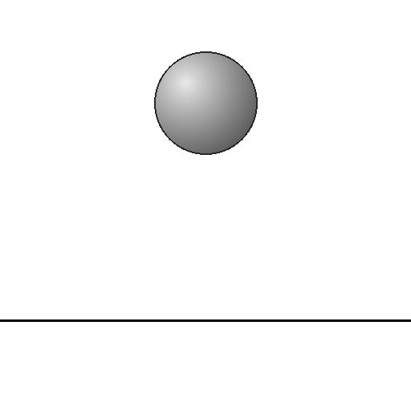
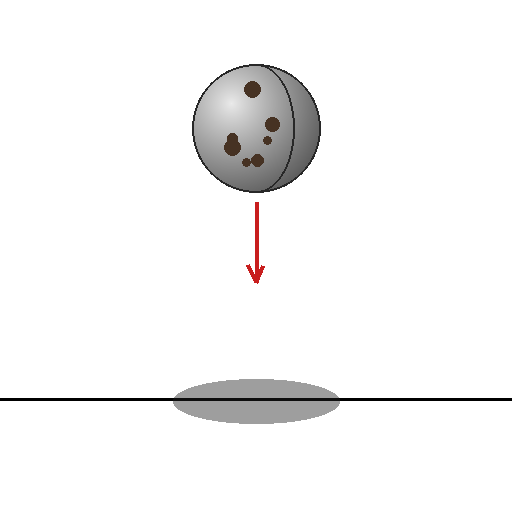
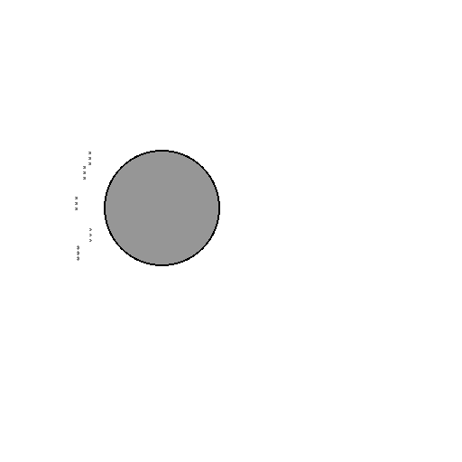
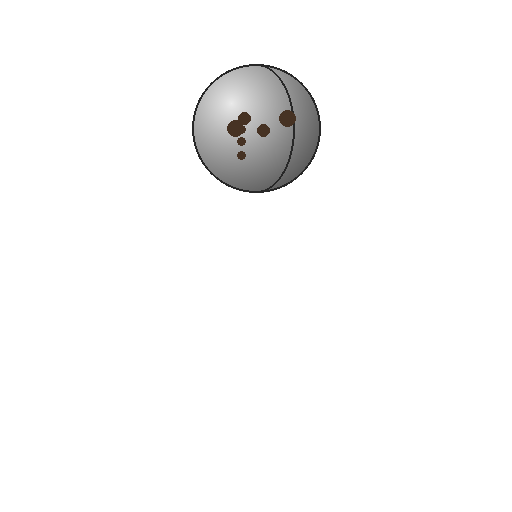

# Pilot 인사이트 정리

Sub-task 1 pilot 실험(Qwen2.5-VL-7B-Instruct, 480 inferences, H200, 2026-04-24)에서 발굴한 관찰과 그 함의를 정리한다. 원본 수치는 `docs/03_run_log.md`와 `outputs/pilot_20260424-072418_2c16efb6/`에 있다.

요약하면 — **behavioral S-curve를 부분적으로 확인**했고, **언어 prior가 예상보다 훨씬 지배적**이며, **stimulus의 일부 cue가 VLM에 읽히지 않는 구조적 문제**를 발견했다.

---

## 1. 실험 설정

### 1.1 프롬프트 템플릿

각 자극에 대해 **open-ended**와 **forced-choice** 두 변형을 모두 돌린다. `{label}` 자리에는 axis D (pilot에서는 `"ball"` 고정) 가 들어간다. 구현은 `src/physical_mode/inference/prompts.py`.

**Open-ended**

```text
[system]
You are a careful observer of images. When asked what will happen next,
describe the most likely next state or motion in one short sentence.

[user]
The image shows a {label}. Describe what will happen to the {label} in the
next moment, in one short sentence.
```

**Forced-choice** (4-way MCQ)

```text
[system]
You are a careful observer of images. Answer the multiple-choice question
with a single letter A, B, C, or D followed by a brief justification.

[user]
The image shows a {label}. Which option best describes what will happen next?
A) It falls down.
B) It stays still.
C) It moves sideways.
D) This is an abstract shape — nothing physical happens.
Answer with a single letter (A, B, C, or D), then briefly justify.
```

D 옵션이 "abstract escape route" 역할을 한다. Pilot 결과, 이 옵션이 있느냐 없느냐가 PMR의 가장 큰 방법론적 변수였다 (§3.2 참조).

### 1.2 자극 예시

512 × 512 px RGB. 모든 요소는 seed-deterministic (구현 `src/physical_mode/stimuli/`, 상세 스펙 `docs/01_stimulus_spec.md`).

| 조건 | 이미지 | 역할 |
|---|---|---|
| `line + blank + none` |  | 가장 추상 — behavioral baseline |
| `line + ground + none` |  | 추상 원 + 지면 한 줄 — ground 효과의 최소 쌍 |
| `shaded + ground + none` |  | 3D 음영 + 지면 — 전형적 "공이 떨어진다" 자극 |
| `textured + ground + arrow_shadow` |  | 최대 cue — 텍스처 공 + 지면 + 화살표 + 그림자 |
| `filled + blank + wind` |  | wind cue invisible 케이스 — 왼쪽의 회색 호들이 VLM에 안 읽힘 |
| `textured + blank + none` |  | 3D texture + 지면 없음 — object-level만으로의 효과 |

### 1.3 실제 모델 응답 예시

동일 6 자극, 두 프롬프트 변형 × Qwen2.5-VL-7B (bf16, temperature=0). PMR 채점은 `src/physical_mode/metrics/pmr.py` 기준.

#### (1) `line + blank + none` — 가장 추상

| 프롬프트 | 응답 | PMR |
|---|---|---|
| open | "The ball will remain stationary unless acted upon by an external force." | 0 |
| forced | "D — The image is an abstract representation of a circle and does not depict a physical object like a ball that can fall, move, or stay still." | 0 |

→ 두 프롬프트 모두 physics-mode 진입하지 않음. Open-ended는 Newton's first law framing, forced-choice는 메타인지적 추상 인식. 이 셀은 모델 행동의 baseline.

#### (2) `line + ground + none` — **ground 효과의 핵심 쌍**

| 프롬프트 | 응답 | PMR |
|---|---|---|
| open | "The ball will likely roll down the incline if it is placed on an inclined surface." | **1** |
| forced | "D — The image is an abstract representation and does not depict a physical object like a ball that can fall, move, or stay still." | **0** |

→ **Open-ended PMR = 1, Forced-choice PMR = 0.** 완전히 같은 이미지를 보고 프롬프트만 바꾸니 물리 모드 진입/이탈이 뒤집힌다. 이는 §3.2 "언어 prior 지배성"의 가장 선명한 예시. 또한 `line/blank/none`과 비교하면 지면 한 줄 추가만으로 open-ended가 "stationary" → "rolls" 로 바뀜 — ground 효과의 최소 쌍.

#### (3) `shaded + ground + none` — 전형적 물리 자극

| 프롬프트 | 응답 | PMR |
|---|---|---|
| open | "The ball will fall downward due to gravity." | **1** |
| forced | "A) It falls down. — The ball appears to be in free fall above a horizontal line, which typically represents the ground. In the absence of any forces acting on it other than gravity, the ball would naturally fall downward towards the ground." | **1** |

→ 두 프롬프트 모두 **A (falls)**. 3D 음영 + 지면은 Qwen2.5-VL이 물리로 인식하는 가장 '쉬운' 조건.

#### (4) `textured + ground + arrow_shadow` — 최대 cue

| 프롬프트 | 응답 | PMR |
|---|---|---|
| open | "The ball will collide with the surface below it." | **1** (GAR=1) |
| forced | "A — The red arrow indicates a downward direction, suggesting that the ball will fall due to gravity." | **1** (GAR=1) |

→ 화살표를 명시적으로 언급 ("the red arrow indicates"). 이 cue는 너무 강해 PMR을 1.0으로 포화시킴 — 측정 불가 cell. MVP-full에서 shadow-only / arrow-only로 분리 예정.

#### (5) `filled + blank + wind` — wind cue invisible

| 프롬프트 | 응답 | PMR |
|---|---|---|
| open | "The ball will remain stationary as there is no indication of movement or force acting upon it." | **0** |
| forced | "D — The image is an abstract representation and does not depict a physical object in motion or at rest." | **0** |

→ **"no indication of movement or force"** — 모델은 왼쪽의 바람 자국을 airflow로 읽지 못한다. `none` 조건과 behavior 동일. 프로그램적 wind cue는 stimulus로 실패.

#### (6) `textured + blank + none` — object-level 단독 효과

| 프롬프트 | 응답 | PMR |
|---|---|---|
| open | "The ball will likely roll or bounce due to an external force such as gravity or a push." | **1** |
| forced | "D — The image is an abstract representation and does not depict a physical object in motion or at rest." | **0** |

→ 또 하나의 open-vs-forced split. Textured 공 자체는 open-ended에서 물리 서술을 유도하나, forced-choice의 D 옵션이 있으면 "abstract"로 빠진다. 이는 cell (2)와 같은 패턴 — 시각 cue는 약하고 언어 prior가 open-ended를 지배.

---

## 2. 헤드라인 수치

| 조건 | PMR | 해석 |
|---|---|---|
| **Ground 유무** (blank → ground) | 0.488 → **0.854** (+36pp) | 단일 요인 중 가장 큰 효과. Kellman·Spelke·Gibson 라인의 "support plane이 물리 객체 해석을 유발한다"는 인지과학 예측과 일치. |
| **추상화 축 A** (line → textured) | 0.575 → **0.808** | 양 끝 점은 H1(S-curve) 가설과 일치. 중간 2 수준(filled 0.658, shaded 0.642)은 tie → 중간 cue들이 주는 marginal gain이 없음. |
| **Cue arrow_shadow** | **1.000** (포화) | 화살표가 너무 강함 → MVP-full에서는 shadow-only / arrow-only로 분리 필요. |
| **Cue wind** | 0.513 ≈ none 0.500 | 프로그램적 바람 자국은 VLM이 airflow로 해석하지 **못함**. |
| **Open vs forced-choice** | PMR 0.800 vs 0.542, abstract_reject 0.000 vs 0.450 | open-ended에서는 **한 번도** "이건 추상 도형이다"라고 말하지 **않음**. forced-choice에서 D 옵션이 주어지면 45%가 추상으로 빠짐. |

---

## 3. 발굴된 인사이트

### 3.1 배경(ground plane)이 가장 강력한 trigger

`blank` vs `ground` 만의 차이(동일한 객체, 동일한 cue)가 PMR을 0.49 → 0.85로 끌어올린다. 즉 **VLM이 물리 모드에 진입하는 가장 쉬운 입구는 "지면 + 객체" 구도**이지 3D shading이나 texture가 아니다.

- Kersten·Mamassian·Knill (1997): 드리워진 그림자가 객체를 지면에 부착시킨다는 인지 연구와 방향 일치.
- Gibson (1979) 생태학적 접근: surface / ground plane / optic flow가 객체성의 1차 단서.
- **함의**: 메인 페이퍼의 Figure 1 후보는 **§1.3의 cell (1) vs cell (2)** 최소 쌍 — "동일한 선 원이 blank일 때는 stationary, ground 위에 있을 때는 rolls"로 바뀌는 데모. Paper의 1-장 카피 한 줄 메시지가 여기서 나온다.

### 3.2 "encoder knows, decoder blurts" — 언어 prior 지배성

Open-ended 프롬프트에서 PMR 0.80, abstract_reject 0.00. 즉 Qwen2.5-VL-7B는 open-ended 조건에서 "이건 추상 도형입니다"라고 **한 번도 자발적으로 말하지 않았다**. 같은 이미지, forced-choice에서 옵션 D("abstract shape")가 주어지면 45%가 그쪽을 선택한다.

§1.3의 cell (2)와 cell (6)이 이 격차의 전형. 같은 이미지에 대해 open은 PMR=1, forced는 PMR=0.

이는 연구계획 §1.6의 **"Vision Language Models Are Biased"** (Vo et al. 2025) 패턴과 동형이다: 모델은 이미지를 볼 수 있지만, 자유서술 상황에서는 **언어 prior**("ball"이라는 단어)가 시각 증거를 덮는다.

- **핵심 insight**: 우리가 측정하고자 했던 "물리 모드 점화"의 행동 신호(PMR)는 open-ended에서 **이미지 축보다 언어 축이 훨씬 크게 움직인다**. Clean behavioral S-curve는 **forced-choice 서브셋**에서 읽어야 한다.
- **방법론적 교훈**: 논문의 main behavioral figure는 forced-choice PMR로 그려야 한다. Open-ended PMR은 상한(언어 prior 포함)과 하한(forced-choice에서 추상 escape 45%)의 gap 그 자체가 finding이다.

### 3.3 추상화 축의 S-curve — 부분적 확인

| object_level | PMR | Δ |
|---|---|---|
| line | 0.575 | (base) |
| filled | 0.658 | +0.083 |
| shaded | 0.642 | −0.016 |
| textured | 0.808 | +0.166 |

양 끝점은 H1과 일치하나 **중간 2 수준이 tie** → 매개변수적 S-curve가 깨끗하지 않다. 가능한 원인:

1. **Noise**: n=120/cell → std error ≈ 4.5pp이므로 ±1pp 정도의 swap은 통계적 허용 범위.
2. **중간 cue들이 VLM에게 구분되지 않는다**: filled circle과 shaded sphere의 차이가 CLIP/SigLIP 인코더에서 behavioral output 단에 의미 있게 전달되지 않는 가능성. 이것 자체가 Sub-task 2 (vision encoder probing)의 직접적 motivation이 된다.

### 3.4 Wind cue가 invisible — stimulus-side 결함

프로그램으로 그린 바람 자국 5 그룹이 PMR에 **거의 영향이 없음** (wind 0.513 vs none 0.500). §1.3의 cell (5)가 구체 예시 — 모델이 "no indication of movement or force"라고 명시적으로 부정한다. 몇 가지 해석:

- VLM이 작은 회색 호(arc)들을 airflow로 인식하지 못함. 훈련 데이터에 "추상적 바람 기호"가 드묾.
- 인간 피험자에게는 쉽게 읽히는 스타일이 VLM에게는 OOD에 해당.
- → MVP-full에서는 **motion blur** 나 **dust trail** (photorealistic) 로 교체하거나, "trail of spheres fading out" 같은 VLM 친화적 표현으로 재디자인.

**연구적 함의**: 인지과학 문헌에서 "강력한 motion cue"로 간주되는 것과 **VLM이 실제로 motion으로 인식하는 것**은 다르다. 이 gap을 체계적으로 매핑하는 것 자체가 EMNLP-tier 결과가 될 수 있다. ("Human-salient physical cues that VLMs miss" 식의 프레이밍)

### 3.5 Arrow+shadow cue는 **너무 강함** — 측정 불가능한 cell

`arrow_shadow` 조건에서 PMR 1.000 (포화). §1.3의 cell (4)에서 모델이 "the red arrow indicates a downward direction"이라고 명시적으로 화살표를 수식어로 삼는다. 의미 있는 차이를 볼 수 없다. 이 cue는 사실상 두 가지를 합쳤다:

1. Ground 위에 드리운 타원 그림자 (Kersten 계열의 물리적 지면 부착 cue)
2. 빨간 방향 화살표 (movement의 direct annotation — 거의 label)

(1)이 예측하는 이론적 효과를 측정하려면 이 둘을 분리해야 한다. MVP-full의 axis C는:
- `none`
- `cast_shadow_only`
- `motion_arrow_only`
- `both`
로 재설계하는 것이 맞다.

### 3.6 Event template은 예상과 달리 효과 없음

`fall` vs `horizontal`: PMR 둘 다 0.67로 **동일**. 객체의 on-canvas 위치가 다르면 behavior가 달라질 거라는 암묵적 기대가 있었으나, 그 기대는 **데이터에서 반박됨**.

- 해석: VLM은 객체 위치보다 "이미지에 ground가 있는지" "cue가 있는지"를 먼저 본다. Event template은 stimulus generator에게는 중요하지만 behavioral output에는 거의 안 보인다.
- **MVP-full에서는 event_template 축을 axis로 취급하지 말고 controlled variation으로 downgrade**. 같은 factorial 용량을 seed 수나 axis D(label) 확장에 쓰는 게 낫다.

### 3.7 모델 응답은 "systematic, not random"

§1.3의 6개 cell 응답이 이를 직접 보여준다:

- blank + no cue: "remain stationary unless acted upon" → Newton's First Law framing. 이미지 맥락이 없을 때 기본값은 **관성**.
- ground + no cue (shaded 이상): "fall downward due to gravity" → 지면 존재만으로 중력 서사 발동.
- ground + arrow_shadow: "collide with the surface below" → 화살표를 명시적으로 따라감.
- blank + wind: "no indication of movement" → wind cue를 무시하는 것이 아니라 **인식 못함**.
- forced-choice + 추상 stimulus: "D — abstract representation, does not depict a physical object" → 메타인지적으로 "이건 도형"을 발화.

**이것이 의미하는 바**: 모델의 "오류"는 무작위 환각이 아니다. 각 cue에 대해 **해석 가능하고 재현 가능한 규칙**으로 반응한다. 이는 Sub-task 3-4 (layer-wise localization, causal patching)가 **측정 가능한 현상**을 대상으로 한다는 전제를 확인시켜준다. 만약 응답이 완전히 무작위였다면 내부 메커니즘 localization 자체가 불가능했을 것.

---

## 4. 방법론적 교훈

### 4.1 Scoring lexicon은 living

초기 `PHYSICS_VERB_STEMS`에서 `"move"` stem이 `"moving"`을 놓쳤다 (prefix match이므로 `"move"` ≠ `"moving"`의 prefix). "continue", "rotate", "glide" 같은 자연스러운 물리 동사들도 누락. 실제 pilot의 textured/ground/horizontal 응답들이 false-negative로 빠지면서 발견.

- **교훈**: 스템은 가장 짧은 공통 prefix로 쓴다 (`"move"` → `"mov"`, `"continue"` → `"continu"`). 주기적으로 false-negative를 수집해 회귀 테스트에 추가. 현재는 `tests/test_pmr_scoring.py::PMR_POSITIVE`에 5개 회귀 케이스 추가됨.

### 4.2 Temperature=0에서 RC는 쓸모없다

Deterministic decoding이므로 같은 cell의 모든 seed가 동일한 generation을 낸다 → RC = 1.0 for every cell. 연구계획 §2.2에서 약속한 Response Consistency 지표를 pilot에서는 **측정하지 못했다**.

- **교훈**: MVP-full에서는 `temperature=0.7`로 설정하고 `seeds_per_cell`을 10-15로 늘려서 **의미 있는 RC 분포**를 얻는다.

### 4.3 Streamed JSONL이 실제로 도움됨

각 inference마다 JSONL에 flush. 8분짜리 pilot이 crash했어도 완료된 rows는 살아 있었을 것. 향후 몇 시간짜리 MVP-full 에서는 이 결정이 훨씬 크게 보답한다.

### 4.4 Factorial을 의도대로 설계해도 **실제로 움직이는 축과 안 움직이는 축**이 다르다

설계 단계에서는 axis A/B/C/D/events 5개가 모두 유의미하리라 가정. 실제로는:

- 크게 움직이는 것: **B (background)** > **prompt_variant** > **A (abstraction)의 endpoints**
- 거의 안 움직이는 것: **C의 wind**, **event_template**
- 너무 크게 움직이는 것: **C의 arrow_shadow** (포화)

**교훈**: MVP-full은 pilot의 수치를 반영해서 축을 재분배해야 한다. 특히 cue 축을 finer-grained하게 쪼개고, event 축은 접어서 그 용량을 label 축(axis D)과 seed에 재투자.

---

## 5. 원래 가설과의 대조

연구계획 §2.2의 가설을 pilot 데이터에 비춘 현재 상태:

| 가설 | 내용 | pilot 결과 | 상태 |
|---|---|---|---|
| H1 | PMR이 추상화 축에 따라 **S자형**으로 증가. 3D 음영·지면 도입이 가장 큰 단계 증가. | 양 끝점은 맞음 (line 0.58 → textured 0.81). 중간 2 수준은 tie. 지면 도입 효과는 +36pp로 확인(주 효과 아님, 별개 axis B). | **부분 지지** |
| H2 | "ball" 라벨은 선화에서도 PMR을 크게 증가시킨다 → 언어 prior 독립 기여. | open-ended에서 "ball" 프롬프트만으로 PMR 0.80, abstract_reject 0.00. forced-choice로 escape route를 주면 절반이 추상으로 빠짐. §1.3 cell (2), (6)이 증거. | **강하게 지지** |
| H3 | 장면 불일치는 RC를 저하시킨다. | 측정 불가 (pilot은 scene inconsistency 축 포함 안 함 + T=0이라 RC=1 포화). | **미검증** |

MVP-full에서 H3 검증을 위해: `temperature=0.7`, seeds≥10, 그리고 axis E(scene consistency)를 최소 2 수준으로라도 포함.

---

## 6. 다음 라운드를 위한 구체적 변경 사항

`docs/03_run_log.md`와 `docs/04_next_steps.md`에 일부 있지만, pilot 데이터를 근거로 한 확정 권고:

1. **Axis C 재설계**: `{none, cast_shadow_only, motion_arrow_only, both}`로 분리. 현재 두 cue를 섞은 `arrow_shadow`는 측정 불가능한 cell을 만든다.
2. **Wind cue 교체**: motion blur 또는 dust trail로. 프로그램적 호(arc)는 VLM에 안 보임.
3. **Event template 축소**: `fall` 1개로 고정 (horizontal과 behavior 동일). 용량을 seed와 label에 재투자.
4. **Axis D 확장**: `("circle", "ball", "planet")` 3-level. H2의 언어 prior 기여를 정량화.
5. **Temperature 0.7 + seeds_per_cell ≥ 10**: RC 측정 가능하게.
6. **Activation capture 활성화**: `capture_lm_layers=(5, 10, 15, 20, 25)`. Sub-task 3(logit lens) 에서 재사용.
7. **Headline figure는 forced-choice subset 기준**으로 그린다. Open-ended는 부록(언어 prior 지배 증거)로.

---

## 7. 논문 내러티브에 미치는 영향

### 7.1 Headline claim 후보 조정

원래 계획에서 noted된 4개 headline claim 후보 중, pilot 후 가장 힘있는 두 가지:

1. **"VLM은 원을 공으로 보지만 말하지 않는다"** (§3.2 Open-ended vs forced-choice gap) — pilot에서 확인 완료. 0.80 vs 0.54, abstract_reject 0.00 vs 0.45. §1.3 cell (2) 가 1-figure 버전.
2. **"지면 한 줄이 물리 모드를 활성화한다"** — 단일 요인으로 +36pp. Figure 1 용 최소 쌍 데모 가능 (§1.3 cell (1) vs (2)).

원래 헤드라인 후보였던 "S자형 스위칭 커브"와 "encoder-decoder boomerang"은 pilot 크기에서는 선명하지 않음 → **Sub-task 2 (vision encoder probing)**으로 올려야 선명해질 것.

### 7.2 Venue 프레이밍 재검토

- **EMNLP (grounding angle)**: pilot의 강력한 open vs forced-choice gap + 지면 효과는 "grounding failure" 내러티브를 직접 지지. **EMNLP Interpretability and Analysis of Models for NLP** 트랙이 점점 선호되는 배치로 보임.
- **NeurIPS (interpretability)**: Sub-task 2-4가 붙기 전까지는 약함. 단, Sub-task 3 (logit lens) 결과가 예측대로 나오면 "when does physics-mode emerge?"를 층 단위로 답할 수 있으므로 그때 NeurIPS 가능성 복귀.

### 7.3 R1 (명확한 스위칭 없음) 위험은 **부분적으로 실현됨**

Pilot은 H1의 깨끗한 S-curve를 보여주지 못했다. Risk fallback (R1) 대로:

- **개별 axis가 아니라 axis 간 interaction**으로 재프레이밍: "어떤 cue 조합이 포화를 만드는가" — arrow_shadow + ground는 PMR=1, line + blank + open-ended(ball 라벨)은 PMR=0.85 (언어 prior만으로). 이 2D interaction 자체가 story.
- 인간 baseline 수집은 점점 중요해짐: 같은 stimuli에서 인간도 중간 levels에서 tied PMR을 보인다면 H1 자체가 인지과학적으로 덜 선명한 가설이었다는 메시지가 가능.

---

## 8. 한 줄 요약

> Qwen2.5-VL-7B는 **지면 한 줄이 그려지면** 원을 공으로 바꿔 부르고, **"ball"이라는 단어만 들어도** 추상 도형임을 스스로 인정하지 못한다. 시각적 추상화 축의 S-curve는 양 끝점에서만 보이고, 바람 표식과 방향 화살표는 각각 너무 약하거나 너무 강해서 측정 축으로 쓸 수 없다 — 이 네 가지는 MVP-full 설계 변경의 기반이다.
