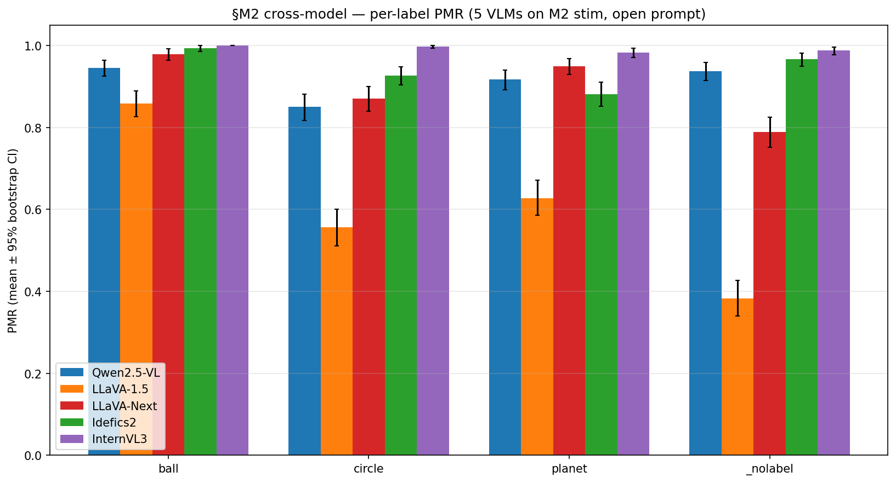
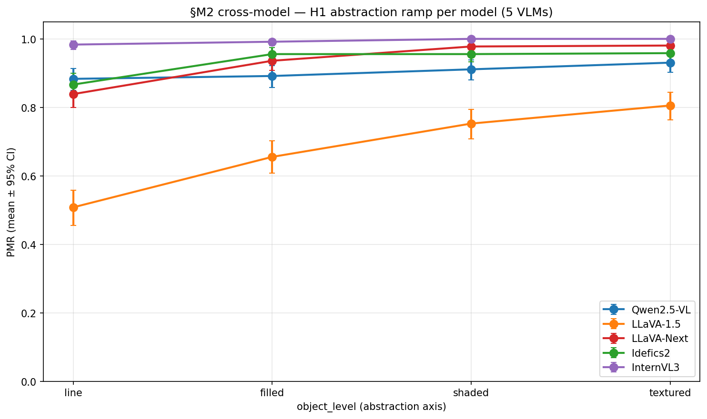
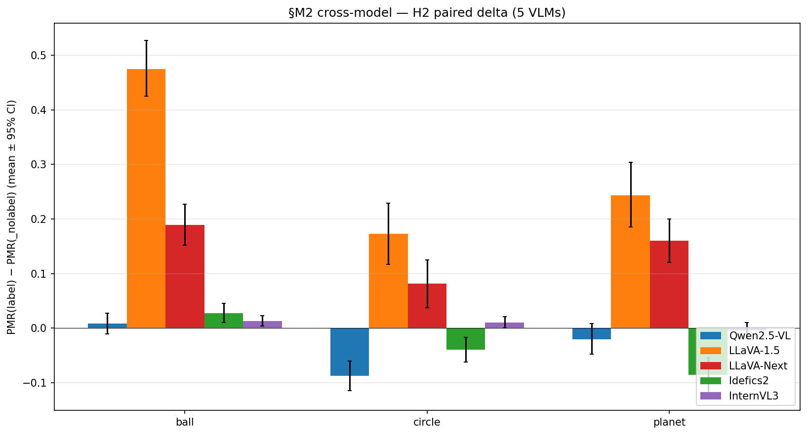

# M2 cross-model (5-model M2-stim apples-to-apples)

> **Recap of codes used in this doc** (one-line each; full definitions in `references/roadmap.md` §1.3 + §2)
>
> - **H1** — PMR rises in an S-shape along the abstraction axis (line → filled → shaded → textured); ground introduction adds the largest single jump.
> - **H2** — The label (ball / circle / planet) independently raises PMR even on minimal stim — a language-prior contribution beyond the visual evidence.
> - **H7** — The label does not toggle PMR — it selects which physics regime applies (ball → kinetic / circle → static / planet → orbital).
> - **H-encoder-saturation** — Behavioral PMR(_nolabel) saturation on synthetic stim is determined at the architecture level (joint encoder + LM), not encoder representational capacity alone.
> - **M2** — ST1 MVP-full — 5-axis factorial (2880 stim); H1 monotone S-curve, H7 emerged.
> - **M4b** — M4 + label-free prompt as H2 null test; revealed H2 is asymmetric on Qwen (circle override, not ball enhancement).
> - **M5a** — ST4 VTI steering — adding +α·v_L10 at LM L10 over visual tokens flips line/blank/none from "stays still" → physics-mode.
> - **M6** — ST5 cross-model sweep — see M6 r1 (LLaVA-1.5), r2 (InternVL3 + LLaVA capture + FC ratio), r3 (Idefics2), r4 (InternVL3 probe), r5 (M8c photo probe), r6 (LLaVA-Next).
> - **M8a** — Stim diversification — non-circle synthetic shapes (square / triangle / hexagon / polygon / wedge × Qwen + LLaVA, labeled + label-free).
> - **§4.6** — VTI-reverse counterfactual stim — pixel-space gradient ascent on Qwen2.5-VL pixel_values maximizing `<h_L10, v_L10>`; 5/5 v_L10 flips at ε=0.05 vs 0/15 random.
> - **v_L10** — Steering direction in LM hidden space (dim 3584 / 4096 per model) at layer 10, derived from M5a class-mean diff (physics − abstract). Unit norm.

## Question

The M2 5-axis factorial (480 stim × 3 labels × 2 prompts = 2880
inferences) was originally Qwen-only. M6 r1 ran the same protocol on
LLaVA-1.5; the other 3 models were tested on M8a-stim only (different
factorial). This milestone fills the gap: **all 5 models run the same
M2 protocol on the same M2 stim**, with LM-layer activation captures
so per-model v_L10 extraction (the prerequisite for §4.6 cross-model)
is also available.

## Method

5 capture-enabled runs + 5 label-free runs on the M2 stim
(`inputs/mvp_full_20260424-093926_e9d79da3`):
- Qwen2.5-VL: original M2 (`outputs/mvp_full_20260424-094103_8ae1fa3d`)
  + label-free (`outputs/label_free_20260425-031430_315c5318`)
- LLaVA-1.5: M6 r1 + M6 r2b capture (existing)
- LLaVA-Next: this milestone (`cross_model_llava_next_capture_*`)
- Idefics2: this milestone (`cross_model_idefics2_capture_*`)
- InternVL3: M6 r2a (existing) + this milestone (added capture run)

Bootstrap CIs: 5000 iterations, prediction-level resampling (seed 42).

## Result



| Model | ball | circle | planet | _nolabel | H1 range |
|---|---:|---:|---:|---:|---:|
| Qwen2.5-VL | 0.946 | 0.850 | 0.917 | 0.938 | +0.05 |
| LLaVA-1.5 | 0.858 | 0.556 | 0.627 | **0.383** | **+0.30** |
| LLaVA-Next | 0.979 | 0.871 | 0.950 | 0.790 | +0.14 |
| Idefics2 | 0.994 | 0.927 | 0.881 | 0.967 | +0.09 |
| InternVL3 | 1.000 | 0.998 | 0.983 | 0.988 | +0.02 |

### H1 abstraction ramp per model



LLaVA-1.5 has the cleanest monotone S-curve (0.51 → 0.81, range 0.30).
Qwen / Idefics2 / InternVL3 are at ceiling; the ramp is invisible.
LLaVA-Next is intermediate (range 0.14, mostly saturated at shaded
and textured).

### H2 paired-delta per model



| Model | ball Δ | circle Δ | planet Δ |
|---|---:|---:|---:|
| Qwen2.5-VL | +0.008 | **−0.088** | −0.021 |
| LLaVA-1.5 | **+0.475** | **+0.173** | **+0.244** |
| LLaVA-Next | +0.190 | +0.081 | +0.160 |
| Idefics2 | +0.027 | **−0.040** | **−0.085** |
| InternVL3 | +0.012 | +0.010 | −0.004 |

Three distinct H2 patterns:

1. **LLaVA-1.5 / LLaVA-Next** (unsaturated CLIP encoder): all positive,
   "classical H2" — every label adds PMR vs. label-free. LLaVA-1.5 is
   the cleanest (ball +0.48), LLaVA-Next muted by CLIP-encoder partial
   saturation.

2. **Qwen / Idefics2** (saturated SigLIP-family encoder, near-zero
   nolabel headroom only because Qwen has it, Idefics2 saturates):
   asymmetric — non-physical labels (circle, planet) suppress PMR
   below the no-label baseline. The "circle override" pattern from M4b
   replicates in Idefics2 (circle −0.04, planet −0.09). The mechanism
   appears to be that abstract-leaning labels override the saturated
   image-prior toward less commitment.

3. **InternVL3** (fully saturated): all deltas ≈ 0. No headroom for
   labels to operate.

This is the **architecture-level reframe** at the H2 level: H2 isn't
"the label always adds PMR" — it's "the label adds PMR when the
encoder leaves room, and otherwise either does nothing or actively
suppresses below baseline." Encoder saturation determines which path
applies.

## Per-model v_L extraction (for §4.6 cross-model prep)

Class-mean diff `mean(h_L | PMR=1) − mean(h_L | PMR=0)` per layer
L ∈ {5, 10, 15, 20, 25}, computed from each model's M2 captures.

| Model | hidden dim | n_pos | n_neg | ||v_L10|| |
|---|---:|---:|---:|---:|
| LLaVA-1.5 | 4096 | 375 | **105** | 0.99 |
| LLaVA-Next | 4096 | 471 | 9 | 0.18 |
| Idefics2 | 4096 | 475 | 5 | 10.4 |
| InternVL3 | 3584 | 479 | **1** | 8.6 |

### Class-imbalance limitation

Three of the four non-Qwen models are too saturated on M2 stim for a
clean v_L10 extraction:
- LLaVA-1.5 has 105 PMR=0 examples (105/480 = 22%) — adequate.
- LLaVA-Next has 9; Idefics2 has 5; InternVL3 has 1 PMR=0 example.

The class-mean diff with n_neg ∈ {1, 5, 9} produces noisy directions
that don't represent "the abstract → physical-mode" axis cleanly —
they more represent the per-stim variance of the negative-class
representative. This is the architecture-level reframe expressed at
the v_L10 level: **for saturated models, M2 stim doesn't span enough
behavioral variance to define v_L10 by class-mean diff**.

Implication for §4.6 cross-model: a meaningful per-model v_L10
extraction needs either (a) harder stim where saturated models also
sometimes fail (e.g., M8c photos, M8a non-circle shapes), or (b) a
different axis definition (e.g., projection onto a label-induced
direction rather than a PMR-induced one).

LLaVA-1.5's v_L10 is the only direct apples-to-apples cross-model
analogue available at this stage. Pixel-space gradient ascent (§4.6
cross-model) is feasible on LLaVA-1.5; for the other 3 models, the
prerequisite v_L10 is not yet reliable from M2 alone.

## Implication for hypotheses

- **H1**: cross-model strict → unsaturated-only confirmed. LLaVA-1.5
  shows clean monotone S-curve; ceiling models compress the axis.
- **H2**: now characterized at 5-model granularity. Three patterns
  (positive on unsaturated, asymmetric on near-saturated, ≈0 on fully
  saturated) match the encoder-saturation prediction.
- **H-encoder-saturation**: 5-model M2-stim apples-to-apples PMR
  ladder now exists (was previously M2 = Qwen-only + cross-model on
  M8a-stim). Strengthens the architecture-level reframe.

## Limitations

1. **Open-prompt only**: forced-choice was excluded for non-Qwen
   models due to LLaVA-A bias and uncertain handling on Mistral-based
   models. Qwen has FC; cross-model FC is open work.
2. **No cross-model vision-encoder probe at M2-stim apples-to-apples**:
   M6 r2 captured Qwen + LLaVA-1.5 vision activations on M2 stim, but
   LLaVA-Next / Idefics2 / InternVL3 don't have M2-stim vision
   captures. Cross-model AUC chain on M2-stim is partial.
3. **v_L extraction is class-imbalanced** for 3 of 4 non-Qwen models
   (see "Class-imbalance limitation" above). §4.6 cross-model is
   feasible only for LLaVA-1.5 from M2 alone.

## Reproducer

```bash
# Run the 5 cross-model M2 captures + label-free runs (~22 min on H200).
CUDA_VISIBLE_DEVICES=1 bash scripts/run_m2_cross_model_chain.sh

# Per-model v_L extraction (~1-2 min).
uv run python scripts/m2_extract_per_model_steering.py

# Cross-model PMR / H1 / H2 analysis + figures.
uv run python scripts/m2_cross_model_analyze.py
```

## Artifacts

- `configs/cross_model_llava_next.py` (+ `_label_free.py`)
- `configs/cross_model_idefics2.py` (+ `_label_free.py`)
- `configs/cross_model_internvl3_capture.py`
- `scripts/run_m2_cross_model_chain.sh` (sequential driver)
- `scripts/m2_extract_per_model_steering.py` (per-model v_L)
- `scripts/m2_cross_model_analyze.py` (PMR / H1 / H2 + figures)
- `outputs/m2_cross_model_summary/{per_label_pmr,per_object_level_pmr,h2_paired_delta}.csv`
- `outputs/cross_model_{llava_next,idefics2,internvl3}_capture_*/probing_steering/steering_vectors.npz`
- `docs/figures/m2_cross_model_{pmr_ladder,h1_ramp,h2_paired_delta}.png`
