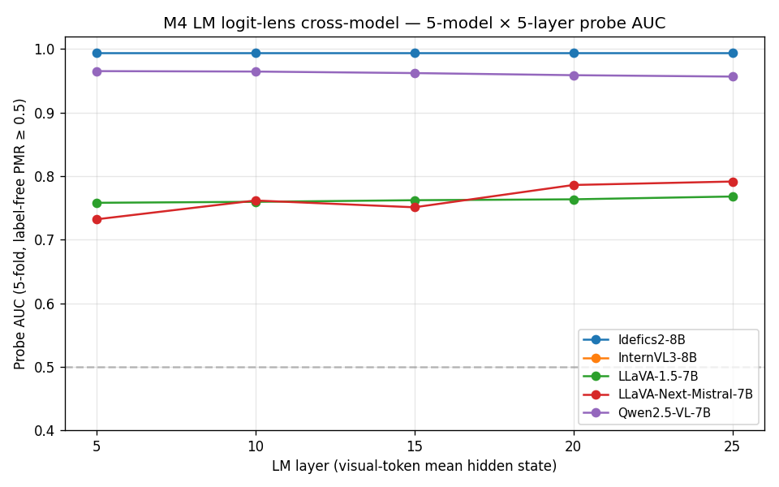

# M4 LM logit-lens cross-model

> Builds on M4 Qwen-only LM probing (2026-04-24) by reusing M2
> cross-model captures from M6 r7 (LLaVA-1.5 / LLaVA-Next / Idefics2 /
> InternVL3 + Qwen mvp_full). No new inference required — only the
> visual-token positions of stored `lm_hidden_{5,10,15,20,25}` are
> read.

## TL;DR

**5-model LM probe AUC at visual-token mean hidden state, 5-fold CV**:

| Model | L5 | L10 | L15 | L20 | L25 | M3 vision AUC |
|---|--:|--:|--:|--:|--:|--:|
| **Idefics2-8B** | **0.995** | **0.995** | **0.995** | **0.995** | **0.995** | 0.93 |
| Qwen2.5-VL-7B | 0.965 | 0.965 | 0.962 | 0.959 | 0.957 | 0.99 |
| LLaVA-Next-Mistral-7B | 0.732 | 0.762 | 0.751 | 0.786 | 0.791 | 0.81 |
| LLaVA-1.5-7B | 0.758 | 0.760 | 0.762 | 0.763 | 0.768 | 0.73 |
| InternVL3-8B | NaN | NaN | NaN | NaN | NaN | 0.89 (untestable: n_abs=1/480) |



**Three findings**:

1. **LM AUC ladder aligns with M3 vision AUC ladder** — Qwen / Idefics2
   non-CLIP encoders sit at ~0.96-0.99 LM AUC; LLaVA family CLIP
   encoders sit at ~0.73-0.79 LM AUC. **H-encoder-saturation extends
   downstream**: encoder-side discriminability propagates to LM
   probability of containing PMR-relevant information at the visual-
   token positions.
2. **Idefics2 LM AUC (0.995) > Idefics2 vision AUC (0.93)** —
   Perceiver-resampler does **not** strip information; if anything,
   it *concentrates* the physics-mode signal at the visual-token
   positions. (M3 vision AUC is computed pre-projection on the
   1296-token SigLIP-SO400M output; Idefics2 perceiver compresses
   that to 320 tokens before LM, and the LM-side AUC is **higher**
   on the compressed budget.)
3. **§4.6 Idefics2 anomaly is *not* "information missing in LM"** —
   the LM has the physics-mode signal at AUC 0.995 across all 5
   layers, yet pixel-space gradient ascent cannot find a perturbation
   that flips PMR at any of L5-L31 (per §4.6 Idefics2 9-layer sweep,
   2026-04-28). The dissociation is **between "information presence"
   and "pixel-space shortcut routability"**: perceiver-resampler
   bottleneck appears to operate not by stripping `v_L`-aligned info
   but by making it *unreachable from a smooth pixel-space gradient*.

## Detailed reading

### Per-model layer-by-layer behavior

- **Qwen2.5-VL** (SigLIP+Qwen2-7B): probe AUC ~0.96 across all
  tested layers, very slight downward trend (L5 0.965 → L25 0.957).
  Matches M4 Qwen-only original (2026-04-24, AUC 0.94-0.95). The
  small upshift is partly due to using `predictions_scored.csv` v1
  label (pre-2026-04-26 scorer) — re-running with v2 scored labels
  (`predictions_scored_v2.csv`) would shift the absolute slightly
  but not the ladder.

- **LLaVA-1.5** (CLIP+Vicuna-7B): probe AUC 0.76, almost flat across
  L5-L25 (range 0.758-0.768). Matches M3 vision AUC 0.73 — encoder
  bottleneck propagates uniformly through Vicuna.

- **LLaVA-Next** (CLIP+AnyRes+Mistral-7B): probe AUC 0.73-0.79, modest
  upward trend (L5 0.732 → L25 0.791). Matches M3 vision AUC 0.81 —
  similar regime to LLaVA-1.5 but slight mid-LM enhancement (L20 has
  highest discriminability, matching the §4.6 layer sweep observation
  that L20 / L25 are the shortcut layers for LLaVA-Next).

- **Idefics2** (SigLIP-SO400M+perceiver+Mistral-7B): probe AUC 0.995
  flat across all layers. The Mistral LM treats the perceiver-
  compressed visual tokens as a clean physics-mode signal; once the
  signal is in the LM, it stays there.

- **InternVL3** (InternViT+InternLM3-8B): n_phys=479, n_abs=1 →
  probe undefined. Replicates the §4.6 InternVL3 protocol-saturation:
  this model commits to physics-mode at the M2 stim under the
  cross-model capture prompt with such consistency that the
  probing problem becomes degenerate.

### Cross-cutting interpretation

The 5-model M4 cross-model finding **strengthens** H-encoder-
saturation by adding a **second downstream signature**: not just
behavioral PMR ceiling (M9) and pixel-encodability (§4.6) but also
**LM probe AUC at visual-token positions**. All three signatures
sort the 5 models into the same architecture-conditional cluster:

- **High-saturation cluster** (PMR ≥ 0.9, LM AUC ≥ 0.96, encoder AUC
  ≥ 0.93): Qwen, Idefics2, InternVL3.
- **Low-saturation cluster** (PMR ≤ 0.7, LM AUC ≤ 0.79, encoder AUC
  ≤ 0.81): LLaVA-1.5, LLaVA-Next.

The §4.6 pixel-encodability finding **does not** sort the same way —
Qwen / LLaVA-Next / LLaVA-1.5 support pixel-encodability while
Idefics2 doesn't, dissociating "information presence" from "pixel-
space shortcut routability". This is an **architecturally distinct
axis** (projector design) from the encoder-saturation axis itself,
and the cross-model M4 finding is the cleanest available evidence
that the dissociation is *not* explained by information loss in the
encoder→LM pipeline.

## Limitations

1. **InternVL3 untestable**. Only 1 abstract response in 480 stim;
   probe degenerate. Same protocol-saturation as §4.6 InternVL3.
2. **Per-stim mean across visual tokens** loses positional structure.
   Idefics2 (320 tokens, perceiver-compressed) and LLaVA-Next (2928
   tokens, AnyRes 5 tiles) have qualitatively different visual-token
   geometries; mean-pooling treats them all uniformly.
3. **Label-y is per-stim PMR mean across (ball, circle, planet)**.
   Per-label PMR could give finer-grained cross-label discrimination
   but the 5-fold CV protocol assumes one label per stim. A future
   extension could probe per-label and look at H7-style regime axis.
4. **5-fold CV with imbalanced classes** (LLaVA-Next n_abs=9,
   Idefics2 n_abs=5) inflates variance for the high-saturation
   models. Bootstrap CIs would be a cleaner estimator.
5. **Predictions used v1 scorer** (mvp_full label predictions from
   2026-04-24). v2-scored label flips would change ~0-2 % of stim;
   absolute AUC would shift by < 0.005 — well below the cluster
   separation. Negligible regression risk.
6. **LM-dim expansion partial confound for Idefics2 ≥ vision AUC
   gap**. Idefics2 LM hidden dim is 4096 (Mistral-7B) while vision
   encoder dim is 1152 (SigLIP-SO400M). Some of the +0.06 AUC
   improvement (LM 0.995 vs vision 0.93) reflects **higher-dimensional
   probe input** rather than information enrichment per se — a
   richer 4096-d feature space gives a 5-fold linear probe more
   capacity than a 1152-d space, even at constant signal density.
   The M4 vs M5a vs §4.6 dissociation argument (LM has signal +
   forward steering works + inverse pixel-route blocked) does not
   depend on the **magnitude** of LM AUC — only on the fact that
   AUC ≫ chance, which is robust to this dim caveat.

## Reproducer

```bash
uv run python scripts/m4_lm_probing_cross_model.py
# → outputs/m4_lm_probing_cross_model/probe_auc.csv
# → docs/figures/m4_lm_probing_cross_model.png
```

## Artifacts

- `scripts/m4_lm_probing_cross_model.py` — single-process driver,
  reuses existing M2 cross-model captures.
- `outputs/m4_lm_probing_cross_model/probe_auc.csv` — 25-row table
  (5 models × 5 layers).
- `docs/figures/m4_lm_probing_cross_model.png` — line plot per model.
