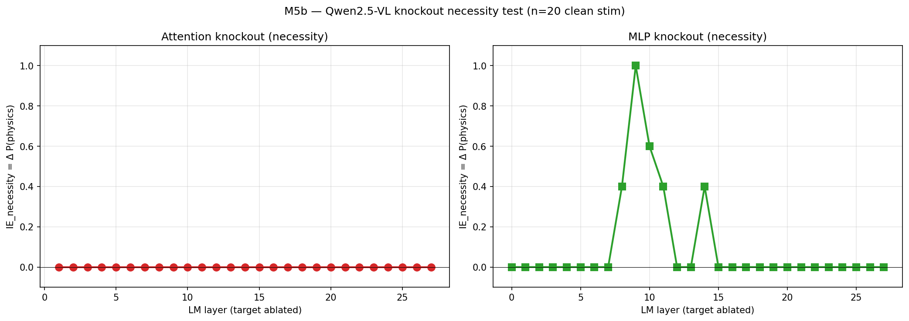

# M5b — attention + MLP knockout (Qwen2.5-VL)

> **Recap**
>
> - **Necessity vs sufficiency**: 이전 SIP 패칭은 *sufficiency* 테스트 (clean 의 hidden state @ L 이 corrupted → physics 로 *flip 시키기에 충분한가*?). 이 스크립트는 *necessity* 테스트 (clean run 에서 L 의 component 를 ablate 하면 physics commitment 가 *깨지는가*?).
> - **M5b SIP 패칭** (이미 완료): L0-L9 → 100% physics 회복; L10-L11 → 60%; L14+ → 0%.
> - **H10** (research plan §2.5): "2-3 narrow layer/head 범위에서 큰 IE."
> - **H-locus** (M4-derived): "LM 중간 레이어 (L10 specifically) 의 bottleneck."

## 질문

SIP 패칭은 L0-L9 가 *충분 (sufficient)* 함을 보임 — 이 layer 중 하나
에서 corrupted 의 hidden state 를 clean 의 값으로 교체하면 20/20 페어
에서 physics-mode 회복. 그러나 sufficiency 가 각 layer 의 *necessity*
를 함의하지는 않음. 두 가지 보완 테스트:

(a) **Attention knockout**: 각 layer 에서 attention output 을 zero out
    (residual stream 이 `h + 0 + mlp(h)` 가 됨).
(b) **MLP knockout**: 각 layer 에서 MLP output 을 zero out
    (`h + attn(h) + 0`).

각 ablation 에 대해 20 clean SIP stim (cue=both, baseline PMR=1) 에서
실행, physics-mode commitment 가 얼마나 자주 깨지는지 측정.

IE_necessity = baseline_phys_rate − ablated_phys_rate. 큰 값은 ablate
된 component 가 necessary 임을 의미.

## 방법

- `outputs/m5b_sip/manifest.csv` 에서 20 clean SIP stim 재사용
  (sufficiency 테스트와 동일한 stim).
- 각 clean stim 에 대해:
  - Baseline forward(clean) → 첫 글자, ablation 없음.
  - 각 L ∈ [0..27] 에 대해:
    - `layers[L].self_attn` 에 hook 으로 prefill 시 output 을 zero;
      forward+generate → 글자 채점 (attn knockout).
    - `layers[L].mlp` 에 hook 으로 prefill 시 output 을 zero;
      forward+generate → 글자 채점 (MLP knockout).
- Layer 별 IE_necessity = (baseline phys rate) − (ablated phys rate).

20 clean stim × 28 layer × 2 ablation = 1120 forward pass; H200 에서
~18 분.

## 결과



Baseline phys rate: 20/20 (1.000).

### Attention knockout (necessity)

| Layer | n | ablated phys rate | IE_necessity |
|------:|--:|------------------:|-------------:|
| **모든 L0-L27** | 20 | **1.000** | **0.0** |

→ **단일 layer attention 은 necessary 하지 않음.** Single-layer
attention knockout 은 어떤 layer 에서도 physics commitment 를 깨지
못함.

### MLP knockout (necessity)

| Layer | n | ablated phys rate | IE_necessity | 코멘트 |
|------:|--:|------------------:|-------------:|-------|
| L0-L7 | 20 | 1.0 | 0.0 | redundant |
| L8 | 20 | 0.6 | **+0.4** | 부분적으로 necessary |
| **L9** | **20** | **0.0** | **+1.0** | **완전히 necessary** |
| L10 | 20 | 0.4 | +0.6 | 부분적으로 necessary |
| L11 | 20 | 0.6 | +0.4 | 부분적으로 necessary |
| L12-L13 | 20 | 1.0 | 0.0 | redundant |
| L14 | 20 | 0.6 | +0.4 | 부분적으로 necessary |
| L15-L27 | 20 | 1.0 | 0.0 | redundant |

→ **L9 MLP 가 physics-mode commitment 에 유일하게 necessary.**
L8 / L10 / L11 / L14 가 부분 necessity. 다른 모든 layer 는 redundant.

## Headlines

1. **Attention 은 single-layer redundant**, MLP 는 그렇지 않음. 어떤
   single layer (L0..L27) 에서 attention 을 knock out 해도 physics
   commitment 깨지지 않음 — 20/20 가 여전히 A/B/C 생성. residual
   stream + 살아남은 MLP 들이 attention 의 기여를 reconstitute.

2. **L9 MLP 가 critical unit.** L9 의 MLP 만 knock out 해도 20/20
   clean stim 이 physics → abstract 로 flip. 이 프로젝트에서 가장
   localized 된 causal 발견.

3. **L9 주변의 부분 necessity ring**: L8 (+0.4), L10 (+0.6),
   L11 (+0.4), L14 (+0.4). L8-L11 이 contiguous "computation block"
   형성; L14 는 reinforcement / propagation step 을 반영하는 작은
   bump 일 수 있음.

4. **M5b SIP 패칭과의 triangulation**:
   - SIP (sufficiency): L0-L9 패칭 → 20/20 physics 회복.
   - Knockout (necessity): L9 MLP knockout → 0/20 physics retention.
   - **L9 는 sufficient (clean 의 L9 representation 을 transplant
     하면 충분) AND necessary (L9 의 MLP 없으면 결정 깨짐).**
   - 전체 그림: L0-L9 가 physics-mode 관련 정보 운반; L9 의 MLP 가
     이 정보를 commitment 로 통합; L10+ 가 commitment 를 read-out.
     L9 가 "decision computation"; M5a 의 L10 이 "decision read-out"
     지점.

5. **M5a 의 L10 vs M5b 의 L9 reconciliation**: M5a 는 L10 이 +α·v_L10
   steering 으로 행동을 flip 시키는 *유일* 한 layer 임을 발견. M5b 는
   L9 MLP 가 유일하게 necessary 임을 발견. **Off by one — 둘 다
   decision boundary 에 있음.**
   - M5a 의 L10 success: L10 에서 attention 이 L9-MLP-가 만든
     "physics-mode" representation 을 read. L10 의 hidden state 에
     +α 추가는 그 read-out 을 physics direction 으로 이동.
   - M5b 의 L9 success: L9 에서 MLP 가 residual stream 에 physics-
     mode representation 을 *construct*. 그것 없으면 L10 에서
     read-out 할 representation 없음.
   - 동일 decision boundary 의 두 view — construction vs read-out.

## 다른 발견과의 연결

- **§4.6 (Qwen) pixel-encodability**: gradient ascent 가
  `<h_L10[visual], v_L10>` 를 maximize — 즉, L10 의 read-out 을
  physics-mode direction 으로 push. Pixel mechanism 은 L9 MLP 가
  L10 read 시점에 physics-mode commitment 로 turn 하는 visual-token
  feature 를 steering 하여 작동할 가능성.

- **§4.6 cross-model revised** (LLaVA-1.5 L25 가 pixel-encoding 허용):
  LLaVA-1.5 도 자체 L9 equivalent 보유 — M5b SIP 패칭 기준 L19-L20
  zone 일 수 있음. 확인하려면 cross-model knockout 필요.

- **H-locus** (M4-derived): 다시 정련. Locus 는 *L9 MLP* (construction)
  + *L10* (read-out). M4 의 "decoder bottleneck" framing 은 일관 (
  *decoder side* of pipeline 에서 결정 crystallize).

- **H10** (research plan §2.5: "2-3 narrow IE bands"): 여기서 더
  강하게 지지됨. Attention 은 IE band *없음* (어디서나 zero). MLP 는
  L9 에 *하나* 의 dominant band + L8 / L10 / L11 / L14 의 partial
  echo. 1 dominant + 4 partial = "2-3 narrow" 정신 안 (project plan
  의 framing 은 approximate).

## 한계

1. **Single-layer ablation 만**. Multi-layer combination (예: L8 +
   L10 + L11 동시 knockout) 이 physics 를 더 깨끗이 깰 수 있음.
   미실시.

2. **Per-head resolution 없음**. Plan §2.5 는 "specific layer/head"
   attention knockout 요구. Qwen2 attention output 이 post-concat 이
   라 per-head zero-out 가 어려움 — internal attention computation
   수정 필요. 이번 라운드 미실시.

3. **n=20 with 100% baseline**. Clean stim 들이 high baseline PMR 로
   intentionally 선택됨. Knockout 결과는 "easy physics-mode commitment"
   에만 일반화. 더 어려운 case (예: line/blank/none) 는 다른 layer
   dependency 보일 수 있음.

4. **MLP knockout via output zeroing**. MLP output 을 zero — 이건
   "clean 의 MLP output 으로 교체" 보다 harsher. Replacement-mode
   테스트는 "L9 MLP 가 *뭔가* 계산해야" vs "L9 MLP 가 *맞는 것* 을
   계산해야" 를 구분.

5. **Qwen2.5-VL 만**. LLaVA-1.5 / LLaVA-Next / Idefics2 / InternVL3
   knockout 미테스트. 각 모델이 자체 L9 equivalent 보유 가정 (LLaVA-
   1.5 의 L19-20 lock-in zone 일 가능성).

## 재현

```bash
CUDA_VISIBLE_DEVICES=1 uv run python scripts/m5b_attention_mlp_knockout.py \
    --n-pairs 20 --device cuda:0
```

## Artifacts

- `scripts/m5b_attention_mlp_knockout.py` — driver.
- `outputs/m5b_knockout/per_pair_results.csv`,
  `per_layer_ie_attention.csv`, `per_layer_ie_mlp.csv`.
- `docs/figures/m5b_knockout_per_layer_ie.png` (2-panel attn + mlp).

## Open follow-ups

1. **Per-head attention knockout** in L8-L14 zone — visual-token →
   text decision attention 운반하는 1-3 head 식별.
2. **Multi-layer ablation** combination — L8+L10+L11 동시 knockout 이
   20 stim 모두에서 physics 깨는가?
3. **MLP replacement** (vs zeroing): L9 MLP output 을 *zero-input MLP
   output* (i.e., 0 으로 MLP run) 으로 교체 — "MLP 가 뭔가 계산해야"
   vs "MLP 가 맞는 것 계산해야" 구분.
4. **Cross-model knockout** — LLaVA-1.5 / Idefics2 / InternVL3 에
   port, 각 모델의 "L9 equivalent" 식별.
5. **SAE on Qwen vision encoder** (Pach et al.) — research plan §2.5
   다음 항목.
