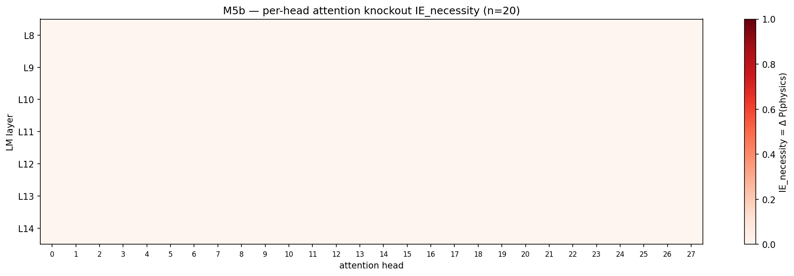

# M5b — per-head attention knockout (Qwen2.5-VL)

> **Recap**
>
> - **Layer-level knockout** (이미 완료): **L9 MLP** output zero → 20/20 clean stim physics → abstract flip; **모든 L0-L27 single-layer attention knockout 이 IE = 0**.
> - **제기된 질문**: "single-layer attention 이 redundant" 는 (a) 정보가 layer 내 head 들에 분산되어 head-level ablation 도 0 으로 나올지, 또는 (b) 1-2 head 가 결정 운반하지만 layer-level knockout 가 attention 신호 외에 다른 것까지 깨서 fail 인지를 의미할 수 있음.
> - 이 스크립트는 L8-L14 zone (L9 critical unit 주변의 partial-MLP-necessity ring) 에서 (layer, head) 한 쌍씩 ablate 하여 disambiguate.

## 질문

Layer-level "attention is redundant" 결과가 더 높은 resolution 에서도
유지되는가? 일부 head 가 visual-token → text physics decision attention 을
운반한다면, 개별 ablation 은 layer-level 결과가 zero 였더라도 non-zero IE 를
보여야 함. Per-head ablation 도 zero 이면, redundancy 는 진짜이고 광범위함.

## 방법

- `outputs/m5b_sip/manifest.csv` 의 20 clean SIP stim 재사용 (layer-level
  knockout 와 동일 cohort).
- 각 (layer L ∈ {8, 9, 10, 11, 12, 13, 14}, head h ∈ [0..27]) 에 대해:
  - `layers[L].self_attn.o_proj` 에 `forward_pre_hook` 등록.
  - Hook 이 input tensor 를 clone 하고 prefill (seq_len > 1) 시 slice
    `x[..., h * head_dim : (h+1) * head_dim]` 을 zero — projection 이전에
    head h 의 o_proj output 기여를 zero 로 설정 (clean per-head ablation).
- 글자 응답 채점 (A/B/C → physics; D → abstract).
- 각 (L, h): `IE_necessity = baseline_phys_rate − ablated_phys_rate`.

20 stim × 7 layer × 28 head = 3920 ablation pass + 20 baseline = 3940
forward pass; H200 에서 ~36분.

Qwen2.5-VL-7B LM config: 28 layer, 28 attention head, head_dim=128,
hidden=3584. Note: GQA with `num_key_value_heads=4` — `o_proj` input
slicing 으로 per-Q-head ablation 은 K/V head sharing 과 무관 (concatenated
head output (28 × 128 = 3584 dim) 이 o_proj 가 보는 것).

## 결과



Baseline phys rate: 20 stim 모두에서 20/20 (1.000).

**모든 (layer, head) pair 가 `IE_necessity = 0.0`** — L8-L14 × 28 head 전체에
서 prefill 시 head 하나 ablate 해도 *전혀* physics commitment 안 깨짐.

| Layer | 28 head 중 max IE | mean IE | IE > 0 인 head 수 |
|------:|------------------:|--------:|----------------:|
| L8 | 0.0 | 0.0 | 0 |
| L9 | 0.0 | 0.0 | 0 |
| L10 | 0.0 | 0.0 | 0 |
| L11 | 0.0 | 0.0 | 0 |
| L12 | 0.0 | 0.0 | 0 |
| L13 | 0.0 | 0.0 | 0 |
| L14 | 0.0 | 0.0 | 0 |

Per-stim 요약: 모든 stim 의 `broken = 0/196` head-ablation — 즉 7-layer ×
28-head grid 의 어떤 head ablation 도 어떤 clean stim 의 physics-mode 를
flip 시키지 못함.

## Headlines

1. **Per-head attention 도 redundant — layer-level finding 확인.**
   L8-L14 zone 의 어떤 (layer, head) 든 ablate 해도 20 clean stim 모두
   physics-mode (A/B/C) 유지. Layer-level 결과 (full-attention knockout
   도 모든 L0-L27 에서 IE=0) 와 결합하면 가능한 가장 강한 null:
   **attention 은 어떤 granularity 에서도 bottleneck 이 아님.**

2. **Redundancy 는 resolution artifact 가 아닌 진짜.** 단일 "decision-
   carrying head" 가설이라면 L8-L14 zone (MLP 부분 necessity 보임) 에서
   IE > 0 인 (L, h) 가 *적어도* 일부 있어야 함. 그런 head 가 완전 부재
   = attention 의 physics-mode commitment 기여는 진짜로 diffuse.

3. **Triangulated mechanism 은 깨끗하게 유지**:
   - **L9 MLP**: necessary (knockout 가 20/20 flip) AND sufficient (SIP
     L0-L9 패칭이 20/20 회복). Construction site.
   - **Attention**: layer + head level 모두 redundant. 정보가 residual
     stream 으로 흐름; 특정 attention head 는 개별적으로 dispensable.
   - **L10**: M5a steering site (read-out 경계). v_L10 vector 는
     residual stream 에 lives — 충분히 비슷한 *어떤* attention pattern
     으로도 접근 가능, 한 specific head 가 아님.

4. **H10** (research plan §2.5: "2-3 narrow IE bands") *완전* resolved:
   시스템 어디서나 유일한 "narrow band" 는 L9 MLP necessity. Attention
   은 어떤 resolution (single-layer, per-head) 에서도 narrow IE band
   zero. 원래 H10 framing 은 attention 과 MLP 모두 localize 가정;
   MLP 만 그러함.

5. **이게 배제하는 것**: physics-mode activation 의 head-pruning
   해석 (예: "layer Y 의 head X 가 visual token 을 read 하고 모델이
   그 head output 으로 commit"). Mechanism 은 construction-and-
   broadcast, pull-through-a-specific-head 가 아님.

## 다른 발견과의 연결

- **M5b SIP 패칭 + MLP knockout**: L9 MLP 가 load-bearing computational
  unit; attention 의 layer-level 역할은 L9 representation 을 residual
  stream 으로 후속 layer 에 broadcast. Per-head IE = 0 가 broadcast 가
  진짜로 diffuse 함을 확인 — 어떤 single head 도 messenger 아님.

- **L10 의 M5a steering**: v_L10 direction 은 residual stream 에 lives.
  Steering 이 post-attention state 를 physics direction 으로 push 하지만
  어떤 한 head 도 preferential 하게 bias 하지 않음 — redundant-attention
  reading 과 완전히 일관.

- **Vision-encoder-side intervention (다음: SAE)**: attention 이
  bottleneck 아님이 확정되었으므로, 다음 plausible localized necessity
  site 는 *L9 upstream* — encoder output 또는 projector. Vision encoder
  의 마지막 layer 위 SAE feature 가 자연스러운 follow-up.

## 한계

1. **Single-head ablation 만**. Multi-head combination (예: L9 의 top-N
   visual-attention head 동시 zero) 이 single-head IE = 0 라도 *cumulative*
   necessity 보일 수 있음. 이번 null 은 single-head resolution 에 conditional.

2. **L8-L14 zone 만**. 해당 layer 범위 밖 head 미테스트. Zone 은 MLP
   부분 necessity 보이는 곳으로 선택; plausible attention-only IE 는
   바깥에 존재 가능 (예: Qwen 에 L25 readout layer 가 있다면).

3. **`o_proj` input slicing 은 Q-head separability 가정**. Qwen 은 GQA
   (4 KV head × 7 Q head). Slicing 은 concatenated per-Q-head output 위에
   동작 — ablation 으로는 정확하지만, 결과 "head" ablation 은 Q-head 의
   specific 기여를 conflate; K/V share-pattern 은 unchanged.

4. **n=20 with 100% baseline**. Layer-level 와 동일한 caveat: easy
   physics-mode commitment (cue=both; M5b SIP clean stim) 만 테스트.
   더 어려운 case (예: line/blank/none) 가 다른 per-head dependency
   보일 가능성 — 그러나 이번 null 의 깨끗함을 감안하면 surprising 일 것.

## 재현

```bash
CUDA_VISIBLE_DEVICES=1 uv run python scripts/m5b_per_head_attention_knockout.py \
    --n-pairs 20 --layers 8,9,10,11,12,13,14 --device cuda:0
```

## Artifacts

- `scripts/m5b_per_head_attention_knockout.py` — driver.
- `outputs/m5b_per_head/per_pair_results.csv`,
  `per_head_ie.csv`.
- `docs/figures/m5b_per_head_attention_ie.png` — heatmap (layer × head, 모두 zero).

## Open follow-ups

1. **Multi-head combination ablation**: layer 별 top-N head 동시 knockout;
   cumulative IE 등장하는가?
2. **Vision-token attention probe**: 어떤 head 가 visual token 에 가장
   attend 하는가? (그 head 의 output 이 necessary 한 것과 다름 — head 별
   visual position 에 대한 attention map 은 necessity 와 독립적으로
   "decision read-out" head 후보 ranking 가능.)
3. **SAE intervention** (다음 M5b 하위 작업): vision encoder output 의
   monosemantic "physics-cue" SAE feature 를 zero 하고 PMR 떨어짐 측정.
   Attention 이 bottleneck 아님이 확정되었으므로 다음 테스트는 LM
   *upstream* (encoder side) 으로 이동.
