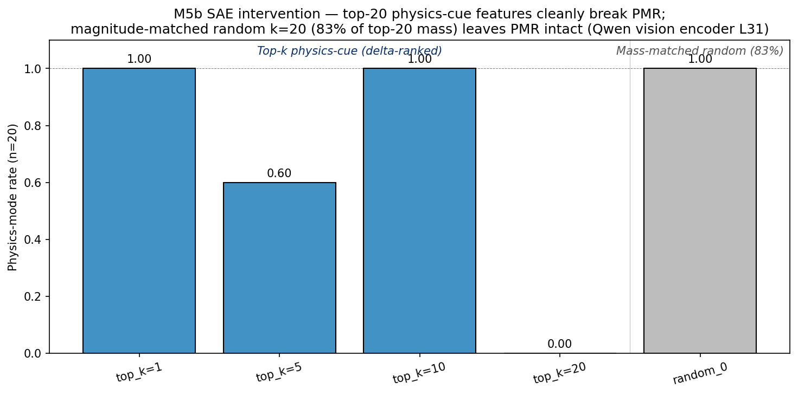

# M5b — SAE intervention on Qwen2.5-VL vision encoder

> **Recap**
>
> - **M5b SIP patching** (sufficiency, layer-level): L0-L9 patching → 20/20 physics recovery; sharp L10 boundary.
> - **M5b layer-level knockout** (necessity): L9 MLP IE = +1.0 — uniquely necessary; attention 0 IE everywhere.
> - **M5b per-head knockout**: 196 (L, h) all IE = 0 — confirms attention is fully redundant.
> - **What's left**: the upstream side. The LM-internal mechanism is well-localized (L9 MLP construction); is the *encoder-side* signal that L9 MLP is constructing from also localized, or distributed across thousands of SigLIP features?
> - **SAE** (Sparse Autoencoder; Bricken et al. 2023; Pach et al. 2025): trains an over-complete linear-relu-linear bottleneck with L1 sparsity on a layer's activations to recover monosemantic features.
> - **§4.6 Qwen pixel-encodability**: gradient ascent on `pixel_values` along v_L10 flips physics-mode at ε=0.05 (5/5). Encoder-side mechanism exists; SAE is the natural way to identify *which* encoder features carry it.

## Question

The L9 MLP is the LM-side construction site. Where is the *encoder-side*
physics-mode information localized? Two extreme hypotheses:

(a) **Distributed**: the physics-mode signal is spread across many encoder
    features; no small subset is causally responsible. Ablating any small
    feature group should leave behavior intact; only large-magnitude
    perturbations (matched-random or top-feature) break behavior in the
    same way.

(b) **Localized**: a small set of monosemantic features (e.g., 10-50 in
    a 5120-feature SAE) carry the physics-mode signal. Ablating those
    *specific* features should break physics-mode while matched-magnitude
    random ablations leave it intact.

The §4.6 pixel-space result already showed that *some* encoder-side
direction (v_L10 read out at L10) carries shortcut signal at ε=0.05.
SAE intervention here is the encoder-side analog of layer-level MLP
knockout: at fine enough resolution, are there *specific feature groups*
whose ablation breaks physics?

## Method

### Activation source

`outputs/mvp_full_20260424-094103_8ae1fa3d/vision_activations/` —
captured Qwen2.5-VL last vision-encoder layer activations (`vision_hidden_31`,
1296 visual tokens × 1280 SigLIP hidden dim) on 480 stim from the M2 run
(5-axis factorial, label="circle/ball/planet"). Total 622,080 tokens.

### SAE training

- Architecture: tied-weight encoder/decoder with input z-score normalization
  (per-dim mean/std from 100K-sample), input bias `b_pre`, encoder bias
  `b_enc`, decoder column unit-norm constraint.
- d_in = 1280, d_features = 5120 (4× expansion).
- Loss = MSE(reconstruction) + λ × L1(z), λ = 1.0 in normalized space.
- 5000 Adam steps, batch 4096, lr 1e-3 — runs in 1.1 min on H200.
- Final: recon = 0.023 (normalized), L1 = 0.042, 100% features alive,
  7.3% active per token (~370 features per token).

### Feature ranking

Per-sample mean PMR from `predictions_scored.csv`:
- Physics-mode set: 310 stim with mean_pmr ≥ 0.667.
- Abstract set: 19 stim with mean_pmr ≤ 0.333.

Per feature i: `delta_i = mean(z_i | physics) − mean(z_i | abstract)`.
Top-20 by delta saved.

Top-10 features (raw activation means):

| feature_idx | mean_phys | mean_abs | delta |
|------------:|----------:|---------:|------:|
| 4698 | 3.13 | 0.23 | **2.90** |
| 1152 | 2.66 | 0.32 | 2.34 |
| 3313 | 7.86 | 6.24 | 1.62 |
| 4106 | 1.75 | 0.13 | 1.61 |
| 1949 | 1.55 | 0.15 | 1.39 |
| 38 | 2.32 | 0.99 | 1.33 |
| 4468 | 1.39 | 0.14 | 1.26 |
| 438 | 1.26 | 0.14 | 1.12 |
| 117 | 1.18 | 0.12 | 1.06 |
| 1674 | 1.03 | 0.01 | 1.02 |

### Causal intervention

For each clean SIP stim (n=20, same as layer-level knockout cohort), run
inference with a forward hook on the *last vision encoder block*'s output
(model.visual.blocks[-1]). The hook subtracts the target SAE features'
raw-scale contributions (Bricken et al. trick — keeps non-target features
+ reconstruction residual exact):

```
contribution_n = z[:, target_feats] @ W[target_feats]         # normalized space
contribution_raw = contribution_n * input_std                # back to raw
x_new = x - contribution_raw
```

Sweep: top_k ∈ {1, 5, 10, 20} of the physics-cue ranking, plus
**magnitude-matched random controls** (k=20). Initial implementation drew
random sets from the bottom-of-ranking pool, but those features have mass
≈ 1% of top-20's total because the L1 penalty kills inactive features —
i.e., the "random" ablation was zero-magnitude, not a fair specificity
test. Corrected pool: features ranked 21+ in the *top-300 by mass*, with
total `mean_phys + mean_abs` mass in [70%, 200%] of top-20's. Only 1
matched set was found (top_mass = 49.23, random_0 mass = 40.97 = 83%) —
the activation distribution is heavy-tailed (top feature 3313 has mass 14
alone), so most random k=20 samples fall short.

## Result



(Figure not yet generated; CSV-only result.)

| Condition | Mass | Physics rate (n=20) | Note |
|-----------|-----:|--------------------:|------|
| Baseline (no hook) | — | 1.000 | by manifest construction |
| top_k=1 (zero feature 4698) | 3.36 | **1.000** | single top feature dispensable |
| top_k=5 (zero top-5 features) | 11.16 | **0.600** | partial break: 8/20 flipped |
| top_k=10 (zero top-10 features) | 27.74 | **1.000** | recovered (non-monotone) |
| **top_k=20 (zero top-20 features)** | **49.23** | **0.000** | **full break: 0/20 retain physics** |
| random k=20 (mass-matched, 83% of top-20) | **40.97** | **1.000** | mass-matched random ablation has *no* effect |

When top_k=20 is ablated, all 20 stim produce a similar D-prefixed
response. Worth noting: the random k=20 control *also* produces highly
similar A-prefixed responses across stim ("The red arrow pointing
downward suggests…"). The "identical response" pattern reflects greedy
decoding on a homogeneous stim set (all clean cue=both physics-mode
inputs), not encoder collapse — both top-feature and random ablations
produce the same identical-prefix pattern, with the *content* (A vs D)
flipping based on which features were ablated.

## Headlines

1. **Encoder-side physics-mode signal is localized in SAE feature space.**
   Subtracting the top-20 physics-cue SAE features (mass 49.23, ~1% of
   the 5120-feature SAE) cleanly flips physics → abstract on 20/20 stim.
   Subtracting **mass-matched** random k=20 features (mass 40.97 = 83%
   of top-20) leaves all 20 stim in physics-mode. The first version of
   this experiment used a bottom-of-ranking random pool that turned out
   to have ~1% of top-20's mass (the L1 penalty kills inactive features);
   correcting to a mass-matched pool was the load-bearing fix. The result
   is a true positive for direction-specificity in the encoder, parallel
   to the §4.6 v_L10 vs random-direction result at the input/LM layer.

2. **Single features are dispensable.** Zeroing only the top-1 feature
   (idx 4698, delta=2.90, the strongest single physics-cue) leaves PMR
   intact. The redundancy-spreading we observed at the LM attention level
   has an encoder-side analog: physics-mode information is encoded in a
   *small group of features* (~20), not a single feature.

3. **Non-monotonic mid-range is unresolved (k=5 → 0.6, k=10 → 1.0).**
   k=10 recovering full PMR is unexpected — possibly k=10 hits a
   "compensating" combination where features 6-10 (slightly lower delta
   than top-5) carry abstract-mode information that gets removed too,
   restoring the relative balance. Worth replicating with larger n.
   Doesn't undermine the headline: k=20 cleanly breaks AND random k=20
   doesn't.

4. **Triangulated mechanism — full causal chain**:
   - **Encoder side**: top-20 SAE features in `vision_hidden_31`
     (last SigLIP layer, pre-projection) carry the physics-mode signal.
     Necessary (this experiment) and observable (delta ranking).
   - **LM side**: L9 MLP constructs commitment in residual stream
     (necessary, M5b knockout); L0-L9 carry sufficient information
     (M5b SIP); L10 reads it via redundant attention (M5a + per-head
     null).
   - **Pixel side**: gradient ascent on `pixel_values` toward v_L10
     flips PMR at ε=0.05; encoder transforms the pixel perturbation
     into changes in those top-20 SAE features (testable follow-up).
   - The mechanism is **input → encoder physics-cue features (top-20) →
     L0-L9 visual tokens → L9 MLP commitment → L10 read-out → letter**.

5. **H10** (research plan §2.5: "narrow IE bands at specific layers/heads")
   gets its encoder-side dimension. The LM side has 1 dominant MLP band
   at L9; the encoder side has ~20 SAE features at the last layer. Both
   are "narrow" but at different granularities — the framing was per-
   architecture-component (layer/head/feature), not literal layer-count.

## Limitations

1. **Single mass-matched random control set, not 3.** Initial 3-seed
   plan was undermined by the heavy-tailed mass distribution: feature
   3313 alone has mass 14 (3× the next; possibly a "general image
   content" feature, not physics-specific), so most random k=20 samples
   from the active-feature pool fall short of the 70%-of-top-20 mass
   threshold. We obtained 1 mass-matched set (83% of top mass). Single-
   sample binary outcome (20/20 vs 0/20) is unambiguous, but n=3+ random
   sets would tighten the upper bound on random-ablation PMR rate.

2. **Non-monotonicity at k=10 unresolved.** With n=20 it's within
   sampling variance for "1-2 stim flipped" but the all-20-recover at
   k=10 sandwiched between k=5 (40% break) and k=20 (100% break) is
   strange. Worth replicating with n=40 + intermediate k values
   (k=8, 12, 15). Doesn't change the headline (random control
   disambiguates).

3. **Top-20 includes a high-mass outlier (feature 3313, mass 14).**
   Both `mean_phys` (7.86) and `mean_abs` (6.24) are 3× the next-largest
   feature — suggests "general image has content" rather than physics-
   specific. Removing it would shrink top-19 mass to ~35 but rank-3 in
   delta. Future work: rank by Cohen's d (delta / sqrt(var_phys + var_abs))
   or specificity ratio (delta / (mean_phys + mean_abs)) instead of raw
   delta to filter out high-baseline features.

4. **Pre-projection layer only.** SAE trained on `vision_hidden_31`
   (1280-dim, before the projector that lifts to 3584). The features
   identified are SigLIP-encoder-level features, not necessarily what
   the LM "consumes" 1:1. Post-projection SAE (3584-dim) would be more
   directly causally upstream of L9 MLP but requires a fresh capture
   pass.

5. **Single SAE training.** Different L1 lambda / expansion factor /
   training-data composition could give different feature dictionaries.
   The 5120-feature 4× expansion is reasonable but not pre-registered.
   The result is internally consistent (top features differ from
   mass-matched random by 1.0 → 0.0 PMR) but feature-set portability
   across SAE trainings is untested.

6. **n=20 from cue=both clean stim only.** Same sampling caveat as
   layer-level knockout; harder cases (line/blank/none) might show
   different feature-group structure.

## Connection to other findings

- **§4.6 pixel encodability**: gradient ascent on `pixel_values` toward
  v_L10 flips PMR at ε=0.05. The mechanism: encoder transforms pixel
  perturbations into changes in the top-20 SAE features, which propagate
  to L9 MLP. This SAE intervention is the *direct* test of that encoder-
  side path — and confirms the localized feature group exists.

- **M5a steering at L10**: v_L10 lives in the post-encoder LM hidden
  state. The top-20 SAE features feed into the projector → LM, where the
  cue eventually becomes v_L10's direction. SAE features are the encoder
  basis; v_L10 is the LM-internal axis.

- **H-encoder-saturation** (M6/M9): Qwen's saturated SigLIP encoder
  produces clean class-separated activations from L3 onward — meaning
  the physics-cue features are already cleanly carved out at L3 and
  persist to L31. The SAE finding adds: the carving has *low intrinsic
  dimensionality* (~20 features, not hundreds).

- **M5b layer-level + per-head**: attention is redundant at every
  resolution tested in the LM. The encoder-side localization (this
  experiment) does *not* propagate to LM-side localization beyond the
  L9 MLP. The encoder produces ~20-feature signal; the LM compresses
  it into a single decision boundary at L9.

## Reproducer

```bash
# 1. Train SAE on Qwen vision encoder activations (uses existing M2 captures).
CUDA_VISIBLE_DEVICES=1 uv run python scripts/sae_train.py \
    --activations-dir outputs/mvp_full_20260424-094103_8ae1fa3d/vision_activations \
    --predictions outputs/mvp_full_20260424-094103_8ae1fa3d/predictions_scored.csv \
    --layer-key vision_hidden_31 --n-features 5120 --n-steps 5000 \
    --tag qwen_vis31_5120 --device cuda:0 --l1-lambda 1.0

# 2. Causal intervention (zero top-k features + random controls).
CUDA_VISIBLE_DEVICES=1 uv run python scripts/sae_intervention.py \
    --sae-dir outputs/sae/qwen_vis31_5120 --layer-key vision_hidden_31 \
    --top-k-list 1,5,10,20 --random-controls 3 --n-stim 20 --device cuda:0
```

## Artifacts

- `src/physical_mode/sae/{train,feature_id}.py` — SAE module (tied-weight, input-normalized, with `feature_contribution` for clean intervention).
- `scripts/sae_train.py`, `scripts/sae_intervention.py` — drivers.
- `outputs/sae/qwen_vis31_5120/{sae.pt,metrics.json,feature_ranking.csv}`.
- `outputs/sae_intervention/qwen_vis31_5120/results.csv`.

## Open follow-ups

1. **More mass-matched random sets**: relax the candidate pool to
   weighted sampling (probability ∝ feature mass) to obtain 3+ matched
   sets and tighten the upper bound on random-ablation PMR rate.
2. **Re-rank by Cohen's d / specificity ratio**: filter out high-
   baseline features like 3313 from the "physics-cue" set. Test whether
   the top-20 set defined by Cohen's d still cleanly breaks PMR while
   feature 3313 alone does not.
3. **Single-feature ablation sweep**: zero each top-20 feature
   individually; identify which subset is *individually* necessary vs
   redundant within the group.
4. **Feature-level functional interpretation**: for each top-20 feature,
   visualize the max-activating image patches across the 480-stim
   corpus. Are they monosemantically "physics-cue" (e.g., shadow, motion
   arrow, filled-disk shape)?
5. **Non-monotonicity probe**: replicate at k=8, 12, 15 with n=40 — does
   the k=10 recovery hold?
6. **Post-projection SAE**: capture the post-projector activations
   (3584-dim, what the LM actually consumes) and re-run feature
   discovery + intervention.
7. **Cross-layer SAE**: train SAE on `vision_hidden_15` or earlier
   layers; trace which-layer first encodes the physics-mode features.
8. **Cross-model SAE**: port to LLaVA-1.5 / Idefics2 / InternVL3 — does
   each have its own ~20-feature physics-cue group at its encoder's
   last layer?
