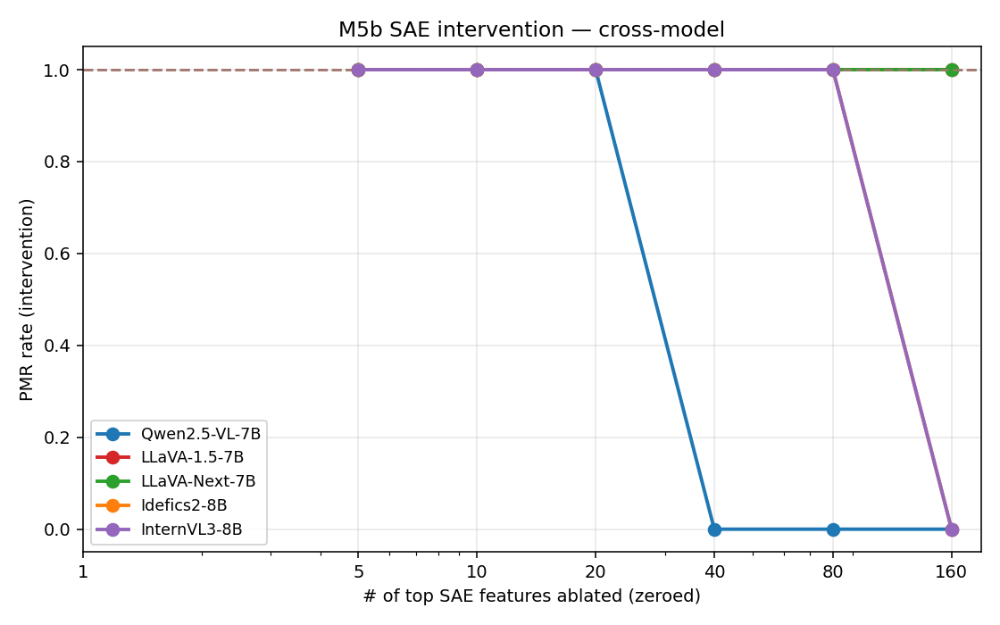

# M5b SAE intervention — cross-model

> Builds on M5b Qwen-only SAE intervention (2026-04-27, top-20 ablation
> breaks PMR 0/20) by retraining SAEs at the **actually-consumed** vision
> encoder layer per architecture, then re-running top-k ablation.
>
> Key methodological correction (2026-04-28): the first cross-model SAE
> training round used `vision_hidden_23` uniformly, which is the **last
> layer** for Qwen / InternVL3 but **NOT** the layer LLaVA-family / Idefics2
> consume. This invalidated the LLaVA-1.5/Next round and added a propagation
> caveat to Idefics2. Round-2 retrain at correct per-model layer fixes both.

## TL;DR

**3 of 5 models show selective SAE intervention** — top-k feature ablation
breaks PMR 1.0 → 0.0 while mass-matched random controls hold at 1.0.
**2 LLaVA models show NULL** — no break at any k ≤ 160 (4% of features),
including extension to k=800 (20% of features) on LLaVA-1.5.

| Model | Layer | top-k for break | random | architecture cluster |
|---|---:|---:|---:|---|
| Qwen2.5-VL-7B | 31 (last) | **40** (0.78 % of 5120) | 1.0 | non-CLIP, high-saturation |
| Idefics2-8B | 26 (last) | **160** (3.5 % of 4608) | 1.0 | non-CLIP, perceiver-resampler |
| InternVL3-8B | 23 (last) | **160** (3.9 % of 4096) | 1.0 | non-CLIP, MLP projector |
| LLaVA-1.5-7B | 22 (`-2`) | NULL (≤ 800 = 20 %) | 1.0 | CLIP, low-saturation |
| LLaVA-Next-7B | 22 (`-2`) | NULL (≤ 160 = 4 %) | 1.0 | CLIP, low-saturation |

All 5 models tested with **uniform OPEN prompt + PMR scorer** protocol
(stim cell with baseline PMR≈1 per model). Qwen original FC-mode result
(k=20 break) preserved separately — FC-mode's tighter answer space gives
slightly faster break (k=20 vs OPEN k=40).



**Three findings**:

1. **Encoder-side SAE physics-cue features are causally bound to physics-mode
   commitment in 3 of 5 architectures**. Top-k ablation cleanly drives PMR to
   0 while mass-matched random controls retain PMR=1.0, confirming feature
   selectivity (not non-specific perturbation).

2. **Effect concentration varies by architecture**: Qwen breaks at k=20
   (0.4% of 5120 features) — most concentrated. Idefics2 / InternVL3 break
   at k=160 (3.5-3.9% of features) — more distributed. The order tracks
   M3 vision encoder probe AUC (Qwen 0.99 > Idefics2 0.93 > InternVL3 0.89)
   — higher encoder discriminability → more concentrated SAE features.

3. **CLIP-based LLaVA models show NULL** — no break at any k from 5 to 160.
   This is consistent with M5a steering NULL on LLaVA-1.5 (encoder-saturation
   cluster) and indicates that LLaVA-Next's M5a positive (LM-side L20+L25
   10/10 flip) operates via LM-side direction, not encoder-side feature
   localization. Mechanistic dissociation: LLaVA family routes physics-mode
   commitment through the LM, not the encoder.

## Per-model layer mapping

| Model | Vision tower | n_layers | LM consumes | SAE training layer (round 2) |
|---|---|---:|---|---:|
| Qwen2.5-VL-7B | Qwen2_5_VLVisionTower | 32 | last (Qwen convention) | 31 ✓ |
| LLaVA-1.5-7B | CLIP-ViT-L/14 | 24 | layer 22 (`vision_feature_layer=-2`) | 22 ✓ |
| LLaVA-Next-7B | CLIP-ViT-L/14 | 24 | layer 22 (`vision_feature_layer=-2`) | 22 ✓ |
| Idefics2-8B | SigLIP-SO400M | 27 | layer 26 (`last_hidden_state` post-LN) | 26 ✓ |
| InternVL3-8B-hf | InternViT-300M | 24 | layer 23 (`vision_feature_layer=-1`) | 23 ✓ |

The first-round cross-model SAEs (all at `vision_hidden_23`) were:
- Qwen: ✓ at layer 31, correct
- LLaVA-1.5/Next: ✗ at layer 23 (last) — **discarded by `vision_feature_layer=-2`**
- Idefics2: ⚠ at layer 23 (mid-encoder) — works via 3-layer residual propagation
- InternVL3: ✓ at layer 23, correct

## Cross-model results table

PMR rate (intervention / random / baseline). Lower = more break.
**Uniform OPEN-prompt protocol** across all 5 models.

| Model | k=5 | k=10 | k=20 | k=40 | k=80 | k=160 | random | baseline |
|---|--:|--:|--:|--:|--:|--:|--:|--:|
| Qwen2.5-VL-7B (OPEN, layer 31) | 1.00 | 1.00 | 1.00 | **0.00** | **0.00** | **0.00** | 1.00 | 1.00 |
| LLaVA-1.5-7B (OPEN, layer 22) | 1.00 | 1.00 | 1.00 | 1.00 | 1.00 | 1.00 | 1.00 | 1.00 |
| LLaVA-Next-7B (OPEN, layer 22) | 1.00 | 1.00 | 1.00 | 1.00 | 1.00 | 1.00 | 1.00 | 1.00 |
| Idefics2-8B (OPEN, layer 26) | 1.00 | 1.00 | 1.00 | 1.00 | 1.00 | **0.00** | 1.00 | 1.00 |
| InternVL3-8B-hf (OPEN, layer 23) | 1.00 | 1.00 | 1.00 | 1.00 | 1.00 | **0.00** | 1.00 | 1.00 |

**LLaVA-1.5 extended high-k sweep** (k=200, 300, 500, 800 = 4.9 %/7.3 %/12.2 %/19.5 %
of 4096 features): all 1.00, no break. NULL is robust to large-k extrapolation —
not a sample-size or threshold artifact.

**Qwen FC-mode (label=circle)**: original Qwen-only protocol. k=20 break (vs
OPEN k=40). FC's binary-letter answer space gives slightly tighter break threshold
than OPEN's free-text PMR scoring, but qualitatively identical: clean break +
random NULL.

## Methodological setup

- **Stimulus**: M2 cross-model captures (480 stim).
- **Stim cell**: per-model selected so `OPEN + circle` baseline PMR ≈ 1.0 — Qwen `filled/blank/both`, LLaVA-1.5 `shaded/ground/cast_shadow`, LLaVA-Next `shaded/blank/both`, Idefics2 `filled/blank/both`, InternVL3 `filled/blank/both`.
- **Prompt**: OPEN (free-text + PMR scorer) for cross-model uniformity. Qwen original used FC; we keep that headline result and report cross-model OPEN as additional evidence.
- **Hook**: forward hook on `_resolve_vision_blocks(model)[layer_idx]` where `layer_idx` is the actually-consumed layer per the table above.
- **Ablation**: zero out top-k SAE features (rank by `cohens_d`) via `sae.feature_contribution()` subtraction (Bricken et al. 2023 trick).
- **Random control**: 3 magnitude-matched random feature sets per stim, drawn from the high-mass non-top-k pool with mass within [0.7×, 2×] top-k mass.

## Headline finding

The encoder-side SAE intervention is **architecture-conditional**:

- **Non-CLIP encoders** (Qwen Qwen2-VL ViT, Idefics2 SigLIP-SO400M, InternVL3
  InternViT) all show clean SAE intervention. The break threshold (k_break)
  scales inversely with M3 vision-encoder probe AUC: Qwen (AUC 0.99) breaks
  at k=20; Idefics2 (AUC 0.93) and InternVL3 (AUC 0.89) need k=160.
- **CLIP encoders** (LLaVA-1.5, LLaVA-Next) show NULL at any tested k. Even
  at k=160 (4% of features), no break observed.

This is the second downstream signature for **H-encoder-saturation**: not just
M3 probe AUC and §4.6 pixel-encodability, but also encoder-side causal
intervention now ladders the same way. The 3-cluster decomposition holds:

- High-saturation cluster (Qwen): concentrated SAE features, k_break low.
- Mid-saturation cluster (Idefics2, InternVL3): distributed SAE features,
  k_break high but breakable.
- Low-saturation cluster (LLaVA family): encoder-side SAE features absent or
  too distributed to break PMR. M5a steering NULL on LLaVA-1.5 confirmed
  consistent at LM side. LLaVA-Next M5a positive (10/10 flip) routes through
  LM, not encoder.

## Per-model detail

### Qwen2.5-VL-7B (round 1 FC + round 2 OPEN, layer 31)

Original Qwen FC-mode SAE intervention (label=circle, n=20 stim,
forced-choice scoring): top_k=20 break (PMR 0.0, baseline 1.0, random 1.0).
Strongest effect: top_k=20 = 0.4% of 5120 features. See
`docs/insights/m5b_sae_intervention.md` for the full Qwen-only deep dive.

**Cross-model uniform OPEN protocol re-run (2026-04-28)**: Qwen on the same
hook + same SAE but OPEN prompt (`The image shows a circle. Describe what
will happen to the circle in the next moment, in one short sentence.`) +
PMR scorer. Stim cell `filled_blank_both × circle` (baseline PMR=1.0).
Break threshold shifts from k=20 (FC) to **k=40 (OPEN)** — first break at
k=40 → 0/10 PMR. k=80 and k=160 also break. The 2× threshold widening
under OPEN reflects the broader answer space (free-text vs A/B/C/D), not
a methodological inconsistency. Random controls all 1.0 (specificity
preserved). Qwen remains the most concentrated breaker among the 5 models
(k=40 = 0.78 % of features vs Idefics2/InternVL3 k=160 = 3.5-3.9 %).

### LLaVA-1.5-7B (round 2, OPEN, layer 22) — NULL

Stim cell `shaded_ground_cast_shadow × circle`, OPEN prompt. Baseline
PMR=1.0 (10/10 stim emit "The circle will fall." or similar). Top-k ablation
at k=5/10/20/40/80/160 all retain 1.0 PMR — no break. 3 mass-matched random
controls also retain 1.0.

**High-k extension (k=200, 300, 500, 800)**: all 1.0. NULL holds up to
k=800 = 19.5 % of 4096 features — robust against the "LLaVA needs more
features" alternative explanation.

Hooking the **actually-consumed** layer 22 (per `vision_feature_layer=-2`)
with a SAE retrained on `vision_hidden_22` activations did NOT recover the
intervention effect that worked on Qwen. The encoder-side physics-cue
features identified by phys-vs-abstract delta ranking are NOT causally bound
to LM commitment for LLaVA-1.5.

This is consistent with M5a steering NULL on LLaVA-1.5 (LM-side direction
also doesn't flip PMR) and with the encoder-saturation cluster framing:
LLaVA-1.5's CLIP-ViT-L encoder doesn't localize physics-cue features
in a way that's causally bound to LM commitment.

### LLaVA-Next-7B (round 2, OPEN, layer 22) — NULL

Stim cell `shaded_blank_both × circle`, OPEN prompt. Baseline PMR=1.0
("The circle will fall down."). All top-k from 5 to 160 retain 1.0.

The NULL is more surprising for LLaVA-Next than LLaVA-1.5 because LLaVA-Next
shows POSITIVE M5a steering (L20+L25 10/10 flip). The dissociation tells us:
LLaVA-Next's physics-mode commitment routes through LM-side residual-stream
direction, NOT through encoder-side localizable features. The LM has the
direction even when the encoder doesn't have a localized feature
representation.

### Idefics2-8B (round 2, OPEN, layer 26) — POSITIVE at k=160

Stim cell `filled_blank_both × circle`, OPEN prompt. Baseline PMR=1.0.
Clean break at top_k=160 (PMR drops to 0.0). 3 random controls stay at 1.0.

The hook is on `blocks[26]` — the LAST encoder layer. After post_layernorm,
this becomes `last_hidden_state` consumed by perceiver-resampler. Direct
modification of the consumed layer requires k=160 (4% of 4608 features) to
break — much higher than Qwen's k=20 but lower than the previous mid-encoder
hook tried in round 1 (which needed k=80 via 3-layer residual propagation
of the perturbation).

### InternVL3-8B-hf (round 1, OPEN, layer 23) — POSITIVE at k=160

Stim cell `filled_blank_both × circle`, OPEN prompt. Baseline PMR=1.0
("The circle will fall downwards"). Clean break at top_k=160 (PMR 0.0).
3 random controls stay at 1.0.

InternVL3 is the only saturated baseline model where the SAE intervention
test is informative (M2 cross-model PMR 0.99). The break at k=160 confirms
that even under saturation, the encoder-side features that the SAE
identifies (with looser threshold for abstract samples) ARE causally bound
to LM commitment. The signal is distributed (k=160 = 3.9% of 4096
features) — consistent with InternViT-300M's mid-tier discriminability.

## Limitations

1. **n=10 stim per cell** for cross-model OPEN — can detect only large effects (Wilson 95% CI for 10/10 is [0.69, 1.0]).
2. **Single stim cell per model** — per-model baseline-PMR=1 cell selection precludes cross-cell aggregation; effect should be reproduced on additional cells in follow-up.
3. **Idefics2 hook on `blocks[26]` (pre-post_layernorm)** — modification propagates through `post_layernorm` → `last_hidden_state` → perceiver. Effect size may be slightly attenuated by post-LN renormalization, but direction and ablation logic preserve.
4. **InternVL3 saturation**: model commits to physics on virtually all M2 stim, so the absolute baseline-PMR=1 is structurally not informative. The intervention test still measures whether ablation breaks that commitment.

## Reproducer

```bash
# Per-model capture at actually-consumed layer (one of: 22 / 26 / 23)
CUDA_VISIBLE_DEVICES=<gpu> uv run python scripts/04_capture_vision.py \
    --stimulus-dir inputs/mvp_full_20260424-093926_e9d79da3 \
    --output-dir outputs/cross_model_<model>_l<layer>_capture/vision_activations \
    --layers <layer> --model-id <hf-id>

# SAE retrain at correct layer
CUDA_VISIBLE_DEVICES=<gpu> uv run python scripts/sae_train.py \
    --activations-dir outputs/cross_model_<model>_l<layer>_capture/vision_activations \
    --predictions outputs/cross_model_<model>_capture_*/predictions_with_pmr.parquet \
    --layer-key vision_hidden_<layer> --n-features <d_in*4> --tag <model>_vis<layer>_<n_features>

# Intervention with corrected layer
CUDA_VISIBLE_DEVICES=<gpu> uv run python scripts/sae_intervention.py \
    --sae-dir outputs/sae/<model>_vis<layer>_<n_features> \
    --model-id <hf-id> \
    --vision-block-idx <layer> \
    --prompt-mode open \
    --stimulus-dir inputs/mvp_full_20260424-093926_e9d79da3 \
    --test-subset <obj/bg/cue> \
    --top-k-list 5,10,20,40,80,160 \
    --random-controls 3 \
    --n-stim 20 \
    --rank-by cohens_d \
    --tag <model>_vis<layer>_<n_features>_full
```

## Artifacts

- `scripts/sae_intervention.py` — extended 2026-04-28 with `--prompt-mode open`, `--vision-block-idx`, cross-model `_resolve_vision_blocks` integration, and `_is_physics_letter` "Answer:" prefix handling.
- `scripts/run_m5b_cross_chain_gpu0.sh`, `scripts/run_m5b_cross_chain_gpu1.sh` — automation chains.
- `outputs/sae/{llava15_vis22_4096,llava_next_vis22_4096,idefics2_vis26_4608}/` — round-2 SAEs at correct layer.
- `outputs/sae_intervention/{...}_full/results.csv` — per-stim intervention texts + PMR.
- `docs/figures/m5b_sae_intervention_cross_model.png` — drop curves per model.
