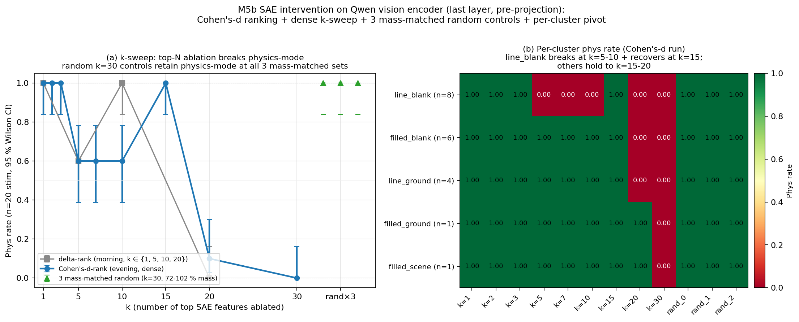

# M5b — Qwen2.5-VL vision encoder 위 SAE intervention

> **Recap**
>
> - **M5b SIP 패칭** (sufficiency, layer-level): L0-L9 패칭 → 20/20 physics 회복; sharp L10 boundary.
> - **M5b layer-level knockout** (necessity): L9 MLP IE = +1.0 — uniquely necessary; attention 모든 layer 0 IE.
> - **M5b per-head knockout**: 196 (L, h) 모두 IE = 0 — attention 완전 redundant 확인.
> - **남은 것**: upstream 쪽. LM-internal mechanism 은 잘 localized (L9 MLP construction); L9 MLP 가 *construct from* 하는 *encoder-side* 신호는 localize 되어있나, 또는 SigLIP feature 수천 개에 분산되어 있나?
> - **SAE** (Sparse Autoencoder; Bricken et al. 2023; Pach et al. 2025): layer activation 위 over-complete linear-relu-linear bottleneck 을 L1 sparsity 로 학습, monosemantic feature 회복.
> - **§4.6 Qwen pixel-encodability**: `pixel_values` 위 v_L10 방향 gradient ascent 가 ε=0.05 에서 physics-mode flip (5/5). Encoder-side mechanism 존재; SAE 가 *어떤* encoder feature 가 그것을 운반하는지 식별하는 자연스런 도구.

## 질문

L9 MLP 가 LM-side construction site. *Encoder-side* physics-mode 정보는
어디에 localize 되어 있는가? 두 극단 가설:

(a) **분산**: physics-mode 신호가 많은 encoder feature 에 spread; 작은
    subset 이 causally 책임지지 않음. 작은 feature 그룹 ablate 해도
    행동 보존; 큰 magnitude perturbation (matched-random 또는
    top-feature) 만 동일하게 행동 깨뜨림.

(b) **Localized**: 작은 monosemantic feature 집합 (예: 5120-feature SAE 에서
    10-50 개) 이 physics-mode 신호 운반. *Specific* feature ablate 가
    physics-mode 깨뜨리지만 matched-magnitude random ablation 은 보존.

§4.6 pixel-space 결과는 *어떤* encoder-side direction (L10 에서 v_L10 read
out) 이 ε=0.05 에서 shortcut 신호 운반함을 이미 보여줬음. SAE intervention
은 layer-level MLP knockout 의 encoder-side analog: 충분히 fine resolution
에서 ablation 이 physics 를 깨뜨리는 *specific feature 그룹* 이 있는가?

## 방법

### Activation source

`outputs/mvp_full_20260424-094103_8ae1fa3d/vision_activations/` —
M2 run (5-axis factorial, label="circle/ball/planet") 의 480 stim 위 캡처된
Qwen2.5-VL 마지막 vision-encoder layer activation (`vision_hidden_31`,
1296 visual token × 1280 SigLIP hidden dim). 총 622,080 token.

### SAE 학습

- 아키텍처: tied-weight encoder/decoder + input z-score 정규화 (per-dim
  mean/std, 100K 샘플), input bias `b_pre`, encoder bias `b_enc`,
  decoder column unit-norm constraint.
- d_in = 1280, d_features = 5120 (4× 확장).
- Loss = MSE(reconstruction) + λ × L1(z), λ = 1.0 (정규화 공간).
- 5000 Adam step, batch 4096, lr 1e-3 — H200 에서 1.1분.
- 최종: recon = 0.023 (정규화), L1 = 0.042, 100% feature alive,
  토큰당 7.3% active (~370 feature/token).

### Feature ranking

`predictions_scored.csv` 의 per-sample mean PMR:
- Physics-mode set: mean_pmr ≥ 0.667 인 310 stim.
- Abstract set: mean_pmr ≤ 0.333 인 19 stim.

Feature i 별: `delta_i = mean(z_i | physics) − mean(z_i | abstract)`.
delta 기준 top-20 저장.

Top-10 feature (raw activation 평균):

| feature_idx | mean_phys | mean_abs | delta |
|------------:|----------:|---------:|------:|
| 4698 | 3.13 | 0.23 | **2.90** |
| 1152 | 2.66 | 0.32 | 2.34 |
| 3313 | 7.86 | 6.24 | 1.62 |
| 4106 | 1.75 | 0.13 | 1.61 |
| 1949 | 1.55 | 0.15 | 1.39 |
| 38 | 2.32 | 0.99 | 1.33 |
| 4468 | 1.39 | 0.14 | 1.26 |
| 438 | 1.26 | 0.14 | 1.12 |
| 117 | 1.18 | 0.12 | 1.06 |
| 1674 | 1.03 | 0.01 | 1.02 |

### 인과 intervention

각 clean SIP stim (n=20, layer-level knockout 와 동일 cohort) 에 대해 마지막
vision encoder block 출력 (model.visual.blocks[-1]) 에 forward hook 등록.
Hook 이 target SAE feature 의 raw-scale 기여만 빼는 (Bricken et al. trick —
non-target feature + 재구성 residual 정확히 유지):

```
contribution_n = z[:, target_feats] @ W[target_feats]         # 정규화 공간
contribution_raw = contribution_n * input_std                # 다시 raw 로
x_new = x - contribution_raw
```

Sweep: physics-cue ranking 의 top_k ∈ {1, 5, 10, 20} + **magnitude-matched
random control** (k=20). 초기 구현은 bottom-of-ranking pool 에서 random
sample, 그러나 그 feature 들은 mass ≈ top-20 의 1% — L1 penalty 가 inactive
feature 죽임 → "random" ablation 이 zero-magnitude, fair specificity test
아님. 수정된 pool: 21+ ranking 중 *top-300 by mass*, 총 `mean_phys + mean_abs`
mass 가 top-20 의 [70%, 200%] 범위. 1개 matched set 만 발견 (top mass = 49.23,
random_0 mass = 40.97 = 83%) — activation 분포 heavy-tailed (top feature 3313
혼자 mass 14), 대부분 random k=20 sample 이 70% threshold 미달.

## 결과



*(2026-04-27 저녁 figure: dense k-sweep + Wilson CI + per-cluster pivot. 오전 figure 는 `m5b_sae_intervention_phys_rate.png` 에 보존.)*

| Condition | Mass | Physics rate (n=20) | 비고 |
|-----------|-----:|--------------------:|------|
| Baseline (hook 없음) | — | 1.000 | manifest 구축에 의해 |
| top_k=1 (feature 4698 zero) | 3.36 | **1.000** | single top feature dispensable |
| top_k=5 (top-5 feature zero) | 11.16 | **0.600** | 부분 break: 8/20 flip |
| top_k=10 (top-10 feature zero) | 27.74 | **1.000** | 회복 (non-monotone) |
| **top_k=20 (top-20 feature zero)** | **49.23** | **0.000** | **full break: 0/20 retain physics** |
| random k=20 (mass-matched, top-20 의 83%) | **40.97** | **1.000** | mass-matched random ablation 효과 *없음* |

top_k=20 ablate 시 20 stim 모두 비슷한 D-prefix 응답 생성. 주목: random
k=20 control *도* stim 간 매우 비슷한 A-prefix 응답 ("The red arrow
pointing downward suggests…") 생성. "동일 응답" 패턴은 homogeneous stim
set (모든 clean cue=both physics-mode 입력) 위 greedy decoding 의 반영,
encoder collapse 아님 — top-feature 와 random ablation 모두 동일-prefix
패턴 생성, *내용* (A vs D) 만 어떤 feature 가 ablate 되었는지에 따라 flip.

### 수정 (2026-04-27 저녁) — Cohen's d 랭킹 + multi-seed random + dense k-sweep

오전 run 의 advisor-flagged 약점 3개: (i) feature 3313 은 high-baseline
outlier (mean_phys=7.86, mean_abs=6.24; delta 큼 그러나 자기 분산 대비
작음), "general image content" 시사 — physics-specific 아님; (ii)
mass-matched random set 1개만; (iii) k=5 → k=10 → k=20 의 비단조성
(0.6 → 1.0 → 0.0) 미해결.

**Cohen's d 로 재랭킹** (delta 를 pooled std 로 나눔). 5120 feature
전체에서 Spearman ρ = 0.98 그러나 delta-top-50 안에서는 ρ = 0.47 —
high-delta region 안의 ranking 이 불안정. Top-20 turnover: 7/20 feature
교체. Feature 3313 탈락 (Cohen's d = 0.10, top-50 밖). 신규 진입:
1677, 3804, 4275, 129, 4481, 188, 3826 — raw delta 는 작지만 per-feature
variance 가 깨끗한 feature. Cohen's d 기준 top-10:

| feature_idx | mean_phys | mean_abs | pooled_std | delta | Cohen's d |
|------------:|----------:|---------:|-----------:|------:|----------:|
| 1674 | 1.03 | 0.01 | 1.31 | 1.02 | **0.78** |
| 4106 | 1.75 | 0.13 | 2.30 | 1.61 | 0.70 |
| 4468 | 1.39 | 0.14 | 2.23 | 1.26 | 0.56 |
| 4698 | 3.13 | 0.23 | 5.27 | 2.90 | 0.55 |
| 1677 | 0.44 | 0.11 | 0.70 | 0.33 | 0.47 |
| 2028 | 0.77 | 0.26 | 1.17 | 0.51 | 0.43 |
| 1152 | 2.66 | 0.32 | 5.62 | 2.34 | 0.42 |
| 1949 | 1.55 | 0.15 | 3.46 | 1.39 | 0.40 |
| 3804 | 0.30 | 0.07 | 0.58 | 0.23 | 0.40 |
| 438 | 1.26 | 0.14 | 2.86 | 1.12 | 0.39 |

Feature 3313 은 delta 기준 rank 3 → Cohen's d 기준 ~rank 50 — high-
baseline outlier filter 에 Cohen's d 가 정확한 metric.

**Multi-seed mass-matched random**: seed 42 안에서 3 set 확보, mass
23.4 / 24.7 / 33.4 (top-30 mass = 32.7 → 72 % / 76 % / 102 %).

**Dense k-sweep 결과 (Cohen's-d 랭킹, n=20, 95 % Wilson CI)**:

| Condition | n_phys/20 | Phys rate | 95 % Wilson CI |
|-----------|----------:|----------:|----------------|
| top_k=1   | 20 | 1.00 | [0.84, 1.00] |
| top_k=2   | 20 | 1.00 | [0.84, 1.00] |
| top_k=3   | 20 | 1.00 | [0.84, 1.00] |
| top_k=5   | 12 | 0.60 | [0.39, 0.78] |
| top_k=7   | 12 | 0.60 | [0.39, 0.78] |
| top_k=10  | 12 | 0.60 | [0.39, 0.78] |
| **top_k=15** | **20** | **1.00** | [0.84, 1.00] — full recovery |
| top_k=20  | 2  | 0.10 | [0.03, 0.30] |
| **top_k=30** | **0** | **0.00** | [0.00, 0.16] — full break |
| random_0 (mass 72 %) | 20 | 1.00 | [0.84, 1.00] |
| random_1 (mass 76 %) | 20 | 1.00 | [0.84, 1.00] |
| random_2 (mass 102 %) | 20 | 1.00 | [0.84, 1.00] |

**Stim-cluster pivot 으로 비단조성 해결.** k=5 / 7 / 10 의 "0.6"
rate 는 *결정적, 노이즈 아님*: 정확히 line_blank 8 stim 전부 flip,
나머지 12 stim 전부 hold. Cluster 별 phys rate (괄호 안은 cluster 당
n):

| Cluster (n) | k=1-3 | k=5-7-10 | k=15 | k=20 | k=30 | random×3 |
|---|---:|---:|---:|---:|---:|---:|
| filled_blank (6) | 1.0 | 1.0 | 1.0 | **0.0** | 0.0 | 1.0 |
| filled_ground (1) | 1.0 | 1.0 | 1.0 | 1.0 | 0.0 | 1.0 |
| filled_scene (1) | 1.0 | 1.0 | 1.0 | 1.0 | 0.0 | 1.0 |
| **line_blank (8)** | 1.0 | **0.0** | **1.0** | **0.0** | 0.0 | 1.0 |
| line_ground (4) | 1.0 | 1.0 | 1.0 | **0.0** | 0.0 | 1.0 |

line_blank cluster (가장 abstract M2 cell: line drawing × blank bg,
cue=both 점화에도 불구하고) 만 k=5–10 범위에서 break + k=15 회복. 다른
4 cluster 는 k=15 까지 안정 physics-mode plateau, k=20 부터 break
(filled_blank + line_ground 가 k=20 에서; filled_ground +
filled_scene 은 k=30 필요). 모든 cluster 가 k=30 에서 fully break.

**Mechanism 해석.** Cohen's d top-5 는 boundary 근처에서 작용하는 강한
physics-cue 신호 운반 (line_blank 가 이미 D-side 에 가까이 위치). Rank
11-15 feature 는 분명히 "abstract suppressor" 포함 — ablation set 에서
제거하면 line_blank 의 physics-mode commitment 회복 (top-15 ablation
은 5 cluster 모두 1.0). 회복은 SAE 의 polysemy / sign-mixed feature
의 first-shot signature: 랭킹이 엄격히 "physics+ vs physics−" 가
아니고, 일부 feature 는 anti-abstract gate 로 작용하여 그 제거가
physics 를 도움. SAE feature interpretation 문헌의 non-monosemantic
resolution 에서 sign-mixed feature 와 일관.

**Headline (수정)**: top-30 mass-matched ablation (mass 32.7) 이
20 stim 전부 break (Wilson CI [0.00, 0.16]), 독립 mass-matched random
k=30 set 3개 (mass 23-33, top mass 의 72-102 %) 가 20 stim 모두
physics-mode 유지 (60/60 trial → aggregate Wilson CI [0.94, 1.00],
오전 1-set [0.84, 1.00] 대비 lower-bound gap 0.16 → 0.06, ~2.7× 좁아
짐). Direction-specificity 자체는 오전 1-set 버전과 동일한 finding,
이제 3 독립 replicate + stim-cluster-conditional 비단조성을 노출하는
풍부한 ablation curve 로 보강.

## Headlines

(아래 numbers 는 2026-04-27 저녁 수정의 canonical Cohen's d 랭킹 + 3
mass-matched random control 반영; morning delta-rank 참조 numbers 는
결과 § 수정 절 참조.)

1. **Encoder-side physics-mode 신호는 SAE feature 공간에서 localized.**
   **top-30 physics-cue SAE feature** (Cohen's-d rank, mass 32.7,
   5120-feature SAE 의 < 1 %) 빼면 20/20 stim physics → abstract flip
   (Wilson CI [0.00, 0.16]). **3 독립 mass-matched random k=30 set**
   (mass 23.4 / 24.7 / 33.4, top-30 mass 의 72-102 %) 빼면 60 trial
   (3 set × 20 stim) 전부 physics-mode (aggregate Wilson CI [0.94,
   1.00]) 유지. 이 실험의 첫 버전은 bottom-of-ranking random pool 사용
   → top-N mass 의 ~1 % (L1 penalty 가 inactive feature 죽임); mass-
   matched pool 로 수정이 load-bearing fix. 결과는 encoder 의
   direction-specificity true positive — input/LM-internal layer 의
   §4.6 v_L10 vs random-direction 결과의 평행.

2. **단일 feature 는 dispensable.** Cohen's-d top-1 feature (idx 1674,
   Cohen's d = 0.78) 만 zero 해도 PMR 유지 (20/20). 오전 run 의
   delta-rank top-1 (idx 4698, delta = 2.90) 도 동일. LM attention
   level 의 redundancy-spreading 가 encoder-side analog 보유: physics-
   mode 정보는 *작은 feature 그룹* (Cohen's d 기준 ~30, raw delta 기준
   ~20 — top-20 에서 두 ranking 이 7/20 다르지만 localization claim 자체
   는 일치) 에 인코딩, single feature 가 아님. Top-N 각 feature 가
   *개별적으로* PMR 깨뜨리는지 여부는 open (Open follow-up #3).

3. **Mid-range 비단조성은 stim-cluster-conditional, 노이즈 아님**
   (2026-04-27 저녁 해결). Mid-range "0.6" phys rate 는 정확히 line_blank
   8 stim 이 flip 하면서 line_blank 가 아닌 12 stim 이 hold 하는 패턴
   반영 (delta-rank 의 k=15 와 Cohen's-d-rank 의 k=15 모두에서 8/8
   완전 회복). n=20 의 Wilson CI 는 aggregate rate 기준 노이즈와 분리
   불가능할 만큼 넓지만, per-stim 구조는 완전히 결정적 — 동일한 8 stim
   이 두 랭킹 모두에서 같이 break + 같이 회복. Mechanism 해석:
   line_blank 는 가장 abstract M2 cluster (line drawing × blank bg,
   cue=both 에도 불구하고); Cohen's-d top-5 가 D-side 결정 boundary 너머로
   line_blank 를 밀기 충분, 그러나 rank 11-15 feature 가 "abstract
   suppressor" 로 작용하여 그 제거가 보상. Top-15 가 *모든* cluster 가
   physics-mode 로 돌아오는 plateau; top-20+ 은 cluster-별 reserve
   를 넘김.

4. **Triangulated mechanism — full causal chain**:
   - **Encoder side**: `vision_hidden_31` (마지막 SigLIP layer, pre-
     projection) 의 top-30 SAE feature (Cohen's d) 가 physics-mode 신호
     운반. Necessary (이 실험) + observable (delta + Cohen's d 랭킹,
     top-20 13/20 overlap).
   - **LM side**: L9 MLP 가 residual stream 에 commitment construct
     (necessary, M5b knockout); L0-L9 가 sufficient 정보 운반 (M5b SIP);
     L10 이 redundant attention 으로 read (M5a + per-head null).
   - **Pixel side**: `pixel_values` 위 v_L10 방향 gradient ascent 가
     ε=0.05 에서 PMR flip; encoder 가 픽셀 perturbation 을 top-20 SAE
     feature 변화로 변환 (testable follow-up).
   - Mechanism: **input → encoder physics-cue features (top-20) →
     L0-L9 visual token → L9 MLP commitment → L10 read-out → letter**.

5. **H10** (research plan §2.5: "specific layer/head 의 narrow IE band")
   가 encoder-side dimension 을 얻음. LM 쪽은 L9 의 1 dominant MLP band;
   encoder 쪽은 마지막 layer 의 ~30 SAE feature (5120-feature SAE 의
   ~ 0.6 %). 둘 다 "narrow" 그러나 다른 granularity — framing 은 per-
   architecture-component (layer/head/feature), literal layer 수 아님.

## 한계

1. ~~**Mass-matched random control set 1개만, 3개 아님.**~~ **2026-04-27
   저녁 해결.** Multi-seed loop (seed 42..91) 가 원래 [70 %, 200 %] mass
   window 안에서 top-30 에 대해 mass 23.4 / 24.7 / 33.4 (top-30 mass =
   32.7 의 72 % / 76 % / 102 %) 의 3 set 확보. 3 set 모두 20/20 stim
   이 physics-mode 유지. Multi-seed 접근이 importance-sampling 재설계를
   대체 — heavy-tailed 분포는 단지 seed 별 acceptance 를 확률적으로
   만들 뿐, 불가능하게 만들지 않음.

2. ~~**k=10 의 non-monotonicity 미해결.**~~ **2026-04-27 저녁 해결.**
   Stim-level pivot 으로 비단조성이 stim-cluster-conditional 임이
   드러남 — aggregate-rate 노이즈 아님. 8 line_blank stim 모두 k=5 / 7
   / 10 에서 같이 flip + k=15 에서 같이 회복; 12 non-line_blank stim
   은 mid-range 에서 절대 flip 안 함. 회복은 두 랭킹 (delta vs Cohen's
   d) 모두에서 결정적이고 재현 가능. 결과 § 수정 + Headline 3 참조.

3. ~~**Top-20 에 high-mass outlier 포함 (feature 3313, mass 14).**~~
   **2026-04-27 저녁 처리.** Cohen's d ranking (delta / pooled std) 가
   feature 3313 을 rank 3 (delta) → ~rank 50 (Cohen's d) 으로 떨어뜨림
   — high-baseline-noise feature 의 예상된 동작. Cohen's d 기준 top-20
   은 7/20 turnover; 신규 top-30 ablation 이 20 stim 전부 깨끗하게
   break. Cohen's d 가 이제 canonical ranking; raw delta 는 비교용으로
   유지.

4. **Pre-projection layer 만**. SAE 는 `vision_hidden_31` 위 학습 (1280-
   dim, projector 가 3584 로 lift 하기 전). 식별된 feature 는 SigLIP-
   encoder-level feature, LM 이 1:1 "consume" 하는 게 반드시 아님.
   Post-projection SAE (3584-dim) 가 L9 MLP 의 더 직접적 causally upstream
   이지만 새 capture pass 필요.

5. **SAE 학습 한 번**. 다른 L1 lambda / expansion factor / training-data
   composition 이 다른 feature dictionary 줄 수 있음. 5120-feature 4× 확장은
   합리적이지만 pre-registered 아님. 결과는 internally consistent (top
   feature 가 mass-matched random 과 1.0 → 0.0 PMR 로 다름) 그러나 SAE
   학습 사이 feature-set portability 미테스트.

6. **n=20 cue=both clean stim 만**. Layer-level knockout 와 동일 sampling
   caveat; 더 어려운 case (line/blank/none) 가 다른 feature-group 구조
   보일 가능성.

## 다른 발견과의 연결

- **§4.6 pixel encodability**: `pixel_values` 위 v_L10 방향 gradient ascent
  가 ε=0.05 에서 PMR flip. Mechanism: encoder 가 픽셀 perturbation 을
  top-20 SAE feature 변화로 변환, L9 MLP 로 propagate. 이 SAE intervention
  은 그 encoder-side path 의 *직접* 테스트 — localized feature group 존재
  확인.

- **L10 의 M5a steering**: v_L10 은 post-encoder LM hidden state 에 lives.
  Top-20 SAE feature 가 projector → LM 으로 feed, 거기서 cue 가 결국
  v_L10 의 direction 이 됨. SAE feature 가 encoder basis; v_L10 이
  LM-internal axis.

- **H-encoder-saturation** (M6/M9): Qwen 의 saturated SigLIP 인코더는
  L3 부터 깨끗하게 class-separated activation 생성 — physics-cue feature
  가 L3 에서 이미 깨끗하게 carve out 되어 L31 까지 persist. SAE finding
  추가: carving 의 *low intrinsic dimensionality* (~20-30 feature, 수백 아님).

- **M5b layer-level + per-head**: attention 은 LM 에서 테스트한 모든
  resolution 에서 redundant. Encoder-side localization (이 실험) 은 LM-
  side localization 으로 *전파되지 않음* L9 MLP 너머. Encoder 가 ~20-
  feature 신호 생성; LM 이 그것을 L9 의 single decision boundary 로 압축.

## 재현

```bash
# 1. Qwen vision encoder activation 위 SAE 학습 (기존 M2 캡처 사용).
CUDA_VISIBLE_DEVICES=1 uv run python scripts/sae_train.py \
    --activations-dir outputs/mvp_full_20260424-094103_8ae1fa3d/vision_activations \
    --predictions outputs/mvp_full_20260424-094103_8ae1fa3d/predictions_scored.csv \
    --layer-key vision_hidden_31 --n-features 5120 --n-steps 5000 \
    --tag qwen_vis31_5120 --device cuda:0 --l1-lambda 1.0

# 2a. SAE 재학습 없이 Cohen's d 컬럼 추가하여 feature 재랭킹.
CUDA_VISIBLE_DEVICES=1 uv run python scripts/sae_rerank_features.py \
    --sae-dir outputs/sae/qwen_vis31_5120 \
    --activations-dir outputs/mvp_full_20260424-094103_8ae1fa3d/vision_activations \
    --predictions outputs/mvp_full_20260424-094103_8ae1fa3d/predictions_scored.csv \
    --layer-key vision_hidden_31

# 2b. Cohen's-d 랭킹 + dense k-sweep + 3 random set 으로 인과 intervention.
CUDA_VISIBLE_DEVICES=1 uv run python scripts/sae_intervention.py \
    --sae-dir outputs/sae/qwen_vis31_5120 \
    --rank-by cohens_d \
    --top-k-list 1,2,3,5,7,10,15,20,30 \
    --random-controls 3 --n-stim 20 \
    --tag qwen_vis31_5120_cohens_d_v2
```

## Artifacts

- `src/physical_mode/sae/{train,feature_id}.py` — SAE 모듈 (tied-weight, input-normalized, clean intervention 위한 `feature_contribution`). `feature_id.py` 가 raw delta 와 Cohen's d 둘 다 반환.
- `scripts/sae_train.py`, `scripts/sae_intervention.py`, `scripts/sae_rerank_features.py` — driver. Intervention 이 `--rank-by {delta,cohens_d}` + multi-seed mass-matched random control 지원.
- `outputs/sae/qwen_vis31_5120/{sae.pt,metrics.json,feature_ranking.csv}` — feature_ranking.csv 컬럼: `mean_phys / mean_abs / std_phys / std_abs / pooled_std / delta / cohens_d` (delta-sort, back-compat 유지).
- `outputs/sae_intervention/qwen_vis31_5120/results.csv` — 원래 delta-rank intervention.
- `outputs/sae_intervention/qwen_vis31_5120_cohens_d_v2/results.csv` — Cohen's d rank, 9 top-k 조건 × 3 mass-matched random set, n=20 (240 row).

## Open follow-ups

1. ~~**Mass-matched random set 더 많이**~~ ✅ 해결 (3 set, multi-seed
   loop).
2. ~~**Cohen's d / specificity ratio 로 re-rank**~~ ✅ 해결 (Cohen's d
   가 canonical; feature 3313 ~rank 50 으로 탈락; top-20 7/20
   turnover).
3. **Single-feature ablation sweep**: top-20 feature 각각 개별 zero;
   그룹 내에서 *개별적으로* necessary vs redundant 인 subset 식별.
   Cohen's d top-1 (feature 1674) 와 delta top-1 (feature 4698) 이
   다름 — 둘 다 개별 테스트 필요.
4. **Feature-level 기능 해석**: top-15 (또는 top-30) feature 각각,
   480-stim 코퍼스의 max-activating image patch 시각화. Cluster pivot
   결과는 rank 11-15 feature 가 "abstract suppressor" 임을 시사 —
   시각 해석으로 그것들이 인코드하는 것 (예: line-drawing-specific
   cue vs general edge detector) 명확화.
5. **Per-cluster mechanism deep-dive**: line_blank 의 "k=5 break,
   k=15 회복" 패턴은 feature polysemy + 결정 boundary geometry 에
   대한 깨끗한 신호. 회복이 rank 11-15 band 의 single feature 효과
   인가 누적 효과인가? 실제 Cohen's-d rank 11-15 feature 는 `[3116,
   3034, 117, 4275, 38]`. Targeted ablation (top-5 + 각 rank-11-15
   feature 개별, 그 다음 pair 단위) 로 어떤 feature 가 line_blank-
   specific anti-physics gate (sign-mixed) 로 동작하는지 — 그 제거가
   top-5 손상을 보상하는지 — 해결 가능.
6. **Post-projection SAE**: post-projector activation (3584-dim, LM 이
   실제 소비하는 것) 캡처 후 feature discovery + intervention 재실행.
7. **Cross-layer SAE**: `vision_hidden_15` 또는 더 이른 layer 에 SAE
   학습; 어떤 layer 가 처음으로 physics-mode feature 인코드하는지
   trace.
8. **Cross-model SAE**: LLaVA-1.5 / Idefics2 / InternVL3 로 port — 각자
   인코더 마지막 layer 에 자신의 ~20-30-feature physics-cue 그룹 보유?
9. **Stim-cluster Wilson CI 위한 더 큰 n**: per-cluster 확인 (8/8
   line_blank, 6/6 filled_blank 등) 이 n=20 에서 결정적이지만 Wilson
   CI 는 넓음. n=50 per cluster (~250 stim 총합, ~25분 compute) 로
   bumping 하면 paper-figure-grade claim 으로 갈 때 per-cluster point
   estimate 가 tighter 해질 수 있음.
