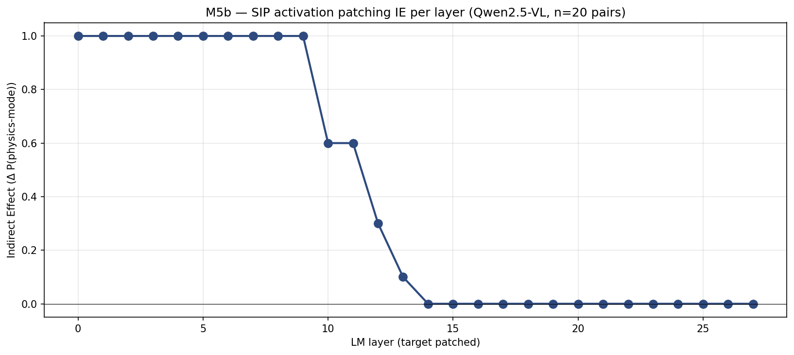
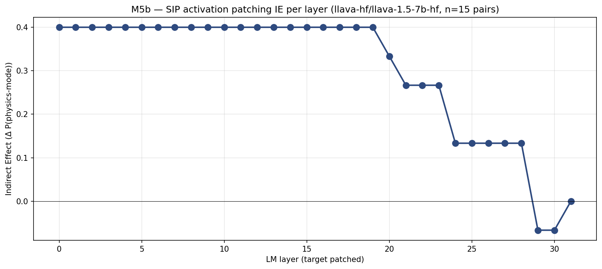

# M5b — cross-model SIP + activation patching: Qwen vs LLaVA-1.5

> **이 문서에서 쓰는 코드 한 줄 recap**
>
> - **M5b** — ST4 Phase 3: SIP + activation patching 으로 인과적 LM layer 식별.
> - **SIP** — Semantic Image Pairs (Golovanevsky et al. NAACL 2025): 단일 시각 cue 만 다른 페어 stim. Clean = physics 유도; corrupted = abstract 유도.
> - **IE** (Indirect Effect) — 패치로 인한 ΔP(physics-mode).
> - **§4.6 revised** — LLaVA-1.5 L25 가 ε=0.2 픽셀-공간 gradient ascent 에서 5/5 flip. Qwen 의 L10 의 analog. 두 모델이 다른 shortcut layer 가짐.
> - **H9** — saturated 인코더는 L5 이전 plateau; unsaturated 는 captured 범위에서 saturated plateau 도달 안 함.

## 질문

Qwen 만 한 M5b 결론 ("L0-L9 패치 → 100% physics 회복, L10-L11 → 60%,
L14+ → 0%") 이 L10 을 Qwen 의 decision-lock-in 경계로 식별. 이게
일반화되는가? 구체적으로:

- IE × layer 곡선 *모양* 이 cross-model 재현되는가?
- decision-lock-in layer 의 *위치* 가 고정된 *relative* depth 에 대응
  하는가, architecture 별로 다른가?

LLaVA-1.5 SIP+patching 으로 답: M2 captures (n_pos=375, n_neg=105 —
적절한 class balance). LLaVA-Next / Idefics2 / InternVL3 는 각각 2 / 0
/ 0 clean SIP candidate (saturated open-prompt PMR) 로 이번 라운드 스킵.

## 방법

각 모델에 대해:
1. open-prompt M2 captures, label="ball": cue=both seed (clean: PMR=1)
   와 cue=none seed (corrupted: PMR=0) 인덱스 페어링. 엄격 필터
   (clean PMR=1 AND corrupted PMR=0).
2. 각 페어: clean 의 layer 별 시각-토큰 위치 hidden state 캐시;
   corrupted baseline; target_L ∈ [0..N_layers] 별 patched corrupted
   (forward hook on `layers[target_L]` at prefill, 시각-토큰 h 를 cached
   clean 값으로 교체).
3. layer 별 IE = ΔP(physics-mode) = (patched PMR 비율) − (baseline
   PMR 비율).

Generic LM-layer resolver via `model.model.language_model.layers`
(Qwen, LLaVA, InternVL 작동); fallback `model.model.text_model.layers`
(Idefics2). LLaVA-Next AnyRes 는 clean/corrupted 간 시각-토큰 수
mismatch 가능 (페어 모두 drop).

## 결과

### Qwen2.5-VL (n=20 페어, 28 LM layer)



- L0-L9: IE = +1.0 (20 페어 모두 100% 회복)
- L10-L11: IE = +0.6 (60%)
- L12-L13: IE = 0.3 / 0.1
- L14+: IE = 0.0

**Decision-lock-in 시작은 L10** (36% relative depth).

### LLaVA-1.5 (n=15 페어, 32 LM layer)



- L0-L19: IE = +0.40 (15/15 → 15/15 PMR=1; baseline 9/15 PMR=1 +
  6/15 가 PMR=0 → PMR=1 flip)
- L20-L23: IE = +0.27 to +0.33 (gradual decline)
- L24-L28: IE = +0.13
- L29-L30: IE = −0.07 (slight negative — late-layer 패치가 해를 끼침)
- L31: IE = 0.0

**Decision-lock-in 시작은 L20** (62.5% relative depth).

corrupted SIP 가 re-inference 시 일부 PMR=1 로 drift (M2 capture 시
PMR=0 → re-inference PMR=1 가 9/15 페어). 따라서 "true SIP signal"
은 6/15 genuinely-corrupted re-inference 페어에 대한 것. 그것에 대해
L0-L19 패치 → 6/6 physics 회복; L20+ progressively 실패.

## Headlines

1. **곡선 모양 cross-model 재현**: 두 모델 모두 sharp-then-declining
   IE × layer 프로파일 — early layer 에 full IE, declining 전이
   zone, LM 끝에 zero IE. *모양* 동일.

2. **Decision-lock-in layer 가 absolute *and* relative depth 모두에서 다름**:
   - Qwen2.5-VL: L10 (36% relative)
   - LLaVA-1.5: L20 (62% relative)
   - LLaVA-1.5 의 commitment 가 Qwen 보다 *깊은* relative depth 에
     lock in. §4.6 cross-model revised 와 일관: LLaVA-1.5 의 "shortcut
     layer" 는 L25 (78% LM depth), L10 의 analog 가 아님.

3. **Qwen-LLaVA 격차는 encoder saturation 과 연결** (H9): Qwen 은
   saturated 인코더가 LM 에 깨끗하게-분리 가능한 physics-mode 정보
   공급. LM 이 일찍 (L10) commit — 입력이 명확하므로. LLaVA-1.5 의
   CLIP 인코더는 noisier 신호; LM 이 더 많은 layer (L0-L19) 에 걸쳐
   integrate 후 commit.

4. **Random-baseline 체크**: LLaVA-1.5 IE at L29-L30 가 약간 *음수*
   (−0.07) — 비정상. 그럴법한 이유: late-layer 패치가 이 깊이에서
   "decision tree" 를 너무 aggressive 하게 disturb, 가끔 physics-mode
   → abstract 로 push. 더 큰 n 으로 replicate 가치.

## Cross-architecture 일반화 평가

**5 모델 중 2 개 검증**: SIP+patching IE-curve shape 가 Qwen 에서
LLaVA-1.5 로 일반화, locus 가 relative depth 에서 shift.

**5 모델 중 3 개 skip**: LLaVA-Next (2 clean SIP), Idefics2 (0),
InternVL3 (0). open-prompt M2 stim 에서 SIP 구축할 만큼 saturated
하지 않음. M8a 또는 photo stim 으로 (PMR=0 cell 더 많은) 재실행 또는
forced-choice 프로토콜 적용 필요.

## 다른 발견과의 연결

- **§4.6 cross-model revised**: LLaVA-1.5 L25 가 픽셀-인코드 가능성
  보유 (78% relative). M5b 는 LLaVA-1.5 lock-in 이 L20 (62.5%) 에서
  시작. L25 는 lock-in zone 안 — 모델이 *부분적으로 commit* 되어 있어
  픽셀 perturbation 이 더 큰 노력 (ε=0.2 vs Qwen 의 ε=0.05) 으로
  여전히 행동 flip 가능. 두 발견 mutually consistent.

- **H-locus** (M4-derived): "L10 specifically 의 mid-layer bottleneck"
  은 이제 *Qwen-특이적*. 일반 formulation: 각 VLM 이 자기 자신의
  "decision-lock-in" layer 를 어떤 relative depth (Qwen 36%, LLaVA-1.5
  62%) 에 가짐. Locus 는 cross-model 존재하지만 다른 위치.

- **H-encoder-saturation** (M6 r2 / M9): Qwen 의 일찍-lock-in 이 일찍
  encoder-side saturation 과 매칭 (encoder probe AUC ~0.99 from L3).
  LLaVA-1.5 의 늦게-lock-in 이 그 slow build-up 과 매칭 (encoder probe
  AUC ~0.73; LM probe plateau 0.77). H9 의 two-cluster 패턴이 M5b
  lock-in layer 차이로 매핑.

## 한계

1. **5 모델 중 2 개만 cross-model SIP+patching 테스트**;
   LLaVA-Next / Idefics2 / InternVL3 은 open-prompt M2 stim 에서 n_neg
   부족. 더 어려운 stim source 필요.

2. **단일 intervention 유형** (visual-token full-replacement 패칭).
   Attention knockout, MLP replacement, SAE intervention 은 research
   plan §2.5 에서 여전히 미해결.

3. **Head-level resolution 없음**. 각 layer 패치가 *모든* 시각-토큰
   hidden state 교체; per-head IE 는 layer 내부 패칭 필요.

4. **n=15 LLaVA-1.5 작음**. 더 풍부한 stim source (M8a / M8c) 에서
   더 큰 n_pairs 로 replicate.

5. **Re-inference drift**: 15 LLaVA-1.5 corrupted SIP 중 9 개가
   re-inference 시 patching 없어도 PMR=1. SIP-construction 시 PMR=0
   은 label-collapse aggregate 위; per-label baseline drift 는 알려진
   M5a-style caveat.

## 재현

```bash
# Qwen (이미 완료; outputs/m5b_sip/per_layer_ie.csv).
CUDA_VISIBLE_DEVICES=1 uv run python scripts/m5b_sip_activation_patching.py \
    --n-pairs 20 --device cuda:0

# LLaVA-1.5 (이번 라운드).
CUDA_VISIBLE_DEVICES=1 uv run python scripts/m5b_sip_cross_model.py \
    --model-id llava-hf/llava-1.5-7b-hf \
    --capture-pattern "cross_model_llava_capture_*" \
    --label ball --n-pairs 15 --model-tag llava15 --device cuda:0
```

## Artifacts

- `scripts/m5b_sip_cross_model.py` — generic per-model SIP+patching.
- `outputs/m5b_sip_cross_model/llava15_{per_pair_results,per_layer_ie,manifest}.csv`.
- `docs/figures/m5b_sip_cross_model_llava15_per_layer_ie.png`.

## Follow-ups (research plan §2.5 remaining)

1. **Attention knockout (per-layer-head)**: Qwen 만, L0-L13 transition
   zone 집중. visual-token → text decision 을 운반하는 1-3 head 식별.
2. **MLP replacement**: 비슷한 layer-sweep 그러나 MLP output 만 패치.
3. **SAE intervention** (Pach et al. 2025): Qwen vision-encoder
   activations 위 SAE 학습; monosemantic "physics-cue" feature 식별.
4. **Multi-axis SIP with matched seeds**: bg_level / object_level 이
   independent 하게 같은 seed 로 toggle 되는 stim 재생성.
5. **Cross-model SIP for saturated models**: LLaVA-Next / Idefics2 /
   InternVL3 에 대해 (open 만 아니라) FC prompt 로 M2 captures
   재실행.
