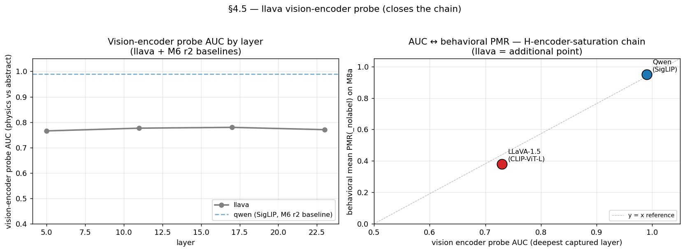

# M6 Round 1 — Cross-Model H2 Fork on LLaVA-1.5-7B

> **Recap of codes used in this doc** (one-line each; full definitions in `references/roadmap.md` §1.3 + §2)
>
> - **H1** — PMR rises in an S-shape along the abstraction axis (line → filled → shaded → textured); ground introduction adds the largest single jump.
> - **H2** — The label (ball / circle / planet) independently raises PMR even on minimal stim — a language-prior contribution beyond the visual evidence.
> - **H4** — The open-ended vs. forced-choice PMR gap is a stable signature of the language-prior ↔ visual-evidence conflict.
> - **H7** — The label does not toggle PMR — it selects which physics regime applies (ball → kinetic / circle → static / planet → orbital).
> - **H-boomerang** — Vision encoder linearly separates physics-mode classes even where behavior fails — encoder knows, decoder gates. (Qwen-scoped: refuted on LLaVA-1.5 because its CLIP encoder is the bottleneck.)
> - **H-direction-bidirectional** — v_L10 is a regime axis within physics-mode (+α → kinetic, −α → static); revised from the initial "one-way activator" framing.
> - **H-locus** — The bottleneck is at the LM mid layers (L10 specifically), not earlier or in the decoding head.
> - **M2** — ST1 MVP-full — 5-axis factorial (2880 stim); H1 monotone S-curve, H7 emerged.
> - **M4b** — M4 + label-free prompt as H2 null test; revealed H2 is asymmetric on Qwen (circle override, not ball enhancement).
> - **M6** — ST5 cross-model sweep — see M6 r1 (LLaVA-1.5), r2 (InternVL3 + LLaVA capture + FC ratio), r3 (Idefics2), r4 (InternVL3 probe), r5 (M8c photo probe), r6 (LLaVA-Next).

**LLaVA-1.5 vision-encoder probe (M6 r1)** — CLIP-ViT-L is unsaturated (AUC ~0.73), unlike Qwen's saturated SigLIP — that's why H2 replicates on LLaVA but Qwen shows it as "circle suppression only":

Tests whether the M4b H2 reframing (`ball ≈ no-label`, `circle = suppressor`)
generalizes from Qwen2.5-VL to a second open-source VLM. Round 1 covers
LLaVA-1.5-7B-hf only; LLaVA-Next, InternVL2, Qwen2-VL are deferred.

Raw numbers: `docs/experiments/m6_cross_model_llava.md`.
Configs: `configs/cross_model_llava.py`,
`configs/cross_model_llava_label_free.py`.

## 1. One-line summary

The M4b reframing is **Qwen-specific**, not a general open-source-VLM
property. LLaVA-1.5-7B shows the *original* H2 pattern: every label
enhances PMR over the no-label baseline (`ball +47.5 pp`,
`planet +24.4 pp`, `circle +17.3 pp`). The cause is a much weaker
visual physics prior in LLaVA-1.5 — it does not default to
physics-mode on M2 stimuli the way Qwen2.5-VL does, so the label
carries the activation work that visual content carries for Qwen.

## 2. The fork, in one comparison

Mean paired delta `PMR(label) − PMR(_nolabel)` over 480 matched
`(obj, bg, cue, seed)` tuples, T=0.7, open prompt:

| label  | Qwen2.5-VL-7B | LLaVA-1.5-7B |
|---|---|---|
| ball   | +0.006 | **+0.475** |
| planet | +0.006 | **+0.244** |
| circle | **−0.065** | **+0.173** |

Three points to read off:

- For Qwen, only `circle` produces a non-trivial signed effect, and
  it is **negative** — the label suppresses an already-saturated
  visual default. This is the M4b reframing.
- For LLaVA, **all three labels are strongly positive**, including
  `circle`. The model needs the label to commit to physics; even an
  abstract-priming label like `circle` still activates more
  physics-mode than no label at all.
- The per-label rank order (`ball > planet > circle`) is preserved
  across both models. The shape of language-prior contribution is
  the same; the *zero point* (where `_nolabel` sits) differs
  dramatically.

## 3. Mechanism — visual default difference, not language-prior asymmetry

`PMR(_nolabel)` by object level:

| object   | Qwen | LLaVA |
|---|---|---|
| line     | 0.942 | 0.142 |
| filled   | 0.933 | 0.317 |
| shaded   | 0.942 | 0.592 |
| textured | 0.975 | 0.483 |

Qwen's visual-only PMR is **already at ceiling on every object level**
(0.93–0.98). For Qwen the language prior has no headroom — adding
`ball` cannot push higher; only `circle` can pull down (and even then
only mildly). For LLaVA the visual-only PMR is much lower (0.14–0.59)
and not even monotone in object abstraction, so the language prior
operates over a wide unsaturated dynamic range and shifts behavior
substantially.

This means the M4b finding does not actually contradict the original
H2; rather, **M4b uncovers Qwen2.5-VL's visual saturation, which is
the structural reason its language-prior contribution looks asymmetric
(circle-only effect)**. LLaVA-1.5's lower visual prior gives the
language-prior contribution full visibility on every label — the
"original" H2 reading.

The simplest unified statement of H2 across both models:

> **Across Qwen2.5-VL and LLaVA-1.5, the language prior is positive
> (or zero) for every label tested, and is masked by visual
> saturation in models with strong vision priors. The "circle
> suppresses below the visual default" effect on Qwen is a
> consequence of saturation: at PMR ≈ 0.95 there is no room for a
> positive language-prior contribution to manifest, so only the
> negative direction (`circle` pulling down) is visible. In LLaVA,
> the same `ball` and `planet` priors are unmasked and contribute
> meaningfully positively.**

## 4. H1 (S-curve) cross-model

Per-object PMR (mean over labels, open prompt):

| object   | Qwen labeled | LLaVA labeled |
|---|---|---|
| line     | 0.906 | 0.508 |
| filled   | 0.933 | 0.656 |
| shaded   | 0.933 | 0.753 |
| textured | 0.950 | 0.806 |

LLaVA-1.5 produces the cleanest S-curve we've measured: monotone
across all four object levels with a 30-pp climb (line → textured).
Qwen's S-curve is invisible because the labeled run is already at
ceiling; the gradient existed in M2's *forced-choice* numbers
(0.74 → 0.83) but is not measurable in the open-prompt comparison
window.

H1 verdict: supported in cross-model **only if the model is not at
visual saturation**. The cleanest H1 evidence in this study is on
LLaVA-1.5, not on Qwen2.5-VL.

## 5. H7 (label selects regime) cross-model

GAR by label (open prompt):

| label  | Qwen | LLaVA |
|---|---|---|
| ball   | 0.706 | 0.356 |
| circle | 0.753 | 0.153 |
| planet | 0.319 | 0.072 |

The qualitative pattern `planet GAR << ball/circle GAR` replicates in
both models — the `planet` label routes physics narration toward
orbital / cosmic events instead of gravity-aligned motion. Sample
LLaVA `planet × line/blank/none` responses include "the planet will
continue to spin and orbit around the sun" and "the planet will be
consumed by a black hole" — explicit non-gravitational physics.

H7 verdict: **supported (cross-model)**. The label-selects-regime
mechanism is not Qwen-specific. Magnitudes differ but the
qualitative dissociation is preserved.

## 6. Hypothesis scorecard update

| H | Pre-M6 | Post-M6 |
|---|---|---|
| **H1** (S-curve) | supported | **supported, sharper on LLaVA** — Qwen is at saturation; LLaVA shows the cleanest monotone object-level gradient. Recommend reporting LLaVA's S-curve as the canonical figure. |
| **H2** (language prior raises PMR) | revised (M4b: ball ≈ no-label, circle suppression) | **revised again — visual-saturation hypothesis** — M4b's "circle suppression only" pattern is a Qwen-specific consequence of Qwen's visual ceiling. LLaVA, with weaker visual prior, recovers the original H2 (`ball +47.5 pp, planet +24.4 pp, circle +17.3 pp`). The unified statement: language prior contributes positively across labels and across models; visual saturation can mask the positive contribution and leave only a negative signal. |
| **H4** (open-FC gap) | supported (Qwen) | **untested cross-model** — LLaVA-1.5 returns "A" for every FC stimulus (12/12 on smoke), making FC PMR uninformative. Defer to round-2 cross-model with a different FC template or first-letter probability scoring. |
| **H7** (label selects regime) | supported (Qwen) | **supported, cross-model** — `planet GAR << ball/circle GAR` holds for both Qwen (0.32 vs 0.71/0.75) and LLaVA (0.07 vs 0.36/0.15). Magnitudes differ but the gradient is preserved. |
| **H-boomerang / H-locus / H-direction-bidirectional** | various | **untested in M6 round 1** — activation captures and steering interventions weren't run on LLaVA. Round 2 of M6 should re-capture activations on LLaVA so the boomerang AUC and the L? regime axis can be compared. |

## 7. Paper implications

- The M4b "circle suppression / ball ≈ no-label" reframing should be
  reported as a Qwen2.5-VL-specific observation in the paper, not a
  cross-model claim. The cleanest single statement is the
  **visual-saturation hypothesis**: when a VLM's visual physics prior
  is already at PMR ceiling, the language prior's *positive*
  contribution becomes invisible and only the *negative* contribution
  (`circle` pulling down) is measurable.
- The cross-model H1 figure should be LLaVA-1.5's S-curve, not
  Qwen's saturated table. This is a sharper test of "abstraction
  matters", and the gap between the two models' S-curves is itself
  evidence for the saturation interpretation.
- H7 cross-model replication is the cleanest single positive
  cross-model claim in the paper so far. The `planet GAR < ball GAR`
  dissociation works in both models, with the same direction.
- Ship a "model-specific visual prior" plot: `PMR(_nolabel)` per
  object level, side-by-side Qwen vs LLaVA — directly visualizes
  the saturation explanation.

## 8. Limitations

- LLaVA's FC bias to "A" makes FC-based metrics unusable in this
  round. Round 2 needs either a re-templated FC ("Choose the most
  plausible outcome") or a first-letter-token-probability score
  rather than greedy first-letter argmax.
- LLaVA's no-label run shows non-monotone object-level PMR
  (shaded > textured). Likely a 7B-scale artefact or a peculiarity
  of how LLaVA reads the M2 textured stimuli (which use a bowling-
  ball texture); worth re-checking with LLaVA-Next or a different
  texture set in round 2.
- No activation captures for LLaVA in this round — H-boomerang /
  H-locus cross-model evidence not yet collected.
- Single cross-model point. The "visual-saturation hypothesis"
  needs at least one more model in either direction (e.g., a smaller
  or larger Qwen variant; LLaVA-Next; InternVL2) to validate the
  saturation claim.
- The M2 stimuli were tuned for Qwen — the no-label PMR collapse
  on LLaVA could partly reflect that the stimuli aren't self-
  identifying as physics scenes to a model with a different visual
  encoder. A model-agnostic stimulus protocol may yield different
  no-label baselines per model.
