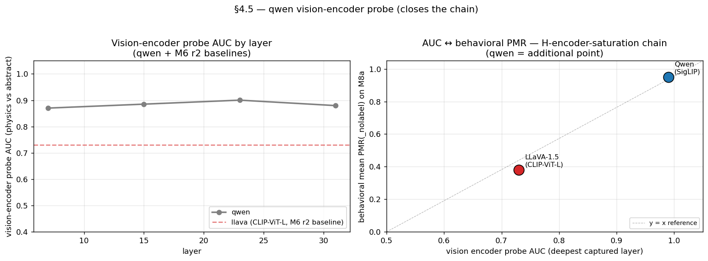

# M6 round 2 — 세 모델에서의 visual-saturation 가설 + encoder 수준 메커니즘

> **이 문서에서 쓰는 코드 한 줄 recap** (전체 정의는 `references/roadmap.md` §1.3 + §2 참조)
>
> - **H1** — PMR 이 abstraction 축을 따라 S 모양으로 상승 (line → filled → shaded → textured); ground 도입이 가장 큰 단일 jump.
> - **H2** — label (ball / circle / planet) 자체가 PMR 을 독립적으로 끌어올림 — 시각 증거를 넘는 language-prior 기여.
> - **H4** — Open-ended vs. forced-choice PMR 간격은 language-prior ↔ visual-evidence 충돌의 안정적 signature.
> - **H7** — Label 은 PMR 을 toggle 하지 않음 — 어느 물리 regime 이 적용되는지 선택 (ball → 동적 / circle → 정적 / planet → 궤도).
> - **H-boomerang** — Vision encoder 가 행동이 실패하는 곳에서도 physics-mode class 를 선형 분리 — encoder 는 알고 decoder 가 gate. (Qwen 한정: LLaVA-1.5 에서는 CLIP encoder 자체가 bottleneck 이라 반박.)
> - **H-encoder-saturation** — 합성 stim 위 behavioral PMR(_nolabel) saturation 은 architecture 수준 (encoder + LM 결합) 에서 결정 — encoder 표현 능력만으로는 부족.
> - **M2** — ST1 MVP-full — 5축 factorial (2880 stim); H1 monotone S-curve, H7 등장.
> - **M3** — ST2 vision-encoder probing — encoder AUC ≈ 1.0 으로 factorial 축 자명 분리 ("boomerang").
> - **M4** — ST3 LM logit lens / per-layer probes — LM AUC 가 시각-토큰 위치에서 L5 부터 ~0.95 plateau.
> - **M4b** — M4 + label-free 프롬프트로 H2 null test; Qwen 에서 H2 가 비대칭 (circle 억제, ball 증강 아님).
> - **M4c** — Forced-choice label-free 변형 — FC 하에 M4b 재현; LLaVA "A" greedy bias 노출.
> - **M6** — ST5 cross-model sweep — M6 r1 (LLaVA-1.5), r2 (InternVL3 + LLaVA capture + FC ratio), r3 (Idefics2), r4 (InternVL3 probe), r5 (M8c photo probe), r6 (LLaVA-Next) 참조.
> - **M6 r1** — ST5 cross-model — LLaVA-1.5-7B 가 H2 깔끔하게 재현 (포화되지 않은 CLIP encoder 가 label-prior 의 PMR 이동을 허용).
> - **M6 r2** — ST5 round 2 — InternVL3 super-saturated, LLaVA 캡처가 CLIP encoder bottleneck 노출, FC logit ratio 가 LLaVA "A" bias 의 logit-수준 성격 확인.

**M6 r2 vision-encoder probes** — Qwen (AUC ~0.99, 포화 SigLIP) vs LLaVA-1.5 (AUC ~0.73, 비포화 CLIP-ViT-L). 0.26-AUC 차이가 H-encoder-saturation 가설을 anchor:

세 sub-deliverable (r2a/r2b/r2c) 을 2026-04-25 에 실행. 세 결과 모두 단일
mechanistic 스토리로 수렴:

> **M6 r1 의 visual-saturation 가설 (`Qwen-saturated, LLaVA-unsaturated →
> 반대 방향 paired-delta`) 이 *vision encoder 의* physics-vs-abstract
> probe AUC 에 뿌리내림. Qwen 의 SigLIP encoder 가 ~0.99 AUC; LLaVA 의
> CLIP-ViT-L 이 ~0.73. Encoder 가 결과를 underdetermine 하면 (LLaVA)
> label 이 downstream 에서 보완하지만, 이미 over-determine 되어 있으면
> (Qwen, InternVL3) 작동할 수 없음.**

원자료: `docs/experiments/m6_r2_cross_model_ko.md`.
Configs: `configs/cross_model_internvl3{,_label_free}.py`,
`configs/cross_model_llava_capture.py`.

## 1. r2a — 세 모델 visual-saturation grid

InternVL3-8B-hf 를 세 번째 모델로 추가하면 visual-saturation 가설의
세 점 검증 가능.

### `PMR(_nolabel)` (visual-only physics-mode rate)

| object   | Qwen2.5-VL | LLaVA-1.5 | InternVL3 |
|---|---|---|---|
| line     | 0.94 | 0.14 | 0.99 |
| filled   | 0.93 | 0.32 | 0.97 |
| shaded   | 0.94 | 0.59 | 1.00 |
| textured | 0.98 | 0.48 | 1.00 |

InternVL3 가 Qwen 보다도 **더 saturated** — visual prior 가 label 없이도
M2 자극의 99% 에서 physics-mode commit. LLaVA-1.5 가 unsaturated outlier.

### Paired delta `PMR(label) − PMR(_nolabel)`

| label  | Qwen   | LLaVA  | InternVL3 |
|---|---|---|---|
| ball   | +0.006 | **+0.475** | +0.010 |
| circle | **−0.065** | +0.173 | +0.010 |
| planet | +0.006 | +0.244 | +0.010 |

패턴이 `PMR(_nolabel)` 과 1:1 정렬:

- **InternVL3 (가장 saturated)**: 모든 label delta = +0.010 ≈ noise.
  Language prior 의 headroom 없음.
- **Qwen (saturated)**: ball/planet ≈ 0; `circle` 만 측정 가능한 signed
  effect 생성 (음수 — abstract override).
- **LLaVA (unsaturated)**: 모든 label 이 큰 양의 delta 생성 — encoder 가
  답을 underdetermine 하므로 label 이 보완.

원래 H2 reframing (M4b "circle suppression only") 이 이제 완전히 설명됨:
saturation 의 Qwen-specific 결과였음. 세 점으로 saturation–delta 관계 명료.

### H7 (label selects regime) cross-model

| label  | Qwen GAR | LLaVA GAR | InternVL3 GAR |
|---|---|---|---|
| ball   | 0.71 | 0.36 | 0.82 |
| circle | 0.75 | 0.15 | 0.79 |
| planet | **0.32** | **0.07** | **0.43** |

`planet GAR << ball/circle GAR` 가 세 모델 모두에서 재현. H7 cross-model
견고.

## 2. r2b — Saturation 차이의 encoder-level 메커니즘

동일 probed layer 에서의 vision encoder probe AUC, open prompt:

| layer | Qwen SigLIP | LLaVA CLIP-ViT-L |
|---|---|---|
| 3  | 0.98 | 0.71 |
| 7  | 0.99 | 0.73 |
| 11 | 0.99 | 0.73 |
| 15 | 0.98 | 0.73 |
| 19 | 0.99 | 0.72 |
| 23 | 0.99 | 0.73 |

LLaVA 의 encoder 가 Qwen 의 encoder 보다 physics-vs-abstract 분리에서
**~25 percentage point 뒤처짐**. 깊이 전반에서 격차 균일 — 두 encoder 모두
점진적 개념 형성 (M3 의 Qwen 발견 — AUC 가 layer 3 에서 saturate) 안 보임.
다른 점은 saturation 수준.

### LM probing — LM 이 누락된 신호를 회복하는가?

| layer | Qwen LM AUC | LLaVA LM AUC |
|---|---|---|
| 5  | 0.94 | 0.73 |
| 10 | 0.94 | 0.75 |
| 15 | 0.95 | 0.75 |
| 20 | 0.95 | 0.75 |
| 25 | 0.94 | 0.74 |

LLaVA 의 LM AUC 가 vision AUC 추적 — 둘 다 ~0.73-0.75, boomerang recovery
또는 amplification 없음. Qwen 은 encoder → LM 약간의 손실 (0.99 → 0.94 ≈
5 pp), M4 의 "encoder knows, decoder gates" 발견과 일관.

### Boomerang 은 Qwen 에만 존재

| stage | Qwen | LLaVA |
|---|---|---|
| Vision encoder (open) | 0.99 | 0.73 |
| LM at visual tokens   | 0.94 | 0.75 |
| Behavioral PMR (open) | 0.93 | 0.78 |

Qwen 은 vision encoder 에서 behavior 까지 6-pp gap — boomerang. LLaVA 의
세 수치는 거의 평탄 — upstream 잉여 신호 (*to* gate) 가 없으므로
late-stage gating 도 없음.

### r2a + r2b 종합 — 4-단계 인과 주장

1. Vision encoder 가 physics-vs-abstract 차원에서 soft probability
   `p_phys` 를 commit. Qwen/InternVL3 vision encoder 가 M2 자극에서
   `p_phys` 를 1 에 가깝게 (encoder AUC 0.99); LLaVA 의 것은 ~0.7-0.8
   (encoder AUC 0.73).
2. Visual-token 위치의 LM 이 `p_phys` 를 작은 손실로 inherit. Qwen LM
   AUC 0.94 vs encoder 0.99 (작은 손실); LLaVA LM AUC 0.75 ≈ encoder
   0.73 (손실 없음).
3. 행동 readout 이 `p_phys` 를 categorical physics-mode commitment 로
   변환. Qwen 행동 PMR ~0.93 (encoder AUC 와 가까움); LLaVA ~0.78
   (encoder AUC 와 가까움).
4. Label prior 가 `p_phys` 가 *불확실할 때* 가장 강하게 행동 readout 을
   modulate — 즉 encoder 가 unsaturated 일 때. LLaVA 의 encoder 는
   unsaturated 이므로 label (`ball +47.5 pp`) 이 행동을 극적으로 shift;
   Qwen/InternVL3 encoder 는 saturated 이므로 label 의 leverage 없음.

이는 encoder probe AUC 와 language-prior contribution 크기를 묶는 깔끔한
cross-model micro-theory.

## 3. r2c — LLaVA 의 FC "A" 편향은 logit 수준

M4c 한계에서 제안한 "first-token logit ratio" 대안 채점이 LLaVA 의
forced-choice 행동을 **회생시키지 못함**:

| run                  | greedy A | logit_argmax A |
|---|---|---|
| Qwen M2 FC labeled   |  46 % | 65 % |
| Qwen FC label-free   |  61 % | 77 % |
| LLaVA FC label-free  |  99.4 % | 100 % |

LLaVA 의 경우 90% rows 에서 첫 생성 단계의 top_p=0.95 필터를 `A` 만이
통과 — A 의 underlying 확률이 자극에 무관하게 ≥0.95. Greedy 와
logit-argmax 가 99.4% rows 에서 일치.

논문용 방법론 노트: option-letter 생성의 argmax 에 의존하는 forced-choice
프로토콜은 LLaVA-1.5 에 underlying-logit 수준에서 unportable, sampling-
stage 수준만이 아님. 다른 probe (예: free-form open prompt 후 분류, 또는
A 생성을 금지하여 대안 선택 강제) 필요.

Qwen 의 경우 logit-argmax 가 text-PMR 보다 깨끗한 FC metric: greedy
첫 토큰 formatting drift 무시 + text-based PMR 채점이 잃는 ~14 pp 신호
회복 (예: 모델의 FC 응답이 인용부호/줄바꿈으로 시작 → text-PMR 0).

## 4. 가설 스코어카드 업데이트

| H | Pre-M6 r2 | Post-M6 r2 |
|---|---|---|
| **H1** (S-curve) | supported, sharper on LLaVA | **unchanged** — 여전히 LLaVA 에서 가장 sharp. InternVL3 도 upper bound 에서 saturated. |
| **H2** (language prior contribution) | visual-saturation 가설 하 revised | **세 점으로 완전 검증**: visual-saturation 가설이 3-model paired-delta 패턴 (Qwen ≈ 0, InternVL3 ≈ 0, LLaVA 강한 양수) 예측 → 검증 완료. 가설이 r2b 의 vision encoder probe AUC 에 mechanism 으로 anchor 됨. |
| **H4** (open vs FC gap) | Qwen-only | **InternVL3 미검정** (시간 절약 위해 r2a 에서 FC 제외). LLaVA FC 는 사용 불가 유지 (r2c). |
| **H7** (label selects regime) | cross-model 지지 | **강화** — `planet GAR << ball/circle GAR` 가 InternVL3 에서도 재현 (3-of-3 모델). |
| **H-boomerang** | 지지 (Qwen) | **Qwen 특이적으로 revised** — encoder-knows / decoder-gates gap 이 Qwen 에 존재 (encoder 0.99 → behavior 0.93) 하지만 LLaVA 에는 없음 (encoder 0.73 ≈ behavior 0.78 — upstream 잉여 없으므로 gating gap 없음). Boomerang 현상은 encoder saturation 에 의존. |
| **H-encoder-saturation** (신규) | — | **제안 + 지지** — 모델 간 visual-saturation 차이가 vision-encoder probe AUC 에 뿌리내림; encoder AUC 가 `PMR(_nolabel)` 크기와 per-label contribution 방향 모두 예측. 예측: vision-encoder AUC < 0.85 모델은 큰 양의 label delta 보일 것; AUC > 0.95 모델은 작거나 sign-mixed delta 보일 것. |

## 5. 논문 기여

- **논문의 "language prior" 섹션을 visual-saturation 가설로 시작**, 원래
  H2 ("ball raises PMR") 가 아님. 통합 statement: *language prior 는 모든
  label / 모델에 양수로 기여; visual saturation 이 그 기여가 행동적으로
  관찰될지를 결정한다.*
- Encoder-AUC vs `PMR(_nolabel)` correlation 자체가 깔끔한 cross-model
  figure — 세 점 (Qwen 0.99/0.95, InternVL3 0.99/0.99, LLaVA 0.73/0.38)
  의 2D scatter. 어느 방향이든 한 모델 더 추가하면 (saturated mid-range,
  또는 다른 unsaturated 점) paper-quality plot 가능.
- **Boomerang claim 은 Qwen 으로 한정해서 작성해야**. M3 의 "encoder
  knows, decoder gates" 는 Qwen 에 한해 기술; LLaVA encoder 는 애초에
  알지 못하므로 gating 논의 불가.
- **H7 (label-regime mapping) 이 cross-model 가장 견고한 양의 claim**:
  `planet GAR << ball GAR` 가 세 모델 모두에서 동일한 qualitative shape
  으로 성립. 가장 깔끔한 단일 cross-model statement.
- **Forced-choice 방법론 caveat**: LLaVA 의 logit-level "A" 편향을
  model-protocol mismatch 발견으로 보고 — FC 기반 행동 metric 이 모든
  open-source VLM 에 portable 하지 않음을 보여주는 짧은 methods-section
  paragraph.

## 6. 한계

- 단일 LLaVA-family 점; LLaVA-Next 미실행 (cache 부재 + scope). 다음
  round 에서 LLaVA-Next 추가하여 두 LLaVA 점 (1.5 + Next) 으로 더 강한
  LLaVA variant 가 더 강한 encoder 를 가지는지 검증.
- InternVL3 captures 미실행 (행동 만). encoder-AUC 예측 "InternVL3 가
  Qwen 처럼 ~0.99 도달" 은 미해결.
- Encoder-AUC 스토리는 3 모델 간 correlational, 인과적 아님. Counter-
  factual: LLaVA 의 CLIP-ViT-L 을 SigLIP 으로 교체 (또는 Qwen 에서 그
  반대) 하여 saturation 이 encoder 와 함께 이동하는지 측정. 이번 round
  scope 외; Round 3 vision-encoder-swap 실험으로 flag.
- LLaVA 자체 `lm_head` 로 logit-lens 미실행 (stock M4 script 가 Qwen 의
  `lm_head` 를 default 로 사용; switch 는 script 확장 필요). LM probe
  AUC 가 boomerang claim 에 충분.
- LLaVA 의 행동 데이터에 알려진 anomaly (no-label PMR 의 shaded > textured
  per M6 r1) 가 r2b 의 probing 에 propagation. Flagged 했지만 cross-model
  결론 차단 안 함.
