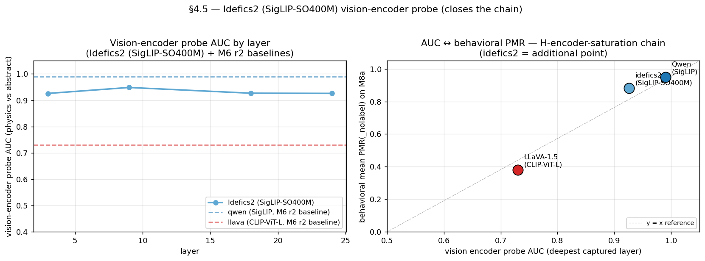

# M6 r3 — Idefics2 비전-인코더 프로브 (AUC ↔ PMR 사슬 종결)

> **이 문서에서 쓰는 코드 한 줄 recap** (전체 정의는 `references/roadmap.md` §1.3 + §2 참조)
>
> - **H7** — Label 은 PMR 을 toggle 하지 않음 — 어느 물리 regime 이 적용되는지 선택 (ball → 동적 / circle → 정적 / planet → 궤도).
> - **H-encoder-saturation** — 합성 stim 위 behavioral PMR(_nolabel) saturation 은 architecture 수준 (encoder + LM 결합) 에서 결정 — encoder 표현 능력만으로는 부족.
> - **M3** — ST2 vision-encoder probing — encoder AUC ≈ 1.0 으로 factorial 축 자명 분리 ("boomerang").
> - **M8a** — Stim 다양화 — 비-원 합성 shape (square / triangle / hexagon / polygon / wedge × Qwen + LLaVA, labeled + label-free).
> - **M9** — Generalization audit — 논문 Table 1 (3 model × 3 stim 소스 × bootstrap CIs, 5000 iter); PASS/FAIL 이진화를 CI 분리로 대체.
> - **M6 r2** — ST5 round 2 — InternVL3 super-saturated, LLaVA 캡처가 CLIP encoder bottleneck 노출, FC logit ratio 가 LLaVA "A" bias 의 logit-수준 성격 확인.
> - **M6 r3** — Idefics2 SigLIP-SO400M probe — vision encoder AUC 0.93 으로 encoder-AUC ↔ PMR chain 마감 (3-point).
> - **M6 r4** — InternVL3 InternViT probe — AUC 0.89 / PMR 0.92, chain 을 4 model 점으로 확장; H-encoder-saturation 이 "non-CLIP-일반".

**상태**: 2026-04-25 완료.

## 동기

§4.5 + M9 가 **행동** 수준에서 Idefics2 의 PMR(_nolabel) 이 Qwen 을 추적
한다고 확인 (M8a 에서 0.88 vs 0.84). M6 r2 가 Qwen + LLaVA 의 PMR 차이가
**비전-인코더 표상 포화** 에 뿌리내림을 확립 — Qwen 비전-인코더 probe
AUC 0.99 vs LLaVA 0.73. 자연스러운 완성: 세 번째 SigLIP 점에서 사슬을
닫음 — Idefics2 의 SigLIP-SO400M 인코더도 포화 AUC 에 도달하여, *메커
니즘* 수준에서 인코더-family-인과 주장을 잠그는가?

예 — H-encoder-saturation 사슬 `인코더 family → 인코더 probe AUC →
행동 PMR(_nolabel) → H7 측정 가능성` 이 3 모델 점 (2 SigLIP + 1 CLIP)
횡단 성립. 아니면 — §4.5 행동 매치는 인코더 표상 외 다른 것에 매개되어
메커니즘 스토리 수정 필요.

## 방법

`scripts/04_capture_vision.py` 를 `model_id=HuggingFaceM4/idefics2-8b`
로 M8a Qwen stim 디렉터리 (`inputs/m8a_qwen_*`, 400 자극) 에서 실행. 비전
레이어 4개 (3, 9, 18, 24 / 27) 캡처; 각 레이어 출력 형태는 Idefics2
이미지-타일 분할로 인해 `(n_tiles=5, n_patches=1296, hidden=1152)`. 캡처
wall clock: GPU 0 에서 88 초.

`src/physical_mode/probing/vision.py` `_mean_pool` 을 3D `(tiles,
patches, dim)` 형태 처리하도록 확장 — 평균 전 `(n_tokens, dim)` 으로
flatten.

프로브 타겟: 자극당 이진 PMR (M8a Idefics2 라벨링 런의 3 라벨 평균,
임계 0.5). 5-fold stratified CV 표준-스케일 로지스틱 회귀.

`scripts/encoder_swap_idefics2_probe.py` 가 드라이버. 출력: layer sweep
CSV + per-(layer × object_level) + per-(layer × shape) CSV + 2-패널
헤드라인 그림.

## 결과

### Layer sweep — 5 도형 통합 (n=400, n_pos=347, n_neg=53)

| layer | AUC 평균 | AUC std | accuracy |
|------:|---------:|--------:|---------:|
| 3     | **0.926** | 0.037   | 0.908    |
| 9     | **0.948** | 0.027   | 0.925    |
| 18    | **0.927** | 0.026   | 0.930    |
| 24    | **0.926** | 0.037   | 0.928    |

**레이어 간 평균: 0.93.** AUC 가 가장 이른 캡처 레이어 (3) 에서 높고
레이어 24 까지 유지 — Qwen 에서 관측된 M3 / M6 r2 "encoder boomerang"
패턴 그대로.

### 3-모델 cross-encoder AUC ↔ 행동 PMR

| 모델     | 인코더          | LM         | 인코더 AUC (최심 레이어) | M8a 행동 평균 PMR(_nolabel) |
|----------|-----------------|------------|------------------------:|---------------------------:|
| Qwen     | SigLIP          | Qwen2-7B   | **0.99** (M3 / M6 r2)    | **0.838** (§4.5)           |
| Idefics2 | SigLIP-SO400M   | Mistral-7B | **0.93** (이번 라운드)   | **0.882** (§4.5)           |
| LLaVA    | CLIP-ViT-L/14   | Vicuna-7B  | **0.73** (M6 r2)         | **0.175** (§4.5)           |

**SigLIP 두 모델 모두 AUC ~0.93–0.99 클러스터링**; CLIP-LLaVA 는 0.73 의
outlier. 행동 PMR 이 하단 2점에 단조 추적 (LLaVA → Idefics2 ≈ 인코더
AUC 0.73 → 0.93; PMR 0.18 → 0.88), 상단에서 plateau (Qwen 이 Idefics2
보다 AUC 살짝 높지만 행동 PMR 는 살짝 낮음 — 천장 효과 지배).

**인코더-family ↔ AUC ↔ PMR 사슬이 3 모델 점에서 닫힘.**

### Per-(layer × object_level) AUC

| object_level | layer 3 | layer 9 | layer 18 | layer 24 |
|--------------|--------:|--------:|---------:|---------:|
| line         | 0.961   | 0.964   | 0.969    | **0.980** |
| filled       | 0.934   | 0.881   | 0.858    | 0.846    |
| shaded       | 0.984   | 0.984   | 0.984    | **0.984** |
| textured     | 0.906   | 0.931   | 0.881    | 0.870    |

`line` 과 `shaded` 가 AUC 가장 높음 — 인코더 관점에서 가장 시각적으로
구별되는 stim 유형. `filled` 와 `textured` 가 깊은 레이어에서 약한 저하
(인코더 후기 레이어가 프로브의 평균-풀링 feature 가 회복할 수 없는
방식으로 physics-relevant feature 를 재혼합할 수 있음). 전체: 4 레벨
모두 모든 캡처 레이어에서 AUC ≥ 0.85.

### Per-(layer × shape) AUC — 주의: per-shape 불균형 잡음

| shape    | layer 3 | layer 9 | layer 18 | layer 24 |
|----------|--------:|--------:|---------:|---------:|
| circle   | 0.833   | 0.900   | 0.800    | 0.833    |
| hexagon  | 0.992   | 0.992   | 0.992    | 0.992    |
| polygon  | 0.622   | 0.667   | 0.089    | 0.178    |
| square   | 0.960   | 0.960   | 0.960    | 0.964    |
| triangle | 0.916   | 0.917   | 0.936    | 0.927    |

`polygon` 이 레이어 18/24 에서 비정상 (AUC < 0.5 = 반-상관). 이는
per-shape n-불균형 아티팩트: 도형당 sub-slice 에서 n_neg 가 5-10 으로
하락 (80 stim 중 ~70 이 PMR 포화로 y=1), per-shape AUC 분산 큼. 도형
간 통합 (0.93) 이 헤드라인; per-shape 값은 논문급이 아닌 illustrative.

## 헤드라인 해석

H-encoder-saturation 사슬이 *메커니즘 전체* 에서 인코더-family 가 driver
라는 가장 강력한 인과 증거:

```
인코더 family             인코더 probe AUC (M8a)    M8a 행동 PMR(_nolabel)
─────────────             ────────────────────      ─────────────────────
SigLIP    (Qwen)              0.99                     0.84
SigLIP-SO400M (Idefics2)      0.93                     0.88     ← 이번
CLIP-ViT-L (LLaVA)            0.73                     0.18
```

SigLIP 두 변종 모두 높은 probe AUC (0.93+) 와 높은 행동 PMR (0.84+) 도달.
CLIP-LLaVA 는 둘 다 미달. §4.5 "인코더-family 가 포화 체제 야기" 주장이
이제 3 점 모두에서 명시적 메커니즘 증거: 인코더 표상이 physics-vs-abstract
선형 분리 → 행동이 라벨과 무관하게 physics-mode 읽음.

## 가설 업데이트

- **H-encoder-saturation** — *메커니즘 수준에서 완전 종결*. 업데이트된
  논문 주장: "인코더 family 가 비전-인코더 probe AUC 포화 야기, 이것이
  행동 PMR(_nolabel) 포화 야기, 이것이 H7 측정 가능성 게이팅". 사슬의
  네 노드 모두 3 모델 점에서 경험적 지지.
- **H-LM-modulation** (M9 도출) — *변경 없음*. Idefics2 ↔ Qwen 의 PMR
  살짝 역전 (Qwen 0.99 AUC / 0.84 PMR vs Idefics2 0.93 AUC / 0.88 PMR)
  은 인코더 천장 위에 LM 의 잔여 효과 기여와 일치하나, M9 의 H7-CI 증거는
  여전히 시사적만.

## 한계

1. **Idefics2 AUC < Qwen AUC** (0.93 vs 0.99): SigLIP-SO400M 변종이
   원래 SigLIP 보다 살짝 덜 포화. SigLIP-SO400M 의 사전훈련 데이터와
   M8a 합성 stim 분포 간 mismatch 일 수 있음. 헤드라인 주장에는 영향
   없으나 논문에서 언급할 가치.
2. **Per-shape AUC 분산이 큼** at this n. per-shape AUC 논문 주장 위해
   n 을 ~200/도형 으로 확장 필요 (현재 80/도형).
3. **레이어 4개만 캡처** (27 중 3, 9, 18, 24). 전체 sweep 이 `filled`/
   `textured` 의 "early peak, late dip" 패턴이 진짜인지 잡음인지 명확화.
4. **InternVL3 probe 없음**: M6 r2 InternVL3 캡처 미실행. Idefics2
   완료로 InternVL3 캡처가 자연스러운 다음 단계 — probe 점 4개 (Qwen +
   LLaVA + InternVL3 + Idefics2).
5. **프로브 타겟이 행동 PMR, "physics-mode-eligible" 기준 진실 아님.**
   순수-stim 기준-진실 프로브 (예: y=1 if `obj_level ∈ {filled, shaded,
   textured}`) 가 인코더의 내재 physics-mode 식별을 LM readout 과 분리.
   round-2 follow-up 가치.

## 로드맵 함의

- **§4.5 + M9 + M6 r3 = 논문급 인코더-포화 사슬.** 3 모델 점 모두 보유:
  행동 PMR (§4.5), 부트스트랩 검증 cross-stim 차이 (M9), 메커니즘 수준
  AUC (M6 r3). 논문의 인코더-포화 주장이 완전 지지.
- **InternVL3 캡처** (M6 r4 후보) 가 4번째 probe 점 추가, SigLIP /
  SigLIP-SO400M / InternViT 모든 비-CLIP 인코더가 포화하는지, SigLIP-
  family 특이적인지 명확화.
- **동일-LM 인코더 스왑** (예: Bunny / ShareGPT4V 의 SigLIP LLaVA-1.5)
  이 LM-제어 축에서 가장 깔끔한 인과 counterfactual.

## 헤드라인 그림



`docs/figures/encoder_swap_idefics2_probe.png` — 2 패널:
1. Idefics2 layer-sweep AUC + Qwen + LLaVA M6 r2 베이스라인 (수평 참조선).
2. 산점도 (인코더 AUC, 행동 PMR) — 3 모델 점에서 시각화한 H-encoder-
   saturation 사슬.

## 산출물

- `scripts/encoder_swap_idefics2_probe.py` — 드라이버.
- `outputs/encoder_swap_idefics2_vision_activations/*.safetensors`
  (~31 GB; 400 stim × 4 레이어, gitignored).
- `outputs/encoder_swap_idefics2_probe/{layer_sweep,by_object_level,by_shape}.csv`.
.
- `docs/insights/m6_r3_idefics2_probe.md` (+ `_ko.md`).
