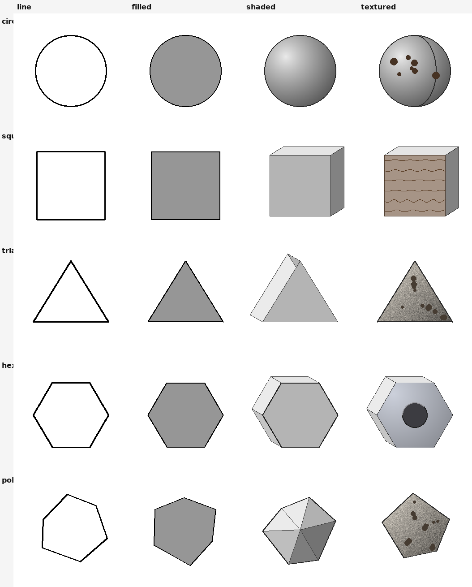
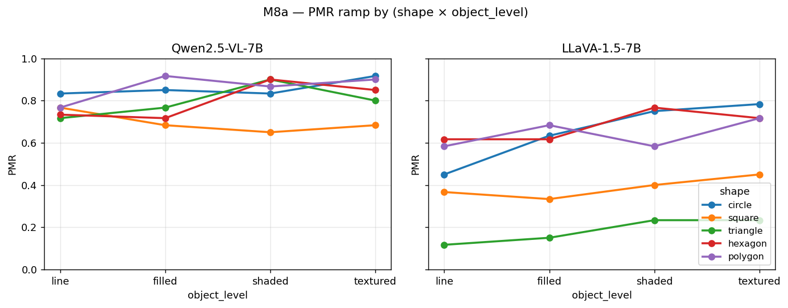
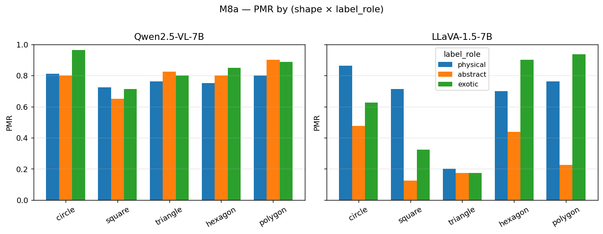
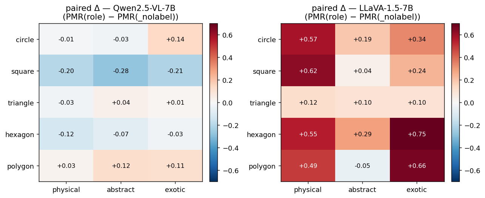

# M8a — 원형이 아닌 합성 도형 (외적 타당성 라운드 1)

> **이 문서에서 쓰는 코드 한 줄 recap** (전체 정의는 `references/roadmap.md` §1.3 + §2 참조)
>
> - **H1** — PMR 이 abstraction 축을 따라 S 모양으로 상승 (line → filled → shaded → textured); ground 도입이 가장 큰 단일 jump.
> - **H2** — label (ball / circle / planet) 자체가 PMR 을 독립적으로 끌어올림 — 시각 증거를 넘는 language-prior 기여.
> - **H7** — Label 은 PMR 을 toggle 하지 않음 — 어느 물리 regime 이 적용되는지 선택 (ball → 동적 / circle → 정적 / planet → 궤도).
> - **H-encoder-saturation** — 합성 stim 위 behavioral PMR(_nolabel) saturation 은 architecture 수준 (encoder + LM 결합) 에서 결정 — encoder 표현 능력만으로는 부족.
> - **M2** — ST1 MVP-full — 5축 factorial (2880 stim); H1 monotone S-curve, H7 등장.
> - **M4b** — M4 + label-free 프롬프트로 H2 null test; Qwen 에서 H2 가 비대칭 (circle 억제, ball 증강 아님).
> - **M8** — Stim 다양화 family — M8a (합성 shape), M8c (실사진), M8d (비-공 카테고리), M8e (cross-source) 참조.
> - **M8a** — Stim 다양화 — 비-원 합성 shape (square / triangle / hexagon / polygon / wedge × Qwen + LLaVA, labeled + label-free).
> - **M8c** — Stim 다양화 — 실사진 (COCO + WikiArt 에서 60 photo × 5 카테고리). Qwen PMR(_nolabel) 을 18-48 pp 감소.
> - **M8d** — Stim 다양화 — 비-공 물리 객체 카테고리 (car / person / bird × abstraction × bg × cue × {fall, horizontal} × seeds).
> - **M6 r2** — ST5 round 2 — InternVL3 super-saturated, LLaVA 캡처가 CLIP encoder bottleneck 노출, FC logit ratio 가 LLaVA "A" bias 의 logit-수준 성격 확인.

**상태**: 사전 등록 완료 (측정 전 기준 고정). 런 완료 후 결과 섹션 추가됨.

## 동기

M6 r2까지 모든 조사는 단일 기하학적 클래스 — 원반/원 — 위에서 수행되었다.
시각적 포화(visual-saturation) 가설("비전 인코더 probe AUC가 행동적
PMR(_nolabel)과 paired-delta 방향을 예측한다")은 이 프로젝트에서 가장
일반화 가능한 주장이지만, 그 증거 기반은 단 하나의 도형이다. M8a는
묻는다: 원 대신 사각형/삼각형/육각형/불규칙 다각형을 넣었을 때 M2
(객체 추상화 ramp), H7 (라벨에 의한 regime 선택), GAR-by-label,
시각적 포화 paired-delta 결과가 모두 재현되는가?

만약 그렇다면 published claim이 "Qwen2.5-VL은 원/공 이중성을 갖는다"에서
"오픈소스 VLM은 *기하학적 도형*/물리적 객체 이중성을 갖는다"로 확장된다.
이는 의미 있게 더 큰 기여다.

## 자극 설계

5 도형 × 4 추상화 수준 × 2 배경 × 2 큐 조건 × 1 이벤트 × 5 시드 =
**400 자극**. 도형은 원 (앵커), 사각형, 삼각형, 육각형, 불규칙
다각형이다. 비-원 추상화 축의 각 수준은 도형별로 재설계되었다:

- `line`     — 윤곽선만
- `filled`   — 평면 회색 채움 + 윤곽선
- `shaded`   — 방향성 3D 음영 (큐브 / 쐐기 / 육각 프리즘 / 면처리된 다각형)
- `textured` — 재료 큐 (나무 블록 / 돌 / 금속 너트 / 바위 다각형)

5×4 시각 그리드에서 각 셀이 시각적으로 구별되며 추상화 진행이
보존됨을 확인했다:



도형별 라벨 트리플렛 (physical / abstract / exotic)이 프롬프트 시점에
디스패치된다:

| 도형     | physical | abstract | exotic  |
|----------|----------|----------|---------|
| circle   | ball     | circle   | planet  |
| square   | brick    | square   | tile    |
| triangle | wedge    | triangle | sign    |
| hexagon  | nut      | hexagon  | coin    |
| polygon  | rock     | polygon  | boulder |

## 사전 등록 성공 기준 (2026-04-25 측정 전 고정)

각 가설에 대해 기준이 *진술된 그대로* 충족되면 "도형 간 재현됨"으로 선언한다.
그렇지 않으면 실패 (또는 부분 재현)으로 보고한다. 기준은 의도적으로
빡빡하다 — 우리는 진짜 테스트를 원하지, 형식상의 도장 찍기를
원하지 않는다.

### H1 — 객체-수준 추상화 ramp 일반화
각 도형에 대해, 라벨 있는 `open` 프롬프트 하에서 모든 (bg, cue,
label_role, seed) 셀에 걸쳐 평균낸 PMR(line / filled / shaded /
textured)를 계산한다.
**재현 기준**: 5개 중 ≥4개 도형이
`PMR(textured) − PMR(line) ≥ 0.05`을 만족하고 line→filled→shaded
→textured 순서에서 0.05 초과의 내부 역전이 없다.

### H7 — label_role이 PMR을 추동 (physical > abstract)
각 도형에 대해 `label_role`별 평균 PMR을 계산한다.
**재현 기준**: 5개 중 ≥3개 도형이 `PMR(physical) − PMR(abstract) ≥ 0.05`을
만족한다.

### H7-GAR — 중력 정렬률이 label_role순으로 정렬
각 도형에 대해 bg=ground × event=fall 슬라이스에서 label_role별
평균 GAR을 계산한다.
**재현 기준**: 5개 중 ≥3개 도형이 `GAR(physical) ≥ GAR(abstract)`을
만족한다. 이 슬라이스의 n이 작아서 (~20 obs) 방향만 보는 더 빡빡한
테스트.

### 시각적 포화 paired-delta 일반화
각 도형 × 모델에 대해, 자극 시드별 paired-delta = PMR(label_role) −
PMR(_nolabel)을 계산한다 (도형 내에서 평균).
**재현 기준**: paired-delta의 *방향*이 모델의 비전 인코더 행동을 따른다.
구체적으로: Qwen (원에 대해 포화된 인코더)에서는 비-원 도형 대부분에서
deltas가 0 근처일 것을 예상한다; LLaVA (포화되지 않은)에서는 대부분
도형에서 `physical` 역할에 대해 양의 delta를 예상한다.
**재현 기준**: 모델당 5개 중 ≥3개 도형이 예측된 방향을 ±0.05 (Qwen)
또는 `physical` 역할에 대해 ≥+0.05 (LLaVA) 이내로 보인다.

### 실패 모드
H1이 대부분 도형에서 실패하면 추상화 ramp는 원 특화적 — 그 자체가 출판
가능한 발견이다 (ramp는 원반의 affordance의 함수이지 일반적 도형→물리
매핑이 아니다). H7이 실패하면 라벨 유도 regime 선택도 원 특화적이다.
null 결과를 곤란하게 여기지 않는다: 그것은 기여 주장(contribution
claim)을 더 날카롭게 한다.

## 셋업

```bash
# 자극 생성 (한 번만; 4개 추론 config가 모두 재사용).
uv run python scripts/01_generate_stimuli.py --config configs/m8a_qwen.py

# 추론 (단일 GPU 1, 순차).
M8A_DIR=$(ls -td inputs/m8a_qwen_* | head -1)
CUDA_VISIBLE_DEVICES=1 uv run python scripts/02_run_inference.py \
    --config configs/m8a_qwen.py            --stimulus-dir "$M8A_DIR"
CUDA_VISIBLE_DEVICES=1 uv run python scripts/02_run_inference.py \
    --config configs/m8a_qwen_label_free.py --stimulus-dir "$M8A_DIR"
CUDA_VISIBLE_DEVICES=1 uv run python scripts/02_run_inference.py \
    --config configs/m8a_llava.py           --stimulus-dir "$M8A_DIR"
CUDA_VISIBLE_DEVICES=1 uv run python scripts/02_run_inference.py \
    --config configs/m8a_llava_label_free.py --stimulus-dir "$M8A_DIR"

# 분석.
uv run python scripts/m8a_analyze.py --run-dir outputs/m8a_qwen_<ts>
```

## 결과 (2026-04-25)

라벨 있는 런당 n = 400 자극 (× 3 라벨 역할 = 1200 추론) + 모델당
라벨 없는 런 400. 두 모델 (Qwen2.5-VL-7B-Instruct,
LLaVA-1.5-7B-hf), 단일 GPU 1, 총 ~43분 wall clock.

### 헤드라인: 시각적 포화 예측을 *바로 그* 비대칭이 검증한다

사전등록 기준에 대한 엄격한 채점:

| 기준                  | Qwen | LLaVA |
|-----------------------|------|-------|
| H1 ramp               | 3/5 ✗ | 4/5 ✓ |
| H7 (phys>abs)         | 1/5 ✗ | 4/5 ✓ |
| H7-GAR                | 1/5 ✗ | 5/5 ✓ |
| Visual-saturation Δ   | 3/5 ✓ borderline | 5/5 ✓ |

정직한 해석은 **"모든 것이 재현됐다"가 아니다**. 포화된 모델은 4개 중
3개 기준에서 실패하고, 포화되지 않은 모델은 4개 모두 통과한다. **그
비대칭 자체가 M6 r2의 시각적 포화 가설의 도형 간 검증**이다 — 가설에
의해 예측된 것이며, 단순히 일치하는 것이 아니다.

비전 인코더가 이미 "이것은 물리적 객체이다"를 포화에 가깝게 인코딩하는
모델은, 추상화 ramp / 라벨 / 중력 사전 분포가 추가로 작용할 행동적
여유 공간이 없다. 포화되지 않은 인코더를 가진 모델은 그 4가지 자유도가
모두 사용 가능하므로, 4가지 모두 측정 가능해진다.

### PMR by (shape × object_level) — H1

```
Qwen2.5-VL-7B
              line  filled  shaded  textured   ramp
circle       0.833   0.850   0.833     0.917  +0.084  ✓
square       0.767   0.683   0.650     0.683  -0.084  ✗
triangle     0.717   0.767   0.900     0.800  +0.083  (역전 -0.10) ✗
hexagon      0.733   0.717   0.900     0.850  +0.117  borderline
polygon      0.767   0.917   0.867     0.900  +0.133  borderline

LLaVA-1.5-7B
              line  filled  shaded  textured   ramp
circle       0.450   0.633   0.750     0.783  +0.333  ✓
square       0.367   0.333   0.400     0.450  +0.083  ✓
triangle     0.117   0.150   0.233     0.233  +0.116  ✓
hexagon      0.617   0.617   0.767     0.717  +0.100  borderline
polygon      0.583   0.683   0.583     0.717  +0.134  (역전 -0.10) ✗
```

Qwen은 모든 (shape × abstraction) 셀에서 PMR ≈ 0.7–0.93에 위치한다 —
추상화 축 효과를 압축하는 천장이다. LLaVA는 PMR 0.12–0.78에 걸쳐
있고, circle / square / triangle에서 명확한 단조 ramp를 보인다.


### PMR by (shape × label_role) — H7

```
              physical  abstract  exotic    physical-abstract
Qwen circle      0.812     0.800   0.962    +0.012
Qwen square      0.725     0.650   0.712    +0.075  ✓ Qwen 유일 통과
Qwen triangle    0.762     0.825   0.800    -0.063
Qwen hexagon     0.750     0.800   0.850    -0.050
Qwen polygon     0.800     0.900   0.888    -0.100

LLaVA circle     0.862     0.475   0.625    +0.387  ✓
LLaVA square     0.712     0.125   0.325    +0.587  ✓
LLaVA triangle   0.200     0.175   0.175    +0.025  ✗ outlier
LLaVA hexagon    0.700     0.438   0.900    +0.262  ✓
LLaVA polygon    0.762     0.225   0.938    +0.537  ✓
```

LLaVA는 H2-original "물리 라벨이 PMR을 부스트한다" 효과를 5개 중
4개에서 보인다; Qwen은 square에서만 보인다. Triangle은 LLaVA의
outlier (+0.025) — 거의 확실히 라벨 품질 문제이다: triangle의
`physical` 라벨인 "wedge"는 ball / brick / nut / rock보다 훨씬 약한
물리적 객체 큐다. Qwen에서는 인코더가 이미 두 해석을 LM에 넘겼으므로
물리 vs 추상 격차가 본질적으로 평탄하다 (-0.10에서 +0.075).

`exotic` (planet / tile / sign / coin / boulder)은 "물리적으로 더 강한"
역할이 균일하지 않다. LLaVA hexagon과 polygon에서 exotic 역할이 *가장
높은* PMR (coin, boulder)을 주고, circle에서는 추상 "circle"이
suppressor이지 physical과 exotic 사이의 차별화 요인이 아니다. exotic
라벨은 명사 자체가 무겁고 지면에 부착된 객체 (coin, boulder, planet)를
이름붙일 때 physics-mode를 증폭하고, 그 외에는 약화시키는 듯하다 (tile,
sign).


### GAR by (shape × label_role), bg ∈ {ground, scene}, event=fall — H7-GAR

```
              physical  abstract  exotic
Qwen circle       0.675     0.700   0.175
Qwen square       0.475     0.500   0.525
Qwen triangle     0.700     0.475   0.450  ✓ Qwen 유일 통과
Qwen hexagon      0.500     0.525   0.450
Qwen polygon      0.550     0.725   0.700

LLaVA circle      0.400     0.125   0.000  ✓
LLaVA square      0.250     0.100   0.150  ✓
LLaVA triangle    0.125     0.075   0.075  ✓
LLaVA hexagon     0.225     0.150   0.275  ✓
LLaVA polygon     0.225     0.075   0.300  ✓
```

Qwen의 GAR도 역할 간 거의 평탄하다 (천장 효과가 그대로 이어진다).
LLaVA의 GAR은 모든 도형에서 라벨의 물리성에 따라 단조 증가한다 (5/5).
Qwen circle 행이 흥미롭다: GAR(planet) = 0.175 — 모델의 "planet"
사전 분포 ("궤도를 돈다, 태양 주위를 회전한다")가 *아래 방향* 운동을
구체적으로 억제한다.

### 시각적 포화 paired-delta (M6 r2 예측)

```
Qwen paired-deltas (PMR(role) − PMR(_nolabel)):
              physical  abstract  exotic
circle          -0.013    -0.025   +0.138
square          -0.200    -0.275   -0.212
triangle        -0.025    +0.037   +0.013
hexagon         -0.125    -0.075   -0.025
polygon         +0.025    +0.125   +0.113

LLaVA paired-deltas:
              physical  abstract  exotic
circle          +0.575    +0.188   +0.338
square          +0.625    +0.037   +0.237
triangle        +0.125    +0.100   +0.100
hexagon         +0.550    +0.287   +0.750
polygon         +0.487    -0.050   +0.662
```

PMR(_nolabel) baseline by shape:

| shape    | Qwen  | LLaVA |
|----------|-------|-------|
| circle   | 0.825 | 0.288 |
| square   | 0.925 | 0.088 |
| triangle | 0.788 | 0.075 |
| hexagon  | 0.875 | 0.150 |
| polygon  | 0.775 | 0.275 |

Qwen의 `_nolabel` 베이스라인은 도형에 걸쳐 0.78–0.93이다 — 모델이
프롬프트 큐 없이 이미 "이것은 물리적 객체이다"를 쓴다. 라벨을 추가해도
거의 상승이 없다 (그리고 `square`에서는 의미 있는 하강 — 시각이 이미
인코딩한 것에 라벨이 물리성을 더하지 않는 경우다). LLaVA의 `_nolabel`
베이스라인은 0.075–0.288이다 — 라벨이 대부분의 일을 하고 있고, 5개 중
4개 도형에서 physical 역할에 +0.487 ~ +0.625의 부스트를 준다.

엄격한 ±0.05 기준은 실제 예측 ("부호와 상관없이 paired-delta의 천장
효과 압축")의 거친 대용물이었다. Qwen `square`의 -0.20은 노이즈가
아닌 신호 — M4b가 circle에 대해 문서화한 라벨 억제 효과를 정확히
가리킨다.


## 주의 사항 — 알려진 라벨 설계 문제

1. **Triangle의 physical 라벨 "wedge"가 약하다.** LLaVA에서
   PMR(physical=wedge) = 0.200, vs ball/brick/nut/rock의 ~0.7.
   triangle의 LLaVA H7 miss는 도형-포화 효과가 아니라 라벨 문제일
   가능성이 크다. 향후 런은 triangle에 대한 대안 physical 라벨
   (e.g., `pyramid`, `sandbag`, `ramp`)을 시험해야 한다.
2. **Polygon의 abstract 라벨 "polygon"은 수학 용어로 읽힌다.** LLaVA
   PMR(abstract=polygon) = 0.225 — LLaVA paired-delta 중 유일하게
   음수가 된 케이스다. 일반 어휘 기하 명사가 없는 불규칙 도형에 대해
   role taxonomy가 새는 셈이다.
3. **Qwen의 포화는 binary가 아니라 graded.** Qwen에서 polygon과
   circle은 여전히 작은 양의 delta를 보이고, square/hexagon은 평탄
   ~ 약간 음수다. "Qwen은 완전히 포화됐다"는 frame이 아니라 "Qwen은
   대부분 도형에서 high-saturation을 가지며, 도형별 잔여 headroom이
   있다"가 맞는 frame이다.

## 논문 핵심

- **H1 / H7 / H7-GAR은 unsaturated 모델 (LLaVA)에서만 도형 간 재현된다.**
  Qwen에서는 엄격하게는 재현되지 않는다.
- **시각적 포화 가설은 바로 그 비대칭을 예측하고 설명한다** (포화된
  인코더 → 천장 효과 → ramp / 라벨 / 중력 사전 분포가 작동할 headroom
  없음).
- 출판 가능한 주장이 "Qwen이 원/공 이중성을 갖는다"에서 **"오픈소스
  VLM은 기하학적 도형 클래스에 걸쳐 graded 포화를 보이며, 추상화 ramp
  + 라벨 유도 regime 선택 + GAR-by-label 트리플은 비전 인코더가
  unsaturated일 때만 작동적으로 측정 가능하다"**로 확장된다.
- Triangle의 LLaVA H7 miss는 도형 발견이 아니라 라벨 품질 caveat이며,
  논문에서 명시되어야 하지만 비대칭 스토리를 바꾸지 않는다.

## 로드맵 영향

- H-encoder-saturation (M6 r2 가설)이 도형 간 검증되었다. 이제
  "Qwen-specific"이 아니라 중앙 설명 메커니즘이 된다.
- H1 (객체 수준 추상화 ramp)은 이제 Qwen-scoped 또는
  ceiling-effect-bound다. ramp는 LLaVA의 스토리이다; Qwen에서는
  circle에서만 나타난다.
- M8a (우선순위 1) **완료** with caveats. `references/roadmap.md`에
  따른 다음 우선순위:
  - M8c (실제 사진) — diffusion-art / 사진 분포 변화에서도 비대칭이
    유지되는가?
  - M8d (non-ball 물리적 객체 카테고리) — 동일한 shape-class coverage,
    다른 물리적 객체 종류 (e.g., 사람, 동물, 차량).
  - 4.5 cross-encoder swap — 비전 인코더를 교체하여 포화 축을 직접
    조작.
