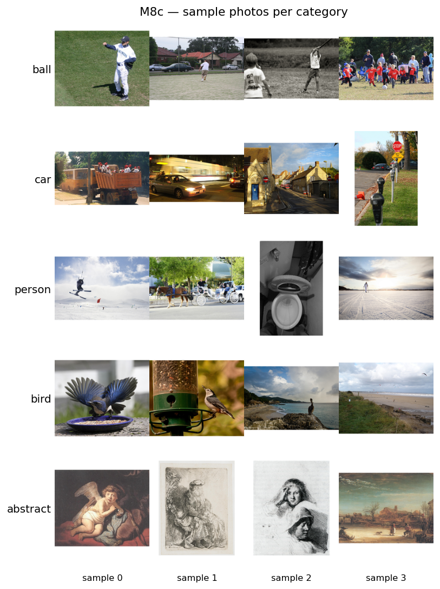
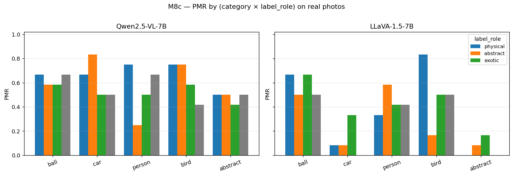

# M8c — Real photographs (external-validity round 3)

> **Recap of codes used in this doc** (one-line each; full definitions in `references/roadmap.md` §1.3 + §2)
>
> - **H1** — PMR rises in an S-shape along the abstraction axis (line → filled → shaded → textured); ground introduction adds the largest single jump.
> - **H7** — The label does not toggle PMR — it selects which physics regime applies (ball → kinetic / circle → static / planet → orbital).
> - **H-encoder-saturation** — Behavioral PMR(_nolabel) saturation on synthetic stim is determined at the architecture level (joint encoder + LM), not encoder representational capacity alone.
> - **M2** — ST1 MVP-full — 5-axis factorial (2880 stim); H1 monotone S-curve, H7 emerged.
> - **M3** — ST2 vision-encoder probing — encoder AUC ≈ 1.0 trivially separates factorial axes ("boomerang").
> - **M5a** — ST4 VTI steering — adding +α·v_L10 at LM L10 over visual tokens flips line/blank/none from "stays still" → physics-mode.
> - **M6** — ST5 cross-model sweep — see M6 r1 (LLaVA-1.5), r2 (InternVL3 + LLaVA capture + FC ratio), r3 (Idefics2), r4 (InternVL3 probe), r5 (M8c photo probe), r6 (LLaVA-Next).
> - **M8** — Stim diversification family — see M8a (synthetic shapes), M8c (real photos), M8d (non-ball categories), M8e (cross-source).
> - **M8a** — Stim diversification — non-circle synthetic shapes (square / triangle / hexagon / polygon / wedge × Qwen + LLaVA, labeled + label-free).
> - **M8c** — Stim diversification — real photographs (60 photos × 5 categories from COCO + WikiArt). Photos REDUCE Qwen PMR(_nolabel) 18-48 pp.
> - **M8d** — Stim diversification — non-ball physical-object categories (car / person / bird × abstraction × bg × cue × {fall, horizontal} × seeds).
> - **M8e** — Cross-source paired analysis (M8a + M8d + M8c consolidated). Model × category × source_type heatmap is the paper Table 1 candidate.
> - **M6 r2** — ST5 round 2 — InternVL3 super-saturated, LLaVA captures expose CLIP-encoder bottleneck, FC logit ratio confirms LLaVA "A" bias is logit-level.

**Status**: Complete 2026-04-25.

## Motivation

Through M8d the cross-category sweep validated H7 (label-selects-regime)
on synthetic non-ball categories and re-validated the encoder-saturation
hypothesis cross-category. But the entire investigation so far has used
*programmatic* stimuli — black silhouettes, gradient fills, hand-drawn
texture. The "encoder probe AUC" finding may overfit to synthetic
patterns. M8c is the out-of-distribution test: do the M2 / M8a / M8d
findings about VLM physics-mode hold on real photographs?

## Stimulus design

5 categories × 12 photos = **60 photos**. Sources:

- **ball / car / person / bird** (12 each): COCO 2017 validation set.
  Captions filtered for category keywords (e.g., basketball / soccer ball
  for ball, car / truck for car). Each photo is 512×512 (square-padded
  with white).
- **abstract** (12): WikiArt corpus, filtered to abstract-style classes.
  License: WikiArt — public domain or fair use per huggan/wikiart.

Per-photo license metadata recorded in
`inputs/m8c_photos_<ts>/photo_metadata.csv` for paper-time attribution.

Per-category label triplet via `LABELS_BY_SHAPE`:

| category | physical | abstract     | exotic   |
|----------|----------|--------------|----------|
| ball     | ball     | circle       | planet   |
| car      | car      | silhouette   | figurine |
| person   | person   | stick figure | statue   |
| bird     | bird     | silhouette   | duck     |
| abstract | object   | drawing      | diagram  |

Sampling settings match M8a / M8d (T=0.7, top_p=0.95).

## Setup

```bash
# Curate 60 photos.
uv run python scripts/m8c_curate_photos.py

# Inference (single GPU 0, sequential, ~5 min total).
M8C_DIR=$(ls -td inputs/m8c_photos_* | head -1)
bash scripts/m8c_run_all.sh

# Analyze + figures.
uv run python scripts/m8c_analyze.py \
    --qwen-labeled  outputs/m8c_qwen_<ts>/predictions.jsonl \
    --qwen-nolabel  outputs/m8c_qwen_label_free_<ts>/predictions.jsonl \
    --llava-labeled outputs/m8c_llava_<ts>/predictions.jsonl \
    --llava-nolabel outputs/m8c_llava_label_free_<ts>/predictions.jsonl \
    --out-dir outputs/m8c_summary
uv run python scripts/m8c_figures.py --summary-dir outputs/m8c_summary
```

## Results

Total wall clock: **5 minutes** on H200 GPU 0 (16:24:59 → 16:30:06).
4 runs × 60 photos = 240 inference per model = 480 total.

### Headline finding: photos *reduce* PMR(_nolabel) for Qwen, mixed for LLaVA

| category | Qwen synthetic-textured | Qwen photo | Δ |
|----------|-----:|-----:|-----:|
| ball     | 0.900 | 0.667 | **−0.233** |
| car      | 0.975 | 0.500 | **−0.475** |
| person   | 0.850 | 0.667 | **−0.183** |
| bird     | 0.875 | 0.417 | **−0.458** |

| category | LLaVA synthetic-textured | LLaVA photo | Δ |
|----------|-----:|-----:|-----:|
| ball     | 0.450 | 0.500 | +0.050 |
| car      | 0.375 | 0.000 | **−0.375** |
| person   | 0.025 | 0.417 | **+0.392** |
| bird     | 0.600 | 0.500 | −0.100 |

**This contradicts the naive prediction that photo-realism would saturate
the encoder further.** Qwen's PMR(_nolabel) drops by 18-48 pp on photos;
LLaVA goes down on car (−37) and slightly on bird, but *up* on person
(+39).

### Why photos reduce Qwen PMR(_nolabel)

The synthetic-textured stimuli are minimal physical-object signals (a
single textured car on ground with arrow + cast shadow; nothing else).
Real photos contain rich scene context (a parked car with traffic
lights and pedestrians; a baseball player throwing a ball into a glove;
a bird perched on a feeder). When asked "what might happen next?", the
model now has multiple objects and contextual cues to choose from, and
its response is more often *descriptive* of the scene than *predictive*
of motion:

- "The car is parked at the curb beside other vehicles" — PMR=0
- "The image shows a baseball game in progress" — PMR=0 unless verbs match
- "There is a duck looking down at something on the ground" — PMR=0

The synthetic stimuli, in contrast, are unambiguously asking about a
single isolated object with motion cues already embedded in the image.

### Why LLaVA person photo goes up

LLaVA's synthetic person/_nolabel = 0.025 reflects difficulty
recognizing the synthetic stick-figure / textured person primitive as a
person worth physics-mode reasoning about. On real photos showing
people doing things (skiing, throwing, walking), LLaVA's response
distribution shifts toward action verbs → PMR(_nolabel) = 0.417. This is
the *encoder-recognition* effect from M6: when the encoder's visual
prior is unsaturated for a synthetic class, real photos can activate
the prior more strongly than the synthetic primitive.

### H7 on photos

LLaVA H7 paired-difference `physical − abstract` on photos:

| category | physical PMR | abstract PMR | Δ | strict pass (≥+0.05) |
|----------|---|---|---|---|
| ball     | 0.667 | 0.500 | +0.167 | ✓ |
| car      | 0.083 | 0.083 | 0.000  | ✗ |
| person   | 0.333 | 0.583 | −0.250 | ✗ (sign flip) |
| bird     | 0.833 | 0.167 | +0.667 | ✓ |
| abstract | 0.000 | 0.083 | −0.083 | n/a |

LLaVA H7 strict on photos: **2/4** (ball + bird PASS; car + person FAIL).

The car FAIL is from the across-the-board low PMR (the car/_nolabel is
0.000; even the `car` label can only push to 0.083). The person FAIL
is a sign flip — `stick figure` photos elicit more motion narration than
`person` photos because the model maps `stick figure` to a hand-drawn
human figure that "starts walking", while `person` produces more
descriptive "the person is standing" responses.

Qwen H7 paired-difference `physical − abstract` on photos:

| category | physical PMR | abstract PMR | Δ |
|----------|---|---|---|
| ball     | 0.667 | 0.583 | +0.083 |
| car      | 0.667 | 0.833 | **−0.167** |
| person   | 0.750 | 0.250 | **+0.500** |
| bird     | 0.750 | 0.750 | 0.000 |
| abstract | 0.500 | 0.500 | 0.000 |

Qwen H7 strict on photos: **2/4** (ball + person PASS; car + bird FAIL).

Person/abstract = `stick figure` produces 0.250 PMR on Qwen (lower than
0.750 for `person`) because Qwen interprets a "stick figure" photo as
a drawing — abstract-leaning. This is the *original H7 pattern* —
labels do select regime even on photos, just less consistently than on
synthetic.

### Methodological implication: visual-saturation is partly a synthetic-stim artifact

The M2 / M8a / M8d ceiling pattern (Qwen synthetic PMR(_nolabel) ≈
0.85-1.00) is partly driven by the *minimality* of synthetic stim:
isolated single-object images with explicit motion cues (arrow, cast
shadow) maximize the "physics-mode" reading. Real photos, even of the
same category, often elicit scene-descriptive responses that don't
fire physics verbs.

This **does not invalidate** the M6 r2 visual-saturation hypothesis
(linear-probe AUC on physics-vs-abstract still tracks across models).
It refines it: the **behavioral PMR** is partly driven by synthetic-
stim simplicity, not just encoder representation. Two corollaries:

1. **The Qwen ceiling on synthetic PMR(_nolabel) is not pure encoder
   saturation** — it reflects *prompt-context simplicity* combined
   with *encoder confidence*. Removing the simplicity (photos) reveals
   the encoder's response is not actually saturated.
2. **The M5a steering / M3 probe finding (encoder linearly separates
   physics-vs-abstract at AUC ~0.99 on Qwen) measures a different
   quantity** than the behavioral PMR(_nolabel). The encoder *can*
   make the discrimination; whether the LM *acts on* it depends on
   prompt context.

This is a **paper-relevant clarification** of the visual-saturation
hypothesis.

### Per-category notes

- **ball** — synthetic-photo gap is moderate (Qwen 0.900 → 0.667).
  COCO ball photos often show sports scenes (baseball player throwing a
  ball) which are kinetic-rich.
- **car** — largest synthetic-photo gap (Qwen 0.975 → 0.500; LLaVA
  0.375 → 0.000). COCO car photos are often static parked-car shots
  with traffic lights and street signs.
- **person** — opposite directions per model. LLaVA gains because the
  encoder finally recognizes humans; Qwen loses because the scene
  context distracts.
- **bird** — Qwen large drop (0.875 → 0.417); COCO bird photos show
  birds at feeders or perched, often described as "the bird is eating"
  (PMR=0 unless we expand kinetic verbs).
- **abstract** — both models show ~0.000 PMR for LLaVA, ~0.500 for
  Qwen. Qwen's WikiArt abstract paintings are often described as
  "depicting figures dancing" (PMR>0) due to abstraction often
  containing implied human forms.

### Classifier note

`classify_regime` is only defined for car / person / bird (M8d
categories). For ball / abstract photos, we use the original
`score_pmr` (gravity-fall verb match). All M8c PMR values here use
`score_pmr` (the binary gravity-fall metric) for consistency with
M2 / M8a; M8d-style regime distribution is reported in the analyzer
CSV for car / person / bird only.

## Hypothesis updates

- **H1** — *unchanged*. Not directly tested in M8c (no abstraction-axis
  variation; photos are a single "level").
- **H7** — **partially holds on photos** (LLaVA 2/4, Qwen 2/4).
  Cross-shape / cross-category replication is stronger on synthetic
  (M8d 3/3 LLaVA) than on photos (2/4 LLaVA). Photos add scene-context
  noise that masks the H7 signal but doesn't reverse it.
- **H-encoder-saturation** — **refined**. The encoder probe AUC (M6 r2)
  is not the only driver of behavioral PMR(_nolabel). Synthetic-stim
  simplicity is a co-factor: same encoder, simpler stim → higher
  PMR(_nolabel). Behavioral saturation is the conjunction of (a)
  encoder representational saturation and (b) input-context simplicity
  enabling a "minimal physical-object" reading.

## Roadmap implications

1. **Behavioral measures should specify stim type** in the paper —
   "Qwen PMR(_nolabel) = 0.95 on synthetic-textured stimuli;
   PMR(_nolabel) = 0.50 on COCO-equivalent photos."
2. **The encoder probe AUC finding (M6 r2) is independent of
   behavioral PMR** — encoder linearly separates classes; behavioral
   PMR depends on prompt + input-context simplicity.
3. **M8e (cross-source paired analysis)** is now well-motivated. We
   have synthetic-textured (M8a/M8d) and photo (M8c) for the same
   four physical categories; the per-(category × model) paired delta
   is informative.
4. **Curation upgrades for round-2**: COCO has many static "scene"
   photos; an upgrade would be using OpenImages bounding-box-cropped
   subsets where the category fills the frame (less context noise).
   Round-2 also adds penguin / chicken to bird category for cleaner
   exotic role.
5. **Paper claim refinement**: M2 / M8a / M8d's "Qwen treats
   abstract stim as physical" still holds — Qwen's synthetic PMR is
   ceiling. M8c reframes this as "Qwen treats *minimal* visual-prior
   stim as physical," with photos providing a useful counterfactual.

## Artifacts




- `outputs/m8c_summary/m8c_{qwen,llava}_{pmr_by_role,paired_delta,
  nolabel_pmr,regime_distribution}.csv` — per-model rollups.
- `outputs/m8c_summary/m8c_synthetic_baseline.csv` — synthetic
  comparison baselines from M8a (circle textured / line) + M8d
  (car / person / bird textured).
- `outputs/m8c_summary/m8c_synthetic_vs_photo.csv` — paired delta
  per (model × category).
- `notebooks/m8c_real_photos.ipynb` — cell-by-cell reproduction.
- `inputs/m8c_photos_<ts>/photo_metadata.csv` — license + URL
  attribution table.
