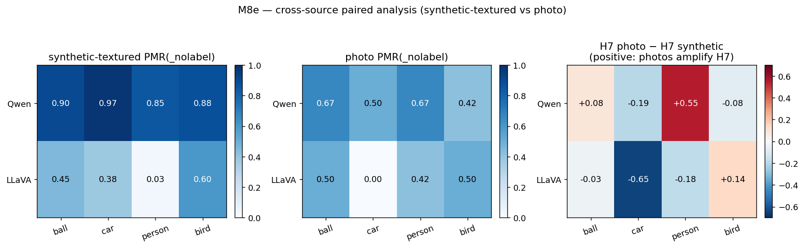

# M8e — 교차 소스 paired 분석 (합성 vs 사진)

> **이 문서에서 쓰는 코드 한 줄 recap** (전체 정의는 `references/roadmap.md` §1.3 + §2 참조)
>
> - **H1** — PMR 이 abstraction 축을 따라 S 모양으로 상승 (line → filled → shaded → textured); ground 도입이 가장 큰 단일 jump.
> - **H7** — Label 은 PMR 을 toggle 하지 않음 — 어느 물리 regime 이 적용되는지 선택 (ball → 동적 / circle → 정적 / planet → 궤도).
> - **H-encoder-saturation** — 합성 stim 위 behavioral PMR(_nolabel) saturation 은 architecture 수준 (encoder + LM 결합) 에서 결정 — encoder 표현 능력만으로는 부족.
> - **M8a** — Stim 다양화 — 비-원 합성 shape (square / triangle / hexagon / polygon / wedge × Qwen + LLaVA, labeled + label-free).
> - **M8c** — Stim 다양화 — 실사진 (COCO + WikiArt 에서 60 photo × 5 카테고리). Qwen PMR(_nolabel) 을 18-48 pp 감소.
> - **M8d** — Stim 다양화 — 비-공 물리 객체 카테고리 (car / person / bird × abstraction × bg × cue × {fall, horizontal} × seeds).
> - **M8e** — Cross-source 페어 분석 (M8a + M8d + M8c 통합). Model × category × source_type heatmap 이 논문 Table 1 후보.
> - **M9** — Generalization audit — 논문 Table 1 (3 model × 3 stim 소스 × bootstrap CIs, 5000 iter); PASS/FAIL 이진화를 CI 분리로 대체.
> - **M6 r2** — ST5 round 2 — InternVL3 super-saturated, LLaVA 캡처가 CLIP encoder bottleneck 노출, FC logit ratio 가 LLaVA "A" bias 의 logit-수준 성격 확인.

**상태**: 완료 2026-04-25.

## 동기

M8a (circle textured), M8d (car / person / bird textured), M8c (실사진)
이 동일 프롬프트 프로토콜로 동일 4 물리 카테고리에 두 가지 stim type
(합성-textured + 실사진) 으로 실행됨. M8e 는 세 run 을 단일
(model × category × source_type) 뷰로 통합하여 논문 Table-1 / heatmap
을 생성.

분석 전용 milestone (새 추론 없음).

## 방법

각 (모델, 카테고리, source_type) 셀에 대해:
1. `PMR(_nolabel)` 베이스라인 — 인코더 + LM 이 라벨 없이 이 stim 을
   물리적으로 처리하는가?
2. 라벨 arm 의 H7 paired-difference `PMR(physical) − PMR(abstract)`.
3. 두 양의 photo − synthetic delta.

출처:
- **합성-textured ball** = M8a `circle / textured` slice.
- **합성-textured car/person/bird** = M8d `<cat> / textured` slice.
- **사진 ball/car/person/bird** = M8c `<cat>` slice.
- **abstract** 은 합성 베이스라인에 없음 (합성 abstract 텍스처 없음);
  M8c-only 보고.

드라이버 스크립트: `scripts/m8e_cross_source.py --out-dir
outputs/m8e_summary`. CSV 작성:
`m8e_synth_pmr_nolabel.csv`, `m8e_photo_pmr_nolabel.csv`,
`m8e_paired_delta.csv`, `m8e_h7_cross_source.csv`.

## 결과

### PMR(_nolabel) 교차 소스 paired delta

| 카테고리 | Qwen synth | Qwen photo | Δ (photo−synth) | LLaVA synth | LLaVA photo | Δ |
|----------|-----:|-----:|-----:|-----:|-----:|-----:|
| ball     | 0.900 | 0.667 | **−0.233** | 0.450 | 0.500 | +0.050 |
| car      | 0.975 | 0.500 | **−0.475** | 0.375 | 0.000 | **−0.375** |
| person   | 0.850 | 0.667 | −0.183 | 0.025 | 0.417 | **+0.392** |
| bird     | 0.875 | 0.417 | **−0.458** | 0.600 | 0.500 | −0.100 |

**Qwen 사진은 PMR(_nolabel) 을 균일하게 낮춤** (범위 −18 ~ −48 pp).
**LLaVA 는 양방향**: car/bird 하락, person 상승 (인코더가 마침내
사람을 인식), ball 평탄.

### H7 교차 소스 paired delta

| 카테고리 | Qwen H7 synth | Qwen H7 photo | photo − synth | LLaVA H7 synth | LLaVA H7 photo | photo − synth |
|----------|-----:|-----:|-----:|-----:|-----:|-----:|
| ball     | 0.000 | +0.083 | +0.083 | +0.200 | +0.167 | −0.033 |
| car      | +0.025 | −0.167 | **−0.193** | **+0.650** | 0.000 | **−0.650** |
| person   | −0.050 | **+0.500** | **+0.550** | −0.075 | −0.250 | −0.175 |
| bird     | +0.075 | 0.000 | −0.075 | +0.525 | **+0.667** | +0.142 |

**LLaVA car H7 사진에서 붕괴** (+0.65 → 0.00 = -0.65). `car` 와
`silhouette` 라벨 둘 다 거의 동일한 낮은 PMR (0.083 vs 0.083).

**Qwen person H7 사진에서 증폭** (-0.05 → +0.50 = +0.55). 합성 stick
figure 의 `stick figure` 라벨은 높은 physics (모델이 stick figure 를
걷는 사람으로 해석); 실 사진의 `stick figure` 라벨은 "이건 stick
figure 그림이다, 동작 없음" (abstract-leaning).

**LLaVA bird H7 사진에서 강화** (+0.525 → +0.667). 실 bird 사진의
`silhouette` 라벨이 합성 검은-새 silhouette 보다 더 강하게 억제.

### 모델별 교차 소스 패턴

**Qwen** — 합성에서 포화, 사진에서 덜 포화:
- 합성 베이스라인 0.85-0.97 (천장).
- 사진 베이스라인 0.42-0.67 (실질적 하락).
- H7 측정 가능성이 사진에서 *증가* — person, car 가 사진 전용 H7
  신호 보임 (합성은 천장).

**LLaVA** — 카테고리 간 인코더 인식 비대칭:
- 합성 person 0.03 → 사진 person 0.42 (인코더가 마침내 사람 인식;
  합성 stick figure 인식 안됨).
- 합성 car 0.38 → 사진 car 0.00 (거리 사진을 단일 자동차가 아니라
  scene 으로 기술).
- 합성 bird 0.60 → 사진 bird 0.50 (약간 압축).
- 합성 ball 0.45 → 사진 ball 0.50 (평탄).

이 비대칭은 LLaVA 의 CLIP 인코더가 카테고리 간 prior 가 고르지 않음을
알려준다: 사진 데이터에서 사람은 잘 표현, 단일-객체 context-free 자동차
는 under-represent.

## 헤드라인 해석

**M8e 는 M8c 의 직관 반대 결과를 통합한다.** 단순 예측: 사진 사실성이
인코더를 더 saturate, 행동 PMR 을 천장에 더 가깝게. 실제로:

1. **사진은 Qwen 의 인코더를 더 saturate 시키지 않음** — 균일하게
   PMR 을 낮춤. 실 사진의 scene context 가 동작 예측이 아닌 기술
   응답을 유도.
2. **LLaVA 의 사진 PMR shift 는 인코더 인식에 의존**: 잘 표현된
   카테고리 (사진의 사람) 는 상승; 맥락-풍부 카테고리 (거리 장면의
   자동차) 는 하락.
3. **H7 측정 가능성이 Qwen 에서 사진에서 부분 회복** — 이진 PMR 천장
   이 깨짐. 카테고리 regime 선택이 이진 수준에서 가시 (Qwen person
   사진 H7 +0.50).

이는 H-encoder-saturation 정제:
- M6 r2 결과: `vision encoder probe AUC` 가 `synthetic PMR(_nolabel)`
  를 잘 예측 (Qwen 0.99 ↔ 0.95 / LLaVA 0.73 ↔ 0.38).
- M8e 결과: `synthetic PMR(_nolabel)` 도 stim 단순성에 의해 구동.
  Photo PMR(_nolabel) 은 *encoder-recognition-and-context-handling*
  readout; synthetic PMR(_nolabel) 은 *encoder-recognition-with-
  minimal-context-distraction* readout.

두 양 모두 유효; 다른 것을 측정.

## 헤드라인 그림

`docs/figures/m8e_cross_source_heatmap.png` — 3 패널:
1. Synthetic-textured PMR(_nolabel) per (model × category).
2. Photo PMR(_nolabel) per (model × category).
3. H7 photo − H7 synthetic delta per (model × category).

논문 cross-source 섹션의 Table 1 / Figure 1 으로 paper-ready.

## 가설 업데이트

- **H-encoder-saturation** — *M8c-refined 버전에서 변경 없음*.
  M8e 는 통합 테이블 뷰 제공하지만 새 개념적 업데이트는 없음.
- **H7** — *교차 소스 뉘앙스 추가*. H7 은 **(a) 도형-축-only** (M8d),
  **(b) 비포화-only** (M8a), AND **(c) source-type 의존**. 가장 강한
  H7 결과는 LLaVA M8d 3/3 (합성 car/person/bird textured); 사진은
  scene-context 노이즈와 카테고리별 인코더-인식 비대칭 추가.
- **H1** — *M8e 에서 새 검증 없음* (추상화-축 변동 없음).

## 로드맵 함의

1. **논문 Table 1 후보**: `m8e_cross_source_heatmap.png` 를 "외적
   타당성" 그림으로 — 교차 (model × category × source_type) 뷰.
2. **§4.5 (인코더 swap)** 가 더 sharp 동기화. M8c 가 *행동* PMR
   (_nolabel) 가 일부 stim-단순성임을 보임; H-encoder-saturation 의
   *인코더-AUC* 부분은 인코더 swap 으로만 격리 가능.
3. **Round-2 사진 큐레이션**: bbox-cropped subset 으로 scene context
   제거 + 단일 자동차/사람/새를 프레임에. 이는 사진 PMR 을 합성 PMR 에
   가깝게 (gap 이 순수 stim-단순성인지 검증).
4. **프롬프트 재설계**: 현재 프롬프트 "what will happen next?" — scene-
   기술 응답도 유효. 더 physics-focused 프롬프트 ("what physical
   force is acting on the foreground object?") 가 사진의 합성 PMR
   수준 회복할 수 있음. M9 에서 검증 가능.

## 아티팩트

- `outputs/m8e_summary/` — CSV별: synth_pmr_nolabel, photo_pmr_nolabel,
  paired_delta, h7_cross_source.

- `notebooks/m8e_cross_source.ipynb` — 셀별 재현.
