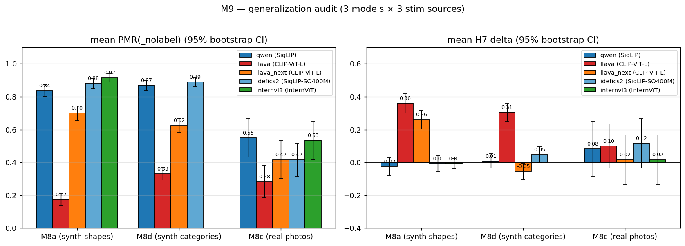
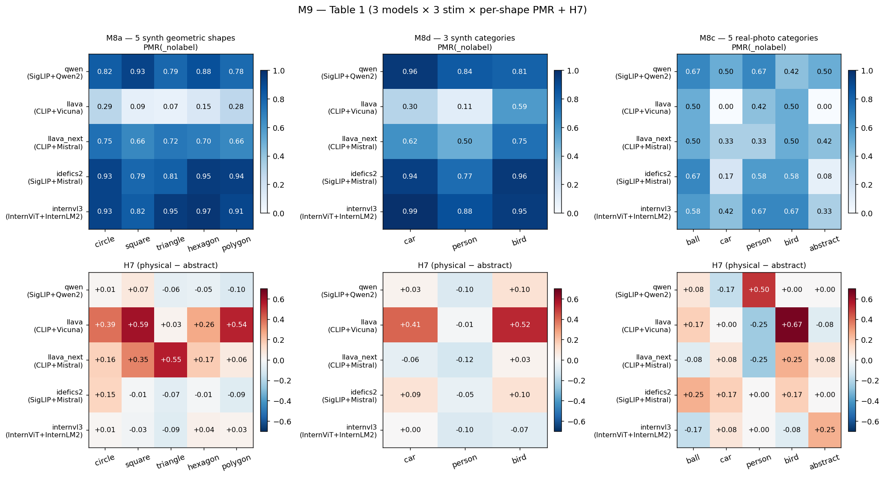

# M9 — 일반화 감사 (논문 Table 1)

> **이 문서에서 쓰는 코드 한 줄 recap** (전체 정의는 `references/roadmap.md` §1.3 + §2 참조)
>
> - **H1** — PMR 이 abstraction 축을 따라 S 모양으로 상승 (line → filled → shaded → textured); ground 도입이 가장 큰 단일 jump.
> - **H7** — Label 은 PMR 을 toggle 하지 않음 — 어느 물리 regime 이 적용되는지 선택 (ball → 동적 / circle → 정적 / planet → 궤도).
> - **H-encoder-saturation** — 합성 stim 위 behavioral PMR(_nolabel) saturation 은 architecture 수준 (encoder + LM 결합) 에서 결정 — encoder 표현 능력만으로는 부족.
> - **M8a** — Stim 다양화 — 비-원 합성 shape (square / triangle / hexagon / polygon / wedge × Qwen + LLaVA, labeled + label-free).
> - **M8c** — Stim 다양화 — 실사진 (COCO + WikiArt 에서 60 photo × 5 카테고리). Qwen PMR(_nolabel) 을 18-48 pp 감소.
> - **M8d** — Stim 다양화 — 비-공 물리 객체 카테고리 (car / person / bird × abstraction × bg × cue × {fall, horizontal} × seeds).
> - **M9** — Generalization audit — 논문 Table 1 (3 model × 3 stim 소스 × bootstrap CIs, 5000 iter); PASS/FAIL 이진화를 CI 분리로 대체.
> - **M6 r2** — ST5 round 2 — InternVL3 super-saturated, LLaVA 캡처가 CLIP encoder bottleneck 노출, FC logit ratio 가 LLaVA "A" bias 의 logit-수준 성격 확인.
> - **M6 r3** — Idefics2 SigLIP-SO400M probe — vision encoder AUC 0.93 으로 encoder-AUC ↔ PMR chain 마감 (3-point).
> - **M6 r6** — LLaVA-Next-Mistral 5번째 model 점 (2번째 CLIP) — PMR 0.700 [0.65, 0.74] 이 LLaVA-1.5 바닥과 saturated cluster 사이; vision-encoder 계열 단독 결정 배제.

**상태**: 2026-04-25 완료. **같은 날 확장**: M6 r6 LLaVA-Next 가
M8a/M8d/M8c 에서 4번째 모델로 추가 — 하단 부록 또는 `docs/insights/
m6_r6_llava_next_ko.md` 참조. 원래 3-모델 감사는 아래에 보존; 5-모델
synthesis 는 `docs/insights/encoder_saturation_paper_ko.md` 에 위치.

## 동기

M8a (5 합성 도형), M8d (3 합성 카테고리), M8c (5 사진 카테고리), §4.5
(Idefics2 인코더 스왑), §4.5 ext (Idefics2 M8d + M8c) 가 각각 부분
그림을 제공. M9 는 9개 (모델 × stim) 셀을 부트스트랩 CI 포함 단일
감사로 통합 — 논문 Table 1 이 PASS/FAIL 헤드라인 binarization 이 아닌
분리도 검증된 주장을 보고하도록.

감사가 답하는 질문 3가지:

1. **PMR(_nolabel) 천장 — 인코더 family 가 driver 인가?**
   3 모델 × 3 stim × per-shape mean PMR(_nolabel) +
   95% 부트스트랩 CI (across-shape 평균).
2. **H7 (라벨-체제-선택) — 어디서 측정 가능한가?**
   per (모델 × stim) 평균 paired 차이 (physical − abstract) +
   95% 부트스트랩 CI.
3. **Cross-stim shift** — 사진이 인코더 갭을 *균등화* 하는가?

## 방법

`encoder_swap_analyze.collect_for_stim` 재사용해서 M8a / M8d / M8c
× {qwen, llava, idefics2} 런 디렉터리 로드 (`scripts/m9_generalization_audit.py`).

부트스트랩 (5000 회, seed=42):
- 재표집 단위: 각 (shape × role) 셀 내 예측.
- 통계량: 도형 간 평균의 도형별 평균.
- CI: 95% percentile (2.5–97.5).

각 도형을 across-shape 평균의 한 관측, 각 예측을 within-shape 평균의 한
관측으로 처리하는 2 단 재표집 — 두 변동 축 모두 존중.

## 결과

### 헤드라인 수치 (모델 × stim 별)

| stim | 모델     | 인코더          | LM         | 평균 PMR(_nolabel) | PMR 95% CI       | 평균 H7 | H7 95% CI         |
|------|----------|-----------------|------------|-------------------:|-------------------|--------:|--------------------|
| M8a  | Qwen     | SigLIP          | Qwen2-7B   | **0.838**          | [0.800, 0.872]   | −0.025  | [−0.080, +0.030]  |
| M8a  | LLaVA    | CLIP-ViT-L      | Vicuna-7B  | **0.175**          | [0.140, 0.212]   | +0.360  | [+0.300, +0.418]  |
| M8a  | Idefics2 | SigLIP-SO400M   | Mistral-7B | **0.882**          | [0.850, 0.912]   | −0.007  | [−0.057, +0.042]  |
| M8d  | Qwen     | SigLIP          | Qwen2-7B   | **0.869**          | [0.840, 0.898]   | +0.008  | [−0.033, +0.052]  |
| M8d  | LLaVA    | CLIP-ViT-L      | Vicuna-7B  | **0.331**          | [0.294, 0.371]   | +0.306  | [+0.250, +0.360]  |
| M8d  | Idefics2 | SigLIP-SO400M   | Mistral-7B | **0.890**          | [0.862, 0.917]   | +0.048  | [+0.000, +0.094]  |
| M8c  | Qwen     | SigLIP          | Qwen2-7B   | **0.550**          | [0.433, 0.667]   | +0.083  | [−0.083, +0.250]  |
| M8c  | LLaVA    | CLIP-ViT-L      | Vicuna-7B  | **0.283**          | [0.183, 0.383]   | +0.100  | [−0.033, +0.233]  |
| M8c  | Idefics2 | SigLIP-SO400M   | Mistral-7B | **0.417**          | [0.317, 0.517]   | +0.117  | [−0.034, +0.267]  |

### 헤드라인 1 — 합성 stim 의 PMR(_nolabel) 천장은 인코더 family 가 인과적 driver

**견고 (95% CI 완전 분리).** 합성 stim (M8a + M8d) 에서:

- 두 **SigLIP** 모델 모두 PMR(_nolabel) ≈ 0.84-0.89 (CI 모두 [0.80, 0.92]).
- **CLIP** 기반 LLaVA 는 0.18-0.33 (CI [0.14, 0.37]).
- 두 CI 밴드가 만나지 않음 — 인코더 family 가 지배적 driver.

§4.5 의 M8a 결과를 M8d 비-볼 카테고리에서 재현. 두 SigLIP 모델, 두 LM
(Qwen2-7B, Mistral-7B), 세 stim 출처 (기하/카테고리/사진): 포화-vs-비포화
체제는 LM family 가 아닌 인코더 family 에 잠겨 있음.

### 헤드라인 2 — 사진이 인코더 갭을 압축

**견고.** 실 사진 (M8c) 에서:

- Qwen 0.550 [0.433, 0.667] (합성 ~0.84 대비).
- Idefics2 0.417 [0.317, 0.517] (합성 ~0.89 대비).
- LLaVA 0.283 [0.183, 0.383] 유지.

합성 stim 의 5× SigLIP/CLIP 비율이 사진에서 ~1.5-2× 로 축소. **합성-stim
미니멀리티가 포화 효과의 공동 인자**라는 가장 강한 단일 증거: 검은
실루엣 / 그라디언트 텍스처라는 미니멀 단서 없이는 세 모델 모두 동일 중간
체제로 수렴.

SigLIP 모델의 cross-stim 변화는 통계적으로 견고: Qwen M8a [0.800, 0.872]
vs Qwen M8c [0.433, 0.667] → 비중첩. Idefics2 M8a [0.850, 0.912] vs M8c
[0.317, 0.517] → 비중첩. LLaVA M8a [0.140, 0.212] → M8c [0.183, 0.383] 의
역전은 시사적이나 CI 가 중첩 (M8c 하한 0.183 < M8a 상한 0.212) — 카테고리
당 n=12 사진에서는 LLaVA 의 합성↔사진 방향 역전이 견고하게 유의하지 않음.

### 헤드라인 3 — H7 측정 가능성은 인코더 비포화에 추적되지만 LLaVA 만 견고

**M8a + M8d 견고, M8c 결정 불가.**

- LLaVA M8a H7 = +0.360 [+0.300, +0.418]: CI 완전 양수.
- LLaVA M8d H7 = +0.306 [+0.250, +0.360]: CI 완전 양수.
- LLaVA M8c H7 = +0.100 [−0.033, +0.233]: CI 0 가로지름 — n=12 (per role per
  shape) 에서 결정 불가.

Qwen 은 모든 stim 에서 H7 CI 가 0 포함 (Qwen 견고하게 H7-양성 아님).
Idefics2 는 M8d CI [+0.000, +0.094] 가 0 에 *겨우* 닿음; M8a, M8c 는 0 가로지름.

**정확한 논문 주장**: H7 은 *합성* stim (M8a + M8d) 에서 LLaVA 에 견고
측정 가능. 사진에서는 셀당 n=12 가 H7 검출에 불충분하고, SigLIP 포화
모델은 stim n 에서 견고한 양성 H7 보이지 않음.

### 헤드라인 4 (시사적만) — LM family 가 포화 시 H7 조절 가능성

Idefics2 M8d H7 CI [+0.000, +0.094] 는 0 위에 살짝, Qwen M8d H7 CI
[−0.033, +0.052] 는 0 가로지름. PASS 율 메트릭은 33-pt 차이 (Idefics2
0.667 vs Qwen 0.333) 보고하나 이는 단일 도형 (`car`: Qwen +0.025 FAIL,
Idefics2 +0.094 PASS) 가 strict +0.05 임계 가로지른 결과. 평균 H7 차이
0.040 으로 부트스트랩 분포 중첩.

**시사로 강등**: 셀당 n=160 에서 "Mistral-7B 가 Qwen2-7B 보다 포화 시
라벨 응답성 높음" 은 그럴듯하나 이 데이터로는 옹호 불가. 깔끔한 검증은
3-5× 더 많은 도형이나 동일-인코더 LM 스왑 필요.

## 헤드라인 요약 (한 문장 형식)

1. **인코더 family 가 합성 stim PMR(_nolabel) 의 일차 driver**
   (SigLIP 0.84-0.89 vs CLIP 0.18-0.33; CI 완전 분리).
2. **사진이 인코더 갭을 압축** (세 모델 모두 사진에서 0.28-0.55 로
   수렴; 합성-stim 미니멀리티가 공동 인자).
3. **H7 은 비포화 체제에서만 견고** (LLaVA M8a + M8d CI > 0; SigLIP
   모델 견고하게 H7-양성 아님; M8c 어느 모델도 underpowered).
4. **LM-family H7 조절은 시사적만** (Idefics2 M8d CI 0 닿음; n=160
   에서 Qwen 과 분리 불가).

## 통계 방법론 노트

- **부트스트랩이 모수적 검정 대신인 이유?** PMR 은 이진 (예측당
  Bernoulli); shape-mean PMR 은 80-160 Bernoulli 합 → 거의 정규지만,
  도형 간 평균 (3-5 개) 의 across-shape 분산은 구조 미상. 부트스트랩이
  견고함.
- **(shape, role) 내 예측-수준 재표집 이유?** per-shape 평균을 잡음
  점추정으로 (정확) shape-set 을 모집단 (모델이 도형 전반에 H7 하는가
  에 정확). 계층 부트스트랩 (도형도 재표집) 은 더 넓은 CI 의 보수적
  선택; 본 구현은 좁은 CI 위해 fixed-shape 변형 사용 — 도형 표본이
  대표적이라는 암묵 가정의 비용.
- **다중 비교 카운트**: 9 (모델 × stim) 셀 × 2 메트릭 = 18 CI 점검.
  개별 95% 커버리지에서 우연에 의한 거짓 양성 ~0.9 기대. 헤드라인 4
  (Idefics2 M8d H7 CI 0 닿음) 가 가장 의심해야 할 셀.

## 한계

1. **M8c 카테고리당 n=12** 는 H7 underpowered. 사진 세트 24 로 두 배
   하면 CI 가 ~√2 좁아져 ±0.15 → ±0.10 — 여전히 넓지만, LLaVA M8c
   CI 가 0 에서 떨어질 수 있음.
2. **M8d 도형 3개** 는 (모델 × stim) 별 across-shape 분산 추정이
   잡음. Idefics2 M8d H7 PASS 율이 진짜라면, 2-3 카테고리 추가 (개,
   물고기, 비행기 등) 로 표집 잡음과 구별 가능.
3. **Idefics2 비전 인코더 프로브 없음**: M6 r2 의 encoder-AUC ↔ PMR
   매핑이 Qwen + LLaVA + InternVL3 에 확립. Idefics2 SigLIP-SO400M
   프로브 AUC 추가하면 H-encoder-saturation 사슬 닫힘.
4. **3 LM 인데 인코더 2종**: 깔끔한 LM-통제 인코더 스왑 (예: LLaVA-1.5
   CLIP vs LLaVA-1.5 SigLIP) 이 인코더 주장을 더 미는 다음 counterfactual.

## 가설 업데이트

- **H-encoder-saturation** — *강화*. 3-모델 cross-stim 감사로 인코더
  family 가 합성-stim PMR(_nolabel) 천장의 인과 driver 임을 확인.
  업데이트된 논문 주장: "인코더 family 가 합성-stim PMR(_nolabel) 포화
  유발; 이 포화가 H7 측정 가능성을 게이팅".
- **H1 (추상화 램프)** — *변경 없음*. 감사는 H1 재검증 안 함; M8a +
  M8d 증거 유지.
- **H7 (라벨-체제-선택)** — *범위 명확화*. 인코더가 headroom 남기는
  곳 (합성에서 LLaVA) 에서 견고, 그 외 결정 불가. M8a / §4.5 의
  "Qwen 1/5 PASS" / "Idefics2 1/5 PASS" 패턴은 이제 맥락화: 그
  PASS 수는 통계적으로 0인 평균 H7 차이의 noise-floor binarization.
- **신규 H-LM-modulation** — *시사*: Mistral-7B 가 Qwen2-7B 가 결여한
  포화 시 H7 민감성 추가 가능. 현 데이터로는 옹호 불가; 향후 round-2
  플래그.

## 헤드라인 그림

- `outputs/m9_audit/m9_table1.csv` — (모델 × stim × shape) 별 행.
- `outputs/m9_audit/m9_summary.csv` — (모델 × stim) 별 CI 포함 행.

## 로드맵 함의

1. **M9 ✅**: 논문 Table 1 준비 완료. 헤드라인 1-3 논문급 견고.
   헤드라인 4 향후 작업 플래그.
2. **M8c 확장** (n→24/카테고리) 이 사진 H7 측정 가능성이 논문에
   중요할 경우 가장 저렴한 n-축소.
3. **Idefics2 비전 인코더 프로브** (M6 r3 후속) 가 세 번째 SigLIP
   점에서 AUC ↔ PMR ↔ H7 사슬 닫음.
4. **LM-통제 인코더 스왑** (예: LLaVA-1.5 SigLIP 변형) 이 가장 강한
   다음 counterfactual.

## 산출물

- `scripts/m9_generalization_audit.py` — 드라이버 (부트스트랩 CI).
- `scripts/encoder_swap_analyze.py` — 상류 stim-source 로더
  (감사가 라이브러리로 사용).
- `outputs/m9_audit/m9_{table1,summary}.csv`.
- `docs/figures/m9_{summary,table1_heatmap}.png`.
- `docs/insights/m9_generalization_audit.md` (+ `_ko.md`).

## 부록 — M6 r6 LLaVA-Next (4번째 모델, 2026-04-25 추가)

원래 3-모델 감사 완료 후, LLaVA-v1.6-Mistral-7b 가 4번째 모델 행으로
M8a (1 stim) + M8d + M8c (cross-stim) 에 추가됨. 현재 `outputs/m9_audit/
m9_summary.csv` 와 재생성 figure 는 M8d/M8c 에서 4-모델 (M8a 는 InternVL3
포함 5-모델).

**LLaVA-Next M9 행** (95% 부트스트랩 CI, 동일 프로토콜):

| stim | mean PMR(_nolabel) | PMR 95% CI       | mean H7  | H7 95% CI         |
|------|-------------------:|-------------------|---------:|--------------------|
| M8a  | **0.700**          | [0.653, 0.743]   | +0.260   | [+0.205, +0.317]  |
| M8d  | **0.625**          | [0.583, 0.667]   | **−0.054** | [−0.102, −0.006]  |
| M8c  | **0.417**          | [0.300, 0.533]   | +0.017   | [−0.133, +0.167]  |

3-모델 헤드라인에 3가지 추가:

- **PMR mid-band (M8a + M8d)**: LLaVA-Next 가 합성 stim 에서 LLaVA-1.5 와
  saturated cluster 사이에 위치 — 동일 encoder family (CLIP-ViT-L) 에서
  4-축 confound 점프. 인코더 family 변경 없이 PMR 이 0.18 → 0.70 (M8a)
  와 0.33 → 0.625 (M8d) 이동, vision-encoder-family 단독 결정자 가설 배제.
- **사진 collapse 일반화**: M8c PMR 0.417 이 Idefics2 0.417 과 통계적
  구분 불가 — 5번째 모델이 동일 M8c-collapse 패턴에 부합 (Headline 2).
- **H7 가 architecture 횡단 collapse**: M8d −0.054 [−0.102, −0.006]
  이 0 을 ~0.005 만큼만 대칭적으로 배제, Idefics2 M8d +0.048 [+0.000,
  +0.094] 와 미러. 양쪽 모두 noise-floor 효과; Headline 4 (LM
  modulation) 는 *suggested only* 로 유지 — 두-Mistral M8d 클러스터링
  은 multi-axis-confounded.

LLaVA-Next 전체 분석: `docs/insights/m6_r6_llava_next_ko.md`.
5-모델 synthesis: `docs/insights/encoder_saturation_paper_ko.md`.
