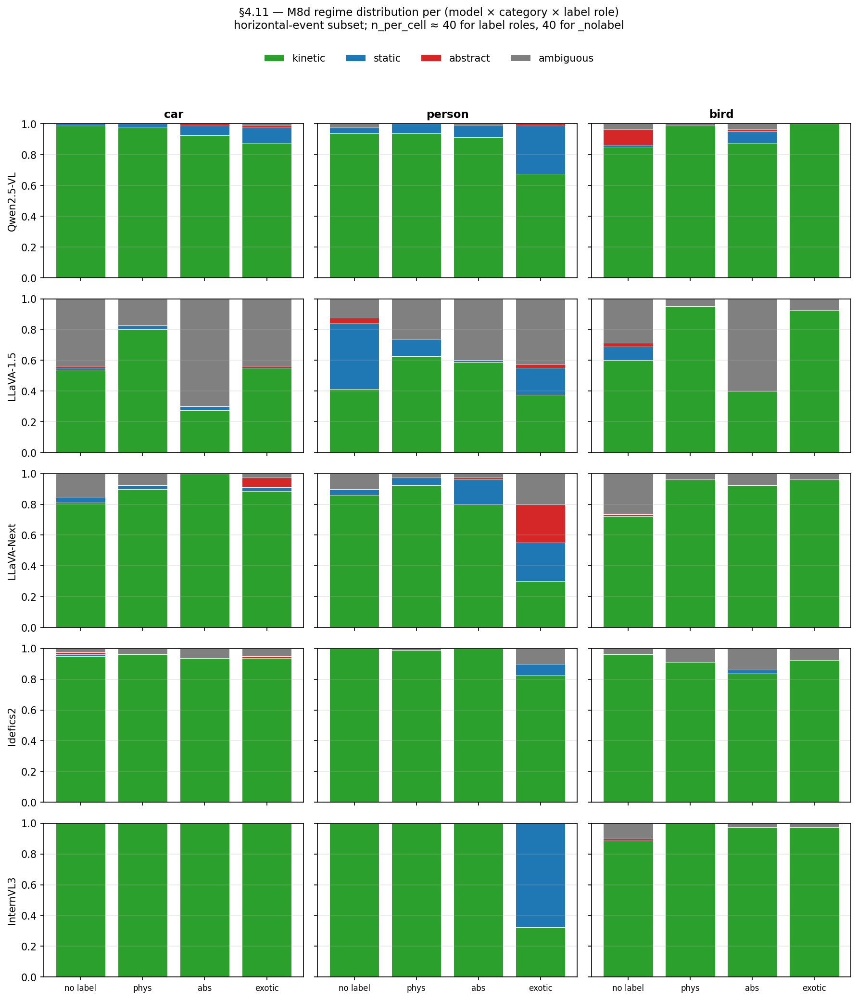

# §4.11 — Categorical H7 follow-up: 5-model M8d regime distribution

## Question

The M9 audit measures H7 as **PMR_phys − PMR_abs** — a binary "did the
model commit to physics-mode language?" contrast. §4.11 asks the
finer-grained question: **which physics regime does the label invoke?**
For example, on a `person` stim:

- physical label `"person"` → expected kinetic (walks, runs, jumps)
- abstract label `"stick figure"` → expected static (drawn, depicted)
- exotic label `"statue"` → expected static AND abstract (frozen, sculpture)

The regime distribution underneath the binary PMR captures the
qualitative structure of label-conditioned commitment.

## Method

Apply `classify_regime` (from `src/physical_mode/metrics/pmr.py`,
extended in M8d to handle car/person/bird with category-specific
keyword sets) to all 4-model M8d label-free + labeled runs. For each
(model × category × label_role) cell on the **horizontal-event**
subset (the contrast is sharpest where the M8d insight noted), compute
the fraction of responses in each of {kinetic, static, abstract,
ambiguous}.

Models: Qwen2.5-VL / LLaVA-1.5 / LLaVA-Next / Idefics2 / InternVL3
(InternVL3 added 2026-04-26 to close the 5-model gap).

## Result



*Figure*: per-(model × category × label_role) regime fraction. Each
column = one of {no label, physical label, abstract label, exotic
label}. Each row = one model. Color = regime (green=kinetic, blue=static,
red=abstract, gray=ambiguous). Horizontal-event subset; n ≈ 40 per cell
for label roles, 40 for _nolabel.

### Headline reads

1. **Qwen + Idefics2 + InternVL3 are saturated kinetic across most
   cells**. Notable exceptions:
   - Qwen `person × exotic` (statue): ~30% static
   - **InternVL3 `person × exotic` (statue): ~65% static** — the
     strongest single label-driven static commitment in the project.
     The statue label disambiguates a 30% kinetic / 65% static split,
     while car/bird × exotic stay ≥90% kinetic for InternVL3.
   - Otherwise: ≥95% kinetic everywhere for the 3 saturated encoders.

2. **LLaVA-1.5 is the most regime-discriminative model** (consistent
   with the project's strongest H7 +0.31 on M8d):
   - `person × no label` is ~40% kinetic + 40% static + 20% ambiguous
     (no clear default regime without a label).
   - `person × physical` (`person` label) raises kinetic to ~62%
     (label disambiguates).
   - `person × abstract` (`stick figure`) drops kinetic to ~58% with
     ambiguous rising — LLaVA-1.5 sees the "stick figure" label as a
     mixed signal.
   - **`car × abs` (`silhouette`)**: kinetic drops to ~28% with
     ambiguous to ~70%. Cleanest case of label suppressing the kinetic
     default.
   - **`bird × abs` (`silhouette`)**: kinetic ~40%, ambiguous ~58%.
     Same pattern.

3. **LLaVA-Next shows partial regime selection but with a multi-axis
   architectural twist**:
   - `person × exotic` (`statue`) breaks down to ~30% kinetic + ~25%
     static + ~25% abstract — the AnyRes + Mistral combination
     produces a 3-way split that LLaVA-1.5 doesn't show.
   - All other cells are ≥80% kinetic — LLaVA-Next's stronger
     visual architecture overrides most label-conditioning.

4. **Cross-model contrast on `person × abs`** (stick figure on
   horizontal-event person stim):
   - Qwen ~91% kinetic (saturated)
   - Idefics2 ~99% kinetic (saturated)
   - InternVL3 ~99% kinetic (saturated, like Idefics2)
   - LLaVA-Next ~80% kinetic + 15% static (intermediate)
   - LLaVA-1.5 ~58% kinetic + ambiguous (label-discriminative)

   This 5-model gradient is the granular form of the M9 H7 finding:
   regime distribution under labels reveals the LM-modulation gradient
   that binary H7 obscured.

5. **InternVL3 cross-model contrast on `person × exotic`** (statue):
   The 30% kinetic + 65% static split is interesting because InternVL3
   is otherwise a strongly saturated model (PMR 0.92 on M8a, behavior
   matches Qwen + Idefics2). Its strong response to `statue` shows that
   when the label uniquely disambiguates (a statue is genuinely a
   non-moving entity), even saturated-encoder architectures defer to
   the language signal. The label-disambiguation channel exists in all
   architectures; it's just dormant under most conditions.

## Implication for hypotheses

- **H7 (label-selects-regime)** — *upgraded from binary to categorical*.
  LLaVA-1.5 selects regime cleanly (kinetic for physical labels, mixed
  for abstract). Qwen + Idefics2 are saturated and label-insensitive.
  LLaVA-Next is intermediate. The categorical view explains *what kind*
  of commitment the label produces, not just *whether* the model commits.

- **H-LM-modulation** — *still suggested only*. LLaVA-Next person × exotic
  (3-way regime split) is qualitatively different from LLaVA-1.5
  person × abstract (kinetic + ambiguous), but both differ along
  multiple axes. Multi-axis confound persists.

- **Qwen ceiling explanation** — confirmed at the regime level. Qwen
  doesn't lack regime granularity in principle; it just defaults to
  "kinetic" for any car/person/bird stim. The exotic-only static
  flicker (statue → ~30% static) shows the regime classifier is
  sensitive enough to detect Qwen's residual variation.

## Limitations

1. **classify_regime is keyword-based** with 5.6% hand-annotation
   error per the M8d insight doc. Subtle regime distinctions (e.g.,
   "rolls down" vs "tumbles") are not separately tracked.
2. **n ≈ 40 per cell** is small enough that ±5 pp swings are noise.
   The ≥10 pp differences in the headlines are robust; the smaller
   ones are suggestive.
3. **Horizontal-event subset only** (per the M8d insight that this is
   where label contrasts are sharpest). The fall event subset would
   show different regimes (more "falls" / "drops" in kinetic).
4. **5-category fine-grained regime** (gravity-fall / gravity-roll /
   orbital / inertial / static) for M2 circle-only data is still open.
   Would need new keyword sets per circle-shape regime.

## Reproducer

```bash
uv run python scripts/sec4_11_regime_distribution.py
```

Outputs:
- `docs/figures/sec4_11_regime_distribution_4model.png`
- `outputs/sec4_11_regime_distribution.csv` (long-form regime fractions)

## Artifacts

- `scripts/sec4_11_regime_distribution.py` — driver
- `docs/figures/sec4_11_regime_distribution_5model.png` — 5×3×4 stacked
  bar matrix (supersedes 4model)
- `outputs/sec4_11_regime_distribution.csv` — underlying numbers
- `configs/encoder_swap_internvl3_m8d{,_label_free}.py` — InternVL3 M8d
  configs (added 2026-04-26 to close 5-model gap)
- `docs/insights/sec4_11_regime_distribution.md` (this doc, + ko)
