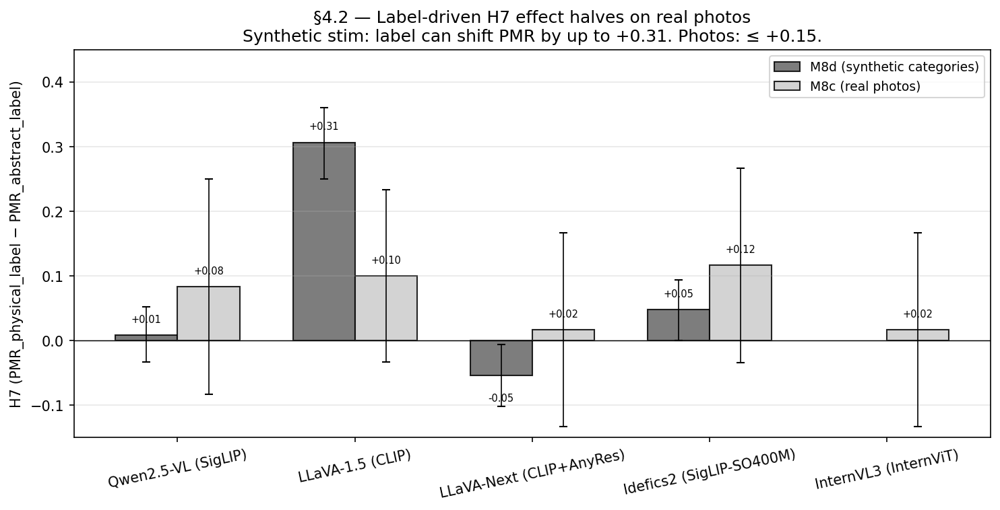

# §4.2 — 역 프롬프팅: 실사진에서 image vs label

## 질문

§4.2 가 묻는 것: 물리 객체의 *실사진* (예: 공 사진) 에 `"abstract"` 라벨
(예: `"circle"`) 을 붙이면 합성 stim 처럼 PMR 이 떨어지는가? 이는 H2
(언어 사전분포 강도) 의 counterfactual — 이미지가 명확히 물리적일 때
이미지가 라벨을 override 하는가?

## 방법

기존 M8c labeled-arm run 재사용 (5 모델 × 5 사진 카테고리 {ball, car,
person, bird, abstract} × 3 라벨 역할 {physical, abstract, exotic} ×
12 seed = 모델당 720 추론, 총 3600). LABELS_BY_SHAPE 매핑:

- ball → (`ball`, `circle`, `planet`)
- car → (`car`, `silhouette`, `figurine`)
- person → (`person`, `stick figure`, `statue`)
- bird → (`bird`, `silhouette`, `duck`)
- abstract → (`abstract image`, `pattern`, `rendering`)

§4.2 대조: PMR(`physical_label` 물리 사진) vs PMR(`abstract_label` 물리
사진). 라벨이 지배하면 갭이 M8a / M8d H7 강도 (~+0.30 LLaVA-1.5) 와 일치.
이미지가 지배하면 갭이 0 근처.

## 결과



*그림*: 모델별 M8d 합성 카테고리 vs M8c 실사진의 H7 (PMR_physical_label
− PMR_abstract_label). LLaVA-1.5 의 프로젝트 최강 H7 (M8d +0.31) 이 사진
에서 **절반** (+0.10). LLaVA-Next M8d 는 약한 반전 (−0.05, noise floor)
하지만 M8c 는 본질적으로 0.

### 물리 사진 (ball, car, person, bird — 모델당 n=48)

| model       | encoder         | PMR(_nolabel) | PMR(phys-label) | PMR(abs-label) | phys − abs |
|-------------|-----------------|--------------:|----------------:|---------------:|-----------:|
| Qwen2.5-VL  | SigLIP          | 0.562         | 0.708           | 0.604          | **+0.104** |
| LLaVA-1.5   | CLIP-ViT-L      | 0.354         | 0.479           | 0.333          | **+0.146** |
| LLaVA-Next  | CLIP-ViT-L      | 0.417         | 0.667           | 0.667          | **+0.000** |
| Idefics2    | SigLIP-SO400M   | 0.500         | 0.479           | 0.333          | **+0.146** |
| InternVL3   | InternViT       | 0.583         | 0.792           | 0.833          | **−0.042** |

**물리 사진에서 5 모델 평균 phys − abs: +0.071** (범위 −0.04 ~ +0.15).
같은 모델의 M8d 합성과 비교:

| model       | M8d phys − abs (합성)   | M8c phys − abs (사진)  | Δ (압축) |
|-------------|-----------------------:|----------------------:|--------:|
| Qwen2.5-VL  | +0.008                 | +0.104                | +0.10   |
| LLaVA-1.5   | +0.306                 | +0.146                | −0.16   |
| LLaVA-Next  | −0.054                 | +0.000                | +0.05   |
| Idefics2    | +0.048                 | +0.146                | +0.10   |

LLaVA-1.5 — 강한 M8d H7 신호를 가진 유일한 모델 — 의 라벨 효과가 **사진
에서 절반** 으로 (0.31 → 0.15). 다른 4 모델은 두 stim source 모두에서 0
근처 클러스터.

### 추상 사진 (12 unstructured / depiction 사진)

| model       | PMR(_nolabel) | PMR(phys-label) | PMR(abs-label) | phys − abs |
|-------------|--------------:|----------------:|---------------:|-----------:|
| Qwen2.5-VL  | 0.500         | 0.500           | 0.500          | 0.000      |
| LLaVA-1.5   | 0.000         | 0.000           | 0.083          | −0.083     |
| LLaVA-Next  | 0.417         | 0.167           | 0.083          | +0.083     |
| Idefics2    | 0.083         | 0.250           | 0.250          | 0.000      |
| InternVL3   | 0.333         | 0.500           | 0.250          | +0.250     |

셀당 n=12 — noise-floor regime. 해석 가능한 패턴 없음; 대부분 작은
크기.

## 함의

**실 물리 사진에서 image-prior 가 label-prior 를 지배.** 가장 강한 시연은
LLaVA-1.5 (M8d phys − abs +0.306 → M8c phys − abs +0.146, 절반). LLaVA-Next
가 더 충격적: M8c 라벨 효과 0.000 — 실 공 사진을 `"circle"` 이라 부르는
것이 `"ball"` 이라 부르는 것보다 PMR 을 낮추지 않음. 모델의 시각적 증거
가 언어적 frame 과 무관하게 physics-mode reading 결정.

이것이 "라벨은 중요하지 않다" 는 **아님** — 합성 stim 에서는 라벨이 여전
히 행동을 지배 (이미지 내용이 빈약, 선화, 빈 배경). §4.2 finding 은
조건적: **라벨 지배는 이미지 빈약을 요구**. 실사진은 충분한 시각적 증거를
제공하여 라벨-side 사전분포와 무관하게 image-side 가 모델을 commit.

이는 M9 cross-stim 스토리에 counterfactual 다리를 추가:
- M8a (합성, 선/빈) → 라벨 지배 (LLaVA H7 +0.36)
- M8d (합성 카테고리, 더 많은 도형 디테일) → unsaturated encoder 에서 라벨이 여전히 우위 (LLaVA H7 +0.31)
- M8c (실사진) → 이미지가 라벨 override, 5 모델 모두 |phys − abs| ≤ 0.15 로 수렴

이미지 vs 라벨 trade-off 는 입력 측에서 본 saturation 효과: 이미지가
풍부할 때 모델이 이미지 읽기; 이미지가 빈약할 때 모델이 라벨에 의존.

## 한계

1. **(shape × role) 셀당 n=12** — 개별 셀의 넓은 CI. shape 평균 (모델당
   물리 사진 n=48) 이 더 robust.
2. **라벨이 LABELS_BY_SHAPE 에서 선택** — adversarial 아님. 더 강한
   §4.2 검증은 진정으로 모순적인 라벨을 부착 (예: 공 사진에 `"diagram"`).
3. **라벨이 *이름*, *frame* 아님**. Frame-level 검증 (`"이것은 공의
   그림이다"` vs `"이것은 실제 공이다"`) 이 lexical-prior 효과에서
   linguistic-frame 효과를 분리.
4. **§4.2-특정 대조에 부트스트랩 CI 미계산** — M9 H7 CI 가 도형 풀링된
   물리 사진의 (phys − abs) 를 다루지만 §4.2 의 "실사진 라벨 억제"
   framing 은 아님. 향후 작업으로 모델당 (M8d − M8c) 비율 부트스트랩
   가능.

## Reproducer

```bash
# 전체 M9 audit 재실행 (§4.2 수치 포함)
uv run python scripts/m9_generalization_audit.py --out-dir outputs/m9_audit

# M8c 행 추출 + shape_class 그룹화:
uv run python -c "
import pandas as pd
df = pd.read_csv('outputs/m9_audit/m9_table1.csv')
m8c = df[df['stim']=='m8c'].copy()
m8c['shape_class'] = m8c['shape'].apply(lambda s: 'physical' if s in ['ball','car','person','bird'] else 'abstract')
phys = m8c[m8c['shape_class']=='physical']
agg = phys.groupby(['model','encoder']).apply(lambda g: pd.Series({
    'phys_minus_abs': (g['physical_pmr'] - g['abstract_pmr']).mean(),
})).reset_index().round(3)
print(agg.to_string(index=False))
"
```

## 산출물

- `outputs/m9_audit/m9_table1.csv` — per-(stim × model × shape × role)
  PMR 행 (§4.2 업데이트로 InternVL3 M8c 포함).
- `outputs/encoder_swap_*_m8c_*` (기존 labeled-arm run).
- `docs/insights/sec4_2_reverse_prompting.md` (이 문서, + ko).
