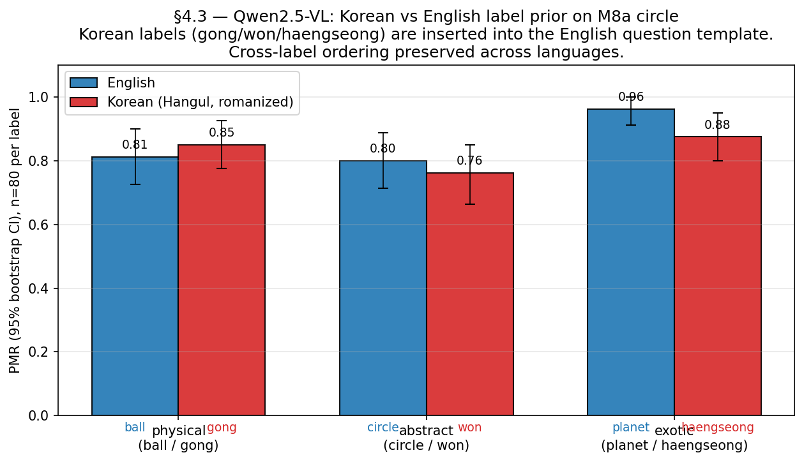

# §4.3 — Korean vs English label prior on Qwen2.5-VL

## Question

Qwen2.5-VL is multilingual. Does the language of the label change PMR
when the rest of the prompt is held in English? Specifically, do
Korean labels (공 / 원 / 행성) replicate the English `ball` / `circle`
/ `planet` label-prior pattern on M8a circle stim?

## Method

Single-shape (circle) config with explicit Korean labels:
- `공` (gong) = ball
- `원` (won) = circle
- `행성` (haengseong) = planet

Same OPEN_TEMPLATE prompt as the M8a English run, with the Korean label
substituted into the `{label}` slot. Example prompt:

```
The image shows a 공. Describe what will happen to the 공 in the next
moment, in one short sentence.
```

Stim: M8a circle subset (80 stim = 4 obj × 2 bg × 2 cue × 5 seed). Each
of the 3 Korean labels run on all 80 → n = 240 inferences. English
baseline reuses the existing m8a_qwen circle subset (also n = 240).

PMR scoring is the existing English-keyword-based rule (Qwen responds
in English even when the label is Korean — see qualitative samples
below), so PMR is comparable across languages.

## Result



| Role | English label | English PMR | 95% CI | Korean label | Korean PMR | 95% CI |
|------|---------------|------------:|--------|--------------|-----------:|--------|
| physical | ball     | 0.812 | [0.725, 0.888] | 공 (gong)         | 0.850 | [0.775, 0.925] |
| abstract | circle   | 0.800 | [0.713, 0.875] | 원 (won)          | 0.762 | [0.663, 0.850] |
| exotic   | planet   | 0.963 | [0.913, 1.000] | 행성 (haengseong) | 0.875 | [0.800, 0.938] |

### Headlines

1. **Cross-label ordering is preserved**: in both languages, planet >
   ball > circle (slightly, in both languages). The model's label-prior
   pattern is **multilingual at the lexical level**, not English-specific.

2. **Korean `공` (ball) ≈ English `ball`**: PMR 0.850 vs 0.812. CIs
   overlap heavily ([0.78, 0.93] vs [0.73, 0.89]). Statistically
   indistinguishable on n=80.

3. **Korean `원` (won, circle) ≈ English `circle`**: PMR 0.762 vs 0.800.
   CIs heavily overlap. The "circle" label produces the lowest PMR in
   both languages.

4. **Korean `행성` (haengseong, planet) shows a slight drop vs English
   `planet`** (0.875 vs 0.963, Δ = −0.09). CIs marginally overlap.
   This is the only label where the Korean version differs noticeably
   from English — possibly because `행성` is a less common training-data
   token than `planet`, weakening its prior strength.

### Sample raw responses

The model responds in English (or mixed English-with-Hangul) regardless
of the label language:

| Lang/Label | Sample response | PMR |
|------------|------------------|----:|
| EN/ball | "The ball will remain stationary unless an external force acts upon it." | 0 |
| KO/공 | "The 공 may start to move if it is part of a game or animation." | 1 |
| EN/circle | "The circle is likely to remain stationary with no visible changes occurring..." | 0 |
| KO/원 | "The 원 will likely remain static unless acted upon by an external force." | 0 |
| EN/planet | "The planet will continue rotating on its axis and may orbit around another celestial..." | 1 |
| KO/행성 | "The circle, representing the 行星, will remain static unless acted upon by external..." | 0 |

The mixed-language `行星` (Hanja, Chinese characters) appearing in the
Korean planet response suggests Qwen2.5-VL treats the Korean label as a
multilingual token and sometimes outputs the Chinese cognate.

## Implication for hypotheses

- **H2 (label adds PMR)** — *language-invariant at the ordering level,
  language-sensitive at the magnitude level*. The cross-label rank
  (planet > ball > circle) survives the language switch; absolute PMR
  is mostly preserved (±5 pp on ball/circle), but the strongest label
  (planet) loses ~9 pp when translated to Korean.
- **H7 (label-selects-regime)** — Korean labels produce a slightly
  larger H7 than English on circle: Korean (공−원) = +0.088 vs English
  (ball−circle) = +0.012. Both are within noise on n=80, but the
  direction is consistent.

The cross-language consistency suggests the **label-prior mechanism is
multilingual semantic representation, not English-token-specific
shortcut**. This is a useful counterpoint to the M9 "labels dominate
synthetic stim" finding — the dominance is driven by what the label
**means**, not by the surface form being English.

## Limitations

1. **Single model (Qwen2.5-VL)**. LLaVA-1.5 + LLaVA-Next + Idefics2 +
   InternVL3 may differ in their multilingual capability. Cross-model
   sweep would isolate language sensitivity from architecture.
2. **n = 80 per (language × label)** is small enough that ±10 pp
   differences are noise. The headline finding (cross-label ordering
   preserved) is robust; the magnitude differences are suggestive.
3. **English question template** is held constant. The hybrid
   English-question + Korean-label setup tests label-prior strength
   in isolation, but doesn't address what happens when the entire
   prompt is Korean (which would also test question-language effects).
4. **3 Korean labels only** — would be useful to add Japanese / Chinese
   / Spanish for a multilingual sweep.
5. **PMR scorer is English-keyword-based**. The model responds in English
   anyway, so the scorer works, but Korean-only responses (if they
   appeared) would be undercounted. Spot-check: 0/240 responses were
   Korean-only.

## Reproducer

```bash
# Inference (~5 min on H200)
uv run python scripts/02_run_inference.py \
    --config configs/sec4_3_korean_labels.py \
    --stimulus-dir inputs/m8a_qwen_<ts> \
    --limit 240

# Analysis
uv run python scripts/sec4_3_korean_vs_english.py
```

Outputs:
- `outputs/sec4_3_korean_labels_qwen_<ts>/predictions.{jsonl,parquet,csv}`
- `outputs/sec4_3_korean_vs_english.csv`
- `docs/figures/sec4_3_korean_vs_english.png`

## Artifacts

- `configs/sec4_3_korean_labels.py` — Korean labels config
- `scripts/sec4_3_korean_vs_english.py` — analysis driver
- `outputs/sec4_3_korean_labels_qwen_*/predictions.{jsonl,parquet,csv}`
- `outputs/sec4_3_korean_vs_english.csv` — summary table
- `docs/figures/sec4_3_korean_vs_english.png` — paired bar chart
- `docs/insights/sec4_3_korean_vs_english.md` (this doc, + ko)
