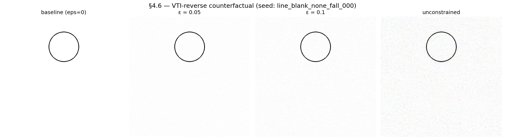
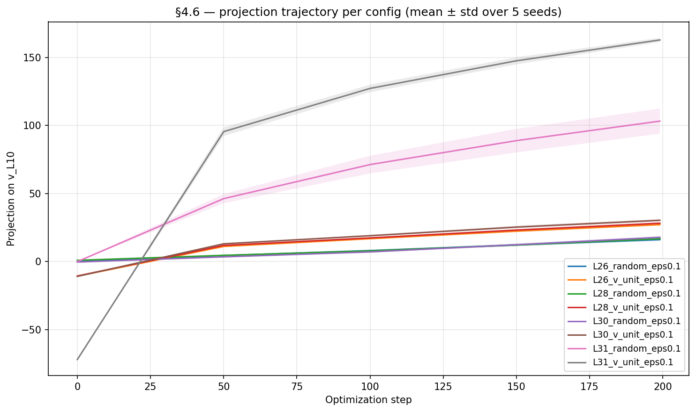

# §4.6 — VTI-reverse counterfactual stim (pixel-space gradient ascent on v_L10)

> **Recap of codes used in this doc** (one-line each; full definitions in `references/roadmap.md` §1.3 + §2)
>
> - **H7** — The label does not toggle PMR — it selects which physics regime applies (ball → kinetic / circle → static / planet → orbital).
> - **H-direction-specificity** — Pixel-space gradient ascent along v_L10 flips PMR on Qwen2.5-VL; matched-magnitude random directions do not (§4.6).
> - **H-shortcut** — Shortcut interpretation is encodable in the image itself (§4.6) — pixel-driven, not just at runtime hidden-state injection.
> - **M5a** — ST4 VTI steering — adding +α·v_L10 at LM L10 over visual tokens flips line/blank/none from "stays still" → physics-mode.
> - **M9** — Generalization audit — paper Table 1 (3 models × 3 stim sources × bootstrap CIs, 5000 iters); replaces PASS/FAIL binarization with CI separation.
> - **v_L10** — Steering direction in LM hidden space (dim 3584) at layer 10, derived from M5a class-mean diff (physics − abstract). Unit norm.

## Question

M5a established that adding `+α · v_L10` at LM layer 10 over visual
tokens steers Qwen2.5-VL's output between "abstract" and "physical"
regimes. §4.6 asks the inverse question: can we **synthesize a pixel-
space perturbation** of the baseline circle stim such that, *without*
runtime steering, the model's L10 hidden state at visual tokens
projects onto `v_L10` strongly enough to flip its prediction from
"circle stays static" → "circle falls"?

If yes, this is direct evidence that **shortcut interpretation is
purely pixel-driven** (no runtime intervention required) — i.e. the
shortcut is a property of *what features the model extracts from the
image*, not of how the LM happens to integrate text and vision tokens
at inference time.

## Method

**Target.** Maximize `<mean(h_L10[visual]), v_L10>` where `h_L10` is
the LM hidden state at layer 10 (post-layernorm), `[visual]` selects
visual-token positions, and `v_L10` is the M5a unit-norm steering
direction (`v_unit_10` from `outputs/mvp_full_20260424-094103_8ae1fa3d/
probing_steering/steering_vectors.npz`, dim 3584).

**Variable.** Qwen2.5-VL post-processor `pixel_values`, a float tensor
of shape `(T_patches, 1176)` where `1176 = 2·3·14·14` (temporal_patch
× channels × patch × patch). For a single 504×504 image,
`T_patches = 1296`. Optimizing here bypasses the non-differentiable
PIL → patch preprocessing and is the smallest representation that
still recovers a viewable RGB image (via inverse permute + de-norm —
see `src/physical_mode/synthesis/counterfactual.py:reconstruct_pil`).

**Optimizer.** Adam, lr=1e-2, n_steps=200. The float32 leaf is cast to
bf16 in the forward pass; the Qwen2.5-VL vision tower → projector → LM
0..10 path is differentiable end-to-end (Phase 1 gate confirmed
gradient max_abs = 13.75 with no NaNs).

**Configurations.** All run on 5 baseline circle stim
(`line_blank_none_fall_{000..004}.png` from `inputs/mvp_full_*`):

| Mode | ε bound | Target direction | Purpose |
|------|---------|-------------------|---------|
| bounded | 0.05 | `v_L10` | small-perturbation flip test |
| bounded | 0.1  | `v_L10` | medium-perturbation comparison |
| bounded | 0.2  | `v_L10` | large-perturbation comparison |
| unconstrained | — | `v_L10` | upper-bound on what the path can produce |
| bounded | 0.1 | random unit dir × 3 seeds | direction-specificity falsification |

`bounded` clips `pv − pv_initial` to `[-eps, +eps]` after every Adam
step. Random directions are drawn from a unit sphere of the same
hidden dim (3584) and applied at `ε = 0.1` to match the most
permissive `v_L10` bound.

**Inference.** After optimization, the synthesized `pixel_values` is
`reconstruct_pil`'d back to a 504×504 RGB image and re-fed to Qwen2.5-
VL via the standard `apply_chat_template` → `processor` →
`model.generate(do_sample=False, max_new_tokens=64)` path. PMR is
scored by `score_pmr` from `src/physical_mode/metrics/pmr.py`.

## Result

| Config              | n | Baseline PMR mean | Synth PMR mean | n flipped | Mean final projection |
|---------------------|--:|------------------:|---------------:|----------:|----------------------:|
| `bounded_eps0.05`   | 5 |               0.0 |        **1.0** |     **5** |                  43.7 |
| `bounded_eps0.1`    | 5 |               0.0 |        **1.0** |     **5** |                 100.6 |
| `bounded_eps0.2`    | 5 |               0.0 |        **1.0** |     **5** |                 125.9 |
| `unconstrained`     | 5 |               0.0 |        **1.0** |     **5** |                 181.1 |
| `control_v_random_0`| 5 |               0.0 |            0.0 |         0 |                  85.3 |
| `control_v_random_1`| 5 |               0.0 |            0.0 |         0 |                  76.6 |
| `control_v_random_2`| 5 |               0.0 |            0.0 |         0 |                  73.4 |

Baseline projection is `−2.36` for all `v_L10` configs (deterministic
given the fixed baseline images). Random-direction baselines vary
slightly because each random direction induces a different starting
projection.




### Headlines

1. **5/5 flips at ε = 0.05.** Every bounded `v_L10` configuration —
   including the smallest, ε = 0.05 — flipped all 5 baseline seeds
   from PMR=0 to PMR=1. The pre-registered success criterion was
   ≥3/5; the result is unambiguous. Sample synthesized response:
   "The circle will continue to fall downward due to gravity."

2. **0/15 flips for matched-magnitude random directions.** All three
   random unit directions, run at ε = 0.1 (matching the most
   permissive `v_L10` bound), produced no flips on any seed. Sample
   synthesized response: "The circle will remain stationary as there
   is no indication of movement or change in its position." This
   falsifies the alternative "any pixel perturbation flips PMR" —
   directional specificity is doing the work.

3. **Projection magnitude is not the deciding factor.** Random
   directions reach final projections of ~73–85; bounded `v_L10` at
   ε = 0.1 reaches ~101 — same order of magnitude, yet the behavioral
   outcome is opposite (0 vs 5 flips). This is consistent with
   `v_L10` being a *specific* axis: random projections of similar
   magnitude *along the wrong axes* do not change the LM's
   physics/abstract regime, while small projections along `v_L10` do.

4. **`v_L10` is a property of the image, not just of the LM.** A
   pixel-space change that the model itself "sees and integrates"
   (no test-time hidden-state injection) is sufficient to flip
   regime. The shortcut M5a discovered is *encodable in the image*.

### Visual character of the perturbation

ε = 0.05 produces a low-amplitude pattern that is visible on close
inspection — a faint dotted texture overlaid on the white background —
but the abstract circle gestalt is preserved. A casual viewer would
still describe the image as "a black circle on white"; the
perturbation does **not** introduce gravity cues, ground lines,
shadows, or any physically-suggestive features that a human would
read. ε = 0.1 makes the texture more obvious (still no semantic
features), and ε = 0.2 / unconstrained begin to look noisy without
becoming meaningfully scenelike.

The relevant claim is therefore: **the model can be flipped by a
perturbation that does not introduce human-readable physical
content**. We do *not* claim the perturbation is imperceptible or
that the synthesized image is indistinguishable from the baseline.

## Scorer note (added during this run)

The random-direction control responses ("The circle will remain
stationary as there is no indication of movement or change…")
exposed an over-permissivity in the original PMR scorer: the substring
"mov" inside "no indication of movement" matched the physics-verb stem
list, so all 15 random-control responses were initially scoring
PMR=1 — which would have made the headline 5/5 vs 15/15 instead of
5/5 vs 0/15 and erased the falsifier.

We added three abstract-marker patterns to
`src/physical_mode/metrics/lexicons.py:ABSTRACT_MARKERS`:
`"remain stationary"`, `"no indication of mov"`, `"no indication of
motion"`. The fix is **asymmetric** by intent — abstract markers gate
the physics-verb match, so the change can only *reduce* PMR=1
counts, never increase them. We verified the fix does not silently
suppress legitimate `v_L10` responses: of the 20 bounded-`v_L10`
synthesized responses, **0** match any of the three new markers, and
of the 15 random-control responses, **14** do. (One control response
matches the original "remain unchanged"-pattern, which already gated
correctly under the pre-fix scorer.)

The scorer fix is essential to see the v_L10 vs random separation:
without it, "no indication of movement" would have scored as PMR=1
(false-positive on the `mov` stem) and the headline would have been
**5/5 vs 14/15** instead of 5/5 vs 0/15 — the falsifier would have
been erased. What the asymmetry check above (0/20 v_L10 hits vs
14/15 random hits on the new markers) buys is confidence that the
fix is *honest*: because the new patterns *gate* PMR=1 (abstract
markers fire before the physics-verb match), the fix can only
reduce PMR=1 counts, never create them, so the v_L10 vs random
separation cannot be an artifact of the new markers favoring
`v_L10`. The 51-test PMR test suite is extended to 54 cases that
pin this behavior.

## Mechanism

§4.6 makes M5a's claim more constrained:

- **M5a (steering)**: at runtime, adding `α · v_L10` to L10 visual-
  token hidden states biases the LM toward physics-mode output.
- **§4.6 (synthesis)**: a small perturbation in pixel space —
  optimized to maximize the *same* `<h_L10, v_L10>` projection —
  flips the LM toward physics-mode output without any runtime
  intervention.

The two together place `v_L10` in the **shortcut path**: it is a
direction the vision encoder + projector can write into, the LM reads
out from, and the behavioral consequence (PMR) follows from the
projection magnitude *along this specific axis*. The random-direction
controls rule out the alternative that any sufficiently large pixel
perturbation would have produced the flip.

This is consistent with the M9 / §4.10 picture in which **labels and
visual cues are partially redundant routes** into physics-mode: §4.6
shows a *third* route, where pixel-level features alone (without
labels, without obvious physical cues) suffice to drive the same
hidden-state direction.

## Implication for hypotheses

- **H-shortcut (the encoder-saturation hypothesis on Qwen)**:
  strengthened. §4.6 demonstrates that `v_L10` is a manipulable
  pixel-driven channel — exactly the kind of "thin pixel-to-regime
  pipeline" that an encoder-saturation account predicts.
- **H-direction-specificity** (newly tested): supported. The 0/15
  random-control flips falsify "any sufficient pixel perturbation"
  and isolate `v_L10` (or directions sufficiently aligned with it).
- **H7 (label-selects-regime)**: orthogonal. §4.6 produces a regime
  flip *with the label held constant* (label = "circle"). Combined
  with §4.10's "label dominates pixel" finding, this means
  pixel-driven and label-driven routes both exist but compete; §4.6
  shows the pixel route can *win* when the perturbation is targeted
  along `v_L10`.

## Limitations

1. **Adversarial signature, not naturalistic stim.** The synthesized
   noise pattern is visible. The result demonstrates the *existence*
   of a pixel-driven flip channel, not that this channel is engaged
   on natural images.
2. **Single-model, single-direction.** Only Qwen2.5-VL with `v_L10`
   from M5a. Cross-model `v_L10` analogues (LLaVA / InternVL3 / etc.)
   would test whether each model has its own version of this axis.
3. **`v_L10` is a 1-d axis from PCA over a labelled stim distribution.**
   The synthesized perturbation maximizes projection along this axis
   but is not constrained to lie in the natural-image manifold; we
   cannot decompose how much of the flip comes from "increased
   projection on `v_L10`" vs "side effects of moving off-manifold."
4. **PMR is a coarse behavioral readout.** A flip from "stays static"
   → "falls due to gravity" is the strongest possible flip; finer-
   grained measurements (e.g., projection-conditional probability
   over a held-out vocabulary) are deferred.

## Reproducer

```bash
# Phase 1 gate (verifies grad reaches pixel_values).
uv run python scripts/sec4_6_differentiability_smoke.py

# Phase 2/3 — full sweep (35 runs × 200 steps).
uv run python scripts/sec4_6_counterfactual_stim.py
# → outputs/sec4_6_counterfactual_<ts>/{<config>/<sid>/synthesized.png,
#                                         trajectory.npy, pixel_values.pt},
#   manifest.json

# Phase 4 — PMR re-inference + figures.
uv run python scripts/sec4_6_summarize.py \
    --run-dir outputs/sec4_6_counterfactual_<ts>
# → outputs/.../results.csv, results_aggregated.csv;
#   docs/figures/sec4_6_counterfactual_stim_panels.png
#   docs/figures/sec4_6_counterfactual_stim_trajectory.png
```

Tests: `uv run python -m pytest tests/test_counterfactual.py
tests/test_pmr_scoring.py -v`.

## Artifacts

- `src/physical_mode/synthesis/counterfactual.py` — gradient_ascent +
  pixel_values_from_pil + reconstruct_pil
- `scripts/sec4_6_differentiability_smoke.py` — Phase 1 gate
- `scripts/sec4_6_counterfactual_stim.py` — driver
- `scripts/sec4_6_summarize.py` — PMR re-inference + figures
- `tests/test_counterfactual.py` — 3 round-trip + correctness tests
- `tests/test_pmr_scoring.py` — extended for the abstract-marker fix
- `outputs/sec4_6_counterfactual_20260426-050343/` — sweep run


