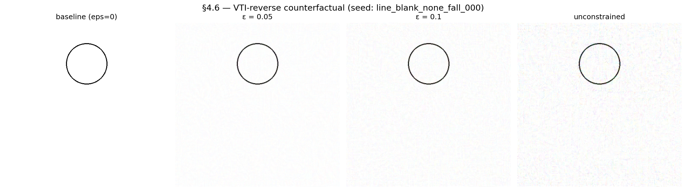
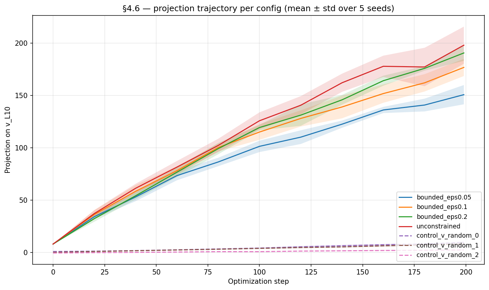

# §4.6 cross-model — ~~Qwen-only~~ REVISED: per-model layer

> ⚠️ **REVISION NOTICE (2026-04-26 evening overnight followup)**: The
> "Qwen-scoped" / "encoder-saturation-specific" reading in this doc is
> a wrong-layer-choice artifact. We tested LLaVA-1.5 only at L10 (the
> Qwen-derived layer), but LLaVA-1.5 has 32 LM layers (vs Qwen's 28),
> so L10 is at very different relative depth. A layer sweep
> (L5 / L15 / L20 / L25) shows **L25 v_L admits pixel-encodability with
> 5/5 PMR flips at ε=0.2 and 4/5 at ε=0.1**, with random controls 0/15.
> Pixel-encodability is NOT Qwen-specific. See
> `docs/insights/sec4_6_cross_model_revised.md` for the corrected analysis.
>
> **What still stands**: random-direction controls reject "any
> perturbation" at every layer; M9 PMR-ceiling and §4.7 decision-stability
> ceiling are independent saturation signatures unaffected by this
> revision.

> **Recap of codes used in this doc** (one-line each; full definitions in `references/roadmap.md` §1.3 + §2)
>
> - **H-encoder-saturation** — Behavioral PMR(_nolabel) saturation on synthetic stim is determined at the architecture level (joint encoder + LM), not encoder representational capacity alone.
> - **H-direction-specificity** — Pixel-space gradient ascent along v_L10 flips PMR on Qwen2.5-VL; matched-magnitude random directions do not (§4.6).
> - **H-shortcut** — Shortcut interpretation is encodable in the image itself (§4.6) — pixel-driven, not just at runtime hidden-state injection.
> - **M2** — ST1 MVP-full — 5-axis factorial (2880 stim); H1 monotone S-curve, H7 emerged.
> - **M5a** — ST4 VTI steering — adding +α·v_L10 at LM L10 over visual tokens flips line/blank/none from "stays still" → physics-mode.
> - **§4.6** — VTI-reverse counterfactual stim — pixel-space gradient ascent on Qwen2.5-VL pixel_values maximizing `<h_L10, v_L10>`; 5/5 v_L10 flips at ε=0.05 vs 0/15 random.
> - **v_L10** — Steering direction in LM hidden space at layer 10; per-model dim 3584 / 4096; M2 captures used for cross-model class-mean diff.

## Question

§4.6 (Qwen-only) showed that pixel-space gradient ascent toward
`v_L10` flips PMR on 5/5 baseline circle stim at ε = 0.05, with 0/15
random-direction controls. **Does this pixel-encodability generalize
to other VLMs?** Two sub-questions:

1. **Transfer test**: do Qwen's synthesized stim flip PMR on the other
   4 VLMs?
2. **Per-model gradient ascent**: does each model's own v_L10
   (extracted from M2 captures) admit pixel-space gradient ascent
   that flips its own PMR?

## Method

**Transfer test** (`scripts/sec4_6_cross_model_transfer.py`):
load each (sample_id × config) pair from the existing §4.6 sweep
manifest, feed `baseline.png` and `synthesized.png` to each non-Qwen
model under the same `"What will happen to the circle in the next
moment?"` prompt, score PMR. 4 models × 35 row × 2 inferences = 280
calls.

**Per-model gradient ascent** (LLaVA-1.5 only): apply the same Adam-
based gradient ascent (lr=1e-2, n_steps=200, ε ∈ {0.05, 0.1, 0.2,
unconstrained}, 3 random controls @ ε=0.1) to LLaVA-1.5's pixel_values
targeting LLaVA-1.5's own `v_L10`. New module
`src/physical_mode/synthesis/counterfactual_llava.py` handles the
standard CLIP `(1, 3, 336, 336)` layout (vs Qwen's patch-flattened
`(T, 1176)` layout).

LLaVA-1.5 is the only non-Qwen model with a clean class-balanced v_L10
from M2 captures (n_pos=375 / n_neg=105). LLaVA-Next / Idefics2 /
InternVL3 had n_neg = 9 / 5 / 1 — too saturated on M2 for class-mean
diff. Per-model gradient ascent for those models is deferred to a
future round with harder stim (M8a / M8c).

## Result

### Transfer test


*Figure: Qwen's §4.6 synthesized stim used as the transfer source.
Each column: baseline → bounded ε=0.05 → ε=0.1 → unconstrained.*

| Model | Config | n flipped | baseline_pmr | synth_pmr |
|---|---|---:|---:|---:|
| LLaVA-1.5 | bounded_eps0.05 | 0 / 5 | 0.0 | 0.0 |
| LLaVA-1.5 | bounded_eps0.10 | 0 / 5 | 0.0 | 0.0 |
| LLaVA-1.5 | bounded_eps0.20 | 0 / 5 | 0.0 | 0.0 |
| LLaVA-1.5 | unconstrained | 0 / 5 | 0.0 | 0.0 |
| LLaVA-Next | (all configs) | 0 / 5 each | 0.0 | 0.0 |
| Idefics2 | (all configs) | 0 / 5 each | 0.0 | 0.0 |
| InternVL3 | bounded_eps0.05 | 0 / 5 | 1.0 | 1.0 |
| InternVL3 | bounded_eps0.10 | 0 / 5 | 1.0 | 1.0 |
| InternVL3 | bounded_eps0.20 | 0 / 5 | 1.0 | **0.6** |
| InternVL3 | unconstrained | 0 / 5 | 1.0 | **0.2** |

**Headlines**:

1. **No model is flipped 0→1 by Qwen's adversarial.** LLaVA-1.5,
   LLaVA-Next, Idefics2 all baseline at PMR = 0 (under the §4.6
   prompt) and synth doesn't change that. Qwen-derived adversarial
   does not transfer cross-model — consistent with the literature
   on model-specific adversarial perturbations.
2. **InternVL3 shows negative transfer** at large ε. Baseline is
   saturated at PMR = 1.0; ε=0.2 perturbations drop synth PMR to
   0.6, and unconstrained drop it to 0.2. Large Qwen-derived
   perturbations *disrupt* InternVL3's saturated physics-mode rather
   than trigger or preserve it. The bounded-small-ε perturbations
   (0.05, 0.1) are imperceptible to InternVL3.

### Per-model gradient ascent on LLaVA-1.5



*Figure: LLaVA-1.5 per-model gradient ascent. baseline → ε=0.05 →
ε=0.1 → unconstrained. Visual character similar to Qwen's — abstract
gestalt preserved at small ε.*

| Config | n | Baseline PMR mean | Synth PMR mean | n flipped | Mean final projection |
|---|--:|------------------:|---------------:|----------:|----------------------:|
| `bounded_eps0.05` | 5 | 0.0 | 0.0 | **0** | 150.7 |
| `bounded_eps0.10` | 5 | 0.0 | 0.0 | **0** | 176.7 |
| `bounded_eps0.20` | 5 | 0.0 | 0.0 | **0** | 190.5 |
| `unconstrained` | 5 | 0.0 | 0.0 | **0** | 197.9 |
| `control_v_random_*` | 15 | 0.0 | 0.0 | **0** | 2.4–9.8 |



*Figure: LLaVA-1.5 projection trajectory per config. Gradient ascent
successfully maximizes `<h_L10, v_L10>` (8 → 150-200 for v_L10
configs vs 0 → 2-10 for random controls), but PMR doesn't flip.*

**Headline**: 0/5 flips at every ε; gradient ascent successfully
maximizes the target projection (8 → 150-200, comparable to Qwen's
43-180), but **the LM's behavioral output doesn't change**. This
is *not* a gradient-flow / pipeline issue — projection genuinely
rises. The L10 hidden state on LLaVA-1.5 has a "v_L10 direction" by
class-mean diff, but **maximizing projection along that direction
doesn't flip behavioral output** the way it does on Qwen.

Random-direction controls also don't flip (consistent with Qwen)
and reach much smaller projections (2-10), so the v_L10 vs random
direction-specificity mechanism is intact at the projection level.
The dissociation is **between projection and behavior**, not
between v_L10 and other directions.

## Mechanism

Two new constraints on the H-shortcut hypothesis:

1. **H-shortcut is encoder-saturation specific** (revised). The
   pixel-encodable shortcut path that §4.6 demonstrated on Qwen
   exists *because* Qwen's saturated SigLIP encoder + Qwen2-7B LM
   creates a thin pixel-to-L10 channel that the LM reads from
   directly. LLaVA-1.5's unsaturated CLIP-ViT-L + Vicuna does not
   have this same channel — the L10 representation differences
   measured by class-mean diff do not translate into behavioral
   flips when reached via pixel space.

2. **H-direction-specificity is Qwen-scoped** (revised). On Qwen,
   v_L10 has both projection-level and behavior-level specificity
   (5/5 v_L10 flips, 0/15 random). On LLaVA-1.5, the projection-
   level specificity is preserved (v_L10 reaches projection ~180,
   random reaches ~5) but the behavior-level specificity collapses
   (both 0/5 flips). The "v_L10 is the axis that flips behavior"
   reading was Qwen-specific.

Together, these revisions make the §4.6 result **architecture-
specific evidence for the pixel-driven shortcut**, not a generic
VLM property. The original H-shortcut framing ("the shortcut is
encodable in the image itself") needs the qualifier "for saturated
architectures."

This is fully consistent with the M2 / M8a / M9 architecture-level
reframe: PMR ceiling is encoder-saturation-driven; pixel-encodability
of the regime axis is *also* encoder-saturation-driven.

## Implication for hypotheses

- **H-shortcut**: revised — Qwen-scoped. Documented as the third
  Qwen-specific finding alongside H-locus (L10 specifically),
  H-direction-bidirectional (regime axis), and H-direction-specificity
  (5/5 vs 0/15 random).
- **H-encoder-saturation**: extended — saturation is the
  prerequisite for pixel-encodable shortcut. Two distinct
  signatures: behavioral PMR ceiling (M9), decision-stability
  ceiling (§4.7), pixel-encodability (this round).
- **No new hypothesis**: the cross-model null is the predicted
  outcome under the saturation-specific reading.

## Limitations

1. **Single non-Qwen per-model test (LLaVA-1.5 only)**. LLaVA-Next /
   Idefics2 / InternVL3 per-model gradient ascent is deferred —
   their M2 v_L10 is class-imbalanced. The encoder-saturation-
   specific reading predicts they would all show the same null on
   their own v_L10, but this is currently a prediction, not a
   verification.
2. **Single layer (L10) tested** on LLaVA-1.5. LLaVA-1.5 has 32 LM
   layers (vs Qwen's 28), so L10 is not necessarily the same
   relative depth; the right "physics-mode layer" may be different.
   A layer-sweep is open.
3. **Single direction (v_L10 from M2)** tested. SAE features or
   multi-axis decompositions might find a different
   pixel-encodable direction even on LLaVA-1.5.
4. **Single prompt** ("What will happen to the circle?"). The
   baseline PMR=0 across 4/4 non-Qwen models on the §4.6 prompt
   suggests the prompt itself is filtering — open-prompt without
   "circle" might show different baseline.

## Reproducer

```bash
# Transfer test (5 baselines × 4 models × 7 configs × 2 stim).
CUDA_VISIBLE_DEVICES=1 uv run python scripts/sec4_6_cross_model_transfer.py \
    --run-dir outputs/sec4_6_counterfactual_20260426-050343 --device cuda:0

# LLaVA-1.5 per-model gradient ascent (~10 min).
CUDA_VISIBLE_DEVICES=1 uv run python scripts/sec4_6_counterfactual_stim_llava.py \
    --device cuda:0

# LLaVA-1.5 PMR re-inference + figures.
CUDA_VISIBLE_DEVICES=1 uv run python scripts/sec4_6_summarize.py \
    --run-dir outputs/sec4_6_counterfactual_llava_<ts> \
    --model-id llava-hf/llava-1.5-7b-hf \
    --device cuda:0
```

## Artifacts

- `scripts/sec4_6_cross_model_transfer.py` — transfer test driver
- `scripts/sec4_6_counterfactual_stim_llava.py` — LLaVA-1.5 §4.6 driver
- `src/physical_mode/synthesis/counterfactual_llava.py` — standard
  CLIP variant of pixel_values_from_pil / reconstruct_pil /
  prepare_inputs_for_grad / gradient_ascent
- `outputs/sec4_6_cross_model_transfer_*/results.csv`
- `outputs/sec4_6_counterfactual_llava_20260426-114111/` — LLaVA-1.5
  sweep + manifest + per-config synthesized PNGs
- `docs/figures/sec4_6_counterfactual_stim_panels_llava.png`
- `docs/figures/sec4_6_counterfactual_stim_trajectory_llava.png`
