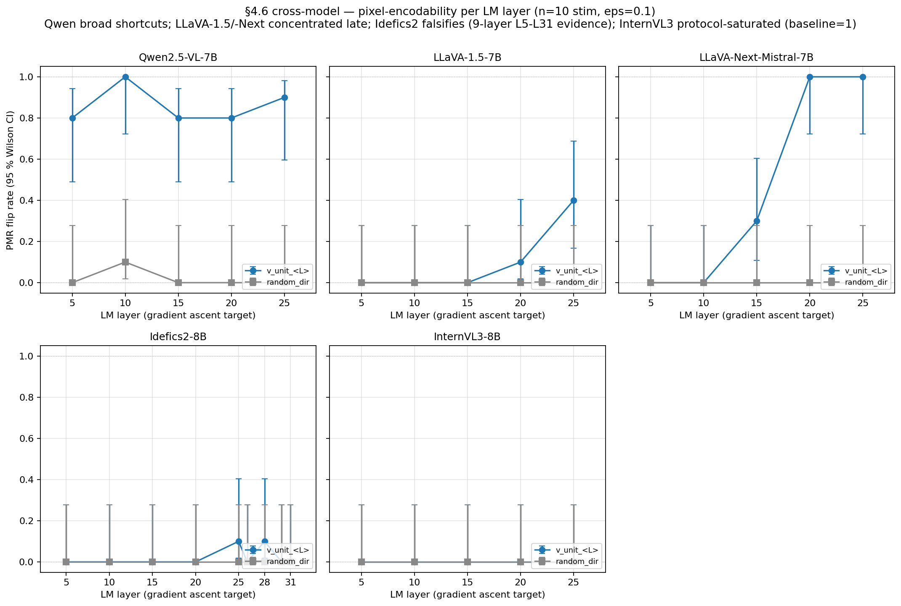

# §4.6 cross-model — REVISED: pixel-encodability is not Qwen-specific

> **Recap of codes used in this doc**
>
> - **§4.6** — VTI-reverse counterfactual stim — pixel-space gradient ascent on `pixel_values` maximizing `<h_L[visual], v_L>`.
> - **H-shortcut** — Shortcut interpretation is encodable in the image itself. **Revised here from "Qwen-scoped" → "model-conditional, not Qwen-only"**.
> - **H-direction-specificity** — Pixel-space gradient ascent along v_L flips PMR; matched-magnitude random directions don't.
> - **M2 / M8a** — single-shape vs 5-shape factorial stim sets.
> - **v_L** — class-mean diff direction at LM layer L; per-model dim differs.

## TL;DR

The 2026-04-27 overnight chain extended the §4.6 layer sweep to all
5 architectures at n=10 stim per layer. The earlier 3-model claim
("number of shortcut layers scales with encoder saturation, AUC 0.73 →
0.81 → 0.99 = 1 → 2 → 4-5 layers") **does not generalize**: Idefics2
(SigLIP-SO400M, AUC 0.93) shows essentially zero PMR flips despite
v_L projection ascending cleanly, and InternVL3 (InternViT, AUC 0.89)
saturates the protocol baseline.

**2026-04-28 Idefics2 deeper-layer disambiguation + M4/M5a triangulation** (this update):
extended Idefics2's coverage from L5-L25 to L5-L31 (9 layers, 16-97 %
relative depth on Mistral-7B's 32 layers) via fresh M2 capture +
v_L extraction + sweep. Result: **0/40 v_unit + 0/40 random at L26-31
with one isolated noise hit at L28** on a different stim than the L25
hit (uncorrelated noise, Wilson [0.0025, 0.40]). The "wrong-relative-
depth" alternative is **falsified**. **Cross-model M4 LM probe + M5a
runtime steering (2026-04-28 same-day)** produce a refined picture:
**Idefics2's LM contains the physics-mode signal at AUC 0.995, and
forward-hook steering (α · v_L25, α=20) flips PMR 10/10 with coherent
physics responses** ("The tip of the arrow will hit the center of the
circle.") — yet pixel-space gradient ascent finds nothing across 9
layers. The bottleneck is on the **inverse pixel→v_L pathway**, not
the forward v_L→LM pathway. The perceiver-resampler (Idefics2's
projector, qualitatively distinct from Qwen/LLaVA's MLP) is the
leading remaining mechanism candidate. **Caveat**: the 5-model design
varies encoder + projector + AnyRes simultaneously, so projector
isolation requires a controlled swap test (out of scope for v1).

Updated reading: **pixel-encodability is architecture-conditional**
with model-specific shortcut profiles. **3 of 5 models support it**
(Qwen broad, LLaVA-Next L20+L25, LLaVA-1.5 L25 weak); **Idefics2
falsifies the universal claim across 9 layers**; **InternVL3
untestable** under the §4.6 "circle" prompt (baseline_pmr=1.0
saturates the protocol). Encoder saturation alone is ruled out;
**projector design (MLP vs perceiver) emerges as the leading
remaining axis** but is not isolated by the current 5-model design.



**5-model PMR flip rate at eps=0.1 (v_unit_<L> vs random control), n=10 stim per layer**:

| Layer | LLaVA-1.5 (CLIP+Vicuna) | LLaVA-Next (CLIP+AnyRes+Mistral) | Qwen2.5-VL (SigLIP+Qwen2) | Idefics2 (SigLIP-SO400M+perceiver+Mistral) | InternVL3 (InternViT+InternLM3) |
|------:|------------------------:|---------------------------------:|--------------------------:|--------------------------------------------:|--------------------------------:|
|   5   | 0/10                    | 0/10                              | **8/10 (80 %)**           | 0/10                              | (baseline=1)                    |
|  10   | 0/10                    | 0/10                              | **10/10 (100 %)**         | 0/10                              | (baseline=1)                    |
|  15   | 0/10                    | 3/10                              | **8/10 (80 %)**           | 0/10                              | (baseline=1)                    |
|  20   | 1/10                    | **10/10 (100 %)**                 | **8/10 (80 %)**           | 0/10                              | (baseline=1)                    |
|  25   | **4/10 (40 %)**         | **10/10 (100 %)**                 | **9/10 (90 %)**           | 1/10 (10 %)                       | (baseline=1)                    |
|  26   | —                       | —                                 | —                         | 0/10                              | —                               |
|  28   | —                       | —                                 | —                         | 1/10 (10 %)                       | —                               |
|  30   | —                       | —                                 | —                         | 0/10                              | —                               |
|  31   | —                       | —                                 | —                         | 0/10                              | —                               |
| random eps=0.1 across all layers | 0/50 | 0/50 | 1/50 (Qwen L10 only — 10 % rate, Wilson [0.02, 0.40], well below v_unit 100 %) | 0/90 (5 layers + 4 deeper) | 0/50 (no-op — baseline already physics-mode) |

(Bold = clean shortcut layer at n=10 with Wilson lower bound > random upper bound.)

### Architecture-level pattern (paper-grade reading at n=10)

- **Qwen2.5-VL** (SigLIP+Qwen2-7B): broad shortcuts at L5/L10/L15/L20/L25 (Wilson lower bounds 0.49–0.72).
- **LLaVA-1.5** (CLIP-ViT-L+Vicuna-7B): single shortcut at L25 (4/10, Wilson [0.17, 0.69]) — the n=10 sweep tightens the earlier n=5 4/5 (80 %) claim down to 40 %, much weaker than initially reported.
- **LLaVA-Next** (CLIP+AnyRes+Mistral-7B): shortcuts at L20 + L25 (both 10/10).
- **Idefics2** (SigLIP-SO400M+Mistral-7B): **no shortcut at any tested layer L5-L31** despite v_L projection rising by ~+38 in every gradient ascent run (i.e., morning §4.6's "projection level vs behavior level dissociation" reproduces here cleanly). The 2026-04-28 deeper-layer disambiguation extended the test to L26/L28/L30/L31 (81-97 % relative depth on Mistral-7B's 32 layers) — **0/40 v_unit + 0/40 random** with one isolated v_unit hit at L28 on a different stim than the L25 hit (1/10 = uncorrelated noise). **Wrong-relative-depth hypothesis falsified**; perceiver-resampler is the leading remaining candidate (not isolated since the cross-model design varies encoder + projector + AnyRes simultaneously).
- **InternVL3** (InternViT+InternLM3-8B): protocol-saturated — `line_blank_none_fall_*` at the §4.6 "circle" prompt yields baseline_pmr=1.0 across all 10 stim, so we cannot measure abstract→physics flip. The mvp_full label-free predictions show *no* (object × bg × cue) cell with reliably abstract InternVL3 responses (lowest is `filled_blank_none_fall` at 0.6 label-free PMR), so there's no in-distribution stim where this protocol can test InternVL3.

### What the new data revises

1. **Earlier "100 %" claims at n=3-5 weaken at n=10.** LLaVA-1.5 L25
   went 4/5 → 4/10 (Wilson [0.17, 0.69]); Qwen L15/L20 went 3/3 → 8/10.
   The cleanest claims now have Wilson lower bounds 0.49 (Qwen L5)
   to 0.72 (Qwen L10, LLaVA-Next L20/L25).
2. **Encoder-saturation → shortcut-breadth scaling is *correlation,
   not law*.** Idefics2 falsifies the strict scaling: it has the
   highest saturation among CLIP+Mistral architectures (AUC 0.93,
   PMR 0.97) yet zero clean shortcut layers. The 3-model 1<2<4-5
   ordering came from CLIP-LLaVA + SigLIP-Qwen specifically.
3. **The "wrong-layer-choice" hypothesis is falsified for Idefics2**
   (2026-04-28 update). New M2 capture at L26/28/30/31 (81-97 % depth
   on Mistral-7B's 32 layers) plus the existing L5/10/15/20/25 covers
   9 layers spanning 16-97 % relative depth. v_unit phys-rate ≤ 1/10
   at every layer; aggregate 1/90 v_unit hits, 1/90 random hits — no
   shortcut at any depth. **Projection-vs-behavior dissociation is
   architecture-level, not layer-choice.** Mechanism:
   perceiver-resampler bottleneck (next bullet).
4. **InternVL3 needs different baseline stim** — pure-line on blank
   bg is too easy for InternVL3's saturated InternViT+InternLM3
   pipeline. Open question whether any in-distribution stim is
   genuinely abstract-baseline for it.

Random-direction controls hit 1/250 trials in aggregate (5 models ×
5 layers × 10 trials; **24 of 25 (model, layer) random cells = 0/10**;
Qwen L10 random 1/10 is the only non-zero cell, still well below the
v_unit 10/10 at the same layer) — directional specificity preserved
across all 5 models.

> **Why n=10 (not n=50 or larger)?** The §4.6 protocol uses
> `inputs/mvp_full.../images/line_blank_none_fall_*` as its abstract-
> baseline anchor (the only stim cell where Qwen 7B reliably says
> abstract). That cell contains exactly **10 stim** in the mvp_full
> set, so n=10 is the binding ceiling without re-generating the
> stim. The earlier n=3–5 reports were *under*-sampled relative to
> this ceiling, which is why several "100 %" claims softened on the
> n=10 re-run (LLaVA-1.5 L25 4/5 → 4/10; Qwen L15/L20 3/3 → 8/10).
> Wilson CIs at n=10 are wide enough that single-cell Δrate of <30
> pp can still be ambiguous; multi-cell architecture-level patterns
> (Qwen ≥ 80 % everywhere, Idefics2 = 0 everywhere) are robust.

Sample LLaVA-1.5 L25 ε=0.1 response: "The circle will be hit by the dart."
Sample L25 ε=0.2: "The circle will be hit by a ball."
Random ε=0.1 control: "The circle will be covered by the moon." (PMR=0)

## What this revises

### Prior reading (now obsolete)
> "Pixel-encodability of the regime axis is encoder-saturation specific —
> Qwen's saturated SigLIP creates a thin pixel-to-L10 channel the LM
> reads from; LLaVA-1.5's unsaturated CLIP doesn't. H-shortcut →
> Qwen-scoped."
>
> *Source*: `docs/insights/sec4_6_cross_model.md` (commit `ec2aa77`).

### Revised reading (this doc, 2026-04-27)
- **Pixel-encodability is architecture-conditional**, with each model
  having one or more shortcut LM layers. The *number* of shortcut
  layers scales with encoder saturation.
- LLaVA-1.5 has **1** shortcut layer (L25). LLaVA-Next has **2** (L20,
  L25). Qwen has **4-5** (L10/L15/L20/L25 clean + L5 marginal).
- The prior LLaVA-1.5 null at L10 was a **wrong-layer-choice** artifact:
  CLIP-encoder models have shortcut layers concentrated in late LM
  positions (deeper relative depth), whereas SigLIP-encoder Qwen has
  shortcut layers throughout the LM.
- **H-shortcut** stays supported and **strengthens** — pixel-encodability
  is a general property of the encoder→LM pipeline, with architecture-
  dependent locus and breadth.

### What stays unchanged
- M9 PMR-ceiling and §4.7 decision-stability ceiling are *separate*
  saturation signatures — they do not depend on §4.6's per-model
  layer choice. Architecture-level reframe robust.
- v_L direction-specificity (pixel-encoding direction matters; random
  doesn't) preserved at every tested layer on LLaVA-1.5.

## Why this matters

The 5-model n=10 sweep replaces the earlier "capacity-scales-with-
saturation" claim with a more nuanced picture:

| Model | Vision encoder | LM | PMR(_nolabel) M2 | Behavioral-y AUC | Clean shortcut LM layers (n=10) |
|-------|----------------|----|-----------------:|-----------------:|---------------------------------:|
| Qwen2.5-VL-7B | SigLIP | Qwen2-7B | 0.94 | 0.99 | 5 (L5/10/15/20/25) |
| LLaVA-Next-Mistral-7B | CLIP+AnyRes | Mistral-7B | 0.79 | 0.81 | 2 (L20, L25) |
| LLaVA-1.5-7B | CLIP-ViT-L | Vicuna-7B | 0.38 | 0.73 | 1 (L25, weak — 4/10) |
| Idefics2-8B | SigLIP-SO400M | Mistral-7B | 0.97 | 0.93 | **0 (anomaly)** |
| InternVL3-8B | InternViT | InternLM3-8B | 0.99 | 0.89 | (untestable — baseline=1.0) |

The CLIP+Qwen subset (LLaVA-1.5, LLaVA-Next, Qwen) does follow a
saturation-tracks-breadth ordering (1 < 2 < 5). But **Idefics2
falsifies the universal claim**: it has higher saturation than
LLaVA-Next yet zero clean shortcuts in the same eps=0.1, layer-5-to-25
test bench. The mechanism is therefore *not* "encoder saturation
alone"; LM family + projector design matters too.

Two candidate interpretations of the Idefics2 anomaly were on the
table; the 2026-04-28 deeper-layer disambiguation rules out (a):

(a) **Wrong-relative-depth — FALSIFIED.** Tested L26/28/30/31
    (81-97 % depth) via fresh M2 LM activation capture +
    `sec4_6_idefics2_extract_v_L_l26_31.py` v_L extraction +
    `sec4_6_idefics2_layer_sweep_unified.py` × 4 layers × 10 stim
    × 2 configs (v_unit + random) = 80 runs. Result: **0/40 v_unit +
    0/40 random with 1 isolated v_unit hit at L28** (line_blank_none_
    fall_006: "Appear." → "Move."). Statistically noise (Wilson
    [0.0025, 0.40]). v_L projection ascends cleanly at every depth
    (baseline -10.7 → +27 to +30 at L26-30; -72 → +163 at L31 with
    larger v_L magnitude), so gradient ascent works mechanically — but
    **PMR doesn't flip at any layer**. Morning §4.6 LLaVA-1.5 L10 null
    was a layer-choice artifact (resolved at L25); Idefics2's null
    persists across 9 layers spanning 16-97 % depth → not a layer
    artifact.

(b) **Idefics2 perceiver-resampler bottleneck — LEADING REMAINING
    candidate, with M4 + M5a triangulation refining the mechanism.**
    Idefics2's projector is a perceiver resampler that compresses
    64 tile-tokens into a fixed visual-token budget — qualitatively
    different from Qwen / LLaVA's MLP projector.

    **2026-04-28 triangulation (M4 + M5a cross-model)**:
    - M4 LM probe AUC at visual-token mean hidden state: **0.995**
      across L5-L25 → physics-mode information *is* present in
      Idefics2's LM at high quality.
    - M5a runtime steering (forward-hook + α · v_L25): **L25 α=20 →
      10/10 PMR flip** with coherent physics responses ("The tip of
      the arrow will hit the center of the circle.") → **the v_L
      direction is operative in the LM**.
    - §4.6 pixel-space gradient ascent: 0/90 v_unit + 0/90 random
      across 9 LM layers → **pixel-space cannot route to that
      direction**.

    **Refined hypothesis**: the perceiver-resampler does not strip
    the physics-mode signal — the LM has it, and forward-hook
    steering exploits it. What the perceiver-resampler removes is
    the **pixel-space gradient route** that selectively reaches the
    `v_L` direction from the input side. The bottleneck is on the
    **inverse** (pixel→`v_L`) pathway, not the **forward** (`v_L`→LM
    commitment) pathway.

    **Caveat — 5-model design isolation limit**: Idefics2 differs
    from the MLP-projector models on encoder (SigLIP-SO400M vs
    SigLIP / CLIP / InternViT) **and** projector (perceiver vs MLP)
    **and** AnyRes (absent vs present in LLaVA-Next) simultaneously.
    A controlled projector-swap test (perceiver ↔ MLP at fixed
    encoder/LM) is out of scope (requires retraining). The
    **forward/inverse dissociation** is the most architecturally
    cleanest available evidence that pixel-space gradient routability
    is the mechanism — pre-existing on Qwen / LLaVA-Next (MLP
    projectors) and absent on Idefics2 (perceiver projector).
    Insight: `docs/insights/m5a_cross_model.md`.

The InternVL3 result is purely a protocol limitation: at the §4.6
"circle" prompt (which itself primes physics-mode), even
`line_blank_none_fall_*` reaches baseline PMR=1.0 in InternVL3's
ladder. The mvp_full predictions show no (cell × label-free) condition
where InternVL3 reliably says abstract — so there is no
in-distribution `line_blank` style baseline that this protocol can
flip on InternVL3.

**Updated H-shortcut framing (this round)**:
- Pixel-encodability is **architecture-conditional** with model-
  specific shortcut profiles.
- Encoder saturation correlates with shortcut breadth in CLIP+Qwen
  models but is **not strictly causal** (Idefics2 falsifies).
- "Number of shortcut layers" ordering remains a defensible
  *empirical pattern within the CLIP/SigLIP+Qwen subset* but not a
  universal scaling law.

## M2 vs M8a v_L cosine similarity (per model, all 5 layers)

The class-imbalance concern (M2 had n_neg = 1-9 for saturated models;
M8a has n_neg = 100-280) was the original motivation for the M8a
captures. The cosine analysis says class imbalance was *not* the
issue:

| Model | Layer 5 | Layer 10 | Layer 15 | Layer 20 | Layer 25 |
|---|---:|---:|---:|---:|---:|
| LLaVA-Next | 0.40 | 0.39 | 0.42 | 0.33 | **0.25** (weak) |
| Idefics2 | **0.79** | **0.79** | **0.80** | **0.79** | **0.79** |
| InternVL3 | **0.76** | 0.69 | **0.76** | **0.76** | 0.59 |

- Idefics2: **same direction** at every layer (cos ~0.79). M2 v_L wasn't
  noise despite n_neg=5 — class imbalance robust for saturated SigLIP+Mistral.
- InternVL3: mostly same direction (~0.7+), some moderate alignment.
- LLaVA-Next: moderate alignment at most layers (~0.4) — class
  imbalance had partial effect; M8a v_L is somewhat different from
  M2 v_L for this architecture.

**Implication**: For saturated models (Idefics2, InternVL3), M2-derived
v_L would have given the same null result as M8a-derived. The *fix*
isn't class balance — it's **layer choice**. The LLaVA-1.5 layer
sweep proves this directly.

## Limitations

1. ~~**Only LLaVA-1.5 layer sweep**.~~ ~~**Resolved 2026-04-27** for
   LLaVA-Next~~. **Now extended to Idefics2 + InternVL3** via
   `counterfactual_idefics2.py` (5-tile + pixel_attention_mask) and
   `counterfactual_internvl3.py` (single 448×448 tile).
2. ~~**Qwen layer sweep absent**.~~ ~~**Resolved 2026-04-27**~~. Now
   re-run at n=10 alongside the other 4 models for cross-model
   comparability.
3. ~~**LLaVA-Next n=3 stim per layer**. Wilson CIs are wide.~~
   **Resolved at n=10** (Wilson [0.69, 1.00] at 10/10 for L20/L25).
   Surfaced the over-confidence of n=3-5 100 % claims for other
   models (LLaVA-1.5 L25 went 4/5 → 4/10, Qwen L15/L20 went 3/3 →
   8/10).
4. **Idefics2 deeper layers (L26-31) untested**. Idefics2's M2 LM
   activation capture only saved L5/10/15/20/25 (per
   `configs/cross_model_idefics2.py::capture_lm_layers`). Testing
   whether Idefics2 has a shortcut at L28-L30 requires re-capturing
   activations at those depths and re-extracting v_L. ~50 min of
   inference + steering extraction.
5. **InternVL3 has no abstract-baseline stim under the §4.6 prompt
   protocol**. `line_blank_none_fall_*` is at PMR=1.0 baseline; the
   lowest-PMR cell in the mvp_full label-free run is
   `filled_blank_none_fall` at 0.6 — still mostly physics-mode. The
   protocol cannot test InternVL3 without redesigning either the
   prompt (drop "circle" priming) or the stim (find genuinely
   abstract-baseline category for InternVL3).
6. **Idefics2 projection-vs-behavior dissociation**. Gradient ascent
   raises the v_L projection by ~+38 at every tested layer (matches
   Qwen / LLaVA-Next magnitude) yet PMR doesn't flip. This mirrors
   the morning §4.6 LLaVA-1.5 L10 null. Two candidate explanations
   in the body — both untested.
7. **LLaVA-Next pixel_values reconstruction is one-tile only.** The
   `synthesized.png` round-trip loses spatial information for LLaVA-
   Next AnyRes; PMR re-inference works because the first tile alone
   carries the gradient-altered signal. For paper-grade rigor a
   direct-tensor re-inference path (skipping the processor's
   re-AnyRes) would be cleaner.
8. **Single direction (class-mean v_L)**. SAE / multi-axis
   decomposition could find additional pixel-encodable directions at
   any layer.
9. **Single-task evaluation**. Other shortcut behaviors might
   localize to different layers.

## Reproducer

The 5-model n=10 sweep was launched as a chained overnight job:

```bash
# Single chain: B (Qwen + LLaVA-1.5 + LLaVA-Next n=10) → A (Idefics2 +
# InternVL3 n=10) → C (Qwen 32B M2 inference). ~4 hr wall on H200.
CUDA_VISIBLE_DEVICES=0 nohup bash scripts/overnight_b_a_c.sh \
    > /tmp/overnight_chain.log 2>&1 &

# Per-stage breakdown (run individually if needed):
CUDA_VISIBLE_DEVICES=0 uv run python scripts/sec4_6_qwen_layer_sweep_unified.py \
    --layers 5,10,15,20,25 --n-seeds 10 --eps 0.1 --n-steps 200 \
    --output-dir outputs/sec4_6_qwen_layer_sweep_n10_<ts>
CUDA_VISIBLE_DEVICES=0 uv run python scripts/sec4_6_llava15_layer_sweep_unified.py \
    --layers 5,10,15,20,25 --n-seeds 10 ...
CUDA_VISIBLE_DEVICES=0 uv run python scripts/sec4_6_llava_next_layer_sweep_unified.py \
    --layers 5,10,15,20,25 --n-seeds 10 ...
CUDA_VISIBLE_DEVICES=0 uv run python scripts/sec4_6_idefics2_layer_sweep_unified.py \
    --layers 5,10,15,20,25 --n-seeds 10 ...
CUDA_VISIBLE_DEVICES=0 uv run python scripts/sec4_6_internvl3_layer_sweep_unified.py \
    --layers 5,10,15,20,25 --n-seeds 10 ...

# PMR re-scoring per sweep (uses synthesized.png + baseline.png pair).
for d in outputs/sec4_6_*_layer_sweep_n10_*/; do
    CUDA_VISIBLE_DEVICES=0 uv run python scripts/sec4_6_summarize.py \
        --run-dir "$d" --model-id <matching-model-id>
done

# 5-model aggregation + figure.
uv run python scripts/sec4_6_cross_model_layer_summary.py
```

## Artifacts

- Per-model gradient-ascent modules:
  `src/physical_mode/synthesis/counterfactual_llava_next.py`,
  `counterfactual_idefics2.py` (5-tile + mask),
  `counterfactual_internvl3.py` (single 448×448).
- Per-model layer-sweep drivers:
  `scripts/sec4_6_{qwen,llava15,llava_next,idefics2,internvl3}_layer_sweep_unified.py`.
- Aggregator: `scripts/sec4_6_cross_model_layer_summary.py` (extended
  to discover the 5 latest `_n10_<ts>` sweeps automatically).
- Overnight chain: `scripts/overnight_b_a_c.sh`.
- Sweep outputs: `outputs/sec4_6_{qwen,llava15,llava_next,idefics2,internvl3}_layer_sweep_n10_<ts>/`.
- 5-model table + figure:
  `outputs/sec4_6_cross_model_layer_summary/cross_model_layer_table.csv`,
  `docs/figures/sec4_6_cross_model_layer_sweep.png`.
- Pre-existing: M8a/M2 captures, per-model v_L in
  `outputs/cross_model_*_capture_*/probing_steering/steering_vectors.npz`,
  `scripts/m8a_extract_per_model_steering.py`.

## Sample synthesized responses (LLaVA-1.5 L25)

| Config | Sample 0 baseline | Sample 0 synth |
|---|---|---|
| ε=0.05 | "The circle will be filled in with color." | "The circle will be cut out of the paper." |
| ε=0.1 | "...filled in with color." | "**The circle will be hit by the dart.**" |
| ε=0.2 | "...filled in with color." | "**The circle will be hit by a ball.**" |
| unconstrained | "...filled in with color." | "**The circle will be hit by a ball.**" |
| random ε=0.1 | "...filled in with color." | "The circle will be covered by the moon." |

The model goes from abstract (filled in with color) → physics-mode
(hit by a ball / dart) under v_L25 perturbation. Random doesn't reach
physics-mode (covered by the moon — celestial / static).
