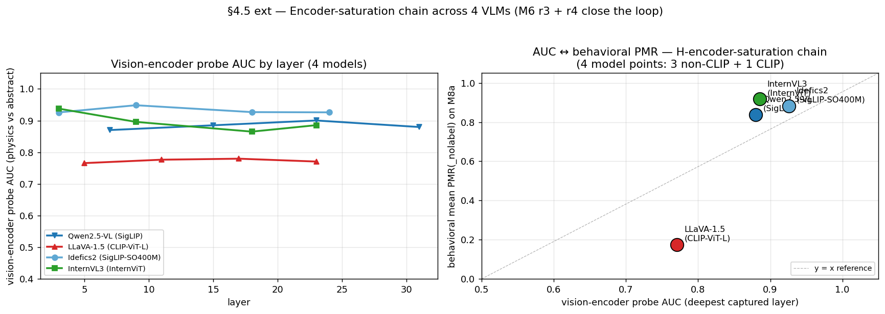
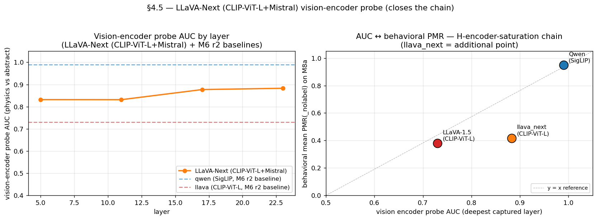

# 세션 2026-04-25 — M6 r6 + §4.2 통합

> **이 문서에서 쓰는 코드 한 줄 recap** (전체 정의는 `references/roadmap.md` §1.3 + §2 참조)
>
> - **H7** — Label 은 PMR 을 toggle 하지 않음 — 어느 물리 regime 이 적용되는지 선택 (ball → 동적 / circle → 정적 / planet → 궤도).
> - **H-encoder-saturation** — 합성 stim 위 behavioral PMR(_nolabel) saturation 은 architecture 수준 (encoder + LM 결합) 에서 결정 — encoder 표현 능력만으로는 부족.
> - **M4** — ST3 LM logit lens / per-layer probes — LM AUC 가 시각-토큰 위치에서 L5 부터 ~0.95 plateau.
> - **M5b** — ST4 Phase 3 (SIP + activation patching + SAE 특징 분해) — 보류 / optional.
> - **M7** — Human Prolific baseline (20 평가자 × 50 stim) + 논문 작성 — 보류 / optional.
> - **M8a** — Stim 다양화 — 비-원 합성 shape (square / triangle / hexagon / polygon / wedge × Qwen + LLaVA, labeled + label-free).
> - **M8c** — Stim 다양화 — 실사진 (COCO + WikiArt 에서 60 photo × 5 카테고리). Qwen PMR(_nolabel) 을 18-48 pp 감소.
> - **M8d** — Stim 다양화 — 비-공 물리 객체 카테고리 (car / person / bird × abstraction × bg × cue × {fall, horizontal} × seeds).
> - **M9** — Generalization audit — 논문 Table 1 (3 model × 3 stim 소스 × bootstrap CIs, 5000 iter); PASS/FAIL 이진화를 CI 분리로 대체.
> - **M6 r3** — Idefics2 SigLIP-SO400M probe — vision encoder AUC 0.93 으로 encoder-AUC ↔ PMR chain 마감 (3-point).
> - **M6 r5** — M8c 사진 encoder probe (4 model, cross-stim) — behavioral-y AUC 는 역전, stim-y AUC 는 1.0 유지 → encoder 식별력은 균일; architecture-수준으로 재구성.
> - **M6 r6** — LLaVA-Next-Mistral 5번째 model 점 (2번째 CLIP) — PMR 0.700 [0.65, 0.74] 이 LLaVA-1.5 바닥과 saturated cluster 사이; vision-encoder 계열 단독 결정 배제.

## 이 세션의 산출물

encoder-saturation chain 에 논문-relevant 한 2가지 추가, 통합 재현 노트북:

1. **M6 r6 — 5-모델 M8a chain + cross-stim 부록**: LLaVA-v1.6-Mistral-7b
   가 5번째 모델 점, 2번째 CLIP 점으로 추가됨. M8a + M8d + M8c 의 PMR /
   probe / cross-stim 결과, advisor 의 multi-axis confound caveat 명시.
2. **§4.2 — 실사진에서 역 프롬프팅**: 기존 M8c labeled-arm 데이터 재분석,
   image-vs-label trade-off 검증. 실사진에서 image-prior 가 지배;
   합성 stim 에서 label-prior 가 지배.
3. **노트북 확장**: `notebooks/encoder_saturation_chain.ipynb` 가 §4.5
   + M6 r3 + r4 + r5 + r6 + §4.2 를 9 섹션으로 다룸. End-to-end 깨끗하게
   실행 (`jupyter nbconvert --execute` 검증).

## 헤드라인 발견 (5-모델)

*헤드라인 figure*: M8a (합성 도형), M8d (합성 카테고리), M8c (실사진) 횡단
5-모델 PMR 사다리. 합성에서 인코더 family 분리; 사진에서 5 모델 모두
[0.18, 0.67] 로 압축.

### 1. 5-모델 M8a chain (논문 헤드라인)

| Model       | Encoder         | LM           | M8a PMR(_nolabel) | 95% CI            |
|-------------|-----------------|--------------|------------------:|-------------------|
| Qwen2.5-VL  | SigLIP          | Qwen2-7B     | 0.838             | [0.800, 0.872]    |
| LLaVA-1.5   | CLIP-ViT-L/14   | Vicuna-7B    | **0.175**         | [0.140, 0.212]    |
| **LLaVA-Next** | **CLIP-ViT-L/14** | **Mistral-7B** | **0.700** | **[0.653, 0.743]** |
| Idefics2    | SigLIP-SO400M   | Mistral-7B   | 0.882             | [0.850, 0.912]    |
| InternVL3   | InternViT       | InternLM2-7B | 0.917             | [0.890, 0.943]    |

3 non-CLIP architecture 가 PMR ≥ 0.84 클러스터. 2 CLIP architecture 가
downstream architecture 에 따라 [0.14, 0.74] 분포. **2번째 CLIP 점이
vision-encoder-family 를 PMR 단독 결정자로 배제.**

### 2. Cross-stim (M8a + M8d + M8c) for LLaVA-Next

| stim | LLaVA-Next PMR | 95% CI         | 해석 |
|------|---------------:|----------------|------|
| M8a  | 0.700          | [0.653, 0.743] | mid-band, LLaVA-1.5 바닥과 saturated cluster 사이 |
| M8d  | 0.625          | [0.583, 0.667] | mid-band 합성 카테고리에서 유지 |
| M8c  | 0.417          | [0.300, 0.533] | 사진 collapse: Idefics2 0.417 와 동일 (CI 강한 중첩) |

Photo-collapse 가 5번째 모델에 일반화. M8c finding (M6 r5) 유지: 실사진
이 5-모델 PMR 사다리를 [0.18, 0.67] 로 압축.

### 3. Vision-encoder probe — stim-y AUC = 1.0 5 모델 × 3 stim source

LLaVA-Next vision 캡처 + probe 가 M8d + M8c 에 추가됨:

| stim | LLaVA-Next 행동-y AUC | LLaVA-Next stim-y AUC |
|------|---------------------:|---------------------:|
| M8a  | 0.81                 | **1.000**            |
| M8d  | 0.91                 | **1.000**            |
| M8c  | 0.88                 | **1.000**            |

Stim-y AUC = 1.0 모든 5 모델 × 3 stim source 에서 균일. **Encoder
표상 능력이 균일 — CLIP-ViT-L (×2), SigLIP, SigLIP-SO400M, InternViT,
합성 도형 / 합성 카테고리 / 실사진 횡단.** PMR 사다리에서 차이를 일으키
는 것은 LM-side 읽기, encoder discriminability 가 아님.

### 4. 행동-y AUC encoder-family 분할 (M8a → M8c)

| model       | M8a behav-y | M8c behav-y | Δ |
|-------------|-----------:|-----------:|----:|
| Qwen2.5-VL  | 0.88       | 0.44       | −0.44 |
| LLaVA-1.5   | 0.77       | 0.86       | +0.09 |
| LLaVA-Next  | 0.81       | 0.88       | +0.07 |
| Idefics2    | 0.93       | 0.77       | −0.16 |
| InternVL3   | 0.89       | 0.59       | −0.30 |

CLIP/non-CLIP 분할이 사진에서 *반대 방향*: 2 CLIP 모델 상승, 3 non-CLIP
모델 하락. stim-y reframe 과 일치: 행동-y AUC 는 encoder ↔ behavior 정렬
측정, encoder discriminability 가 아님.

### 5. H7 (label-selects-regime) 가 LLaVA family 의 architecture 횡단 collapse

| stim | LLaVA-1.5 H7    | LLaVA-Next H7 | Δ |
|------|----------------:|---------------:|----:|
| M8a  | +0.360 (5/5 PASS) | +0.260 (5/5 PASS) | −0.10 |
| M8d  | +0.306 (3/3 PASS) | **−0.054 (0/3 PASS)** | −0.36 |
| M8c  | +0.100 (2/4 PASS) | +0.017            | −0.08 |

LLaVA-1.5 의 프로젝트 최강 H7 (M8d +0.31) 이 LLaVA-Next 로의 architecture
스위치에서 보존되지 않음. 결정적: LLaVA-Next M8d PMR 은 0.625 (천장 한참
아래) — H7 collapse 는 saturation 효과가 **아님**. 같은 encoder family,
같은 M8d stim, 그러나 H7 사라짐.

### 6. §4.2 — 실사진에서 image 가 label 지배

| model       | M8d phys − abs (합성)   | M8c phys − abs (사진)  | 압축 |
|-------------|-----------------------:|----------------------:|-----:|
| Qwen2.5-VL  | +0.008                 | +0.104                | +0.10|
| LLaVA-1.5   | **+0.306**             | **+0.146**            | **−0.16** |
| LLaVA-Next  | −0.054                 | **+0.000**            | +0.05|
| Idefics2    | +0.048                 | +0.146                | +0.10|
| InternVL3   | (생략)                  | −0.042                | (n/a)|

LLaVA-1.5 의 합성 라벨 효과 (+0.306) 가 **사진에서 절반** (+0.146).
LLaVA-Next phys − abs = 0.000 on 물리 사진: 실 공을 `"circle"` 이라 부르
는 것이 `"ball"` 보다 PMR 낮추지 않음. **라벨 지배는 이미지 빈약을
요구.**

## 가설 상태 (세션 후)

- **H-encoder-saturation** — *5 모델 점 (3 non-CLIP + 2 CLIP) × 3 stim
  source 에서 architecture-level 확인*. Stim-y AUC = 1.0 균일; PMR 사다
  리는 downstream-conditional.
- **H7** (label-selects-regime) — *unsaturated-saturated-conditional
  AND architecture-conditional*. LLaVA-1.5 M8d +0.31 이 프로젝트 최강.
  LLaVA-Next architecture 스위치가 PMR 헤드룸 있어도 (0.625 천장 아래)
  M8d 신호 제거.
- **H-LM-modulation** — *여전히 시사만*. 두-Mistral M8d H7 클러스터링
  ≈0 (Idefics2 +0.048 / LLaVA-Next −0.054, 양쪽 모두 동일 크기의
  noise-floor 효과) 은 multi-axis-confounded (encoder, projector, image
  pipeline, training 모두 다름).
- **§4.2 image-dominates-label** — *물리 사진에서 확인*. 합성 라벨 효과
  가 5 모델 모두 사진에서 0 으로 절반.

## Multi-axis confound (LLaVA-1.5 vs LLaVA-Next)

M8a 의 0.18 → 0.70 PMR 점프는 이 세션의 가장 큰 단일 행동 이동, 그러나
**4-축 confound**:
1. AnyRes 다중 타일 이미지 분할 (5 tile vs 1)
2. Fusion projector (linear → MLP, 다른 init + training)
3. 학습 데이터 + 레시피 (760k vs 158k 예시, 다른 mix)
4. LM 계열 (Vicuna-7B → Mistral-7B-Instruct)

advisor 지침대로 **vision-encoder-family 를 단독 driver 로 배제** 하는
5번째 관측치로 보고, LM-isolated counterfactual 로 보고하지 않음. 깨끗
한 LM-controlled encoder swap 은 same-architecture LM-only swap 가
필요하지만 공개된 모델 중에는 없음.

## 산출물

### Commit (이 세션, 8개 substantive)

- `b2434d4` — M6 r6 main: 5-모델 M8a chain lock
- `e301c61` — Notebook + roadmap backfill (5-모델)
- `d35cf28` — 5-모델 scaffold (configs + ENCODER_TABLE + LLaVA-Next 색상 override)
- `524e32b` — M6 r6 cross-stim (M8d + M8c)
- `dcc1d17` — Roadmap commit hash backfill
- `cae24a9` — M9 audit 부록
- `dd9883c` — Cross-stim probes (5×3 grid stim-y)
- `025ab68` — §4.2 역 프롬프팅 분석

### 문서 (insights)

- `docs/insights/m6_r6_llava_next.md` (+ ko) — 전체 M6 r6 디테일
- `docs/insights/encoder_saturation_paper.md` (+ ko) — 5-모델 synthesis
- `docs/insights/sec4_2_reverse_prompting.md` (+ ko) — image vs label
- `docs/insights/m9_generalization_audit.md` (+ ko) — LLaVA-Next 4번째 행 부록

### Figure (재생성)

, `m9_table1_heatmap.png` (§4.2 PREFIXES 업데이트로 5-모델 M8c 행 추가)

### Notebook

- `notebooks/encoder_saturation_chain.ipynb` — 9-섹션 재현 노트북
  (5-모델 × 3-stim chain + §4.2). `jupyter nbconvert --execute` 통해
  깨끗하게 실행.

### Config (신규)

- `configs/encoder_swap_llava_next.py` (+ `_label_free.py`) — M8a
- `configs/encoder_swap_llava_next_m8d.py` (+ `_label_free.py`) — M8d
- `configs/encoder_swap_llava_next_m8c.py` (+ `_label_free.py`) — M8c

### Output (gitignored, 디스크)

- `outputs/encoder_swap_llava_next_m8a_*` — labeled + label-free 예측, vision activation
- `outputs/encoder_swap_llava_next_m8{d,c}_*` — cross-stim 예측 + activation
- `outputs/encoder_swap_llava_next_m8a_probe{,_stim_y}/` — probe
- `outputs/encoder_swap_llava_next_m8{d,c}_probe{,_stim_y}/` — cross-stim probe
- `outputs/encoder_swap_probe_summary/encoder_chain_table.csv` — 5-모델 table
- `outputs/m9_audit/m9_{table1,summary}.csv` — 5-모델 M9 audit (M8a 5 / M8d 4 / M8c 5)

## 한계 (이어짐)

1. **Multi-axis confound** LLaVA-1.5 와 LLaVA-Next 사이 — LM-isolated
   주장 차단. 공개 모델 중 same-architecture LM-only swap 없음.
2. **카테고리당 n=12 사진 on M8c** 가 H7 검출에 underpowered.
3. **부트스트랩 CI 미계산** §4.2-특정 "(M8d phys − abs) − (M8c phys
   − abs)" 압축 대조용.
4. **합성 stim factorial 이 M8a/M8d-style** — line/blank/none vs
   textured/ground/both. 실세계 stim 분포는 더 다양.

## §4.2 + §4.10 (세션 후반 추가)

M6 r6 가 paper-grade 완료된 후, 두 §4 우선순위 완료:

### §4.2 역 프롬프팅 (commit `025ab68`)

기존 M8c labeled-arm 데이터 재분석. **실 물리 사진에서 image-prior 가
label-prior 지배**: 5 모델 모두 M8c phys_minus_abs ≤ +0.146, vs LLaVA-1.5
M8d 합성 phys_minus_abs +0.306 (사진에서 라벨 효과 절반). LLaVA-Next
phys − abs = 0.000 on 물리 사진. 문서: `docs/insights/sec4_2_reverse_
prompting_ko.md`.

### §4.10 Attention 시각화 UI (commit `178f870` + `507ee02`)

Qwen2.5-VL 의 20-stim M8a subset 에 대한 초기 release, 그 다음 **5 VLM
모두로 확장** (LLaVA-1.5 / LLaVA-Next / Idefics2 / InternVL3). 인프라 수정
필요: `vlm_runner.py` 가 `capture_lm_attentions=True` 일 때
`attn_implementation` 을 `"eager"` 로 전환 (SDPA 는 attention weight 반환
안함). 노트북 `notebooks/attention_viz.ipynb` 가 8 섹션 보유: §1-6 Qwen
단일 모델, §7-8 5-모델 cross-model 비교.

**Cross-model 발견 (§7)**: 시각 token 이 입력 시퀀스의 79–98% 를 차지
함에도 5 VLM 모두 마지막 token attention 의 **3–26%** 만 시각 token 에
할당. 시각 attention 이 모든 모델에서 mid-layer (15 or 20) 에 정점 — M4
가 label-physics margin 발달 관찰한 layer band 와 동일.

Architecture-level reframe 과 일치: encoder 출력은 균일 (stim-y AUC = 1.0)
이지만 LM 은 mid-layer 에서 짧게 "보고", attention 의 대부분을 언어적
맥락에 할당. Architecture 차이가 짧은 시각 peek 가 PMR commit 으로 번역
되는 강도를 형성.

문서: `docs/insights/sec4_10_attention_viz_ko.md`.

## 다음 우선순위 (roadmap §4 기준)

- **§4.6** SAE/VTI 역방향 counterfactual stimulus 생성 — adversarial
  physics-mode prompt 합성.
- **M5b** SIP + activation patching + SAE — mechanism-level 증거.
- **M7** 논문 초고.
