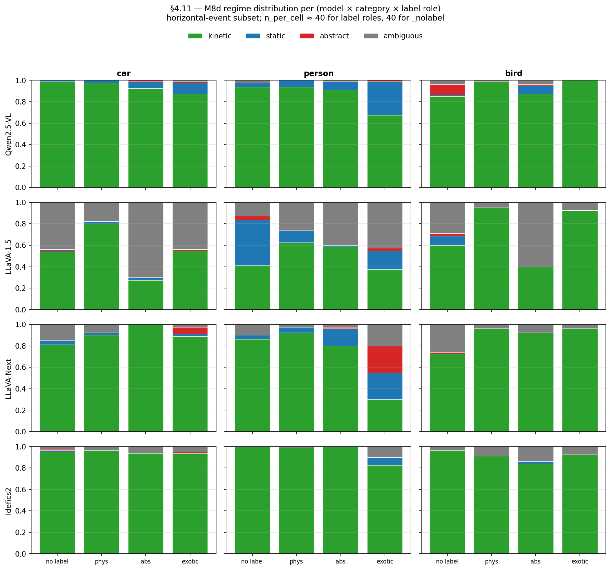
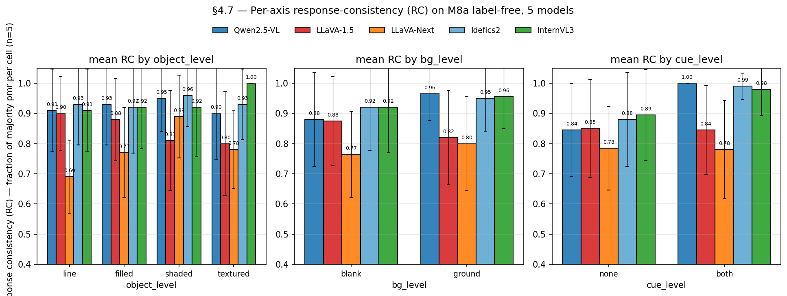

# Session 2026-04-26 — §4.7 + §4.11

## What this session delivered

Two §4 add-ons that re-use existing M8d / M8a label-free data with no
new inference. Closes the analysis-only items from the §4 backlog.

1. **§4.11 — categorical H7 regime distribution** (commit `309bdf6`).
   Applies `classify_regime` to all 4-model M8d label-free + labeled
   runs (Qwen / LLaVA-1.5 / LLaVA-Next / Idefics2). 4×3×4 stacked-bar
   matrix shows kinetic / static / abstract / ambiguous fractions
   per (model × category × label_role).

2. **§4.7 — per-axis RC decision stability** (commit `bbf01f9`).
   Reinterprets RC under T=0.7 as per-axis decision stability on M8a
   label-free. 5 models × 3 axes (object_level / bg_level / cue_level)
   × {2-4 levels each}.

## Headline findings

### §4.11 — regime distribution distinguishes models that binary H7 obscured

- **Qwen + Idefics2**: saturated kinetic everywhere (~95%). Only Qwen
  `person × exotic` (statue) shows ~30% static.
- **LLaVA-1.5**: most regime-discriminative. `car × abs` (silhouette)
  drops kinetic to 28% with 70% ambiguous.
- **LLaVA-Next**: intermediate. `person × exotic` (statue) shows a
  3-way split (30% kinetic + 25% static + 25% abstract) — multi-axis
  architectural twist absent in LLaVA-1.5.

The 4-model gradient on `person × abs` (stick figure):
| Model | % kinetic |
|---|---:|
| Qwen | 91 |
| Idefics2 | 99 |
| LLaVA-Next | 80 |
| LLaVA-1.5 | 58 |

Granular form of the M9 H7 finding. Categorical view reveals what
*kind* of commitment the label produces, not just whether the model
commits.

### §4.7 — cue_level is the dominant decision stabilizer for saturated models

| model | cue=none → cue=both | bg=blank → bg=ground |
|-------|---------------------|----------------------|
| Qwen2.5-VL | 0.84 → **1.00** (+0.16) | 0.88 → 0.96 (+0.08) |
| Idefics2 | 0.88 → 0.99 (+0.11) | 0.92 → 0.95 (+0.03) |
| InternVL3 | 0.89 → 0.98 (+0.09) | 0.92 → 0.96 (+0.04) |
| LLaVA-1.5 | 0.85 → 0.85 (0) | 0.88 → 0.82 (**−0.06**) |
| LLaVA-Next | 0.78 → 0.78 (0) | 0.77 → 0.80 (+0.03) |

**Reading**: saturation is not just a behavioral PMR ceiling but also a
**decision-stability ceiling**. Non-CLIP models converge to the same
PMR call across all 5 seeds when cues fire; CLIP-based models retain
seed-level variance even under strong cues. Separate signature of the
H-encoder-saturation reframe.

## Hypothesis status updates

- **H7** — was already "unsaturated-only AND architecture-conditional";
  §4.11 adds the **categorical** dimension (binary→regime distribution)
  showing label-disambiguation works at the regime level for LLaVA-1.5
  even where the binary H7 number is muted.
- **H-encoder-saturation** — was already "architecture-level confirmed
  at 5 model points × 3 stim sources"; §4.7 adds the **decision-stability
  dimension**: saturation also locks in seed-level commitment under cues.
  Two distinct signatures of the same architectural property.

## Late-session addition: InternVL3 M8d (closes §4.11 5-model gap)

After §4.7 + §4.11 4-model commits, InternVL3 was run on M8d (~13 min
on GPU 0) and §4.11 figure regenerated as 5-model. Commits `be29792`
(§4.11 5-model close) and `3b1e5d8` (M9 audit InternVL3 M8d row).

**InternVL3 M8d new finding**: `person × exotic` (statue) PMR drops
from 0.800 (physical "person") to 0.481 (exotic "statue") — a 32 pp
suppression. Categorical view: 30% kinetic / 65% static — **the
strongest single label-driven static commit in the project**. This
shows that even saturated-encoder architectures (InternVL3 PMR 0.92
on M8a) have an active label-disambiguation channel that fires when
the label uniquely picks out a non-moving entity.

Updated 5-model `person × abs` (stick figure) gradient:
| Model | % kinetic |
|---|---:|
| Idefics2 | 99 |
| InternVL3 | 99 |
| Qwen | 91 |
| LLaVA-Next | 80 |
| LLaVA-1.5 | 58 |

5-model § 4.11 figure: `docs/figures/sec4_11_regime_distribution_5model.png`.
Roadmap §4.11 promoted from "partial" to "complete".

## Limitations carried forward

1. ~~§4.11 InternVL3 missing~~ — *closed* (commit `be29792`).
2. **§4.11 5-category fine-grained classifier** (gravity-fall / gravity-
   roll / orbital / inertial / static) for M2 circle-only data is still
   open — would need new keyword sets + extending `classify_regime` to
   `circle` shape.
3. **§4.7 n_seeds=5** is the bare minimum for RC. ≥10 pp differences
   are robust; <5 pp differences are suggestive.
4. **§4.7 single arm (label-free)**. Labeled arms might show different
   RC structure since labels themselves stabilize commitment.

## Artifacts

### Commits (this session, 6 substantive + bookkeeping)

- `309bdf6` — §4.11 4-model M8d regime distribution
- `bbf01f9` — §4.7 per-axis RC stability
- `be29792` — §4.11 5-model close (InternVL3 M8d)
- `73a9bf9` — §4.3 Qwen-only Korean labels
- `df44a19` — §4.3 5-model cross-model extension
- `c05e170` — Korean PMR scorer (lexicons + fallback)
- `38ef1c4` — §4.3 framing tweaks per advisor

### New figures

- `docs/figures/sec4_11_regime_distribution_4model.png`
- `docs/figures/sec4_11_regime_distribution_5model.png`
- `docs/figures/sec4_7_rc_per_axis.png`
- `docs/figures/sec4_3_korean_vs_english.png` (Qwen-only)
- `docs/figures/sec4_3_korean_vs_english_cross_model.png` (5-model)

### New insight docs

- `docs/insights/sec4_11_regime_distribution.md` (+ ko)
- `docs/insights/sec4_7_rc_per_axis.md` (+ ko)
- `docs/insights/sec4_3_korean_vs_english.md` (+ ko)
- `docs/insights/session_2026-04-26_summary.md` (this doc, + ko)

### New scripts

- `scripts/sec4_11_regime_distribution.py`
- `scripts/sec4_7_rc_per_axis.py`
- `scripts/sec4_3_korean_vs_english.py` (Qwen-only)
- `scripts/sec4_3_korean_vs_english_cross_model.py` (5-model)

### New configs

- `configs/sec4_3_korean_labels.py` (Qwen)
- `configs/sec4_3_korean_labels_{llava,llava_next,idefics2,internvl3}.py`

### Roadmap

- §4.11 marked "complete" (5-model with InternVL3 M8d added late session)
- §4.7 marked "complete"
- §4.3 promoted from "Qwen-only" to "5-model"
- §4.10 milestone-table row updated to ✅ (was still tagged PRIORITY 6)

## Late-session addition #2: §4.3 Korean vs English label prior (5-model + scorer fix)

After §4.7 + §4.11 + InternVL3-M8d, §4.3 was opened (originally listed as
open with a "PMR scorer is English-only" caveat) and run end-to-end:

1. **Qwen-only initial** (commit `73a9bf9`): single-model Korean labels
   (공/원/행성) on M8a circle. Cross-label ordering preserved across
   languages; `행성` shows ~9 pp drop vs `planet`. PMR scorer applies
   cross-language because the model responds in English even with
   Korean labels (0/240 Korean-only on Qwen).

2. **5-model cross-model extension** (commit `df44a19`): same
   Korean-label config replicated for LLaVA-1.5, LLaVA-Next, Idefics2,
   InternVL3 (configs: `configs/sec4_3_korean_labels_<model>.py`). Each
   model's existing M8a circle EN baseline paired with the new Korean
   run. Headlines: cross-label ordering preserved 4/5 models;
   LLaVA-1.5 swing largest (avg |Δ|=0.11; Vicuna LM weak Korean SFT);
   Idefics2 rank-flips KO `공 > 원 > 행성` vs EN `ball > planet > circle`;
   InternVL3 swing minimal (ceiling + InternLM3 strong Korean).

3. **Korean scorer fix** (commits `c05e170` + `38ef1c4`): advisor flag
   exposed 12/1200 Hangul-only responses (LLaVA-Next 4, Idefics2 8)
   that the English-keyword scorer silently dropped. Added Korean
   physics-verb stems (`떨어` / `이동` / `움직` / ...) and Korean
   abstract markers (`그대로` / `움직이지 않` / ...) to
   `src/physical_mode/metrics/lexicons.py` with substring fallback in
   `score_pmr`. 8 new regression tests in `tests/test_pmr_scoring.py`
   (36 cases total, all pass). Scorer fix narrows Idefics2 exotic
   deficit (−0.10 → −0.05) but rank-flip preserved; LLaVA-1.5 numbers
   unchanged (0/80 KO-only) — confirms LLaVA-1.5 swing is real, not a
   scorer artifact (advisor's blind-spot concern empirically refuted).

**Headline (mechanism)**: Multilingual semantic representation in the
vision-language joint space holds 4/5 models. Magnitude is bottlenecked
by *LM-side* Korean fluency (Vicuna < Mistral < InternLM3 ≈ Qwen2.5),
not by vision encoder. Same encoder + different LM → different KO
magnitude. This adds a **language-prior axis** distinct from the
encoder-saturation / label-prior story (M6 r2 / M8a / §4.7).

Doc: `docs/insights/sec4_3_korean_vs_english.md` (+ ko).
Figures: `docs/figures/sec4_3_korean_vs_english{,_cross_model}.png`.

## Combined backlog after this session

Open §4 items:
- ~~§4.3 — Korean vs English label prior~~ — *closed* (commits
  `73a9bf9` + `df44a19` + `c05e170` + `38ef1c4`). Scorer extended to
  Korean. Other languages (Japanese / Chinese / Spanish) and
  fully-Korean prompt remain open as future extensions.
- §4.4 — Michotte 2-frame causality (needs 2-image prompt support)
- §4.6 — SAE counterfactual stim generation (complex, 4-6 hours)
- §4.8 — PMR scaling (Qwen 32B/72B — needs new large-model loads)

Major milestones:
- **M5b** — SIP / activation patching / SAE feature decomposition
  (mechanism-level evidence, the next paper-section gap)
- **M7** — paper draft + Prolific human baseline

## Session running total (2026-04-25 + 2026-04-26)

- Total commits since start of M6 r6: ~22 substantive (+ session/
  scorer/bookkeeping commits)
- Total insight docs: 17 (English) + 17 (Korean) = 34 paired docs
  (research_overview, session summaries, m6 r1-r6, m8 a/c/d/e, m9,
  encoder_saturation_paper, sec4_2/4_3/4_7/4_10/4_11, m5/m4 series)
- Total figures: 32+ (project-wide); 7 added across this 2-day run
  (session_5model_cross_stim_pmr, session_image_vs_label_h7,
  session_attention_cross_model, sec4_11_regime_distribution_4model,
  sec4_11_regime_distribution_5model, sec4_7_rc_per_axis,
  sec4_3_korean_vs_english + sec4_3_korean_vs_english_cross_model)
- Total notebooks: 13 (project-wide); 1 new (attention_viz.ipynb) +
  1 extended (encoder_saturation_chain.ipynb). §4 follow-ups don't
  ship reproduction notebooks per project convention.
- Scorer extended once (English-only → English+Korean) with regression
  tests; first language extension to the rubric.
- pytest: 123/123 (no regressions)
