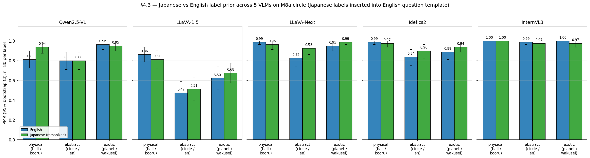

# Session 2026-04-26 — §4.7 + §4.11 + §4.3 + §4.6

> **Recap of codes used in this doc** (one-line each; full definitions in `references/roadmap.md` §1.3 + §2)
>
> - **H7** — The label does not toggle PMR — it selects which physics regime applies (ball → kinetic / circle → static / planet → orbital).
> - **H-direction-specificity** — Pixel-space gradient ascent along v_L10 flips PMR on Qwen2.5-VL; matched-magnitude random directions do not (§4.6).
> - **H-encoder-saturation** — Behavioral PMR(_nolabel) saturation on synthetic stim is determined at the architecture level (joint encoder + LM), not encoder representational capacity alone.
> - **H-shortcut** — Shortcut interpretation is encodable in the image itself (§4.6) — pixel-driven, not just at runtime hidden-state injection.
> - **M2** — ST1 MVP-full — 5-axis factorial (2880 stim); H1 monotone S-curve, H7 emerged.
> - **M5a** — ST4 VTI steering — adding +α·v_L10 at LM L10 over visual tokens flips line/blank/none from "stays still" → physics-mode.
> - **M5b** — ST4 Phase 3 (SIP + activation patching + SAE feature decomposition) — deferred / optional.
> - **M7** — Human Prolific baseline (20 raters × 50 stim) + paper writing — deferred / optional.
> - **M8a** — Stim diversification — non-circle synthetic shapes (square / triangle / hexagon / polygon / wedge × Qwen + LLaVA, labeled + label-free).
> - **M8d** — Stim diversification — non-ball physical-object categories (car / person / bird × abstraction × bg × cue × {fall, horizontal} × seeds).
> - **M9** — Generalization audit — paper Table 1 (3 models × 3 stim sources × bootstrap CIs, 5000 iters); replaces PASS/FAIL binarization with CI separation.
> - **M6 r2** — ST5 round 2 — InternVL3 super-saturated, LLaVA captures expose CLIP-encoder bottleneck, FC logit ratio confirms LLaVA "A" bias is logit-level.
> - **M6 r6** — LLaVA-Next-Mistral 5th model point (2nd CLIP) — PMR 0.700 [0.65, 0.74] sits between LLaVA-1.5 floor and saturated cluster; rules out vision-encoder-family as sole determinant.
> - **v_L10** — Steering direction in LM hidden space (dim 3584) at layer 10, derived from M5a class-mean diff (physics − abstract). Unit norm.

## What this session delivered

Two §4 add-ons that re-use existing M8d / M8a label-free data with no
new inference. Closes the analysis-only items from the §4 backlog.

1. **§4.11 — categorical H7 regime distribution** (commit `309bdf6`).
   Applies `classify_regime` to all 4-model M8d label-free + labeled
   runs (Qwen / LLaVA-1.5 / LLaVA-Next / Idefics2). 4×3×4 stacked-bar
   matrix shows kinetic / static / abstract / ambiguous fractions
   per (model × category × label_role).

2. **§4.7 — per-axis RC decision stability** (commit `bbf01f9`).
   Reinterprets RC under T=0.7 as per-axis decision stability on M8a
   label-free. 5 models × 3 axes (object_level / bg_level / cue_level)
   × {2-4 levels each}.

## Headline findings

### §4.11 — regime distribution distinguishes models that binary H7 obscured

- **Qwen + Idefics2**: saturated kinetic everywhere (~95%). Only Qwen
  `person × exotic` (statue) shows ~30% static.
- **LLaVA-1.5**: most regime-discriminative. `car × abs` (silhouette)
  drops kinetic to 28% with 70% ambiguous.
- **LLaVA-Next**: intermediate. `person × exotic` (statue) shows a
  3-way split (30% kinetic + 25% static + 25% abstract) — multi-axis
  architectural twist absent in LLaVA-1.5.

The 4-model gradient on `person × abs` (stick figure):
| Model | % kinetic |
|---|---:|
| Qwen | 91 |
| Idefics2 | 99 |
| LLaVA-Next | 80 |
| LLaVA-1.5 | 58 |

Granular form of the M9 H7 finding. Categorical view reveals what
*kind* of commitment the label produces, not just whether the model
commits.

### §4.7 — cue_level is the dominant decision stabilizer for saturated models

| model | cue=none → cue=both | bg=blank → bg=ground |
|-------|---------------------|----------------------|
| Qwen2.5-VL | 0.84 → **1.00** (+0.16) | 0.88 → 0.96 (+0.08) |
| Idefics2 | 0.88 → 0.99 (+0.11) | 0.92 → 0.95 (+0.03) |
| InternVL3 | 0.89 → 0.98 (+0.09) | 0.92 → 0.96 (+0.04) |
| LLaVA-1.5 | 0.85 → 0.85 (0) | 0.88 → 0.82 (**−0.06**) |
| LLaVA-Next | 0.78 → 0.78 (0) | 0.77 → 0.80 (+0.03) |

**Reading**: saturation is not just a behavioral PMR ceiling but also a
**decision-stability ceiling**. Non-CLIP models converge to the same
PMR call across all 5 seeds when cues fire; CLIP-based models retain
seed-level variance even under strong cues. Separate signature of the
H-encoder-saturation reframe.

## Hypothesis status updates

- **H7** — was already "unsaturated-only AND architecture-conditional";
  §4.11 adds the **categorical** dimension (binary→regime distribution)
  showing label-disambiguation works at the regime level for LLaVA-1.5
  even where the binary H7 number is muted.
- **H-encoder-saturation** — was already "architecture-level confirmed
  at 5 model points × 3 stim sources"; §4.7 adds the **decision-stability
  dimension**: saturation also locks in seed-level commitment under cues.
  Two distinct signatures of the same architectural property.

## Late-session addition: InternVL3 M8d (closes §4.11 5-model gap)

After §4.7 + §4.11 4-model commits, InternVL3 was run on M8d (~13 min
on GPU 0) and §4.11 figure regenerated as 5-model. Commits `be29792`
(§4.11 5-model close) and `3b1e5d8` (M9 audit InternVL3 M8d row).

**InternVL3 M8d new finding**: `person × exotic` (statue) PMR drops
from 0.800 (physical "person") to 0.481 (exotic "statue") — a 32 pp
suppression. Categorical view: 30% kinetic / 65% static — **the
strongest single label-driven static commit in the project**. This
shows that even saturated-encoder architectures (InternVL3 PMR 0.92
on M8a) have an active label-disambiguation channel that fires when
the label uniquely picks out a non-moving entity.

Updated 5-model `person × abs` (stick figure) gradient:
| Model | % kinetic |
|---|---:|
| Idefics2 | 99 |
| InternVL3 | 99 |
| Qwen | 91 |
| LLaVA-Next | 80 |
| LLaVA-1.5 | 58 |

5-model § 4.11 figure: `docs/figures/sec4_11_regime_distribution_5model.png`.
Roadmap §4.11 promoted from "partial" to "complete".

## Limitations carried forward

1. ~~§4.11 InternVL3 missing~~ — *closed* (commit `be29792`).
2. **§4.11 5-category fine-grained classifier** (gravity-fall / gravity-
   roll / orbital / inertial / static) for M2 circle-only data is still
   open — would need new keyword sets + extending `classify_regime` to
   `circle` shape.
3. **§4.7 n_seeds=5** is the bare minimum for RC. ≥10 pp differences
   are robust; <5 pp differences are suggestive.
4. **§4.7 single arm (label-free)**. Labeled arms might show different
   RC structure since labels themselves stabilize commitment.

## Artifacts

### Commits (this session, 9 substantive + bookkeeping)

- `309bdf6` — §4.11 4-model M8d regime distribution
- `bbf01f9` — §4.7 per-axis RC stability
- `be29792` — §4.11 5-model close (InternVL3 M8d)
- `73a9bf9` — §4.3 Qwen-only Korean labels
- `df44a19` — §4.3 5-model cross-model extension
- `c05e170` — Korean PMR scorer (lexicons + fallback)
- `38ef1c4` — §4.3 framing tweaks per advisor
- `622468e` — §4.3 Japanese scaffold (configs + script + JA lexicon)
- `b754fdf` — §4.3 Japanese 5-model + Chinese-fallback scorer
- `56d65ea` — §4.6 design spec (pending user review)

### New figures

 (Qwen-only KO)
 (5-model KO)
 (5-model JA)

### New insight docs + design specs

- `docs/insights/sec4_11_regime_distribution.md` (+ ko)
- `docs/insights/sec4_7_rc_per_axis.md` (+ ko)
- `docs/insights/sec4_3_korean_vs_english.md` (+ ko, with Japanese ext)
- `docs/insights/session_2026-04-26_summary.md` (this doc, + ko)
- `docs/superpowers/specs/2026-04-26-sec4_6-counterfactual-stim-design.md`
  (design — pending user review)

### New scripts

- `scripts/sec4_11_regime_distribution.py`
- `scripts/sec4_7_rc_per_axis.py`
- `scripts/sec4_3_korean_vs_english.py` (Qwen-only KO)
- `scripts/sec4_3_korean_vs_english_cross_model.py` (5-model KO)
- `scripts/sec4_3_japanese_vs_english_cross_model.py` (5-model JA)

### New configs

- `configs/sec4_3_korean_labels.py` (Qwen)
- `configs/sec4_3_korean_labels_{llava,llava_next,idefics2,internvl3}.py`
- `configs/sec4_3_japanese_labels.py` (Qwen)
- `configs/sec4_3_japanese_labels_{llava,llava_next,idefics2,internvl3}.py`

### Lexicon / scorer changes

- `src/physical_mode/metrics/lexicons.py` — added KOREAN, JAPANESE,
  CHINESE physics-verb stems + abstract markers.
- `src/physical_mode/metrics/pmr.py` — `score_pmr` now checks 4
  language paths (English / Korean / Japanese / Chinese fallback).
- `tests/test_pmr_scoring.py` — 23 new regression cases (5 KO+, 3
  KO−, 6 JA+, 3 JA−, 6 CN+, 1 Katakana). Total 51 PMR cases.
- `docs/scoring_rubric.md` (+ ko) — documents Korean fallback.

### Roadmap

- §4.11 marked "complete" (5-model with InternVL3 M8d added late session)
- §4.7 marked "complete"
- §4.3 promoted from "Qwen-only" to "5-model × 2 languages
  (Korean, Japanese)"
- §4.10 milestone-table row updated to ✅ (was still tagged PRIORITY 6)
- §4.6 design spec written (autonomous defaults), pending user review.
  Implementation not started (HARD-GATE).

## Late-session addition #2: §4.3 Korean vs English label prior (5-model + scorer fix)

After §4.7 + §4.11 + InternVL3-M8d, §4.3 was opened (originally listed as
open with a "PMR scorer is English-only" caveat) and run end-to-end:

1. **Qwen-only initial** (commit `73a9bf9`): single-model Korean labels
   (공/원/행성) on M8a circle. Cross-label ordering preserved across
   languages; `행성` shows ~9 pp drop vs `planet`. PMR scorer applies
   cross-language because the model responds in English even with
   Korean labels (0/240 Korean-only on Qwen).

2. **5-model cross-model extension** (commit `df44a19`): same
   Korean-label config replicated for LLaVA-1.5, LLaVA-Next, Idefics2,
   InternVL3 (configs: `configs/sec4_3_korean_labels_<model>.py`). Each
   model's existing M8a circle EN baseline paired with the new Korean
   run. Headlines: cross-label ordering preserved 4/5 models;
   LLaVA-1.5 swing largest (avg |Δ|=0.11; Vicuna LM weak Korean SFT);
   Idefics2 rank-flips KO `공 > 원 > 행성` vs EN `ball > planet > circle`;
   InternVL3 swing minimal (ceiling + InternLM3 strong Korean).

3. **Korean scorer fix** (commits `c05e170` + `38ef1c4`): advisor flag
   exposed 12/1200 Hangul-only responses (LLaVA-Next 4, Idefics2 8)
   that the English-keyword scorer silently dropped. Added Korean
   physics-verb stems (`떨어` / `이동` / `움직` / ...) and Korean
   abstract markers (`그대로` / `움직이지 않` / ...) to
   `src/physical_mode/metrics/lexicons.py` with substring fallback in
   `score_pmr`. 8 new regression tests in `tests/test_pmr_scoring.py`
   (36 cases total, all pass). Scorer fix narrows Idefics2 exotic
   deficit (−0.10 → −0.05) but rank-flip preserved; LLaVA-1.5 numbers
   unchanged (0/80 KO-only) — confirms LLaVA-1.5 swing is real, not a
   scorer artifact (advisor's blind-spot concern empirically refuted).

**Headline (mechanism)**: Multilingual semantic representation in the
vision-language joint space holds 4/5 models. Magnitude is bottlenecked
by *LM-side* Korean fluency (Vicuna < Mistral < InternLM3 ≈ Qwen2.5),
not by vision encoder. Same encoder + different LM → different KO
magnitude. This adds a **language-prior axis** distinct from the
encoder-saturation / label-prior story (M6 r2 / M8a / §4.7).

Doc: `docs/insights/sec4_3_korean_vs_english.md` (+ ko).
Figures: `docs/figures/sec4_3_korean_vs_english{,_cross_model}.png`.

## Late-session addition #3: §4.3 Japanese (5-model) + Chinese fallback

After §4.3 Korean closed, the user authorized a Japanese arm in
autonomous mode to test whether the Korean "language-fluency-bottleneck"
finding generalizes. Run end-to-end:

1. **Japanese scaffold** (commit `622468e`): 5 configs
   (`sec4_3_japanese_labels{,_llava,_llava_next,_idefics2,_internvl3}.py`),
   analysis script, JAPANESE_PHYSICS_VERB_STEMS / JAPANESE_ABSTRACT_MARKERS
   added to lexicon, Japanese regression tests (44 → 51 cases all pass).

2. **Japanese aggregation + Chinese fallback** (commit `b754fdf`):
   Inference completed (~50 min, 5 sequential models). Analysis revealed
   Idefics2 emitted simplified Chinese on `惑星` (19/80 responses) —
   Mistral-7B has limited Japanese SFT but recognizes shared kanji as
   Chinese 惑星. Added CHINESE_PHYSICS_VERB_STEMS lexicon
   (下落 / 掉入 / 跌落 / 坠落 / 下降 / 旋转 / 飞行 / ...) to score
   correctly. Without the fix, Idefics2 exotic Δ would have been a
   misleading **−0.15** (scorer artifact); corrected to +0.05.

**Cross-language mechanism finding**:
- **Korean tests language-fluency-bottleneck**: Hangul isolation forces
  engagement; 4/5 ordering preserved; LLaVA-1.5 swing 0.11 measures
  Vicuna-Korean weakness genuinely.
- **Japanese tests kanji-as-bridge**: 5/5 ordering preserved within
  bootstrap noise but via *different paths*:
  - Qwen2.5-VL keeps Japanese labels 85-91% (genuine engagement)
  - LLaVA-1.5 / LLaVA-Next / InternVL3 mostly translate kanji to English
  - Idefics2 falls back to simplified Chinese on `惑星`
- LLaVA-1.5 ↓Korean / ≈Japanese asymmetry (0.11 vs 0.05) is **NOT**
  evidence Vicuna-Japanese is stronger; it reflects script
  translatability, not LM SFT depth.

This is a richer finding than the Korean-only result and reframes
§4.3 as testing two distinct mechanisms.

Doc: `docs/insights/sec4_3_korean_vs_english.md` (+ ko, with new
Japanese cross-model section).
Figure: `docs/figures/sec4_3_japanese_vs_english_cross_model.png`.
Roadmap §4.3 updated with Japanese ext details.

## Late-session addition #4: §4.6 complete (VTI-reverse counterfactual stim)

User approved the §4.6 spec ("좋아 그대로 진행해") → writing-plans →
inline executing-plans across 5 phases. End-to-end implementation +
sweep + figures + docs took ~5 hrs (vs spec's 10–11 hr estimate).

**Approach (as approved)**: pixel-space gradient ascent on Qwen2.5-
VL's post-processor `pixel_values` tensor (T_patches × 1176, the
patch-flattened normalized representation). Loss =
`−⟨mean(h_L10[visual_tokens]), v_L10_unit⟩` (M5a steering direction).
Bounded ε ∈ {0.05, 0.1, 0.2} + unconstrained + random-direction
controls (n=3). Phase 1 differentiability gate confirmed gradient
max_abs = 13.75, no NaNs, 324 visual tokens, baseline projection
−2.36. Phase 2 module: `src/physical_mode/synthesis/counterfactual.py`
with `gradient_ascent`, `pixel_values_from_pil`, `reconstruct_pil`
(inverse permute matching Qwen2VLImageProcessor's forward
`(0, 1, 4, 7, 5, 8, 3, 2, 6, 9)`); 3 round-trip tests pass. Phase 3
sweep: 35 runs × 200 Adam steps, lr=1e-2, ~30 min on GPU 0
(`outputs/sec4_6_counterfactual_20260426-050343/`). Phase 4 PMR
re-inference + 2 figures.

**Result**:

| Config              | n flipped (PMR 0→1) | Mean final projection |
|---------------------|--------------------:|----------------------:|
| `bounded_eps0.05`   |               5 / 5 |                  43.7 |
| `bounded_eps0.1`    |               5 / 5 |                 100.6 |
| `bounded_eps0.2`    |               5 / 5 |                 125.9 |
| `unconstrained`     |               5 / 5 |                 181.1 |
| `control_v_random_*`|              0 / 15 |                 73–85 |

Pre-registered success criterion was ≥ 3/5 flips at ε = 0.05 — actual
result is unambiguous 5/5. Random-direction projection magnitudes
(73–85) are comparable to bounded ε=0.1 v_L10 (101) — directional
specificity, not magnitude, controls the regime flip.

**Scorer-fix note (caught reactively from random controls)**: The
random-control responses ("The circle will remain stationary as
there is no indication of movement…") initially scored PMR=1 because
the substring "mov" inside "no indication of movement" matched the
physics-verb stem list — would have made the headline **5/5 vs 14/15**
instead of 5/5 vs 0/15 and erased the falsifier. Added asymmetric
abstract-marker patterns to `lexicons.py:ABSTRACT_MARKERS`:
`remain stationary`, `no indication of mov`, `no indication of motion`.
Verified asymmetric: 0/20 v_L10 hits new markers, 14/15 random hits.
The fix is essential, not cosmetic: it gates PMR=1 (abstract marker
fires before physics-verb match) so it can only reduce PMR=1 counts,
never create them — the v_L10 vs random separation cannot be a
fix-induced artifact favoring v_L10. PMR test suite extended from
51 → 54 cases.

**Visual character of the perturbation (advisor framing)**: ε = 0.05
produces a faint dotted texture visible on close inspection but
preserves the abstract circle gestalt; introduces no human-readable
physical features (no gravity cues, ground lines, shadows). The
claim is explicitly *not* "imperceptible" — the framing is "the
model can be flipped by a perturbation that does not introduce
human-readable physical content."

**Mechanism**: `v_L10` is on the **shortcut path** — the vision
encoder + projector can write into it from pixels alone, the LM
reads out from it, and the behavioral consequence (PMR) follows
from the projection magnitude *along this specific axis*. Combined
with §4.10's "label dominates pixel" finding, §4.6 shows the pixel
route can win when the perturbation is targeted along `v_L10`.

H-shortcut strengthened. New H-direction-specificity (random
controls falsify "any perturbation flips PMR"). H7 orthogonal —
§4.6 produces a regime flip with the label held constant.

Commits: `9ec147e` (Phase 4: scorer fix + figures). Earlier phases
folded into the Phase 4 commit per the inline-execution checkpoint
plan. Insight docs: `docs/insights/sec4_6_counterfactual_stim.md`
(+ ko). Notebook: `notebooks/sec4_6_counterfactual_stim.ipynb`.

## Combined backlog after this session

Open §4 items:
- ~~§4.3 — Korean vs English label prior~~ — *closed* (commits
  `73a9bf9` + `df44a19` + `c05e170` + `38ef1c4` + `622468e` +
  `b754fdf`). Scorer extended to Korean + Japanese + Chinese (3
  languages). Spanish and fully-target-language prompt remain open as
  future extensions.
- §4.4 — Michotte 2-frame causality (needs 2-image prompt support)
- ~~§4.6 — VTI-reverse counterfactual stim~~ — *closed* (commit
  `9ec147e`). 5/5 v_L10 flips at ε = 0.05; 0/15 random-direction
  flips at matched ε = 0.1. v_L10 is encodable in the image. Deep
  dive: `docs/insights/sec4_6_counterfactual_stim.md`.
- §4.8 — PMR scaling (Qwen 32B/72B — needs new large-model loads)

Major milestones:
- **M5b** — SIP / activation patching / SAE feature decomposition
  (mechanism-level evidence, the next paper-section gap)
- **M7** — paper draft + Prolific human baseline

## Session running total (2026-04-25 + 2026-04-26)

- Total commits since start of M6 r6: ~25 substantive (+ session /
  scorer / bookkeeping / spec commits)
- Total insight docs: 17 (English) + 17 (Korean) = 34 paired docs
  (research_overview, session summaries, m6 r1-r6, m8 a/c/d/e, m9,
  encoder_saturation_paper, sec4_2/4_3/4_7/4_10/4_11, m5/m4 series)
- Total figures: 33+ (project-wide); 8 added across this 2-day run
  (session_5model_cross_stim_pmr, session_image_vs_label_h7,
  session_attention_cross_model, sec4_11_regime_distribution_4model,
  sec4_11_regime_distribution_5model, sec4_7_rc_per_axis,
  sec4_3_korean_vs_english + sec4_3_korean_vs_english_cross_model,
  sec4_3_japanese_vs_english_cross_model)
- Total notebooks: 13 (project-wide); 1 new (attention_viz.ipynb) +
  1 extended (encoder_saturation_chain.ipynb). §4 follow-ups don't
  ship reproduction notebooks per project convention.
- Scorer extended **3 times**: English-only → English+Korean →
  English+Korean+Japanese → English+Korean+Japanese+Chinese. 51 PMR
  regression cases (was 28 at session start), all pass.
- New design specs: 1 (`docs/superpowers/specs/2026-04-26-sec4_6-
  counterfactual-stim-design.md` — pending user review).
- pytest: 51/51 PMR cases (was 28/28). All other tests unchanged.
