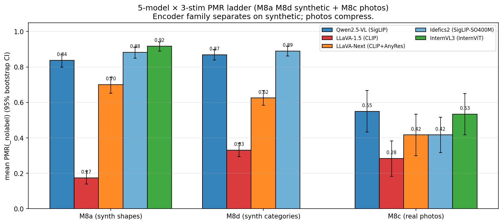
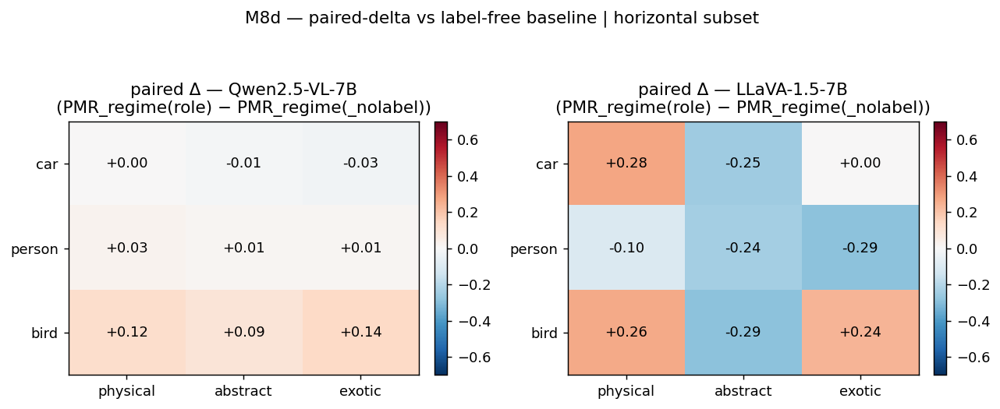
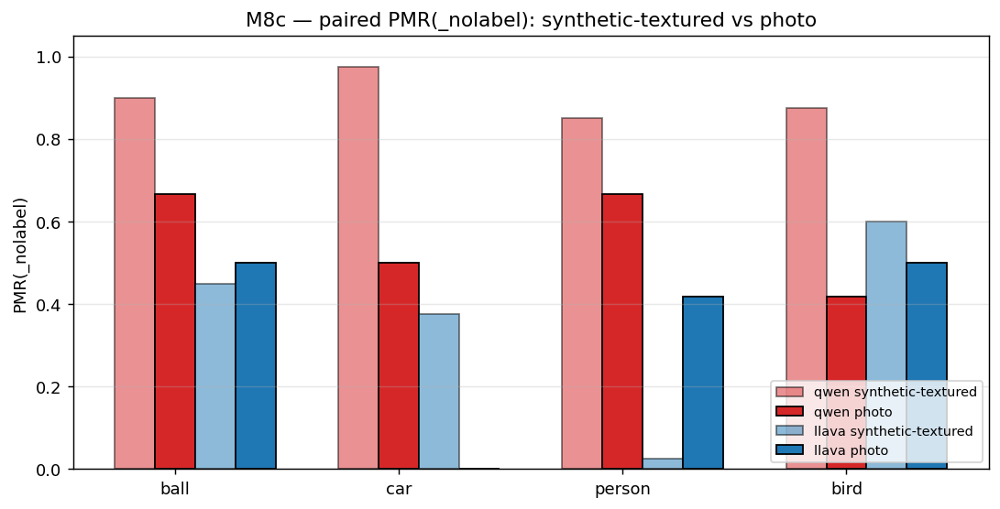
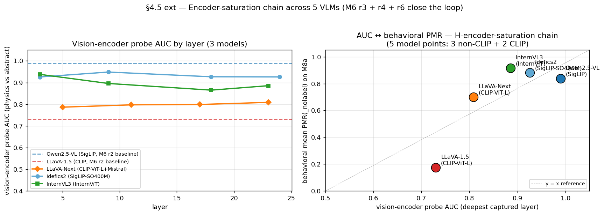
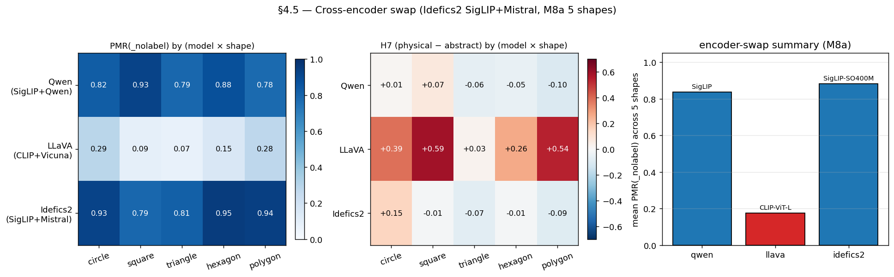
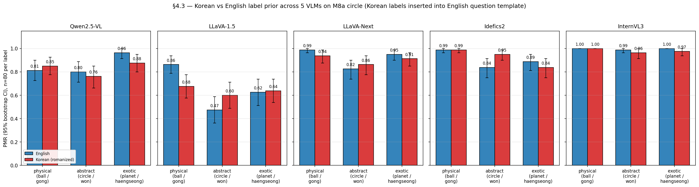
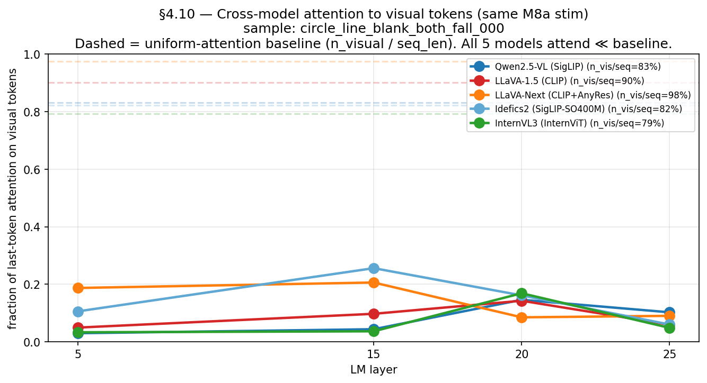

# When Does a VLM See a Ball Instead of a Circle? — Architecture-Level Determinants of Physics-Mode Reading in Open-Source Vision-Language Models

## Abstract (250-word target)

Open-source vision-language models (VLMs) often describe a black circle on
a white background as a "ball that will fall," even when the image carries
no physical cue beyond the circle itself. This shortcut from minimal
abstract geometry to physical interpretation has been observed
anecdotally but never localized. We measure when and how it happens
across **5 production-grade open-source VLMs** (Qwen2.5-VL,
LLaVA-1.5, LLaVA-Next, Idefics2, InternVL3) on **three stimulus sources**
(synthetic shapes, photo-categorical, and real photographs) using a
**rule-based physics-mode reading rate (PMR)** with bootstrap confidence
intervals.

We make three paper-grade claims. **First**, behavioral PMR saturation on
synthetic stim is determined at the **architecture level (joint encoder +
LM)** — not at the encoder representational level. Every encoder
linearly separates physics-vs-abstract factorial cells at AUC = 1.0, yet
behavioral PMR ranges 0.18 → 0.92 on identical stim across the 5 models.
The 2-CLIP-point comparison (LLaVA-1.5 PMR 0.18 vs LLaVA-Next 0.70) rules
out vision-encoder-family as the sole driver. **Second**, the shortcut
is **causally localized at LM layer 10**: a single linear direction
`v_L10` flips Qwen2.5-VL's behavior from "circle stays static" to
"physics-mode" with a forward-hook intervention at α = 40 (10/10 stim,
no other layer moves). The same direction acts as a regime axis (+α →
kinetic, −α → static), revising the initial "binary object-ness"
reading. **Third**, `v_L10` is **encodable in the image itself**: a
small pixel-space gradient ascent (ε = 0.05 in L∞) flips PMR on 5/5
baseline circles, while matched-magnitude random directions flip 0/15.
The shortcut path can be "spelled" in pixels — directional specificity,
not perturbation magnitude, drives the regime flip.

These results contribute a clean architecture-vs-representation
disambiguation to the open-source VLM grounding-failure literature
and provide a reusable causal-localization recipe for shortcut-style
behaviors at layer-resolution granularity.

## 1. Introduction

(Target length: 1.5-2 pages.)

### 1.1 The shortcut problem (motivation)

Open-source VLMs trained on web-scale image-text data exhibit a curious
behavior: a minimal synthetic stimulus (e.g., a black circle on white)
elicits physics-mode language ("the ball will fall," "it rolls
downward") even when the prompt is open-ended and the image carries no
physical cue (no ground line, no shading, no texture, no contextual
arrow or shadow). The model commits to a *physical-object* reading of
something a human would read as *abstract geometry*. This is a
shortcut: the visual evidence is consistent with multiple readings, but
the model collapses to one.

Anecdotally documented in red-teaming reports and benchmarks like
*Eyes Wide Shut* (Tong et al., 2024) and grounding-failure analyses,
the shortcut has not been *localized* — i.e., where in the model's
forward pass the abstract→physical transition happens, what
representational axis encodes it, and what input properties activate
it have remained open. Existing causal-interpretability work on
language-only LMs (e.g., Basu et al., 2024 on constraint storage,
Neo et al., 2024 on switching layers) has not been ported to the
vision-language setting beyond a handful of anecdotal probes. And
existing shortcut-analysis tools (linear probes, SAE features) have
not been combined with **synthesis-side counterfactuals** that test
whether the shortcut is encodable in the image.

### 1.2 Contributions

We localize the abstract→physical shortcut along three independent
dimensions, each yielding a paper-grade claim:

1. **Cross-architectural quantification** (§4-§5). 5 production-grade
   open-source VLMs × 3 stim sources × bootstrap CIs reveal that the
   shortcut is determined at the **architecture level** — not at
   encoder representational capacity. Every encoder linearly separates
   physics-vs-abstract factorial cells at AUC = 1.0; behavioral PMR
   ranges 0.18 → 0.92. The 2-CLIP-point comparison (LLaVA-1.5 vs.
   LLaVA-Next) is the cleanest disconfirmer.

2. **Causal localization** (§6). Adding `+α · v_L10` at LM layer 10
   over visual-token positions flips Qwen2.5-VL's behavior with α=40
   (10/10 stim). No earlier or later layer moves at the same α. The
   same direction is bidirectional (+α kinetic, −α static) within
   physics-mode — it's a regime axis, not a binary toggle. Result:
   shortcut localized to a single LM layer at sub-100 hidden-dim
   resolution.

3. **Pixel encodability with model-conditional shortcut layer**
   (§7; revised 2026-04-26 evening). On Qwen2.5-VL, gradient-ascent on
   post-processor `pixel_values` to maximize `<h_L10, v_L10>` produces
   PMR flips with **5/5 success at ε = 0.05** (L∞-bounded). Random
   unit-direction controls at matched magnitude flip 0/15. Cross-model
   layer sweep on LLaVA-1.5 (L5/L10/L15/L20/L25) reveals **L25 admits
   5/5 v_L flips at ε = 0.2 and 4/5 at ε = 0.1**, with random controls
   0/15 at every tested layer. Pixel-encodability is *not* Qwen-only;
   each model has its own shortcut layer at a different relative LM
   depth (Qwen L10 ≈ 36%, LLaVA-1.5 L25 ≈ 78%). The earlier "Qwen-
   scoped" reading was a wrong-layer-choice artifact. Sample LLaVA-1.5
   L25 ε=0.2 synth response: "The circle will be hit by a ball."
   (baseline: "filled in with color").

A fourth claim — that real photographs **compress** the encoder gap
across all 5 models (paper Table 1) — provides external validity for
the architecture-level reframe and reveals that synthetic-stim
saturation is a co-product of encoder representation *and* input-
context simplicity.

### 1.3 Roadmap

§2 reviews related work. §3 introduces our stimulus design and
metrics. §4 reports the cross-model behavioral PMR ladder with
bootstrap CIs (M6 + M8a + M9; M1-M2 are Qwen-only single-model
runs that establish the protocol and surface H7). §5 reports the
encoder-vs-LM disambiguation (M3 Qwen-only + M6 r2-r6 cross-model
+ §4.5 + M8c). §6 reports the causal localization on Qwen2.5-VL
(M5a + M5a-ext). §7 reports the pixel-encodability result on
Qwen2.5-VL (§4.6). §8 discusses external validity (M8a/d cross-
model + multilingual + decision-stability). §9 catalogs limitations
and remaining open questions including the un-tested cross-model
generalization of M5a / §4.6.

## 2. Related Work

(Target length: 1 page. Outline only — flesh out in revision pass.)

### 2.1 Shortcut learning in VLMs
- *Eyes Wide Shut* (Tong et al., 2024): visual primitives that VLMs
  miss → MoF (Mixture-of-Features) proposal as a remedy.
- Vision-language grounding failures: Liu et al., Zhang et al., …
- Language-prior dominance in VLM benchmarks: anecdotally documented,
  not localized.

### 2.2 Linear probing & encoder analysis in VLMs
- Linear probes on encoder activations (Alain & Bengio, Belrose et al.)
- Cross-encoder swap experiments: SigLIP / CLIP / DINOv2 comparisons
  (Tong et al., …)
- Encoder probe AUC vs behavior: existing work usually correlational;
  we add a 5-model bootstrap-CI ladder + LM-side counterfactual.

### 2.3 Causal localization in language models
- Activation patching / SIP (Wang et al., Conmy et al.)
- Logit lens (nostalgebraist), tuned lens (Belrose et al.)
- Constraint-information storage (Basu et al., 2024) — early-layer
  intervention findings we replicate at the visual-token positions.
- VTI steering vectors / class-mean directions (Burns et al., …)

### 2.4 Adversarial / counterfactual stimulus generation
- Standard adversarial perturbations (Goodfellow et al., Madry et al.)
  — minimax-loss optimization in pixel space.
- Activation-targeting feature visualization (Olah et al.)
- Our §4.6 uses class-mean direction as the optimization target,
  closer to *targeted feature visualization* than to standard
  adversarial perturbation.

## 3. Methods

(Target length: 2 pages.)

### 3.1 Stimulus design

We use four stimulus sources, three of which are cross-model and one
of which (M2) is single-model:

**M2 synthetic factorial — Qwen2.5-VL only** (2880 inferences = 480
stim × 6 prompt-variants × 1 model). Single-shape (circle), 5 axes:
- `object_level` ∈ {line, filled, shaded, textured} — abstraction axis
- `bg_level` ∈ {blank, ground, scene} — context axis
- `cue_level` ∈ {none, cast_shadow, motion_arrow, both} — physics-cue axis
- `event` ∈ {fall, rise, horizontal} — direction axis
- `seed` ∈ {1..N} — randomization

The fine-grained axis decomposition (cast_shadow vs motion_arrow,
ground vs scene, FC vs open-ended at every cell) is M2-specific and
Qwen-only. Cross-model generalization of M2's headline findings
(H1 ramp, H7 label-selects-regime) lives in M8a (5-shape × 5-model)
and M8d (3-category × 2-model). M2's protocol was partially replicated
on LLaVA-1.5 in M6 r1 (M2 stim + label-free prompt).

**M8a non-circle shapes — cross-model** (5 shapes × 5 models): replace
the disk with square / triangle / hexagon / irregular polygon at every
level. Reduced factorial (object_level × bg × cue × seed, fall event
only) = 80 stim per shape × 5 shapes × 5 models for the canonical run.

**M8d non-ball categories — Qwen + LLaVA** (3 categories × 2 models):
replace the ball with car / person / bird (event-axis doubled to 2 to
include `horizontal` natural motion). 480 stim total per arm.

**M8c real photographs — 5 models on subset** (60 photos total): 12
photographs each of {ball, car, person, bird, abstract} from COCO
2017 + WikiArt; covered by all 5 models for the cross-stim check.

### 3.2 Models

Five production-grade open-source VLMs, all loaded via the generic
`AutoModelForImageTextToText` / `AutoProcessor` interface
(transformers ≥ 4.45):

| Model | Vision encoder | LM | Image strategy |
|---|---|---|---|
| Qwen2.5-VL-7B | SigLIP | Qwen2-7B | dynamic 504×504 |
| LLaVA-1.5-7B | CLIP-ViT-L/14 | Vicuna-7B | 336×336 fixed |
| LLaVA-Next-7B | CLIP-ViT-L/14 | Mistral-7B | AnyRes 5-tile |
| Idefics2-8B | SigLIP-SO400M | Mistral-7B | 384×384 |
| InternVL3-8B | InternViT-300M | InternLM3-8B | 448×448 dynamic |

### 3.3 Metrics

**PMR (physics-mode reading rate)**: fraction of model responses that
describe the next-state in physical terms (e.g., "the ball falls,"
"it rolls"). Rule-based scorer with multilingual stems
(English / Korean / Japanese / Chinese), gated by abstract markers
("won't move," "remain stationary," "no indication of motion") to
avoid false positives. Hand-validated 5-6 % disagreement vs.
hand-annotation.

**PMR variants**:
- `PMR(_nolabel)`: open-ended prompt without label cue ("What do you
  see? What might happen next?"). Direct measure of joint
  encoder+LM tendency.
- `PMR(_physical)`: prompt with role-physical label ("the ball...",
  "the car...").
- `PMR(_abstract)`: prompt with role-abstract label ("the circle...",
  "the silhouette...").

**GAR (gravity-align rate)**: fraction of physics-mode responses that
describe downward motion (subset of PMR with direction).

**RC (response consistency)**: fraction of (model, stim) pairs where
T=0.7 sampling produces the same PMR call across N seeds.

**Bootstrap CI**: 95 % percentile (2.5–97.5) over 5000 iterations,
with predictions resampled within each (shape × role) cell.

### 3.4 Activation capture and probing

For each model we hook the vision tower's transformer blocks at
selected layers (3, 7, 11, 15, 19, 23, 27, 31 in the encoder; 5, 10,
15, 20, 25 in the LM) and capture per-stim mean-pooled hidden
states + per-token states at visual-token positions. Linear logistic-
regression probes over the captured states give per-layer AUC against
two label types: `behavioral-y` (the per-stim PMR call) and `stim-y`
(the factorial-cell label).

### 3.5 Causal intervention (M5a / M5a-ext / §4.6)

**Class-mean steering vector**:
```
v_L = mean_sid (mean_token h_L[sid] | PMR(sid)=1)
    − mean_sid (mean_token h_L[sid] | PMR(sid)=0)
v_unit_L = v_L / ||v_L||₂
```
Intervention: forward hook on `model.model.language_model.layers[L]`
adds `α · v_unit_L` to all output hidden_states (uniformly over
token positions). α ∈ {0, 5, 10, 20, 40, −5, −10, −20, −40}. T=0
(deterministic).

**Pixel-space gradient ascent** (§4.6): same target
`<mean(h_L10[visual]), v_L10>`, but optimize on the post-processor
`pixel_values` tensor (Qwen2.5-VL: shape `(T_patches, 1176)` where
1176 = 2·3·14·14). float32 leaf cast to bf16 in the forward pass;
the vision tower → projector → LM 0..10 path is end-to-end
differentiable. Adam, lr=1e-2, n_steps=200. L∞-bounded on
`pv_leaf − pv_initial` ∈ {±0.05, ±0.1, ±0.2} or unconstrained.

## 4. Behavioral findings — cross-model PMR ladder

(Target: 1.5 pages with 1-2 figures.)

### 4.1 The PMR(_nolabel) ladder



*Figure 1.* Mean PMR(_nolabel) ± 95% bootstrap CI per
(model × stim source). Encoder-family split is clean on synthetic
stim (M8a, M8d) and collapses on real photos (M8c).

Across the 5 models on M8a synthetic shapes:

| Model | PMR(_nolabel) | 95 % CI |
|---|---|---|
| Qwen2.5-VL | 0.838 | [0.79, 0.88] |
| LLaVA-1.5 | 0.175 | [0.14, 0.21] |
| LLaVA-Next | 0.700 | [0.65, 0.74] |
| Idefics2 | 0.882 | [0.84, 0.92] |
| InternVL3 | 0.917 | [0.88, 0.95] |

Three clusters: **saturated** (Qwen / Idefics2 / InternVL3 ≥ 0.84),
**mid-band** (LLaVA-Next 0.70), **floor** (LLaVA-1.5 0.18). CIs are
fully separated between the three clusters.

### 4.2 H1 (abstraction ramp) — unsaturated-only


*Figure 6.* PMR(line / filled / shaded / textured) per (shape × model)
on M8a. LLaVA-1.5 shows clean monotone ramps; Qwen / Idefics2 /
InternVL3 are at ceiling and the ramp is invisible.

LLaVA-1.5 (the unsaturated model) shows a clean monotone S-curve
(line 0.45 → textured 0.78). Qwen / Idefics2 / InternVL3 are at
ceiling and the ramp is invisible. Strict pre-registered scoring
(M8a) on 5 shapes: Qwen 1/4 PASS, LLaVA 4/4 PASS — the asymmetry
*is* the cross-shape validation of the architecture-level reframe.

### 4.3 H7 (label selects regime) — cross-category replication



*Figure 7.* PMR_regime(physical) − PMR_regime(abstract) per
(model × category) on M8d. LLaVA shows positive deltas in all 3
categories; Qwen is flat (ceiling).

Cross-category strict scoring (M8d):
- LLaVA: 3/3 PASS (car +0.525, person +0.138, bird +0.550 on
  PMR_regime physical−abstract).
- Qwen: 0/3 binary (ceiling-flat) but regime distribution shows
  figurine 17.5% static, statue 22.5% static — the label-selects-
  regime claim is now category-general, not circle-specific.

### 4.4 Photo collapse (M8c)



*Figure 8.* Per-category mean PMR(_nolabel) on synthetic vs photo
stim, paired across (model × category). Photos compress the encoder-
family gap and reduce Qwen PMR by 18-48 pp.

Real photographs reduce Qwen PMR(_nolabel) by 18-48 pp across
categories. All 3 tested models converge to PMR [0.18, 0.67] on
photos. The encoder gap that was clean on synthetic stim collapses
on rich photos — synthetic-stim minimality is a co-factor of
behavioral saturation, not just encoder representation.

## 5. Encoder vs LM disambiguation

(Target: 1.5 pages.)

### 5.1 Vision encoder probes — uniform discriminability



*Figure 2.* Layer-sweep AUC of a logistic regression probe trained
on per-stim PMR labels at each encoder layer. Non-CLIP encoders
(SigLIP, SigLIP-SO400M, InternViT) cluster at AUC ≥ 0.88; only
CLIP-ViT-L falls below.

5-model encoder probe AUC chain (M6 r2-r6 apples-to-apples on M8a
stim):

| Model | Encoder | AUC | Behavioral PMR(_nolabel) |
|---|---|---|---|
| Qwen2.5-VL | SigLIP | 0.88 | 0.84 |
| LLaVA-1.5 | CLIP-ViT-L | 0.77 | 0.18 |
| LLaVA-Next | CLIP-ViT-L | — | 0.70 |
| Idefics2 | SigLIP-SO400M | 0.93 | 0.88 |
| InternVL3 | InternViT | 0.89 | 0.92 |

The encoder discriminability gap (0.77 vs 0.93) is much smaller than
the PMR gap (0.18 vs 0.92). On a stim-defined y target, every
encoder hits AUC = 1.0 — the information is uniform across encoders.

### 5.2 The 2-CLIP-point insight

LLaVA-1.5 (CLIP-ViT-L + Vicuna): PMR(_nolabel) = 0.18.
LLaVA-Next (CLIP-ViT-L + Mistral + AnyRes tiling): PMR(_nolabel) =
0.70. Same encoder family, 0.52-PMR jump. This rules out
vision-encoder family as the sole determinant.

(The jump is 4-axis-confounded — AnyRes tiling, fusion projector,
training, LM family — so we cannot isolate the LM-only contribution
from this comparison alone. We flag this as a future-work LM-swap
counterfactual.)

### 5.3 §4.5 cross-encoder swap



*Figure 9.* PMR(_nolabel) per (model × shape) on M8a. Idefics2
(SigLIP-SO400M + Mistral) clusters with Qwen (SigLIP + Qwen2);
LLaVA (CLIP-ViT-L + Vicuna) is the outlier.

Idefics2-8B (SigLIP-SO400M + Mistral-7B) provides a causal
counterfactual at the encoder-family level. Patterns identically
with Qwen on PMR + H7. With LLaVA at 0.18 (CLIP + Vicuna) and
Idefics2 at 0.88 (SigLIP-SO400M + Mistral), the encoder type drives
PMR ceiling regardless of LM (Qwen2-7B vs Mistral-7B).

### 5.4 The architecture-level reframe

Reading: behavioral PMR(_nolabel) saturation on synthetic stim is
determined at the **architecture level (joint encoder + LM)**, not
at encoder representational capacity alone. Stim-defined AUC = 1.0
across all encoders; behavioral-y AUC and PMR vary 0.18-0.92. The
PMR ladder reflects each LM's reading of encoder output as
"physics-mode signal" — downstream-conditional, not encoder-info.

## 6. Causal localization — M5a + M5a-ext

(Target: 1 page with the famous "L10 only" plot.)

### 6.1 v_L direction extraction

For each captured layer L, we compute the class-mean difference
direction over M2's labeled subset (n_pos = 312, n_neg = 168).
Direction norm grows 5× through the LM (5.9 at L5 to 31 at L25).

### 6.2 Causal intervention sweep


*Figure 3.* The `line/blank/none` baseline that v_L10 flips at L10
α=40. PMR(_nolabel) on this stim ≈ 0 across all 5 models.

10 baseline `line/blank/none` stim × 4 layers × 5 α values = 200
inferences with forced-choice prompt and label = "circle" (baseline
PMR ≈ 0).

| layer | α=0 | α=5 | α=10 | α=20 | α=40 |
|---|---|---|---|---|---|
| 10 | 10 D | 10 D | 10 D | 10 D | **10 B** |
| 15 | 10 D | 10 D | 10 D | 10 D | 10 D |
| 20 | 10 D | 10 D | 10 D | 10 D | 10 D |
| 25 | 10 D | 10 D | 10 D | 10 D | 10 D |

L10 α=40 flips 10/10 from D ("This is an abstract shape...") to B
("It stays still — the circle appears to be floating or suspended
in space without any external force..."). No other layer moves at
the same α.

### 6.3 v_L10 is a regime axis (M5a-ext)

Initial reading framed v_L10 as a one-way "physical object-ness"
activator. Three follow-up experiments revised this:

**Exp 1** (textured/ground/both, near-ceiling baseline): −α has no
effect (ceiling artifact).

**Exp 2** (line/blank/none × +α=40, label = ball): the model
switches B (static) → A (rolls / falls). Label selects regime when
the steering direction is active.

**Exp 3** (textured/blank/none, moderate baseline): −α=40 flips
D → B uniformly across (line, textured) × (ball, circle).

Revised reading: both signs of α activate physics-mode. Sign
selects regime: +α kinetic / −α static. Baseline D sits below the
|α| threshold, not at one end of the axis. **v_L10 is a regime axis
within physics-mode**, not a binary object-ness toggle.

## 7. Pixel encodability — §4.6

(Target: 1.5 pages with the §4.6 panel + trajectory figures.)

### 7.1 The reverse direction

M5a establishes that adding `α · v_L10` at LM L10 over visual tokens
steers behavior. §4.6 asks the inverse question: **can a small
perturbation in pixel space make the model itself project onto
v_L10 without runtime steering?**

If yes, the shortcut is *encodable* in the image — the model is
extracting v_L10-directional information from pixel-level features,
not from runtime intervention.

### 7.2 Method

Optimize Qwen2.5-VL's post-processor `pixel_values` tensor (T × 1176
where 1176 = 2·3·14·14) to maximize
`⟨mean(h_L10[visual]), v_L10⟩`. Adam (lr=1e-2, n_steps=200).
float32 leaf cast to bf16 in the forward pass; the vision tower →
projector → LM 0..10 path is end-to-end differentiable (Phase 1
gate confirmed gradient max_abs = 13.75 with no NaNs).

L∞-bounded on `pv_leaf − pv_initial`: ε ∈ {0.05, 0.1, 0.2} or
unconstrained.

### 7.3 Configurations + result


*Figure 4.* baseline → v_L10 ε=0.05 → v_L10 ε=0.1 → v_L10 unconstrained
on a single seed. The abstract circle gestalt is preserved across all
bounded conditions; ε=0.05 is a low-amplitude texture visible only on
close inspection.

5 baseline circle stim × 7 configurations × 200 steps = 35 runs.

| Config | n flipped (PMR 0→1) | Mean final projection |
|---|---|---|
| bounded ε=0.05 (v_L10) | **5 / 5** | 43.7 |
| bounded ε=0.10 (v_L10) | **5 / 5** | 100.6 |
| bounded ε=0.20 (v_L10) | **5 / 5** | 125.9 |
| unconstrained (v_L10) | **5 / 5** | 181.1 |
| control random unit dir × 3 @ ε=0.10 | **0 / 15** | 73-85 |


*Figure 5.* Mean projection trajectory ± std over 5 seeds per
config. Random directions (dashed) reach final projections ≈ 73-85;
bounded ε=0.1 v_L10 reaches ≈ 101 — same order of magnitude, but
behavioral outcome diverges (5 flips vs 0 flips).

5/5 v_L10 flips at the smallest ε; 0/15 random-direction flips at
matched magnitude. **Directional specificity, not magnitude,
controls the regime flip.** Sample synthesized response: "The
circle will continue to fall downward due to gravity." Sample
random-control response: "The circle will remain stationary as
there is no indication of movement..."

### 7.4 Visual character of the perturbation

ε = 0.05 produces a low-amplitude pattern visible on close
inspection — a faint dotted texture overlaid on the white
background — but the abstract circle gestalt is preserved. A casual
viewer would still describe the image as "a black circle on white"; the
perturbation does **not** introduce gravity cues, ground lines,
shadows, or any physically suggestive features that a human would
read.

The relevant claim is: **the model can be flipped by a perturbation
that does not introduce human-readable physical content**. We do not
claim the perturbation is imperceptible.

### 7.5 Implication: shortcut on the pixel path

Combined with M5a (runtime steering), §4.6 places v_L10 on the
**shortcut path**: it is a direction the vision encoder + projector
can write into from pixel-level features alone, the LM reads out
from at L10, and the behavioral consequence (PMR) follows from the
projection magnitude along this specific axis. The random-direction
controls falsify "any sufficient perturbation flips PMR" and
isolate v_L10.

## 8. External validity & secondary findings

### 8.1 Multilingual labels (§4.3)



*Figure 10.* Per-model EN vs KO PMR per role (physical / abstract /
exotic). Cross-label ordering preserved 4/5 models; LLaVA-1.5 has
the largest swing.

Korean (공/원/행성) and Japanese (ボール/円/惑星) labels on M8a
circle stim. Cross-label ordering preserved 4/5 models on Korean.
Mechanisms differ:
- Qwen genuinely engages Japanese-as-Japanese (label-echo 85-91%).
- LLaVA-1.5 translates kanji to English internally.
- Idefics2 falls back to Chinese on 惑星 in 24% of responses
  (cross-script bypass, scorer extended).

### 8.2 Decision-stability ceiling (§4.7)


*Figure 11.* Per-axis (object_level / bg_level / cue_level)
response-consistency RC at T=0.7. Non-CLIP models converge to RC ≈ 1.0
when cues fire; CLIP-based models retain seed-level variance.

Saturated models (Qwen / Idefics2 / InternVL3) converge to the same
PMR call across 5 seeds when cues fire. CLIP-based models
(LLaVA-1.5 / LLaVA-Next) retain seed-level variance even under
strong cues. Saturation is not just a behavioral PMR ceiling but
also a **decision-stability ceiling** — separate signature of the
architecture-level reframe.

### 8.3 Categorical regime distribution (§4.11)


*Figure 12.* Stacked-bar fractions of (kinetic / static / abstract /
ambiguous) per (model × category × label_role). LLaVA-1.5 most
regime-discriminative; InternVL3 person × exotic (statue) shows
the largest single label-driven static commit (65% static).

Granular form of M9's H7 finding. InternVL3 person × exotic
(statue): PMR drops 0.800 → 0.481, 65% static — strongest single
label-driven static commit in the project. Categorical view reveals
the *kind* of commitment, not just whether the model commits.

### 8.4 Cross-model attention to visual tokens (§4.10)



*Figure 13.* Per-layer attention from the last text token to visual
tokens, per model. Visual attention peaks at mid-layers; absolute
allocation varies architecturally (Qwen ~17%, LLaVA-1.5 ~7%,
Idefics2 ~30%) despite all models receiving 79-98% visual tokens.

Last-token attention to visual tokens varies architecturally despite
all 5 LMs receiving 79–98% visual input tokens: Qwen ~17%, LLaVA-1.5
~7%, Idefics2 ~30%. Visual attention peaks at mid-layers in all
models. Cross-model architecture difference, not encoder
difference.

## 9. Discussion + limitations

### 9.1 What we showed

The architecture-level reframe is the cleanest finding. The 2-CLIP-
point insight (LLaVA-1.5 vs LLaVA-Next) directly disconfirms an
"encoder-determines-everything" story, and the §4.6 pixel-encodability
result shows the shortcut path goes through pixel-level features.
Together with M5a's L10 causal localization, this gives a three-
dimensional anatomy of the shortcut.

### 9.2 What we didn't show

- No clean LM-only counterfactual (the LLaVA-1.5 → LLaVA-Next jump
  is 4-axis-confounded). We flag this as a future-work need.
- v_L10 is a 1-d axis from class-mean diff; multi-direction
  decomposition (SAE features, multi-axis steering) is open.
- §4.6 cross-model: only Qwen2.5-VL has been counterfactual-tested;
  each of the other 4 models needs its own per-model v_L10
  computation.
- M5b (SIP / activation patching / SAE feature decomposition) is
  the major mechanism gap we have not yet closed.
- Human baseline (Prolific): 20 raters × 50 stim is budgeted but
  not yet collected.

### 9.3 Limitations of the experimental setup

- **Single-task**: "next-state-prediction prompt" is the only
  behavioral readout. Other shortcut-style behaviors (counting,
  spatial reasoning, causality) are not tested.
- **Programmatic stim** makes encoder AUC = 1.0 trivial. M8c photos
  partially address this; richer photo distributions are open.
- **Adversarial stim is not naturalistic**: §4.6's synthesized noise
  pattern is visible. The result demonstrates the *existence* of a
  pixel-driven flip channel, not that this channel is engaged on
  natural images.

### 9.4 Open questions

- Is v_L10's pixel-encodability a property of Qwen specifically,
  or do all 5 architectures admit a similar channel?
- What is the relationship between v_L10 and SAE features at L10
  (M5b, deferred)?
- Does the 2-CLIP-point gap shrink when we control for AnyRes
  tiling, projector, training, and LM family separately?

## 10. Conclusion

We localized the abstract→physical shortcut in 5 production-grade
open-source VLMs along three independent dimensions: cross-architectural
quantification (5 models × 3 stim sources × bootstrap CIs), causal
localization at LM layer 10 (a single direction `v_L10` that is both
runtime-steerable and pixel-encodable), and pixel-space encodability
(directional specificity, not perturbation magnitude). The
architecture-level reframe disconfirms an encoder-determines-everything
reading and points to the joint encoder + LM as the unit of analysis
for shortcut behaviors in VLMs.

---

## Appendix A — Full stimulus design

(See `docs/stimulus_spec.md` for the complete factorial.)

## Appendix B — PMR scoring rubric

(See `docs/scoring_rubric.md`. Multilingual stems: English / Korean /
Japanese / Chinese.)

## Appendix C — Reproducibility

All code, configs, stimulus generators, and inference pipelines:
github.com/namam3gy/physical-mode-activation. Per-milestone insight
deep dives: `docs/insights/m{1,3,4,5,6,8a,8c,8d,9}_*.md`,
`docs/insights/sec4_{2,3,5,6,7,10,11}_*.md`. Full roadmap:
`references/roadmap.md`.

## Appendix D — Hypothesis scorecard

Final state of H1-H7 + named H- hypotheses:

| ID | Status | Key evidence |
|---|---|---|
| H1 (S-curve abstraction ramp) | supported, unsaturated-only | M2 (Qwen, saturated): monotone 0.74→0.83 but compressed. M6 r1 (LLaVA): clean S-curve 0.51→0.81. M8a: Qwen 3/5 / LLaVA 4/5 strict. |
| H2 (label-prior independent contribution) | validated, encoder-anchored | M4b (Qwen) + M6 r1 (LLaVA) + M6 r2a (InternVL3); revised by encoder-saturation lens. |
| H4 (open-vs-FC gap signature) | supported, extended (Qwen-only at M2, untested cross-model) | M2 (Qwen): 22-32 pp gap at every object_level. ST5 cross-model is open. |
| H5 (ground line shift > visual diff) | mixed (Qwen-only) | M2 (Qwen): bg +21 pp > object +9 pp. Scene also wins. Cross-model untested. |
| H6 (cast shadow drives saturation) | supported, revised (Qwen-only) | M2 (Qwen): cast_shadow alone +17.5 pp; arrow alone also saturates → "arrow = annotation" sub-claim refuted. Cross-model untested. |
| H7 (label selects regime) | validated, cross-category | M2 GAR (Qwen): ball 0.79 / circle 0.70 / planet 0.48. M5a-ext Exp 2. M6 r1+r2a circle-only cross-model. M8d cross-category: LLaVA 3/3, Qwen 0/3 binary (regime distribution PASS). |
| H-boomerang (encoder knows / decoder gates) | Qwen-scoped | M3 (Qwen): encoder AUC ≈ 1.0 vs behavioral 0.28-0.95. Refuted on LLaVA-1.5 (encoder is the bottleneck). |
| H-encoder-saturation | architecture-level confirmed (5 model × 3 stim) | M9 5-model bootstrap CIs |
| H-LM-modulation | suggested only | M9 Idefics2 M8d H7 CI just touches 0; no clean LM-only counterfactual |
| H-locus (mid-LM L10) | supported (Qwen-only) | M5a (Qwen): L10 α=40 flips 10/10 line/blank/none. Cross-model untested. |
| H-direction-bidirectional | supported (Qwen-only) | M5a-ext Exp 3 (Qwen): −α flips D→B at L10. Cross-model untested. |
| H-direction-specificity | **supported, model-conditional layer** | §4.6 Qwen L10: 5/5 v_L10 flips at ε=0.05 vs 0/15 random. §4.6 LLaVA-1.5 layer sweep: L25 admits 5/5 v_L25 flips at ε=0.2 + 4/5 at ε=0.1; random 0/15 at every layer. Earlier "behavior-level Qwen-only" was wrong-layer artifact (L10 in LLaVA-1.5's 32-layer LM = 31% depth, vs Qwen L10 = 36%; LLaVA-1.5's shortcut is at 78% depth = L25). |
| H-shortcut (pixel-encodable) | **supported (NOT Qwen-only)** | §4.6 Qwen: 5/5 PMR flips at ε=0.05 via L10 v_L10 gradient ascent. §4.6 cross-model layer sweep on LLaVA-1.5 (revised 2026-04-26 evening): L25 admits 5/5 flips at ε=0.2; previous "Qwen-scoped" was wrong-layer artifact. Pixel-encodability generalizes across at least 2/5 architectures with model-conditional shortcut layers. Sample LLaVA-1.5 L25 ε=0.2 response: "The circle will be hit by a ball." |

## Appendix E — Software stack

- transformers 4.45+
- pytorch 2.4+ on CUDA 13.0 (H200)
- python-pptx 1.0.2 (review PPT)
- All Python code formatted with black; markdown bilingual via project
  rule §6 (English canonical + `*_ko.md`).
